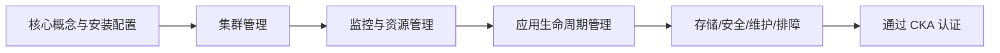

# CKA 认证实战班介绍

Kubernetes（常被口语化读作 k-eight-s，缩写 K8s）是目前最流行的开源容器编排引擎，更准确的定位是「容器集群管理系统」。它把多台主机上的 CPU、内存、存储抽象成一个资源池，并以声明式的方式完成应用的部署、扩缩容、自愈与发布。在国内，前一百强互联网公司中 95% 以上都在基于 K8s 构建企业云平台；大厂已经完成落地，中型和小型公司处于迁移或刚起步阶段。可以说在可预见的未来，K8s 会成为通用基础设施的标准，容器化运维与 DevOps 建设也成为运维方向最有前景、薪资也更高的两条主线。

本实战班面向「零基础 / 刚入门」的同学，目标是让你从零快速掌握 K8s 并熟悉 CKA 考纲，最终具备一线互联网公司的 K8s 运维与开发岗位能力。

## 纲要

- K8s 的行业现状与为什么它成了基础设施标准
- CKA 认证的价值：能力证明、求职敲门砖、企业级 KCNA/KCSP 与投标资质
- CKA 考试形式、费用与补考政策
- CKA 考纲五大模块概览（与课程目录一一对应）
- 适合人群、学习周期与薪资预期
- 推荐的本地学习与练习目录组织方式

## K8s 为什么成了必学技术

K8s 解决的核心问题是「成千上万个容器跑在哪、怎么扩、怎么自愈」。Docker 解决了「单个应用怎么打包跑起来」，而 K8s 站在多个容器引擎之上做统一调度。随着越来越多公司把业务容器化，K8s 已经从「可选技能」变成「运维 / 开发工程师的必备技术」。

行业大致呈现三个梯队：

| 梯队 | 现状 | 对个人的意义 |
| --- | --- | --- |
| 大公司 | K8s 已落地，需要人才持续优化平台 | 岗位多、要求深 |
| 中型公司 | 正在向 K8s 迁移 | 机会多、成长空间大 |
| 小公司 | 刚开始推容器化 | 尽早积累，抢占先发优势 |

## 为什么考 CKA

CKA（Certified Kubernetes Administrator）由 Linux 基金会 CNCF 与 Google 共同推出，面向 K8s 日常管理能力的官方认证。课程体系的编排，正是参照「在企业中落地 K8s 所必须经历的核心步骤」来设计的，所以无论用什么方式学 K8s，这一支点都绕不过去。它的价值主要体现在四点：

1. **提升专业能力**：体系化掌握 K8s 日常运维管理，直接用于工作与求职。
2. **证明实力**：简历上体现 CKA，面试官筛选时会更优先地考虑你，相当于在求职市场建立信用。
3. **企业级认证阶梯**：个人通过 CKA 后，所在企业若有 3 名员工持证，可申请面向企业的 KCSP 资质，作为对外服务的资质背书。
4. **投标优势**：面向企业容器化项目的投标中，持证人数可作为资质展现给客户，提高成功率（类似红帽、思科等认证的作用）。

简而言之，考证不是目的，掌握 K8s 并拿到证书作为辅助，才能显著提升你在 IT 市场的竞争力。

## CKA 考试形式与费用

CKA 是**线上实操考试**：给你一个终端和考题，你要在真实集群里把命令敲出来，而不是背题库。考试强调「凭对 K8s 的熟悉程度拿证」，所以实战性很强。

| 项目 | 说明 |
| --- | --- |
| 考试形式 | 远程线上、全程实操（Performance-based） |
| 题目数量 | 约 24 道任务（以报名页面为准） |
| 通过分数 | 历史上曾为 66 / 74 / 76 分不等，请以当前官网报名页为准 |
| 考试费用 | 原价 2088 元，含一次免费补考机会 |
| 补考 | 首次未通过可免费申请第二次 |

> 提示：考试难度不低，报名后建议跟随辅导完成学习和报名 / 考试流程。不同渠道可能提供专属折扣，具体以官方合作政策为准。

## CKA 考纲五大模块

课程目录基本覆盖 CKA 考纲约 98% 的内容，任意出题都在范围内。考纲可归纳为五大块：



| 模块 | 核心内容 |
| --- | --- |
| 1. 核心概念、安装配置 | 资源对象的应用场景、用途与集群搭建 |
| 2. 集群管理 | 节点、集群组件、证书与升级维护 |
| 3. 监控 | 资源利用率、Metrics Server、日志 |
| 4. 应用生命周期管理 | 应用部署、调度（节点选择 / 亲和性）、网络暴露 |
| 5. 存储、安全、维护、排障 | 数据持久化、RBAC 安全框架、集群维护与故障排查 |

需要强调的是：靠背题库风险很大，只有实打实掌握技术，即使遇到意外变体也能从容应对。

## 适合人群与学习周期

- **定位**：K8s 初中级，零基础或刚入门均可。只要会 Linux 或 Docker 基础就能跟；若两者都不会，多花些功夫也可跟上。
- **学习周期**：最快 1 个月学完并拿证，稍慢 1.5 个月，最慢约 2 个月，可按自身时间规划。
- **薪资预期**：根据往期学员情况，具备 1–3 年运维 / 开发经验者，学完在一线城市拿到 15K–20K 较为常见；但薪资受工作经验、综合能力、学历等共同影响，无法做出保证。

往期班级通过率较高（据课程方统计在 98% 以上），学习或考试过程中遇到任何问题都可以随时向老师求助。

## 推荐的学习目录组织

在本地练习时，建议把清单、脚本与笔记分层管理，方便复用与复盘：

```dir
├── k8s-cka/
    ├── manifests/          # 手写或导出的 yaml 资源清单
    │   ├── pod-nginx.yaml
    │   └── deploy-web.yaml
    ├── cheatsheet/         # kubectl 速查与考纲笔记
    ├── scripts/            # 部署 / 排障脚本
    └── notes/              # 官方文档摘录与错题本
```

## 总结

- K8s 已成为基础设施标准，容器化运维与 DevOps 是运维方向最有前景的主线。
- CKA 是 CNCF 官方认证，价值在于能力证明、求职敲门砖，以及企业级 KCSP / 投标资质。
- 考试为线上实操（约 24 题、含一次补考），凭真实熟练度拿证，背题库风险高。
- 考纲五大模块覆盖集群全生命周期，课程目录与之高度对应，学完即可从容应考。
- 零基础可入门，建议 1–2 个月规划学习；遇到疑问及时求助，通过率会显著提升。
