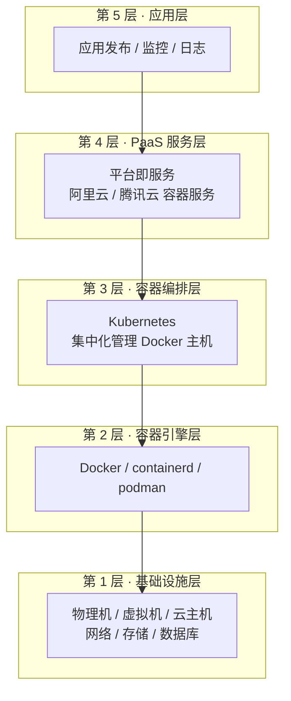

# Kubernetes 认证实战: 有了 Docker 为什么还要 K8s（分层关系）

CKA 考纲第一块是「核心概念、安装配置」，而一切的核心概念都建立在一个问题上：**Docker 已经能跑容器了，为什么还需要 Kubernetes？**。结论先给：**Docker 是容器引擎，负责"跑一个容器"；Kubernetes 是容器集群管理系统，负责"管成千上万个容器跑在哪、怎么扩、怎么挂了自愈"**。两者不在同一层，不是替代关系，而是互补。

## 纲要

- 从基础设施层到编排层的五层技术栈
- Docker 与 Kubernetes 的本质差异：引擎 vs 编排
- 容器编排工具的兴衰：Swarm、Mesos 与 K8s 为什么赢
- Kubernetes 的来源：Google Borg 的开源产物
- 官网与学习路径

## 五层技术栈

整个容器技术栈是有明确分层的，看这张图就能一眼看清 Docker 和 K8s 各自站的位置：



| 层级 | 名称 | 解决的问题 | 代表组件 |
| --- | --- | --- | --- |
| 第 1 层 | 基础设施层 | 提供算、网、存资源 | 物理机、云主机、交换机、NAS、MySQL |
| 第 2 层 | 容器引擎层 | 在操作系统上装引擎、起容器 | Docker、containerd |
| 第 3 层 | 容器编排层 | **集中化管理多台 Docker 主机** | **Kubernetes** |
| 第 4 层 | PaaS 服务层 | 给开发/运维提供统一平台能力 | 阿里云容器服务、腾讯云 TKE |
| 第 5 层 | 应用层 | 自动化发布、监控、日志 | CI/CD、Prometheus、ELK |

一句话类比：**Docker 管理"一个鸡蛋"，Kubernetes 提供"装鸡蛋的篮子"**。鸡蛋少的时候无所谓，鸡蛋多了就必须用篮子兜着。

## 核心差异：引擎 vs 编排

| 对比项 | Docker | Kubernetes |
| --- | --- | --- |
| 定位 | 容器引擎（container runtime） | 容器集群管理系统（orchestration） |
| 管理范围 | 单台主机上的容器 | 跨主机的整个集群 |
| 是否可替代 | 不可被 K8s 替代（K8s 要调它的 API） | 可被其他编排工具替代（历史上有 Swarm） |
| 核心职责 | 构建镜像、创建/启停容器 | 调度、自愈、伸缩、滚动更新、服务发现 |
| 最小调度单元 | Container | **Pod** |

需要澄清一个常见误解：**K8s 节点上依然要装 Docker 之类的容器引擎**，只是现在主流默认使用 `containerd`。kubelet 本身不直接创建容器，它调用容器引擎的 API，由引擎真正去 runc 起容器。

Kubernetes 支持多个容器引擎（Docker、containerd、CRI-O），Docker 只是当时最主流的一个选择；而编排层在 Docker 官方的 Swarm 失败后，只剩 K8s 一家独大。

## 编排工具的兴衰

| 工具 | 出处 | 结局 |
| --- | --- | --- |
| Docker Swarm | Docker 公司官方 | 功能可用但未流行，已被放弃维护 |
| Mesos / Mesos DC/OS | Apache 社区 | 逐步边缘化 |
| **Kubernetes** | **Google 开源** | **事实标准，唯独大** |

Google 从 2000 年代就开始在内部大规模跑容器，沉淀出内部系统 **Borg**，把这种"集中化管理容器的能力"抽象出来。2014 年 Google 把这套经验开源，就是 Kubernetes，并把它捐给 CNCF。所以 K8s 的成功不是单纯蹭了 Docker 的热度，而是它本身就是一个经过十年超大规模生产验证的产品。

国内现状也印证了这一点：Top 100 互联网公司中 95% 以上都在基于 K8s 构建企业云平台，大公司已完成落地，中型公司在迁移中，小公司刚开始推。

## 目录结构

学习 K8s 时，本机到集群的目录可以这样组织：

```text
├── k8s-study/
    ├── manifests/          # 手写的 yaml 资源清单
    │   ├── pod-nginx.yaml
    │   └── deploy-web.yaml
    ├── scripts/            # 部署 / 排障脚本
    └── notes/              # 官方文档摘录与笔记
```

## Kubernetes 是什么

广义上，"容器平台""私有云平台""微服务平台"这些叫法**都没错**，只是观察角度不同。更精确的说法：

- **它是一个容器集群管理系统**，把多台物理机/虚拟机的 CPU、内存、存储抽象成一个统一的资源池；
- **它让部署应用变简单高效**：不再需要人工判断"这波流量放哪台机器、那台机器资源够不够"；
- **它让应用更好管**：副本数、滚动升级、自愈、扩容，都是声明式地交给他，而不是手工干预。

## API 速览

| 概念 | 说明 |
| --- | --- |
| `kubectl` | Kubernetes 命令行管理工具，用户的操作入口，只与 API Server 通信 |
| API Server (`kube-apiserver`) | 集群统一入口，提供 REST 风格的 API，所有组件的协调者 |
| etcd | 键值数据库，存集群全部状态，需独立部署与备份 |
| 容器运行时 | kubelet 调用的底层引擎（Docker / containerd） |

## Demo 示例

```bash
# 1. 查看当前 kubeconfig 指向的集群与上下文
kubectl config view

# 2. 看这个集群里能管多大的资源池（节点视角）
kubectl get nodes -o wide

# 3. 一次创建，直接复用给别的集群
# --dry-run=client 只在本机做校验并输出，不真正下发
kubectl create deployment nginx --image=nginx:1.21 \
  --dry-run=client -o yaml > manifests/deploy-nginx.yaml

# 4. 应用这个清单
kubectl apply -f manifests/deploy-nginx.yaml
kubectl get pods -o wide
```

```yaml
# manifests/pod-nginx.yaml —— K8s 的最小调度单元是 Pod，不是 Container
apiVersion: v1
kind: Pod
metadata:
  name: nginx-pod
  labels:
    app: nginx          # Service 就是靠 label 找到这批 Pod 的
spec:
  containers:
    - name: nginx
      image: nginx:1.21
      ports:
        - containerPort: 80
```

**验证分层是否真的生效**：

```bash
# Pod 不是 Docker 里的 container，它是容器的更高级封装
kubectl get pod nginx-pod -o jsonpath='{.spec.containers[*].name}{"\n"}'
kubectl describe pod nginx-pod | head -20
```

### 总结

- Docker 解决"怎么把一个应用打包跑起来"，Kubernetes 解决"一万个人跑起来的容器该怎么管"。
- 两者是**互补而非替代**：K8s 站在多个 Docker 主机之上，统一抽象和调度。
- 编排层已经收敛到 K8s 一家独大，Swarm/Mesos 没有学习价值，只需理解它们存在过。
- K8s 源自 Google 的 Borg，是超大规模生产验证过的产品，不是概念玩具。
- 学习路径：先搞清分层，再背组件，最后用 `kubectl` 实操把概念落地。

