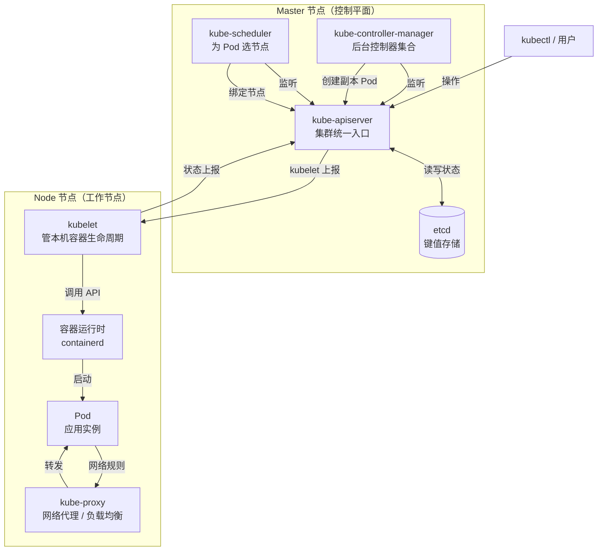
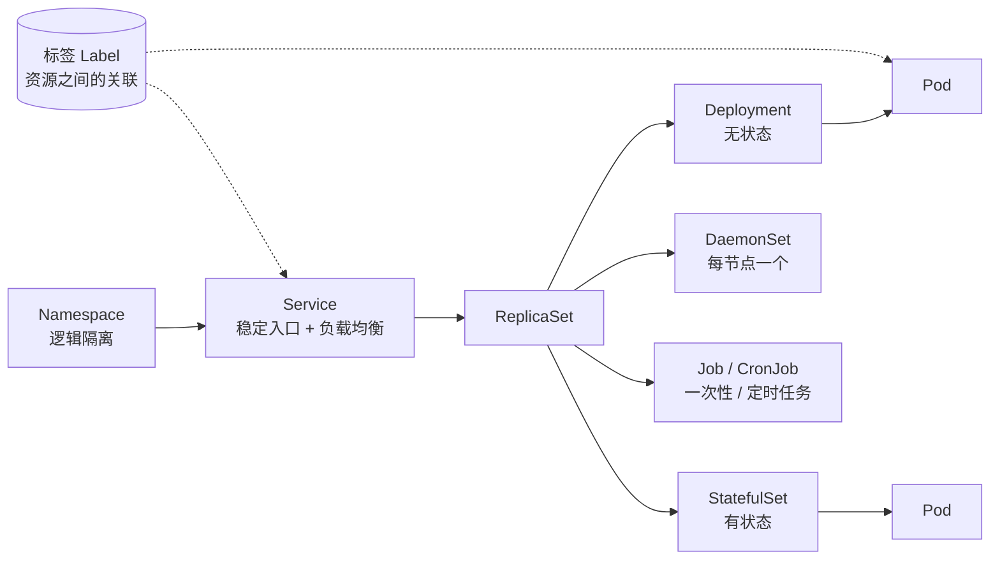

# Kubernetes 认证实战: K8s 集群架构与五个核心概念

CKA 考纲里「核心概念」占约 19%，是出实操题最多的一块。本文讲两件事：**集群架构里 master 和 node 各有哪些组件、它们怎么通信**；**Pod / Controller / Service / Label / Namespace 这五个概念分别在解决什么问题**。记住一句话：**整个集群围绕 API Server 通信**，其余组件都要连它。

## 纲要

- master 与 node 两个角色的职责边界
- master 三组件：API Server、Scheduler、Controller Manager
- etcd 为什么必须备份
- node 两组件：kubelet 与 kube-proxy，外加容器运行时
- 五个核心概念：Pod、Controller、Service、Label、Namespace
- 用命令把架构和概念一次性验证出来

## 两个角色：master 与 node



| 角色 | 职责 | 是否跑业务容器 |
| --- | --- | --- |
| master（控制平面） | 管集群级别的状态：对外暴露服务、调度容器、维护副本数、故障自愈 | 一般不跑 |
| node（工作节点） | 真正运行 Pod 的地方 | 是 |

> 注意：master 上也可以跑 Pod（比如 kube-system 下的控制平面组件常以静态 Pod 形式跑在 master），但业务应用不应该调度到 master 上。CKA 常考污点：`node-role.kubernetes.io/control-plane:NoSchedule`。

## master 的三个核心组件

| 组件 | 作用 | 备注 |
| --- | --- | --- |
| `kube-apiserver` | 集群统一入口，提供 REST 风格 API，是所有组件的协调者 | 所有增删改查与监听都过它 |
| `kube-scheduler` | 为新建的 Pod 选一个合适的 node | 只做调度决策，不跑容器 |
| `kube-controller-manager` | 内含众多控制器（Deployment、ReplicaSet、Job、CronJob、Node 等），负责应用的"高级层面"事务 | 中文旧译常叫"控制器管理器" |

**API Server 的三个作用**（面试必答）：

1. 集群的统一入口；
2. 提供 RESTful API（`HTTP + JSON` 的方式对外提供服务）；
3. 其他组件从它这里获取任务/状态，所有对象的增删改查都经它写入 etcd。

**etcd 不算是 master 的组件**，它是一个独立的分布式键值数据库，K8s 只是用它存状态。它放在哪台机器上都行，只要 API Server 能连上 —— 和 LNMP 里的 MySQL 可以独立部署一个道理。

### etcd 为什么必须备份

etcd 存的是集群的全部状态。**etcd 挂了或数据丢了，集群里的任务就都没了** —— 就像 Java + MySQL 的网站，MySQL 挂了里面的注册用户、订单都没了。所以 CKA 一定会考 etcd 备份与恢复（对应真题演练里的备份恢复题）。

## node 的两个核心组件

| 组件 | 作用 |
| --- | --- |
| `kubelet` | 每个 node 上装的代理人，管理**本机**运行的容器生命周期：创建容器、挂数据卷、拉镜像、上报状态给 API Server |
| `kube-proxy` | 为每个 node 上的 Pod 实现**网络代理与负载均衡**，解决"容器创建好了，用户怎么访问"的问题 |
| 容器运行时 | 具体运行容器的引擎（containerd / Docker）， kubelet 不自己创建容器，它调运行时的 API |

kubelet 上报的状态通过 `kubectl` 就能看到（`kubectl describe node` 里的 Conditions 就是它写的）。

## 集群配置目录

一套 kubeadm 部署的集群，目录大致是这样：

```text
├── /etc/kubernetes/
    ├── manifests/            # 控制平面静态 Pod 的清单
    │   ├── etcd.yaml
    │   ├── kube-apiserver.yaml
    │   ├── kube-controller-manager.yaml
    │   └── kube-scheduler.yaml
    ├── admin.conf            # 管理员 kubeconfig
    ├── kubelet.conf
    ├── controller-manager.conf
    ├── scheduler.conf
    └── pki/                  # 全部证书
        ├── ca.crt / ca.key
        ├── apiserver.crt / apiserver.key
        └── ...
├── /var/lib/kubelet/
├── /var/lib/containerd/     # 或 /var/lib/docker/
└── /etc/cni/net.d/          # CNI 插件配置
```

## 五个核心概念



| 概念 | 一句话 | 关键点 |
| --- | --- | --- |
| **Pod** | K8s 的最小调度单元，是容器更高一级的抽象 | 一个 Pod 可含多个容器，它们**共享网络命名空间**；Pod 是短暂的，不是长期稳定运行的实体 |
| **Controller** | Pod 的更高级封装，负责部署和管理 Pod | Deployment（无状态）、StatefulSet（有状态）、DaemonSet（守护进程）、Job/CronJob（定时任务） |
| **Service** | 两个功能：找到一组 Pod；把这组 Pod 暴露出去 | 具体实现靠 node 上的 kube-proxy 落地 |
| **Label（标签）** | 资源之间关联的桥梁 | Deployment 靠 `selector` 匹配 ReplicaSet，Service 靠 `selector` 匹配 Pod |
| **Namespace（命名空间）** | 把集群资源做逻辑隔离，提供类似多租户的能力 | 多个团队/项目共用一个集群时用它隔离 |

> **Pod 是短暂的**：这一点在 CKA 排错题里极重要 —— 你 `kubectl get pod` 看到的 Running，不代表应用的进程是活的，要进容器里看。

## API 速览

| 查询目标 | 命令 |
| --- | --- |
| 集群所有组件状态 | `kubectl get componentstatuses`（或 `kubectl get cs`） |
| 节点与角色 | `kubectl get nodes -o wide` |
| master 上的污点 | `kubectl describe node <node> \| grep -i taint` |
| Pod 在哪个节点 | `kubectl get pods -o wide` |
| 资源字段说明 | `kubectl explain pod.spec.containers` |
| 生成可复用清单 | `kubectl create deployment nginx --image=nginx --dry-run=client -o yaml` |

## Demo 示例

```bash
# 1. 看控制平面组件是否健康
kubectl get cs
# NAME                 STATUS    MESSAGE             ERROR
# scheduler            Healthy   ok
# controller-manager   Healthy   ok
# etcd-0               Healthy   {"health":"true","reason":"LIVE"}

# 2. 看每个 node 上的 Pod 分布，验证"业务跑在 node 上"
kubectl get pods -A -o wide | head

# 3. 看 kubelet 上报给节点的状态
kubectl describe node node-1 | sed -n '/Conditions:/,/Addresses:/p'

# 4. 看 master 的污点（业务 Pod 默认调度不上去的原因）
kubectl describe node node-1 | grep -A2 Taint

# 5. 展开 Deployment -> ReplicaSet -> Pod 的 controller 链
kubectl get deploy
kubectl get rs
kubectl get pods -o custom-columns=NAME:.metadata.name,NODE:.spec.nodeName,OWNER:.metadata.ownerReferences[*].name
```

```yaml
# 一个最小可用的 Pod，标签是 Service 找到它的唯一依据
apiVersion: v1
kind: Pod
metadata:
  name: web
  namespace: default
  labels:
    app: web            # 与 Service 的 selector 对应
spec:
  nodeName: node-1     # 直接用 nodename 可绕过调度器（CKA 冷门考点）
  containers:
    - name: web
      image: nginx:1.21
      ports:
        - containerPort: 80
  restartPolicy: Always
```

```bash
# 6. 用 --show-managed-fields 看谁在管理这个 Pod（Controller 链的证据）
kubectl get pod web -o yaml --show-managed-fields | head -40

# 7. 验证 Namespace 的逻辑隔离：同一个名字在不同 ns 共存
kubectl create ns prod
kubectl run busybox --image=busybox --dry-run=client -o yaml | kubectl apply -f -
kubectl get pods -n kube-system | head -5
```

### 总结

- 架构就记两组数：**master 三组件（API Server、Scheduler、Controller Manager）+ etcd；node 两组件（kubelet、kube-proxy）+ 容器运行时**。
- 所有组件都**围绕 API Server 通信** —— 别的组件不互相直连，而是向 API Server 询问任务、读写 etcd。
- API Server 是统一入口、提供 REST API、也是其他组件获取任务的地方，这三句话是必背的。
- **Pod 是最小调度单元**，是容器的封装；Controller 是 Pod 的更高封装；这俩别混。
- **Label 负责关联，Namespace 负责隔离，Service 负责找到并暴露一组 Pod** —— 五个概念里最容易被考实操的是 Label 选择器写错导致 Service 选不中 Pod。

