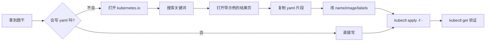

# Kubernetes 认证实战: 熟悉官方文档（考点分布与搜索技巧）

CKA 是**机考实操**：浏览器只开两个标签页 —— 一个是考试页面（左题右终端），另一个给你开 `kubernetes.io`。也就是说**考场上是可以查官方文档的**，会查文档本身就是得分项。结论：**死背 yaml 题库性价比低，学会在官方文档里搜到示例并改对字段才快**。

## 纲要

- CKA 考场界面与两个标签页的限制
- 文档站四大菜单：首页、学习、概念、任务
- 概念（Concepts）章节与考纲占比
- 任务（Tasks）为什么是考试时查得最多的一页
- 命令行工具参考：查参数而不是查示例
- 搜索框的正确用法

## 考场界面

```text
┌───────────────────────────────────────────────────────────────┐
│  标签页 1：考试页面                                              │
│  ┌────────────────────┐  ┌─────────────────────────────────┐  │
│  │ 题目列表 / 题干     │  │ 终端 (kubectl 可用)              │  │
│  │ 1. 创建 Pod nginx  │  │ $ kubectl get pods              │  │
│  │ 2. ...             │  │ $ kubectl run nginx --image=..  │  │
│  │ 3. ...             │  │ $                               │  │
│  └────────────────────┘  └─────────────────────────────────┘  │
├───────────────────────────────────────────────────────────────┤
│  标签页 2：https://kubernetes.io   ← 给你开，用来查文档         │
└───────────────────────────────────────────────────────────────┘
```

限制要点：

- 只能开**两个**标签页，第三个打不开；
- 考试环境**不允许开任何代理/客户端类进程**，想加速只能从网络层解决，一般环境直连也能考；
- 建议约**上午场**考，晚上网络拥塞时官方文档打开很慢。

## 文档站结构

```text
kubernetes.io/
├── 首页 Home
├── 学习 (Setup / Learn)
│   ├── 学习环境（如何起一个测试集群）
│   ├── 生产环境（云上装的方式）
│   └── 部署工具（kubeadm / 二进制）
├── 概念 Concepts          ← 理论主体，CKA 考纲「核心概念」约 19% 出自这里
│   ├── Kubernetes 是什么
│   ├── 组件 / API
│   └── Kubernetes 对象（Namespace、Label、Pod、Service ...）
├── 任务 Tasks             ← 实操示例，考试时查得最多
│   ├── 为 Pod 配置卷
│   ├── 用 ConfigMap 配置 Pod
│   ├── 创建静态 Pod
│   ├── 为容器设置环境变量
│   ├── 部署无状态应用（Deployment）
│   ├── 部署有状态应用（StatefulSet）
│   └── 访问集群中的应用（DNS / Service）
├── 教程 Tutorials（国外培训教程，一般可跳过）
└── 参考 Reference
    ├── Kubernetes API 参考
    ├── 命令行工具 (kubectl) 参考      ← 必看
    └── 组件参数参考                   ← 二进制部署调参时查
```

| 菜单 | 内容 | 考试价值 |
| --- | --- | --- |
| 首页 | 学习路径指引 | 低 |
| 学习 | 安装方式说明（kubeadm / 二进制） | 中，安装题可查 |
| **概念 Concepts** | 各种对象与原理 | **高**（占考纲约 19%，出实操题） |
| **任务 Tasks** | 大量可复制的 yaml 示例 | **最高**，翻 yaml 时第一去处 |
| 教程 Tutorials | 国外培训视频文字 | 低，英文听不懂可略 |
| **参考 Reference** | `kubectl` 命令与组件参数全集 | **高**，查参数 / 查 subcommand |

## 中文覆盖度

官方文档已支持多语言，中文翻译目前大约覆盖 **50%**，剩下仍是英文。所以两条路都要会：

- 中文页过一遍，建立"某个知识点在哪个菜单下"的**位置感**；
- 英文页靠浏览器翻译 + 自己的理解啃。

> 别急着买书。官方文档是一手资料，按考纲把 Concepts 和 Tasks 过一遍，比买一堆书更实在。

## 搜索是核心技能

考场上不会用目录导航（太慢），要**用搜索框**：

1. 题干说"用 Deployment 部署一个应用" → 搜 `deployment`；
2. 结果里打开前几个，找带 `yaml` 示例的；
3. 复制示例 → 改 `name`、改 `image`、改 `labels` → 粘回终端。



### 比复制更快的另一条路

大多数 yaml 根本不用手写，`kubectl` 能直接生成模板：

```bash
# 生成 yaml 而不真正创建（--dry-run=client 只在本机校验）
kubectl run nginx --image=nginx:1.21 --dry-run=client -o yaml
kubectl create deployment web --image=nginx:1.21 --dry-run=client -o yaml
kubectl create pod mypod --image=busybox --dry-run=client -o yaml
```

注意区分两个 `dry-run`：

| 写法 | 行为 |
| --- | --- |
| `--dry-run=client` | 只在本机做校验并输出 yaml，**不发请求给 API Server** |
| `--dry-run=server` | 发给 API Server 做服务端校验，返回校验后的对象 |
| `kubectl create ... --dry-run=client -o yaml \| kubectl apply -f -` | 考试里最稳的一步到位写法 |

## API 速览

| 场景 | 该去哪查 |
| --- | --- |
| 不知道某个字段怎么填 | Concepts → Kubernetes 对象，或 `kubectl explain <资源>` |
| 不会写某资源的 yaml | Tasks → 对应任务页，复制官方示例 |
| 记不住命令的参数 | Reference → Command line tool (kubectl) |
| 二进制部署某个组件想调参 | Reference → 该组件的 CLI 参数列表 |
| 想看 API 版本差异 | Reference → Kubernetes API |

`kubectl explain` 是本地就能用的"官方文档"，优先级最高：

```bash
kubectl explain pod
kubectl explain pod.spec.containers
kubectl explain deployment.spec
kubectl explain service.spec.type
```

## Demo 示例

```bash
# 1. 在本地先把字段结构摸清（不需要开文档站）
kubectl explain pod.spec          # 列出 pod.spec 下所有字段及说明

# 2. 生成一个 Pod 的完整文件，从此不必手敲
kubectl run nginx --image=nginx:1.21 --dry-run=client -o yaml > pod.yaml
cat pod.yaml
# apiVersion: v1
# kind: Pod
# metadata:
#   creationTimestamp: null
#   labels:
#     run: nginx
#   name: nginx
# spec:
#   containers:
#   - image: nginx:1.21
#     name: nginx
#     resources: {}
#   dnsPolicy: ClusterFirst
#   restartPolicy: Always
# ...

# 3. 生成后改两处就能交卷
sed -i 's/^  name: nginx/  name: cka-nginx/; s|image: nginx:1.21|image: nginx:1.21\n    ports:\n    - containerPort: 80|' pod.yaml
kubectl apply -f pod.yaml
kubectl get pod cka-nginx -o wide
```

```yaml
# 4. 对照官方文档示例改出来的答法：显式给端口和标签
apiVersion: v1
kind: Pod
metadata:
  name: cka-nginx
  namespace: default
  labels:
    app: cka-nginx        # 后面 Service 就靠这个 selector 选中它
spec:
  containers:
    - name: nginx
      image: nginx:1.21
      ports:
        - containerPort: 80
```

### 总结

- CKA 考场给开 `kubernetes.io`，**会查文档 = 会做题**；概念占考纲约 19%，任务页是翻 yaml 的第一去处。
- 文档站里最该啃的是 **Concepts**（概念）和 **Tasks**（实操示例）两大菜单，参考里的 **kubectl 命令**用来查参数。
- 别背题库。官方示例复制过来只解决"怎么写"，**字段改不改得对**要靠平时做实验。
- 本地效率神器是 `kubectl explain` 和 `--dry-run=client -o yaml`，比开网页快得多。
- 约上午场考、不开代理进程，两个标签页够用：一个考试页，一个文档页。

