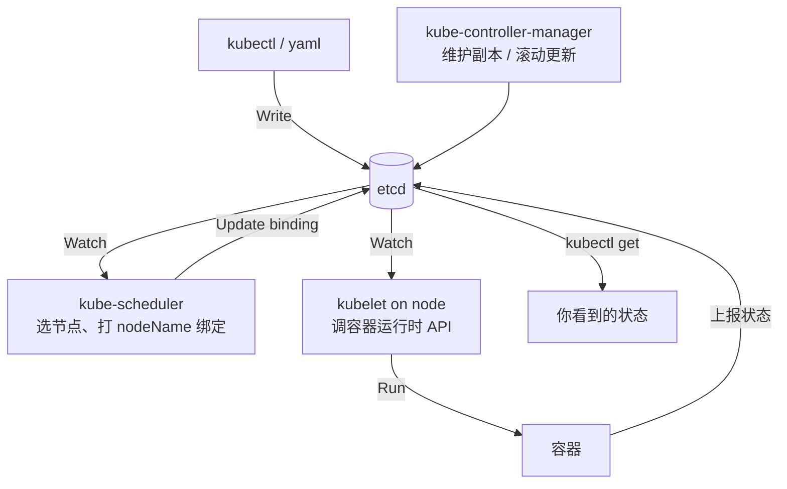

# Kubernetes 认证实战: 应用程序故障排查（从 Pod 事件到容器日志）

CKA 排障题里「应用程序故障排查」基本出 1~2 题，考的不是应用本身（它不在 K8s 范围内），而是**容器层级怎么查**。结论先给：**Pod 状态只要不是 Running，第一反应就是 `kubectl describe pod <name>` 看事件；Pod 起来了才轮到 `kubectl logs` 和 `kubectl exec`**。

## 纲要

- 排障前先回顾：创建一个 Pod 的背后链路
- 第一种现象：Pod 处于 Pending（不可调度）
- 第二种现象：Pod 起来了但容器异常退出
- 两个必背命令：describe 看事件、logs/exec 看应用
- 多容器 Pod 必须 `-c` 指定容器
- 镜像先用 Docker 本地验一遍

## 先回到创建链路

排查之前要把链路在脑子里过一遍，异常一定出在某个环节：



链路里最容易出问题的两处：**kubelet 调运行时起容器**（镜像拉不动、起不来），以及 **kubelet 上报的状态**（上报错误就显示异常状态）。

## 三种典型现象

| 现象 | 含义 | 先看什么 |
| --- | --- | --- |
| `Pending` | 没调度上去，或正在拉大镜像 | `describe` 看 Events |
| `ContainerCreating` | 镜像在拉 / 解压 | `describe` + 看节点磁盘、网络 |
| `CrashLoopBackOff` / `Error` | 容器起来又退了 | `logs` 看应用输出 |

## 现象一：Pod 一直 Pending

构造一个不可调度的 Pod：写一个 nodeSelector，但节点上没这个标签。

```bash
# 1. 生成一个 Deployment 清单，把时间戳删掉才好手改
kubectl create deployment web --image=nginx:1.21 \
  --dry-run=client -o yaml > web.yaml
sed -i '/creationTimestamp/d' web.yaml
```

```yaml
apiVersion: apps/v1
kind: Deployment
metadata:
  name: web
spec:
  replicas: 1
  selector:
    matchLabels:
      app: web
  template:
    metadata:
      labels:
        app: web
    spec:
      nodeSelector:
        gpu: "true"     # 节点上没这个标签 → Pod 永远调度不上去
      containers:
        - name: nginx
          image: nginx:1.21
```

```bash
kubectl apply -f web.yaml
kubectl get pods
# NAME                  READY   STATUS    RESTARTS   AGE
# web-5d9f8c7b-abcde    0/1     Pending   0          10s

# 2. 第一时间 describe，Events 里会写死原因
kubectl describe pod web-5d9f8c7b-abcde
# Events:
#   Type     Reason             Message
#   ----     ------             -------
#   Warning  FailedScheduling   0/3 nodes are available: 3 node(s) had untolerated taint {...}
#   Warning  FailedScheduling   0/3 nodes are available: 3 nodes don't match node selector...
```

> Pending 不一定是故障 —— 拉一个几百 MB 的大镜像时也会短暂停在 Pending。判断办法：`describe` 的 Events 里是不是 `Pulling`、`Pulled`。

## 现象二：容器起来了但立刻退出

```bash
kubectl run busybox --image=busybox:1.28 -- command -- sleep 3600 --dry-run=client -o yaml
```

如果只写 `image` 不写常驻命令，busybox 跑完就退，`kubectl get pod` 会看到 `Completed` 或 `CrashLoopBackOff`。

```bash
# 1. 看事件
kubectl describe pod busybox | tail -20
#   Normal   Pulled      Container image already present on machine
#   Normal   Created     Created container
#   Normal   Started     Started container
#   Warning  BackOff     Back-off restarting failed container

# 2. 看应用日志（这次能打到退出前输出了什么）
kubectl logs busybox
kubectl logs busybox --previous        # 看上一次崩溃的日志，排障神器
```

**最常见的这类错误就是镜像本身有问题**。所以在把镜像推进 K8s 之前，先在本地 `docker run` 验一遍 —— Docker 能跑起来，K8s 基本也没问题。

## 两个必背命令

| 命令 | 看的是谁 | 适用状态 |
| --- | --- | --- |
| `kubectl describe pod <pod>` | **K8s 管理 Pod 产生的事件**（调度失败、拉镜像失败、探针失败） | Pending / ContainerCreating / Error 都能看 |
| `kubectl logs <pod>` | **容器里应用输出到标准输出的日志** | 只有 Pod 起来了才有 |
| `kubectl exec -it <pod> -- sh` | 进容器里 debug | 只有 Pod 起来了才能进 |

> **`logs` 和 `exec` 对 Pending 的 Pod 用不了**，会报 `the server could not find the requested resource` 或容器未就绪的错误。所以顺序不能反：**先 describe 定位为什么起不来，Pod 起来了再看 logs/exec**。

## 多容器 Pod 必须指定 `-c`

一个 Pod 里放两个容器（nginx + tomcat），此时默认只对第一个容器生效，多容器要显式指定：

```bash
# 默认进入第一个容器（yaml 里 containers 的第一项）
kubectl exec -it web-xxx -c nginx -- sh

# 查第二个容器的日志
kubectl logs web-xxx -c tomcat

# 两个都启动了吗：0/2 表示两个都没就绪
kubectl get pod web-xxx
# NAME      READY   STATUS    RESTARTS   AGE
# web-xxx   0/2     Running   0          30s
```

`READY` 列显示 `0/2` 就是在告诉你**这个 Pod 里有几个容器**；`-c <name>` 必须写全，否则日志和进容器都会落到第一个上。

## 日志在哪儿

同一条命令，kubeadm 部署和二进制部署找到日志的位置完全不同：

```text
/var/log/
├── messages                    # 系统级
├── kubelet.log                 # 二进制部署：kubelet
├── kube-apiserver.log
├── kube-controller-manager.log
├── kube-scheduler.log
├── etcd.log
└── pods/                       # 静态 Pod 的日志目录
    └── ...

# kubeadm 部署：控制平面全部是静态 Pod，直接用 kubectl 看
kubectl logs -n kube-system kube-apiserver-node1
kubectl logs -n kube-system kube-controller-manager-node1
kubectl logs -n kube-system kube-scheduler-node1
```

判断集群是哪种部署方式（下一节会讲，这里先记住排查入口）：

| 部署方式 | 控制平面组件怎么起 | 看日志的方式 |
| --- | --- | --- |
| kubeadm | 除 kubelet 外全是静态 Pod | `kubectl logs -n kube-system <组件 pod>` |
| 二进制 | systemd 管理的独立进程 | `/var/log/*.log` 或 `journalctl -u <服务>` |

## API 速览

| 想看什么 | 命令 |
| --- | --- |
| Pod 基本状态 | `kubectl get pods -o wide` |
| Pod 事件（**最关键**） | `kubectl describe pod <pod>` |
| 上一个容器崩溃前的日志 | `kubectl logs <pod> --previous` |
| 指定容器 | `kubectl logs <pod> -c <container>` / `kubectl exec -it <pod> -c <container> -- sh` |
| 看容器里 process 是否还活着 | `kubectl exec <pod> -- ps aux` |
| 容器资源占用 | `kubectl top pod <pod>` |
| othesis 节点日志 | 二进制看 `/var/log/<component>.log`；kubeadm 看 `kubectl logs -n kube-system <pod>` |

## Demo 示例

一条完整的排障闭环（可直接抄进考场终端）：

```bash
# 第 1 步：确认现象
kubectl get pods -A | grep -v Running

# 第 2 步：拿名字，describe 看事件
POD=$(kubectl get pod -l app=web -o jsonpath='{.items[0].metadata.name}')
kubectl describe pod "$POD" | tail -30

# 第 3 步：按事件类型分流
#   FailedScheduling     -> 查节点污点 / nodeSelector / 资源不足：
#                            kubectl describe node <node> | grep -A2 Taint
#   ErrImagePull         -> 镜像名写错或私有仓库没登：kubectl get -o yaml | grep image
#   CrashLoopBackOff     -> 进第 4 步

# 第 4 步：看应用日志
kubectl logs "$POD" --previous
kubectl exec -it "$POD" -- sh
# 容器里：ps aux / curl 127.0.0.1:8080 / ls / etc ...
```

```yaml
# 一个自带常驻命令、能稳定跑在 K8s 里的最小 Pod
apiVersion: v1
kind: Pod
metadata:
  name: debug-box
  labels:
    app: debug
spec:
  containers:
    - name: busybox
      image: busybox:1.28
      command: ["sleep", "3600"]   # 不加这条，容器跑完就退
      resources:
        requests:
          cpu: "10m"
          memory: "16Mi"
```

### 总结

- 排障顺序固定：**`get` 看状态 → `describe` 看事件 → `logs/exec` 看应用**，顺序反了会白忙。
- `describe` 的 Events 是 K8s 给的免费线索，Pending / FailedScheduling / ErrImagePull 就写在那里。
- `CrashLoopBackOff` 一定要加 `--previous` 看上一轮日志，否则只看得到空输出。
- 多容器 Pod 的 `logs`、`exec` 必须带 `-c`，默认只对第一个容器生效。
- 镜像先本地 `docker run` 验通再推进 K8s，能砍掉一大半"应用起不来"的考桩。

