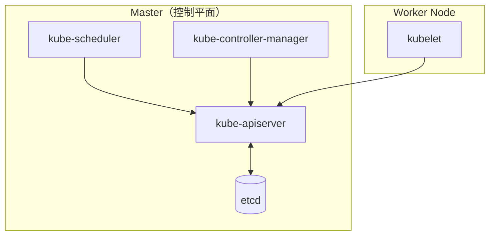

# Kubernetes 认证实战: 管理节点（Master）故障排查

CKA 有一道经典真题：**给一个管理节点的异常，让你找出来并修好**。题干通常不会说明白，就是"管理节点有异常"，实际上往往只是"某个 master 组件没起来"。结论先给：**先 `kubectl get cs` 看哪个组件不健康 → 判断集群是 kubeadm 还是二进制部署 → 按对应方式把组件拉起来 → 设开机自启**。

## 纲要

- 单 master 架构回顾：三组件 + etcd
- 第一步：区分 kubeadm 部署还是二进制部署
- 第二步：用 `kubectl get cs` 定位哪个组件不健康
- kubeadm 场景：从静态 Pod 清单目录找问题
- 二进制场景：ps / systemctl / journalctl
- 完整修复动作：启动 + enable

## 架构回顾



master 就 **3 个核心组件**（API Server、Scheduler、Controller Manager），外加一个**独立部署**的 etcd（不算 master 组件，放哪都行，只要 API Server 连得上）。

一个必须先分清的前提：**kubeadm 部署时，除 kubelet 之外的控制平面组件都是静态 Pod（Static Pod）**；二进制部署时，所有组件都是 systemd 管的独立进程。

## 第一步：先判断是哪种部署

| 判断依据 | kubeadm 部署 | 二进制部署 |
| --- | --- | --- |
| `ps` 看进程 | 进程存在但其实是容器里跑的，看不准 | 能直接看到可执行文件路径与参数 |
| `kubectl get pods -n kube-system` | **能看到 apiserver / controller-manager / scheduler / etcd 的 Pod** | 看不到这些 Pod |
| 系统服务 | 没有对应 systemd 单元 | `systemctl status <组件>` 有输出 |
| 静态 Pod 清单目录 | `/etc/kubernetes/manifests/*.yaml` 存在 | 没有 |

```bash
# 方式 A（最快）：看 kube-system 下有没有控制平面 Pod
kubectl get pods -n kube-system -o wide | grep -E 'apiserver|controller|scheduler|etcd'
# kube-apiserver-master1    1/1     Running   0   5d
# kube-controller-manager-master1  1/1  Running  0  5d
# kube-scheduler-master1    1/1     Running   0   5d
# etcd-master1              1/1     Running   0   5d

# 方式 B：二进制环境用 systemctl 验证
systemctl status kube-controller-manager
# ● kube-controller-manager.service - Kubernetes Controller Manager
#     Loaded: loaded (/usr/lib/systemd/system/kube-controller-manager.service; enabled)
#     Active: active (running) since ...
# kubeadm 环境执行这条会报 Unit not found
```

## 第二步：定位不健康的组件

```bash
kubectl get cs
# NAME                 STATUS      MESSAGE             ERROR
# controller-manager   Unhealthy   `{}`                  ← 就它
# scheduler            Healthy     ok
# etcd-0               Healthy     {"health":"true"}
```

注意：**etcd 独立部署时会显示 3 个 etcd 成员**（`etcd-0`、`etcd-1`、`etcd-2`），而打包进 Pod 时只显示一个 `etcd`。

## kubeadm 场景：静态 Pod 清单目录

静态 Pod 由 kubelet 定时扫描 `/etc/kubernetes/manifests/` 自动拉起，**清单文件在就自动起，文件没了就自动消失**。

```text
/etc/kubernetes/
└── manifests/                       # kubelet 的静态 Pod 工作目录
    ├── etcd.yaml
    ├── kube-apiserver.yaml
    ├── kube-controller-manager.yaml    ← 真题最爱挪走这一份
    └── kube-scheduler.yaml
```

复现与修复：

```bash
# 1. 把清单挪走 → controller-manager 的 Pod 会立刻消失
mv /etc/kubernetes/manifests/kube-controller-manager.yaml /root/bak/

# 2. 确认 Pod 没了、cs 变 unhealthy
kubectl get pods -n kube-system | grep controller   # 无输出
kubectl get cs                                       # Unhealthy

# 3. 把清单放回去 → kubelet 自动重新拉起，无需手动 start
cp /root/bak/kube-controller-manager.yaml /etc/kubernetes/manifests/

# 4. 三选一：等 kubelet 轮询（默认 20s），或强制刷新
sleep 20 && kubectl get cs
systemctl restart kubelet
```

顺带一提：**清单可以从别的 control-plane 节点直接拷一份过来**（同一个集群里这几份 yaml 是一样的）。

## 二进制场景：ps / systemctl / 日志

```bash
# 1. 找进程在哪、启动参数是什么
ps -ef | grep -E 'kube-controller-manager|kube-scheduler|kube-apiserver|etcd' | grep -v grep

# 2. 看服务状态
systemctl status kube-controller-manager

# 3. 看日志（定位配置写错、证书过期这类真·故障）
journalctl -u kube-controller-manager -f --since '10 min ago'
# 或二进制直接落盘：tail -f /var/log/kube-controller-manager.log

# 4. 起来了还报错？看进程有没有监听端口
ss -lntup | grep -E '6443|10259|10257|2379'
# 6443 = apiserver，10259 = kube-scheduler，10257 = kube-controller-manager，2379 = etcd
```

## 完整修复动作（得分的两个点）

组件的"健康"除了当前能跑，**还要开机自启**，考场上少写 `enable` 会丢分。

```bash
# 二进制：启动 + 设开机启动
systemctl start kube-controller-manager
systemctl enable kube-controller-manager
systemctl is-enabled kube-controller-manager   # 验证，输出 enabled

# kubeadm：把清单放回 manifests 目录即可（它本身由 kubelet 托管）
# 若需开机自启，确认 kubelet 自身是 enabled：
systemctl is-enabled kubelet                    # 正常应输出 enabled
```

## API 速览

| 目标 | 命令 |
| --- | --- |
| 查全部组件健康 | `kubectl get cs`（老版本 `kubectl get componentstatuses`） |
| 查控制平面 Pod | `kubectl get pods -n kube-system -o wide` |
| 看某个组件日志（kubeadm） | `kubectl logs -n kube-system kube-controller-manager-<master>` |
| 看某个组件日志（二进制） | `journalctl -u kube-controller-manager -f` |
| kubelet 是否开机自启 | `systemctl is-enabled kubelet` |
| 静态 Pod 清单目录 | `/etc/kubernetes/manifests/` |
| 二进制组件参数全集 | 官方文档 Reference → 组件命令行参数 |

## Demo 示例

把上面流程串成一条可执行的排障脚本：

```bash
#!/usr/bin/env bash
set -euo pipefail

echo "== 1. 当前不健康的组件 =="
kubectl get cs | awk '$2 != "Healthy" {print}'

echo "== 2. 判断部署方式 =="
if kubectl get pods -n kube-system 2>/dev/null | grep -qE 'kube-apiserver|etcd'; then
  echo "部署方式: kubeadm（控制平面是静态 Pod）"
  ls -l /etc/kubernetes/manifests/
  # 静态 Pod 异常：把清单移出/移回触发 kubelet 重建
  mv /etc/kubernetes/manifests/kube-controller-manager.yaml /tmp/
  sleep 20
  cp /tmp/kube-controller-manager.yaml /etc/kubernetes/manifests/
  sleep 20
else
  echo "部署方式: 二进制（systemd 托管）"
  systemctl status kube-controller-manager --no-pager | head -5
  systemctl start kube-controller-manager
  systemctl enable kube-controller-manager
  journalctl -u kube-controller-manager -n 50 --no-pager
fi

echo "== 3. 复检 =="
kubectl get cs
```

```yaml
# /etc/kubernetes/manifests/kube-controller-manager.yaml 的关键片段
# 清单放对位置，kubelet 就会自动拉起静态 Pod，不需要手动 start
apiVersion: v1
kind: Pod
metadata:
  name: kube-controller-manager
  namespace: kube-system
  pathAliases:
    - containerRuntimeEndpoint
spec:
  containers:
    - name: kube-controller-manager
      image: k8s.gcr.io/kube-controller-manager:v1.23.6
      command:
        - kube-controller-manager
        - --kubeconfig=/etc/kubernetes/controller-manager.conf
        - --leader-elect=true
      volumeMounts:
        - mountPath: /etc/kubernetes/pki
          readOnly: true
          name: pki
  volumes:
    - name: pki
      hostPath:
        path: /etc/kubernetes/pki
```

### 总结

- CKA 的 master 故障题基本都很"素"：**组件没启动，把它启动起来并设开机自启**。
- 动手前先分清** kubeadm（静态 Pod + manifests 目录）还是二进制（systemd）**，这是所有操作的前提。
- `kubectl get cs` 一步定位，`kubectl get pods -n kube-system` 一步判部署方式，两条命令搞定 80%。
- kubeadm 场景别去找 systemd，正确动作是把 `/etc/kubernetes/manifests/` 里的 yaml 放回去。
- 二进制场景的三板斧：`ps` 看进程、`systemctl status` 看状态、`journalctl -u` 看日志，修完别忘 `enable`。

