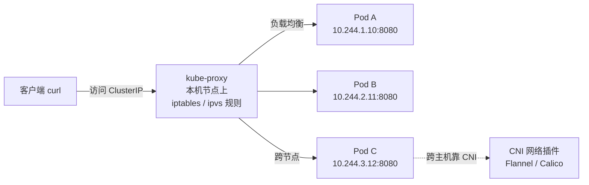

# Kubernetes 认证实战: Service 访问故障排查的七步定位法

Service 访问不通是 CKA 排障大题里最常见的一题。结论先给：**从客户端一路往下剥 —— Service 有没有选中 Pod → 端口对不对 → Pod 本身活着吗 → DNS 解析了吗 → kube-proxy 活着吗 → iptables/ipvs 规则写了吗 → CNI 跨节点通不通**。用排除法一分钟内能扫完九成的坑。

## 纲要

- Service 的访问链路回顾
- 第一步：Service 有没有真的关联到 Pod
- 第二步：端口 port / targetPort / nodePort 到底填什么
- 第三步：Pod 状态正常，不代表应用正常
- 第四步：用域名还是用 ClusterIP，先确定访问方式
- 第五步：kube-proxy 是否正常工作
- 第六步：iptables / ipvs 转发规则有没有写进去
- 第七步：CNI 网络插件决定跨节点能不能通

## 访问链路



**Service IP 是一个虚拟 IP，并不绑在任何一个网卡上**。你 curl 它，实际是交给本机 kube-proxy 生成的 iptables/ipvs 规则做 DNAT 转发到后端 Pod。

Service 解决两件事：

1. **服务发现**：Pod 是短暂的、会变，Service 提供一个稳定入口；
2. **负载均衡**：把请求摊到这一组 Pod 上。

两件事落地的分别是谁：

| 功能 | 谁实现 |
| --- | --- |
| 服务发现 | kube-proxy 维护的转发规则 + 各节点上的 kube-proxy 配合 |
| 负载均衡 | kube-proxy（底层是 iptables 或 ipvs） |

## 第一步：Service 有没有真的关联到 Pod

Service 靠 `spec.selector` 的标签去匹配 Pod。匹配不到就是**一个空 Service**，curl 必然无响应。

```bash
# 最直观：看 Service 后面有没有挂上后端 IP
kubectl get endpoints $SVC
# NAME         ENDPOINTS                        PORT
# web          10.244.1.10:8080,10.244.2.11:8080   8080
# 空的话 ENDPOINTS 列什么都没有 → Service 是空的

# 等价写法，EP 是 endpoints 的简写
kubectl get ep $SVC
kubectl get ep $SVC -o yaml

# 用 selector 反查 Pod，看到底选中了谁
kubectl get pods -l app=web --show-labels
```

**最常见的坑**：从别处复制了一份 yaml，`selector` 里的标签忘了改，或和 Deployment 里 Pod 模板的 `labels` 对不上，Service 就成了空壳。

```yaml
apiVersion: v1
kind: Service
metadata:
  name: web
spec:
  selector:
    app: web        # 必须和 Pod 模板 labels 完全一致，多一个冒号都不行
  ports:
    - port: 80      # Service 自己的端口，配合 ClusterIP 使用
      targetPort: 8080   # 容器的端口，一般和 port 不一样
```

## 第二步：端口到底填什么

| 字段 | 含义 |
| --- | --- |
| `port` | Service 自己的端口（ClusterIP + port 才是访问地址） |
| `targetPort` | **后端容器实际监听的端口**，填错了转发必失败 |
| `nodePort` | 仅 NodePort 类型，节点对外暴露的端口 |

`targetPort` 写的是**镜像里应用监听的端口**，不是随便填的。

```bash
# 后端 Pod 真正在哪个端口上提供服务？
kubectl exec -it $POD -- ss -lntup
# 或看容器声明的端口
kubectl get pod $POD -o jsonpath='{.spec.containers[*].ports[*].containerPort}'
```

> 构建镜像时把默认 8080 改成了 9090，创建 Service 时还写 80 → 规则照转，但容器里没人应答，请求 100% 失败。

**另一个隐蔽坑：标签太宽泛误选了别的应用**。Service 只认"这个 namespace 下有没有匹配这个标签的 Pod，匹配几个就关联几个"。名字都不一样也会被拉进来：

```bash
# 三个端点里有两个根本不是同一个 Deployment 管的
kubectl get ep web
# NAME   ENDPOINTS
# web    10.244.1.10:8080,10.244.2.11:8080,10.244.3.13:9090
```

解决办法是让标签更精确，比如 `app: web,version: v2`。

## 第三步：Pod 状态正常 ≠ 应用正常

```bash
kubectl get pod -l app=web
# NAME                  READY   STATUS    RESTARTS   AGE
# web-5d9f8c7b-abcde    1/1     Running   0          5m
```

`Running` 只说明**容器进程没退出**。应用可能内存溢出、抛异常、根本没在监听端口，但对 K8s 来说它依然是 Running。

```bash
# 两个层面都要查
kubectl exec -it $POD -- curl -sS 127.0.0.1:$PORT     # 容器内自测
# 下面命令中的变量按你的集群环境赋值后再执行
kubectl logs $POD --previous                            # 看崩溃前日志
```

生产环境要给探针兜底（`readinessProbe` 不通过的 Pod 会被自动从 Service 的 endpoints 里摘掉）：

```yaml
readinessProbe:
  httpGet:
    path: /healthz
    port: 8080
  periodSeconds: 5
```

> 探针挂了 → Pod 从 endpoints 摘除 → Service 转发无终点。此时 `kubectl get endpoints` 会显示这些 Pod 的 IP 消失，这也是一种排障信号。

## 第四步：你访问的是 ClusterIP 还是 DNS 名

前端连后端，通常写 Service 名字而不是 IP —— 因为换个集群 IP 全变了。用名字就必须有 DNS。

```bash
# K8s 集群内默认用 CoreDNS 做解析
kubectl get pods -n kube-system -l k8s-app=kube-dns
kubectl get svc -n kube-system

# 在 Pod 里实测解析
kubectl exec -it $POD -- nslookup web.default.svc.cluster.local
kubectl exec -it $POD -- curl http://web:80
```

如果 curl ClusterIP 能通、用域名不通，问题就在 CoreDNS：describe 一下 `kube-dns` / `coredns` 这个 Pod，按前面应用程序排障的思路查事件。

## 第五步：kube-proxy 本身活着吗

```bash
# 所有 worker 节点上都要查（每个 node 都有 kube-proxy，负责本节点的转发规则）
systemctl status kube-proxy            # 二进制
kubectl get pod -n kube-system -l k8s-app=kube-proxy -o wide

# kube-proxy 自己监听的端口，说明它起来了
ss -lntup | grep -E '10249|10256'      # 10249 指标/健康，10256 就绪探测

# 日志里的 error 一定要先修（哪怕看着影响不大）
journalctl -u kube-proxy -f --since '10 min ago'
# 常见的：'conntrack' command not found —— 少装了 conntrack-tools
```

```text
/var/log/
├── kube-proxy.log            # 二进制部署：
├── messages                  # 系统级日志
└── journalctl 查 systemd 输出   # journalctl -u kube-proxy -n 100 --no-pager

# 本机上进程 → 端口 → 日志，三步走
ps -ef | grep kube-proxy | grep -v grep
ss -lntup | grep kube-proxy
journalctl -u kube-proxy -n 100 --no-pager
```

> 经验法则：日志里只要冒出 error 级，**不管当前有没有影响，先修掉**。比如缺 `conntrack` 命令，装包、重启 kube-proxy，错误消失。

## 第六步：iptables / ipvs 规则写进去了吗

kube-proxy 的**默认代理模式就是 iptables**，只有显式指定 `--proxy-mode=ipvs` 才走 ipvs。

```bash
# 看当前用哪种模式（kubeadm 装的集群默认是 iptables）
kubectl get configmap -n kube-system kube-proxy -o yaml | grep -i mode
# proxyMode: ""

# iptables 模式：按 Service 名字过滤，找 KUBE-SERVICES / KUBE-SEP 链
iptables -t nat -S | grep WEB_SVC
iptables -t nat -S | grep KUBE-SERVICES
iptables -L KUBE-FW -n -v | head

# ipvs 模式
ipvsadm -Ln
ipvsadm -Ln --stats
```

kube-proxy 启动时日志会打印它在做什么，可以照着核对：

```text
Adding new service port web:80 -> 10.96.123.45:80
Using iptables proxy mode
```

规则在，转发链路基本就通了。

## 第七步：CNI 插件决定跨节点能不能通

Service 后端 Pod 不一定和你 curl 的节点在同一台机器上，跨节点通信完全靠 CNI 插件（Flannel / Calico）。

```bash
# 看 Pod 分散在哪些节点
kubectl get pods -l app=web -o wide
# NAME    ...  NODE
# web-1   ...  node-1
# web-2   ...  node-2     ← curl 在 node-1 上打 → 要走 CNI

# CNI 插件自身是否健康
kubectl get pods -n kube-system -l k8s-app=flannel -o wide
kubectl get pods -n kube-system -l k8s-app=calico-node -o wide
```

故障特征很典型：**同一节点上的 Pod 能 curl 通，跨节点的一定失败，表现为时通时不通（有概率）** —— 因为转发规则在本地，落到本节点 Pod 就直接通了，落到别的节点就要过 CNI。

```bash
# 节点间的 Pod 网络是否通
ping 10.244.2.11
ip route show | grep 10.244
ip link show flannel.1        # Flannel VXLAN
```

> 已知的历史坑：kubeadm 部署 + Flannel VXLAN 模式，在 1.17/1.18 版本上出现过 curl 极慢（约 10 秒才返回、成功率靠运气）的 bug。这类"节点内/网络层"的问题靠上面七步都查不出来，只能靠抓包分析定位到 CNI。

## API 速览

| 想查什么 | 命令 |
| --- | --- |
| Service 及类型/ClusterIP | `kubectl get svc -o wide` |
| Service 后端有没有 Pod | `kubectl get endpoints $SVC` / `kubectl get ep -o wide` |
| 用 selector 反查 Pod | `kubectl get pod -l <key>=<val> --show-labels` |
| Pod 在哪个端口监听 | `kubectl exec <pod> -- ss -lntup` |
| DNS 解析是否正常 | `kubectl exec <pod> -- nslookup <svc>` |
| CoreDNS 状态 | `kubectl get pods -n kube-system -l k8s-app=kube-dns` |
| kube-proxy 状态 | `systemctl status kube-proxy` / `kubectl get pod -n kube-system -l k8s-app=kube-proxy` |
| 走了哪种代理模式 | `kubectl get cm -n kube-system kube-proxy -o yaml \| grep -i mode` |
| iptables 规则 | `iptables -t nat -S \| grep <svc>` |
| ipvs 规则 | `ipvsadm -Ln` |
| CNI 插件状态 | `kubectl get pods -n kube-system -l k8s-app=flannel/calico-node` |

## Demo 示例

一条命令走完七步的排障脚本：

```bash
#!/usr/bin/env bash
SVC=${1:-web}
NS=${2:-default}

echo "===== 1. service 基本信息 ====="
kubectl get svc "$SVC" -n "$NS" -o wide

echo "===== 2. endpoints 是否为空（最关键） ====="
kubectl get endpoints "$SVC" -n "$NS" -o wide

echo "===== 3. selector 匹配了哪些 Pod ====="
SEL=$(kubectl get svc "$SVC" -n "$NS" -o jsonpath='{.spec.selector}')
echo "selector = ${SEL}"
kubectl get pod -n "$NS" --show-labels | grep -F "$(echo "$SEL" | tr -d '{}"' | tr ',' '\n' | sed 's/^/ /;s/$/ /' | tr -d '\n')"

echo "===== 4. Pod 状态与分布 ====="
kubectl get pod -n "$NS" -o wide

echo "===== 5. kube-proxy 组件健康 ====="
kubectl get pod -n kube-system -l k8s-app=kube-proxy -o wide
systemctl status kube-proxy --no-pager | head -3

echo "===== 6. 转发规则 ====="
iptables -t nat -S | grep "$SVC" || echo "（无规则：转发层没生成，查 kube-proxy 日志）"

echo "===== 7. DNS ====="
kubectl exec -n kube-system deploy/coredns -- nslookup "$SVC"."$NS".svc.cluster.local 2>/dev/null || \
  kubectl get pods -n kube-system -l k8s-app=kube-dns
```

```yaml
# 一个字段齐全、排障友好的 Service（NodePort + 明确端口命名）
apiVersion: v1
kind: Service
metadata:
  name: web
  namespace: default
spec:
  type: NodePort
  selector:
    app: web             # 与 Deployment 的 pod template labels 严格一致
  ports:
    - name: http         # 命名端口，方便 targetPort 用名字引用
      port: 80           # Service 端口
      targetPort: 8080   # 容器实际监听端口
      nodePort: 30080    # 仅 NodePort 生效，范围 30000-32767
      protocol: TCP
```

### 总结

- 排障顺序就是数据流向：**客户端 → Service → kube-proxy 规则 → 后端 Pod → CNI**，逐层排除，别跳步。
- **先看 `kubectl get endpoints` 是否为空**，一秒判断是不是 selector 写错，命中率极高。
- `targetPort` 必须等于容器里应用**真正监听**的端口，和 `port` 不一样很正常，别照抄成 80。
- `Running` 不代表能服务，应用挂了 K8s 看不出来，要进容器 curl 自测或加 `readinessProbe`。
- kube-proxy 的 error 日志先修再谈；跨节点时不通要想到 **CNI 插件**，本节点通、跨节点不通就是它。

