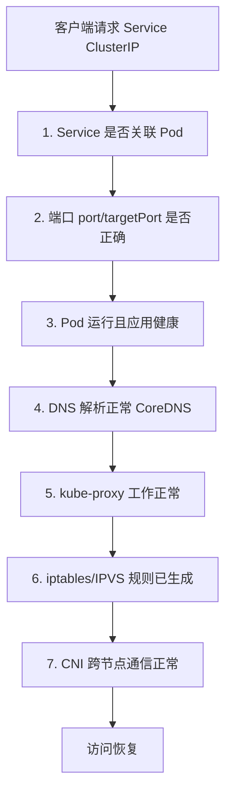

# Service 访问故障排查（七步定位法）

当你在集群内 `curl` 一个 Service 的 ClusterIP 却得不到响应时，问题可能出在链路上的任何一环。要高效排查，前提是先理解 Service 的访问全流程：**客户端请求 Service 的 ClusterIP → kube-proxy 借助 iptables 或 IPVS 做负载均衡 → 转发到后端 Pod 的 targetPort**。Service 的两个核心能力——服务发现与负载均衡——正是由 kube-proxy 落实、底层由 iptables/IPVS 实现的。

下面给出一套从「应用层」到「网络层」的七步排查思路，按顺序逐一排除，绝大多数 Service 访问异常都能在 1–2 分钟内定位。

## 纲要

- 先理解 Service 访问链路：ClusterIP → kube-proxy → iptables/IPVS → Pod
- 第一步：确认 Service 是否通过标签关联到了 Pod（看 Endpoints）
- 第二步：核对端口映射 port / targetPort / containerPort
- 第三步：确认 Pod 状态正常且应用进程真的在提供服务
- 第四步：确认 Service 能否通过 DNS 名称解析（CoreDNS）
- 第五步：确认 kube-proxy 组件本身工作正常
- 第六步：确认 iptables / IPVS 转发规则已生成
- 第七步：跨节点场景确认 CNI 网络插件工作正常

## Service 访问全流程



## 排查步骤详解

### 1. Service 是否关联到了 Pod

Service 通过 **标签选择器（selector）** 匹配 Pod，匹配到的 Pod 会被写入 Endpoints。最直观的确认方式不是看标签，而是直接看 Endpoints：

```bash
# 直接看这个 Service 背后有没有关联到 Pod 的 IP
kubectl get endpoints <service-name>

# 或者通过标签筛选它应该匹配的 Pod
kubectl get pods -l app=web
```

如果 Endpoints 为空，说明 selector 与 Pod 标签不匹配——常见原因是写 YAML 时从别处复制了标签却没改，或 Deployment 的 Pod 模板标签与 Service 的 selector 对不上。空 Service 自然无人响应，curl 必然失败。

### 2. 端口映射是否正确

一个标准 Service 里有多个端口概念，写错 targetPort 是最常见的坑：

| 字段 | 含义 | 易错点 |
| --- | --- | --- |
| `port` | Service 的 ClusterIP 上暴露的端口 | 集群内访问用的端口 |
| `targetPort` | 请求被转发到的**后端 Pod 容器端口** | 必须写应用实际监听的端口 |
| `containerPort` | Pod 里容器声明监听的端口 | 应与 targetPort 一致 |

关键点：**targetPort 写的是你部署的镜像里应用真正监听的端口，不是随便填的**。如果容器里 nginx 监听 80，你却写成别的端口，iptables/IPVS 按端口转发过去后，后端根本没有服务响应，请求必然失败。

导出一份标准 Service 模板对照：

```bash
kubectl expose deployment web --port=80 --target-port=80 --dry-run=client -o yaml
```

### 3. Pod 是否正常工作

这里分两个层面，不能只看 Pod 状态：

- **Pod 状态**：`kubectl get pods` 看是否为 `Running`。
- **应用进程是否真的健康**：Pod 是 Running 只代表 kubelet 认为容器没退出。若应用内部 OOM、抛异常但进程未退出，Pod 仍是 Running，却不提供服务。这种情况要靠**日志**（`kubectl logs`）或**健康检查（liveness/readiness probe）**来发现。

### 4. Service 是否通过 DNS 工作

跨应用访问（如前端连后端）通常写 Service 名称而非 IP，因为 IP 换集群就变。集群内 DNS 由 **CoreDNS**（旧版为 kube-dns）提供，默认部署在 `kube-system` 命名空间：

```bash
kubectl get pods -n kube-system -l k8s-app=kube-dns
kubectl describe pod -n kube-system <coredns-pod>   # 套用应用故障排查思路
```

若 CoreDNS 异常，通过名称访问会失败，但用 ClusterIP 仍能通——这能帮你区分是 DNS 层还是转发层的问题。

### 5. kube-proxy 是否正常工作

负责服务发现与负载均衡的正是 kube-proxy。先在 Node 上确认它启动了：

```bash
# 进程是否存在
ps aux | grep kube-proxy
# 它自身也会监听端口并暴露指标（常见如 10249/10256，以实际为准）
ss -lntp | grep kube-proxy
```

再看日志里有没有 error 级别信息：

```bash
journalctl -u kube-proxy --no-pager | grep -i error
```

典型故障：日志报 `conntrack` 命令找不到。这种一般是缺软件包，用包管理器装上、重启 kube-proxy 即可，这类「装个包就能解决」的问题都不难处理。

### 6. iptables / IPVS 规则是否生成

只要 kube-proxy 正常工作且日志无错，规则一般都会写。可验证一下：

```bash
# iptables 模式：过滤出该 Service 相关的链与 DNAT 规则
iptables-save | grep <service-name>

# IPVS 模式：查看虚拟服务与真实后端
ipvsadm -ln        # 若未安装先 yum/apt 装 ipvsadm
```

如果规则没生成，请求到 kube-proxy 这层就断了，后续没有转发动作，链接直接挂掉。

### 7. CNI 网络插件是否跨节点正常

当后端 Pod 分布在多个节点时，负载均衡规则只认「IP + 端口」，不关心 Pod 在哪个节点；真正把流量送到其他节点的 Pod，靠的是 **CNI 网络插件**（如 Flannel、Calico）打通的扁平化网络。

跨节点通信失败时，会出现「偶发能访问」的现象：你 curl 时恰好命中原节点本地的 Pod，不走 CNI 就能通；命中其他节点的 Pod 则失败。这时要排查 CNI 插件状态。

> 已知坑：在 1.17 / 1.18 版本中，Flannel 的 vxlan 模式在 kube-proxy 某些部署下会导致 `curl` Service 极慢（约 10 秒偶发才成功），官方已收到 issue，建议关注版本与修复进展。

## 组件与命令速查

```dir
├── 排查起点
    ├── kubectl get endpoints/svc/pods   # 关联与端口
    ├── kubectl logs / describe          # 应用健康
    ├── CoreDNS (kube-system)            # DNS 解析
    ├── kube-proxy (各节点)              # 规则下发
    │   ├── iptables-save | grep svc     # iptables 模式规则
    │   └── ipvsadm -ln                  # IPVS 模式规则
    └── CNI 插件 (flannel/calico)        # 跨节点通信
```

## 总结

- Service 访问异常遵循固定链路，按「应用层 → 转发层 → 网络层」顺序排查最快。
- 前四步多在应用 / 配置层：标签关联、端口映射、Pod 与应用健康、CoreDNS。
- 后三步多在集群组件层：kube-proxy 状态、iptables/IPVS 规则、CNI 跨节点通信。
- 养成习惯：日志里出现 error 级别就先修复，别等问题扩大；装包能解决的都不是大问题。
- 绝大多数问题靠这七步排除法 1–2 分钟可定位，仅少数 CNI / kube-proxy 深坑才需抓包等高级手段。
