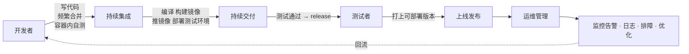

# Kubernetes 认证实战: 容器交付流程（从本地开发到持续交付）

想清楚"容器交付流程变了什么"，才知道一个项目该怎么迁到 K8s 上。结论先给：**K8s 只认镜像 —— 不管你是 Python 包、Java jar 还是 Go 二进制，交付物统一变成"一个能可靠跑起来的镜像"**；交付流程本身从"运维手工上线"变成了 **CI/CD 平台全自动**。

## 纲要

- 项目生命周期里的三个角色
- 本地开发阶段：频繁合并、容器内自测
- 持续集成：代码自动合并、自动测试
- 持续交付：编译 → 构建镜像 → 推镜像 → 部署到测试环境
- 发布上线：谁该来做发布
- 运维的真正战场：监控、日志、排障、优化

## 三个角色与一条流水线



| 角色 | 主要做的事 |
| --- | --- |
| 开发者 | 编码、功能实现、**本地容器环境自测**、频繁合并、出 release 版本 |
| 测试者 | 用 CI 平台把代码合并部署到测试环境逐条验证需求，确认"随时可发布" |
| 运维 | 拉代码 → 编译构建 → 部署到 K8s → 对外暴露；以及之后的监控、日志、扩容缩容、持续优化 |

## 本地开发阶段

- **多人并行开发，要频繁合并 + 集成测试**。攒几个月代码最后再合，出问题点多、定位成本大；早合并早暴露。
- **开发者自己也要有在容器里自测的能力**：写个 Dockerfile，本地起容器跑一遍你这次写的功能。
- 因为交付平台就是 K8s，**业务层面的事 K8s 不关心，它只关心"你的镜像能不能稳定跑起来"**。

## 持续集成（CI）

用平台把"自动合并 + 自动测试 + 自动验证"串起来，有问题就反馈给开发。**CI 面向的是团队之间代码的合并**；每种功能自己不定期的自测则是开发者的事。

## 持续交付（CD）

测试同学介入后的这一段，流水线干了四件事：

1. 代码编译；
2. 构建镜像；
3. 推送镜像；
4. **部署项目到测试环境**供验证。

测试通过 → 开发把这个分支打成一个 **release（可部署版本）** → 随时可以发。

> release 这个词和 GitHub 上的 release 一个意思：推出来的一个"可部署版本"。

## 上线发布：谁来点这个按钮

```text
代码分支确认可用（已过测试）
        │
        ▼
{产品/运维 } 约定发布时间（如"今晚发第一版"）
        │
        ▼
拉代码 → 编译构建 → 部署到 K8s → 对外暴露
        │
        ▼
考虑：起几个 Pod？每个 Pod 配额多少？要不要健康检查？数据要不要持久化？
     要不要支持扩容缩容？预发/生产用哪套配置？
```

课程里的建议是**让开发人员自己上线**而不是纯运维：项目出问题八成是代码本身，开发者对出错位置最熟，现场解决比跨角色沟通快得多。大厂基本都这么走。

运维真正的价值在后半段：**监控告警、日志收集、故障排查、持续优化，把平台做得更傻瓜、更平台化** —— 也就是"怎么管好这些容器"。

```text
研发诉求
  ├── 代码仓库（GitLab / Gitee）
  ├── CI/CD 平台（Jenkins / GitLab CI / ArgoCD）
  │       └── 跑编译、构建镜像、推镜像
  └── 制品仓库： harbor / Docker Hub / 阿里云ACR
```

## CI/CD 三个缩写

| 缩写 | 全称 | 含义 |
| --- | --- | --- |
| CI | Continuous Integration 持续集成 | 频繁合并代码 + 自动构建验证 |
| CD（Delivery） | 持续交付 | 产出可部署版本，人工决定何时发布 |
| CD（Deployment） | 持续部署 | 自动把通过验证的版本发布到生产 |

想让上面这条链路不靠人肉敲命令，就得有 **CI/CD 平台**把它自动化 —— 这类平台一般提前由运维建好。

### 容器化之后改变了什么

| 之前 | 容器化之后 |
| --- | --- |
| 交付物：Python 包 / Java jar 包 / Go 二进制 / 一整套部署文档 | **交付物：一个镜像**（附一份配置） |
| 环境靠人装、靠脚本在每台机器上跑 | 镜像是模板，起一个环境就是 `docker run` |
| 不同环境跑脚本有概率跑不通 | 镜像保证环境高度一致 |
| 上线 = 运维手工操作 | 上线 = 平台自动拉镜像、起 Pod |

## API 速览

| 场景 | 做法 |
| --- | --- |
| 本地自测 | `docker build -t app:v1 . && docker run -d -p 8080:8080 app:v1` |
| 打可部署版本 | CI 打 tag：`v1`、`v2` |
| 推到制品库 | `docker tag app:v1 harbor.example.com/demo/app:v1 && docker push ...` |
| K8s 拉镜像起服务 | `kubectl create deployment app --image=...` |
| 看流水线产物 | 镜像仓库 UI 或 `docker pull` 验证 |

## Demo 示例

一个最简化的 CI 片段（概念示意，考试不需要）：

```bash
#!/usr/bin/env bash
set -euo pipefail

# 1. 编译（以 Maven 为例，Java 项目主流构建工具）
mvn clean package -DskipTests

# 2. 构建镜像
docker build -t javademo:v1 -f Dockerfile .

# 3. 登录私有仓库并推送（仓库是 https 的话要先配 insecure-registries）
docker login harbor.example.com -u admin -p "$HARBOR_PWD"
docker tag javademo:v1 harbor.example.com/demo/javademo:v1
docker push harbor.example.com/demo/javademo:v1

# 4. 交付给 K8s：改一下镜像版本就完成一次发布
kubectl set image deployment/javademo javademo=harbor.example.com/demo/javademo:v1
kubectl rollout status deployment/javademo
```

```text
# 开发 → 制品库 → K8s 的完整链路
开发者
  └── git push
        └── CI: mvn clean package -DskipTests
              └── target/*.war
                    └── docker build  →  javademo:v1
                          └── docker tag/push  →  harbor.example.com/demo/javademo:v1
                                └── Deployment 拉取镜像  →  Pod
                                      └── Service/Ingress 对外暴露
```

### 总结

- 容器化之后**一切交付皆为镜像**：K8s 不看你是什么语言，只看你能不能给我一个可靠的镜像。
- 开发者要具备"在容器环境里自测"的能力，这是本地开发阶段的核心变化。
- CI 管代码合并、CD 管产出一个可部署版本并部署到测试环境，release 就是这个版本的标记。
- 让开发自己上线，能砍掉大量跨角色沟通成本；运维的主战场转向监控、日志、排障和平台化。
- 想让整条链路不靠手敲，就离不开 CI/CD 平台（Jenkins / GitLab CI / ArgoCD 之类）。

