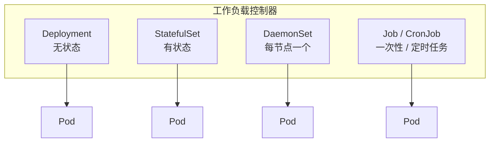

# Kubernetes 认证实战: 在 K8s 平台部署项目的四个步骤

把一个项目迁到 K8s 上，流程其实就四步。结论先给：**制作镜像 → 用工作负载控制器部署镜像 → 用 Service/Ingress 对外暴露 → 加监控日志与日常运维**。前面那套交付流程最终就落到这四步上。

## 纲要

- 第一步：制作镜像（容器时代一切交付皆为镜像）
- 第二步：使用工作负载控制器部署镜像
- 第三步：对外暴露应用
- 第四步：日志监控与日常运维
- 三种常见控制器各自适合什么场景

## 第一步：制作镜像

非容器时代，Python 交付包、Java 交 jar 包、Go 交二进制包；到了 K8s，**我只认你给我的镜像** —— 你给我一个可靠的镜像，我就把它可靠地跑起来。所以制作镜像是第一步，也是最关键的一步。

## 第二步：使用工作负载控制器部署镜像

**Pod 本身没什么高级功能**：一个 Pod 里放一个容器，和 `docker run` 差别不大；Pod 的价值在于可以封装多个容器（这种场景其实不多）。

想用上 K8s 的高级特性（滚动更新、回滚、副本维持、伸缩），**必须得用控制器**。控制器是 Pod 的更高级封装，负责"部署和管理 Pod"。



| 控制器 | 适用场景 | CKA 考点特征 |
| --- | --- | --- |
| **Deployment** | 无状态前端、网站服务 | 最常考；滚动更新、回滚、`kubectl create job --from=cronjob` 都是它派生 |
| **StatefulSet** | 有状态应用（数据库、有状态中间件） | 稳定网络 ID + 稳定存储 |
| **DaemonSet** | 守护进程类（日志采集、监控代理） | 每个节点跑一个 |
| **Job / CronJob** | 一次性任务 / 定时任务 | 注意 Job 可以从 CronJob 派生 |

> 面试高频："这三个控制器分别适合部署什么应用？"—— 记住这张表就够了。

## 第三步：对外暴露应用

部署完 Pod 还不算完，得让别人能访问到 —— 这就是 **Service / Ingress** 干的活（后面有专门章节）。

```bash
kubectl get svc
kubectl get ingress
kubectl get endpoints $SVC
```

## 第四步：日志监控与日常运维

```text
日常运维清单
├── 服务不可访问？→ 查 Pod 状态、describe 看事件
├── 节点磁盘满了？→ 清日志、清镜像
├── 组件起不来？→ 查 cs、查进程、看日志
├── Service 不通？→ 查 endpoints、查 kube-proxy 规则
└── 扩容缩容？→ kubectl scale
```

监控推荐组合：**Prometheus + Grafana** 做监控，**ELK** 做日志收集。

## API 速览

| 目标 | 命令 |
| --- | --- |
| 快速无 yaml 部署一个 Deployment | `kubectl create deployment <name> --image=` |
| 生成 yaml 再手改 | `kubectl create deployment <name> --image= --dry-run=client -o yaml` |
| 直接跑一个 Pod（仅测试） | `kubectl run <name> --image=` |
| 看 Deployment 的滚动状态 | `kubectl rollout status deploy/<name>` |
| 伸缩 | `kubectl scale deploy/<name> --replicas=3` |
| 暴露成 Service | `kubectl expose deploy/<name> --type=NodePort --port=80` |

## Demo 示例

```bash
# 1. 制作镜像（见上一节）
# docker build -t javademo:v1 .

# 2. 用控制器部署镜像 —— 一条命令等价于一整段 Deployment yaml
kubectl create deployment javademo \
  --image=harbor.example.com/demo/javademo:v1 \
  --replicas=3 \
  --dry-run=client -o yaml > javademo-deploy.yaml

# 3. 想用高级功能就往 yaml 里补字段（resources / probes / volumeMounts）
kubectl apply -f javademo-deploy.yaml
kubectl get deploy javademo
kubectl get rs
kubectl get pods -o wide

# 4. 对外暴露
kubectl expose deploy javademo --type=NodePort --port=8080 --target-port=8080
kubectl get svc javademo -o wide
```

```yaml
# 一个"能上生产"的最小 Deployment：副本 + 资源 + 探针 + 控制器选择
apiVersion: apps/v1
kind: Deployment
metadata:
  name: javademo
  namespace: default
spec:
  replicas: 3                     # 副本数，保证高可用与分布
  selector:
    matchLabels:
      app: javademo               # 控制器靠这个关联 Pod
  template:
    metadata:
      labels:
        app: javademo             # 必须和上面完全一致
    spec:
      containers:
        - name: web
          image: harbor.example.com/demo/javademo:v1
          ports:
            - containerPort: 8080
          resources:
            requests:             # 最小资源保障（调度依据）
              cpu: "500m"
              memory: "512Mi"
            limits:               # 最大资源上限
              cpu: "1"
              memory: "1Gi"
          readinessProbe:
            httpGet:
              path: /
              port: 8080
            initialDelaySeconds: 50   # 应用启动慢，先别急着探
            periodSeconds: 10
          livenessProbe:
            httpGet:
              path: /
              port: 8080
            initialDelaySeconds: 50
            periodSeconds: 10
```

### 总结

- 部署一个项目的流程就是四步：**制作镜像 → 用控制器部署 → 对外暴露 → 监控与日常运维**。
- **Pod 本身功能有限，高级特性全靠控制器**；控制器选错（无状态用 StatefulSet、有状态用 Deployment）是架构级错误。
- `--dry-run=client -o yaml` 是最省时的写法，生成后再补 resources / probes / 挂载。
- 监控用 Prometheus + Grafana，日志用 ELK；这两块在 CKA 里以概念题形式出现。
- 日常运维 = 前面所有排障技能的复训：Pod 不通、组件起不来、Service 转发失败，按流程过一遍就行。

