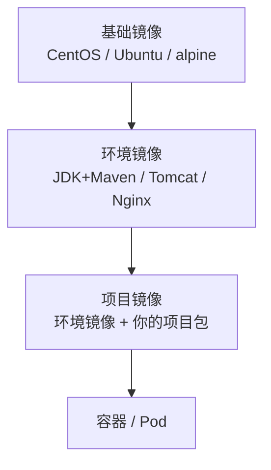
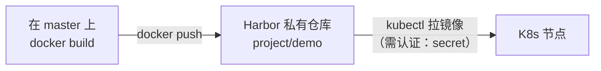

# Kubernetes 认证实战: 制作镜像并推送到镜像仓库（从编译到 Harbor）

把一个项目部署到 K8s，第一步永远是**先做出一个能跑的镜像**。结论先给：**先熟悉项目 → 编译出可部署包 → 写 Dockerfile 把包拷进环境镜像 → `docker build` 本地验证 → `docker tag` + `docker login` + `docker push` 推进私有仓库**。

## 纲要

- 拿到源码后必须先问清楚的五件事
- 项目代码构成与依赖服务
- 编译构建：Maven / JDK / Git 环境准备
- 镜像的三层抽象：基础镜像 → 环境镜像 → 项目镜像
- 写 Dockerfile：把 war 展开拷进 Tomcat
- 本地 build + run 验证镜像
- 推送到 Harbor 私有仓库（打 tag、登录、insecure-registries）

## 拿到源码先问清楚五件事

运维不能只收一个源码目录就直接开编。动手前必须搞清楚：

| 要问什么 | 例子 |
| --- | --- |
| **① 代码构成** | 什么语言？编译工具？源文件在哪？ |
| **② 依赖服务** | 要不要数据库？要不要消息队列？ |
| **③ 服务端口** | 对外提供服务的端口是多少（微服务可能很多个）？ |
| **④ 配置文件在哪** | 连库的配置文件是哪个？切换环境改哪个文件？ |
| **⑤ 有没有持久化文件** | 后台上传的头像、附件要存哪？ |

```text
javademo/                          # 项目根目录
├── pom.xml                        # Maven 构建描述文件
├── Dockerfile                     # 镜像定义
├── src/
│   ├── main/
│   │   ├── java/                  # Java 源代码（目录很深）
│   │   └── resources/
│   │       └── application.yml    # ★ 配置文件：连库信息、端口 8080 都在这
│   └── test/
├── db/                            # 数据库表结构（.sql 脚本）
├── target/                        # 构建产物目录（mvn 生成）
└── Dockerfile.bak
```

本例项目信息：

- **语言**：Java，需要 JDK + Maven；
- **依赖服务**：MySQL（存业务数据）；
- **端口**：8080（跑在 Tomcat 里）；
- **配置文件**：`src/main/resources/application.yml`，里面写数据库连接串和端口；
- **持久化**：这个 Demo 没有（有的话要考虑 PV/PVC）。

> 换环境（测试库 vs 生产库）就是改 `application.yml` 里的连接信息 —— 后面我们会把它抽到 **ConfigMap** 里，改配置不必重打镜像。

## 编译构建

不同语言有自己的工具链，Java 主流是 Maven：

```bash
# 1. 装环境（Java 项目典型组合：JDK + Maven + Git）
yum install -y java-1.8.0-openjdk maven git

# 2. 拉代码
git clone "$GIT_REPO"

# 3. 进源码目录编译构建
cd javademo
mvn clean package -DskipTests
```

| 参数 | 作用 |
| --- | --- |
| `clean` | 清理旧的构建产物 |
| `package` | 打包 |
| `-DskipTests` | **跳过单元测试**。测试没改代码时跑单测容易挂，一般跳过；测试写得可靠就别跳 |
| `target/` | 构建产物目录，war 包就生成在这里 |

构建成功后 `target/` 下多出一个 war 包，这就是"可部署的包"。

## 镜像的三层抽象



对应到物理机时代就是三步：**先装操作系统（基础镜像）→ 再装运行环境（环境镜像）→ 最后放项目代码并启动（项目镜像）**。

镜像最大的价值是**像模板一样把这个过程抽离出来独立描述，并保证环境高度一致、可版本化管理**（基础镜像 v1/v2、环境镜像 JDK 8→9、项目镜像 v1/v2 各自迭代）。Docker 把这三步做成了分层抽象，起环境就是 `docker run`，不再靠脚本在每台机器上重跑一遍（脚本换台机器跑不通是常态）。

官方一般已提供了现成的环境镜像（如 Tomcat），优先直接用；满足不了再自己按这个层次构建。

## 写 Dockerfile

要点：**先把 war 展开，只把可部署内容拷进镜像**，不要直接拷 war 走 Tomcat 热加载（不太可控）；并且删掉 Tomcat 默认首页。

```dockerfile
# 1) 环境镜像：直接用官方 Tomcat（想用自制镜像就去掉仓库前缀）
FROM tomcat:8-jdk8

# 2) 把 war 展开成一个目录，供后面拷贝
RUN unzip /usr/local/tomcat/webapps/*.war -d /tmp/ROOT

# 3) 删掉默认索引页（用不到）
RUN rm -f /usr/local/tomcat/webapps/ROOT/index.jsp

# 4) 把编译好的网站程序拷到 Tomcat 网站根目录
COPY /tmp/ROOT/ /usr/local/tomcat/webapps/ROOT/

# 5) 暴露服务端口
EXPOSE 8080
```

> `COPY` 的目标路径必须是 **Tomcat 的 webapps/ROOT** —— 它默认网站根目录就是这个。

## Demo 示例：本地构建与验证

```bash
# 构建，指定镜像名
docker build -t javademo:v1 -f Dockerfile .

# 起一个容器自测：宿主 8888 → 容器 8080
docker run -d -p 8888:8080 --name javademo-test javademo:v1

# 访问 http://<master-ip>:8888 能打开页面 = 镜像没问题
curl -I http://192.168.31.160:8888
docker logs javademo-test
```

**Docker 能起来，K8s 基本也不会差** —— 这是排障时最省事的一条经验。

## 推送到 Harbor 私有仓库



为什么必须要有仓库：镜像构建在 master 本地，其他节点要跑你的服务，难道要 `scp` 一个小镜像过去？节点几十上百个时完全不可行。**正确姿势是各节点主动去仓库拉**。

```bash
# 1. Harbor 里先建一个私有项目（类比 K8s 的 namespace，用来做权限隔离）
#    私有 → 拉镜像必须认证，不能直接匿名拉

# 2. 给本地镜像打 tag，格式：仓库地址/项目名/镜像名:版本
docker tag javademo:v1 harbor.example.com/demo/javademo:v1

# 3. 登录仓库
docker login harbor.example.com
# Username: admin
# Password: （你的密码）

# 4. 推送
docker push harbor.example.com/demo/javademo:v1
```

### 两个必踩的坑

**坑一：仓库是 http 而非 https → 必须配 insecure-registries**

Docker 默认走 HTTPS，你 Harbor 只监听 80 端口，直接 push 会失败。要在本机（以及所有要拉镜像的节点）上配：

```text
# /etc/docker/daemon.json（没有就新建）
{
  "insecure-registries": ["harbor.example.com"]
}
```

```bash
systemctl daemon-reload && systemctl restart docker
```

**坑二：忘了 `docker login` 就在 push**

报错形如 `unauthorized: authentication required`。私有仓库必须先登录 —— 在 K8s 侧对应的解法就是创建 `imagePullSecrets`（下一节讲）。

## API 速览

| 动作 | 命令 |
| --- | --- |
| 编译 | `mvn clean package -DskipTests` |
| 构建镜像 | `docker build -t <name>:<tag> -f Dockerfile .` |
| 本地跑起来验证 | `docker run -d -p 8888:8080 <name>:<tag>` |
| 打 tag | `docker tag <本地镜像> <仓库>/<项目>/<镜像>:<版本>` |
| 登录仓库 | `docker login <仓库地址>` |
| 推送 | `docker push <仓库>/<项目>/<镜像>:<版本>` |
| 测试拉取 | 在目标节点 `docker pull <仓库>/<项目>/<镜像>:<版本>` |
| 配 http 仓库 | `/etc/docker/daemon.json` 加 `insecure-registries` |

```text
# 本地开发机 → 制品库 → K8s 节点
javademo/ (源码)
   └─ mvn clean package  →  target/javademo.war
        └─ unzip → ROOT/  (可部署的网站程序)
             └─ Dockerfile: COPY ROOT → tomcat webapps/ROOT
                  └─ docker build  →  javademo:v1
                       └─ docker tag/push → harbor.example.com/demo/javademo:v1
                            └─ K8s 节点 docker pull → 启动 Pod
```

### 总结

- 接手源码先问五件事：**语言与结构、依赖服务、端口、配置文件位置、持久化需求**，别直接开编。
- 镜像分三层：基础镜像 → 环境镜像 → 项目镜像；能用官方环境镜像就用，别重复造轮子。
- Dockerfile 里**把 war 展开再拷进 webapps/ROOT**，比直接拷贝 war 走热加载更可控；记得删默认首页。
- `docker run` 本地能起 = 镜像成功了一大半，这是最便宜的验证手段。
- 推私有仓库三步：`docker tag`（带仓库地址/项目名/版本）→ `docker login` → `docker push`；仓库是 http 的话所有节点都要配 `insecure-registries`。

