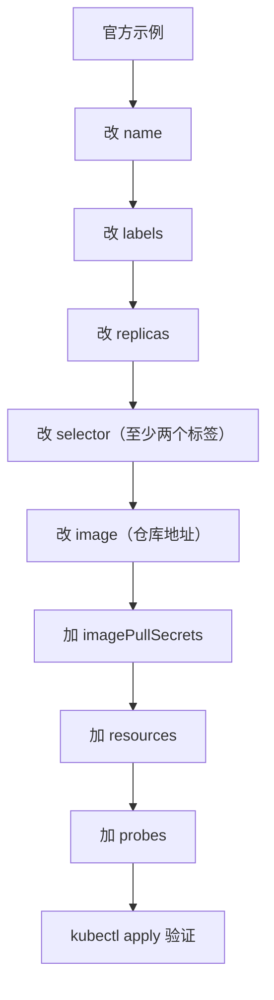

# Kubernetes 认证实战: 用工作负载控制器部署镜像（Deployment 与私有仓库认证）

镜像推到私有仓库后，直接 `kubectl create deployment` 会报 `Failed to pull image ... authentication required`。结论先给：**私有仓库的凭据存在 `Secret` 里，yaml 里用 `imagePullSecrets` 引用它**，K8s 自动拿这个凭据去拉镜像，不用在每个节点上 `docker login`。

## 纲要

- 从官方文档复制示例再逐项改造
- Deployment 必改的四个地方：name / labels / replicas / selector
- selector 与 pod template labels 必须严格一一对应
- 私有仓库：三种认证方式
- 资源配额 requests / limits
- 健康检查 readinessProbe / livenessProbe

## 先复制官方示例再逐项改

写 yaml 最稳的做法是去官方文档搜 `deployment` 拿示例，粘过来再改 —— **网络上的示例普遍滞后，官方文档永远是最新的**，所以 K8s 也允许你开两个标签页查文档。



从上到下逐项看（层级结构如下）：

```text
Deployment yaml
├── apiVersion
├── kind
├── metadata
│   ├── name            ← 改成你的项目名
│   └── labels
└── spec
    ├── replicas        ← 改副本数
    ├── selector        ← 改，且要和 template 的 labels 一致
    └── template
        ├── metadata.labels   ← 与 selector 一一对应
        └── spec
            ├── imagePullSecrets   ← 私有仓库凭据
            └── containers
                ├── image     ← 改仓库地址
                └── ports
```

| 位置 | 要不要改 | 怎么改 |
| --- | --- | --- |
| `apiVersion` | 不用 | 已经是最新 |
| `kind` | 不用 | 资源类型本来就是 Deployment |
| `metadata.name` | **要** | 改成你的项目名，如 `javademo` |
| `metadata.labels` | 要 | 改成项目标签，可有可无也可删 |
| `spec.replicas` | **要** | 如 3 副本，保证高可用与分布 |
| `spec.selector` | **要** | 控制器关联 Pod 用的选择器，建议配**两个标签** |
| `spec.template.metadata.labels` | **要** | 必须与 selector 严格一致 |
| `spec.template.spec.containers[].image` | **要** | 写镜像仓库的完整地址 |
| `spec.template.spec.containers[].ports` | 要 | 改成容器实际端口 |

### 标签选择器为什么要用两个

```yaml
spec:
  selector:
    matchLabels:
      project: www          # ① 项目名
      app: javademo         # ② 应用名（微服务时就是服务名）
  template:
    metadata:
      labels:
        project: www        # 必须和上面一一对应
        app: javademo
```

一个标签容易撞车：别的 Deployment 也可能有 `app: web`，两个应用的 Pod 会被同一个 Service 混选。加一个 `project` 维度就能精确定位 —— **Service 也是按标签关联的，标签写宽了会误选**。

## 私有仓库认证

### 报错现场

```bash
kubectl apply -f javademo.yaml
kubectl get pods
# NAME                     READY   STATUS         RESTARTS   AGE
# javademo-xxx             0/1     ErrImagePull   0          10s

kubectl describe pod javademo-xxx | tail -10
# Events:
#   Warning  Failed scheduling  0/3 nodes available
#   Normal   Pulling            Pulling image "harbor.example.com/demo/javademo:v1"
#   Warning  Failed to pull image ...
#   Error    ErrImagePull       "harbor.example.com/demo/javademo:v1":
#            unauthorized: authentication required
```

### 为什么不能在每个节点 docker login

私有仓库意味着**谁拉都要认证**。K8s 集群有几十上百个节点，让你在每台机器上 `docker login` 显然不现实。K8s 的解法是：**把凭据存成 Secret，让 API Server 带着它去拉**。

```bash
# 创建拉取镜像用的 Secret（自动 encode 成 base64 存在 etcd 里）
kubectl create secret docker-registry harbor-cred \
  --docker-server=harbor.example.com \
  --docker-username=admin \
  --docker-password='<你的密码>' \
  -n default

# 查看（值是 base64 编码的，不是明文）
kubectl get secret harbor-cred -o yaml

# 如果 push 时忘了登录，本地先补一个（等同效果）
docker login harbor.example.com
docker push harbor.example.com/demo/javademo:v1
```

> `kubectl create secret docker-registry` 里的 `-n` 要和 Deployment 的 namespace 一致；集群-wide 拉镜像时建议放在 `default`。

然后在 yaml 里引用：

```yaml
spec:
  template:
    spec:
      imagePullSecrets:          # 与 containers 同级
        - name: harbor-cred
      containers:
        - name: web
          image: harbor.example.com/demo/javademo:v1
```

### 三种私有仓库写法

| 方式 | 做法 | 适用 |
| --- | --- | --- |
| `imagePullSecrets` | 在 Pod spec 里写明 Secret 名 | **最常用**，考试就写这个 |
| 节点级认证 | 每个节点 `docker login` / `crictl` 配 auth | 节点少时使用，不推荐 |
| 全集群默认 | 修改 `kubelet` 或 ServiceAccount 默认拉取凭据 | 改全局，风险大 |

## 资源配额

`resources` 与 `image` **同级**：

```yaml
resources:
  requests:                 # 最小资源保障，也是调度依据
    cpu: "500m"             # 半核
    memory: "512Mi"
  limits:                   # 最大资源上限
    cpu: "1"                # 一核
    memory: "1Gi"
```

`requests` 不够 → Pod 调度不上去（Pending）；`limits` 超了 → 内存会被 OOMKill，CPU 会被限流。

## 健康检查

Tomcat 类应用启动慢，**`initialDelaySeconds` 要写长一点**，否则容器还没起来就被判定失败重启：

```yaml
readinessProbe:
  httpGet:
    path: /
    port: 8080
  initialDelaySeconds: 50   # 启动 50 秒后才开始第一次检查
  periodSeconds: 10         # 之后每 10 秒一次
livenessProbe:
  httpGet:
    path: /
    port: 8080
  initialDelaySeconds: 50
  periodSeconds: 10
```

| 探针 | 失败的后果 | 用途 |
| --- | --- | --- |
| `readinessProbe` | Pod 从 Service 的 endpoints 摘掉，**不影响重启** | 不发流量给没准备好的实例（滚动更新时尤其重要） |
| `livenessProbe` | 重启容器 | 自愈 |

> 为什么 `initialDelaySeconds` 要 50 秒而不是 5 秒：应用 30 秒左右才起来，5 秒就探必然失败，然后被反复重启，永远起不来。

## API 速览

| 目标 | 命令 |
| --- | --- |
| 生成 Deployment 模板 | `kubectl create deployment <n> --image= --dry-run=client -o yaml` |
| 从私有仓库拉镜像的凭据 | `kubectl create secret docker-registry <n> --docker-server=... --docker-username=... --docker-password=...` |
| 查看容器镜像 | `kubectl get pod <p> -o jsonpath='{.spec.containers[*].image}'` |
| 改镜像版本（触发滚动更新） | `kubectl set image deploy/<n> <容器名>=<新镜像>` |
| 看滚动进度 | `kubectl rollout status deploy/<n>` |
| 查看本地 pull 的事件 | `kubectl describe pod <p> \| grep -A3 Events` |

## Demo 示例

```bash
# 1. 创建私有仓库凭据
kubectl create secret docker-registry harbor-cred \
  --docker-server=harbor.example.com \
  --docker-username=admin \
  --docker-password='xxxx' \
  -n default

# 2. 生成 Deployment 骨架再手改（比从零写快）
kubectl create deployment javademo \
  --image=harbor.example.com/demo/javademo:v1 \
  --dry-run=client -o yaml > javademo.yaml
sed -i '/creationTimestamp/d' javademo.yaml

# 3. 改造后应用
kubectl apply -f javademo.yaml

# 4. 排错：Pod 没起来先看 describe 的事件
kubectl get pods -l app=javademo
kubectl describe pod -l app=javademo | tail -20
```

```yaml
apiVersion: apps/v1
kind: Deployment
metadata:
  name: javademo
  namespace: default
  labels:
    project: www
    app: javademo
spec:
  replicas: 3
  selector:
    matchLabels:
      project: www
      app: javademo
  template:
    metadata:
      labels:
        project: www
        app: javademo
    spec:
      imagePullSecrets:
        - name: harbor-cred
      containers:
        - name: web
          image: harbor.example.com/demo/javademo:v1
          ports:
            - containerPort: 8080
          resources:
            requests:
              cpu: "500m"
              memory: "512Mi"
            limits:
              cpu: "1"
              memory: "1Gi"
          readinessProbe:
            httpGet:
              path: /
              port: 8080
            initialDelaySeconds: 50
            periodSeconds: 10
          livenessProbe:
            httpGet:
              path: /
              port: 8080
            initialDelaySeconds: 50
            periodSeconds: 10
```

### 总结

- 私有仓库拉镜像失败 → 建 `docker-registry` 类型的 Secret，Deployment 里写 `imagePullSecrets`，**不用在每台节点 docker login**。
- `selector.matchLabels` 和 `template.metadata.labels` **必须严格一致**，否则控制器选不中自己创建的 Pod。
- 标签至少给两个维度（项目 + 应用），避免和别的应用撞标签导致 Service 误选。
- `requests` 是调度依据、`limits` 是上限，两者缺一会让调度或稳定性出问题。
- 启动慢的应用 `initialDelaySeconds` 必须放宽；探针配错比不配更糟（会陷入反复重启）。

