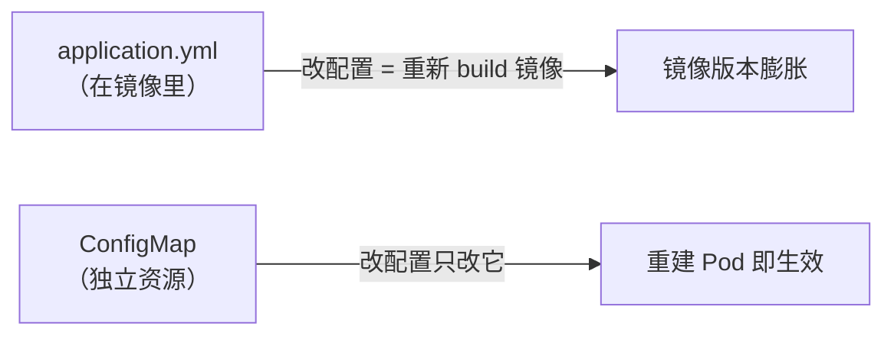
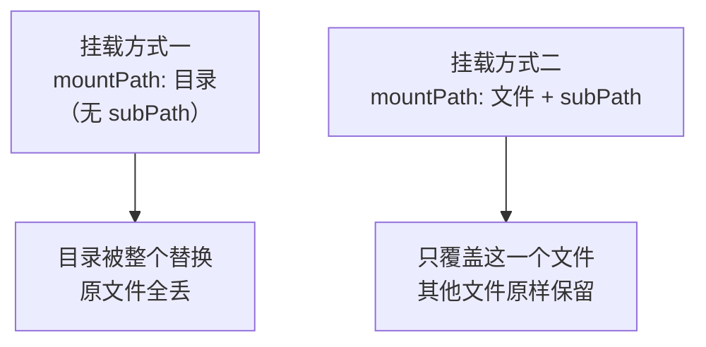

# Kubernetes 认证实战: 用 ConfigMap 存项目配置文件（挂载与 subPath）

项目里有配置文件（比如连数据库的 `application.yml`），没必要把它烤进镜像 —— 换环境改个库就得重新打镜像，太笨重。结论先给：**配置存 ConfigMap，Pod 用数据卷挂进去；但直接挂会覆盖原目录，必须加 `subPath`**。

## 纲要

- 为什么配置要外置
- 建 ConfigMap
- 在 Deployment 里挂数据卷
- 不加 subPath 的覆盖坑
- 改了 configmap 不会自动生效
- 验证挂载结果

## 为什么外置配置



把配置放进 ConfigMap 的好处：

- 改配置**不用改程序、不用重新打镜像**；
- 不同环境（测试库 / 生产库）用不同的 ConfigMap 即可；
- 配置也进了版本管理（etcd），可审计。

## 建 ConfigMap

```yaml
apiVersion: v1
kind: ConfigMap
metadata:
  name: javademo-config
  namespace: default
data:
  application.yml: |
    server:
      port: 8080
    spring:
      datasource:
        url: jdbc:mysql://javademo-db.default.svc.cluster.local:3306/k8s
        username: root
        password: "123456"
        driver-class-name: com.mysql.cj.jdbc.Driver
```

也可以从文件直接生成，不用手写 yaml：

```bash
kubectl create configmap javademo-config \
  --from-file=src/main/resources/application.yml \
  -n default

# 一次塞多个文件
kubectl create configmap javademo-config \
  --from-file=src/main/resources/ -n default

# 从已有 ConfigMap 改一个 key 的 value
kubectl create configmap javademo-config \
  --from-literal=application.yml="$(cat application.yml)" \
  --dry-run=client -o yaml | kubectl apply -f -

kubectl get cm javademo-config -o yaml
```

注意缩进：`data` 下的多行字符串用 `|` 块标量，内容缩进必须**比 key 多一级**，否则解析报错。

## 在 Deployment 里挂进去

数据卷（`volumes`）与容器（`containers`）**同级**，挂载点（`volumeMounts`）在容器内部：

```yaml
apiVersion: apps/v1
kind: Deployment
metadata:
  name: javademo
spec:
  template:
    spec:
      containers:
        - name: web
          image: harbor.example.com/demo/javademo:v1
          volumeMounts:
            - name: config-volume          # 对应下面的 volume 名
              mountPath: /usr/local/tomcat/webapps/ROOT/WEB-INF/classes/application.yml
              subPath: application.yml     # ★ 关键
      volumes:
        - name: config-volume
          configMap:
            name: javademo-config          # 引用的 ConfigMap 名
            items:
              - key: application.yml       # ConfigMap 里的 key
                path: application.yml      # 挂进容器后的文件名
```

层级关系别搞错：

```text
spec.template.spec
├── containers
│   └── web
│       └── volumeMounts
│           ├── name: config-volume
│           ├── mountPath: /usr/local/tomcat/.../application.yml
│           └── subPath: application.yml
└── volumes                     ← 与 containers 同级，不是嵌套在容器里
    └── name: config-volume
        └── configMap
            └── name: javademo-config
```

## 不加 subPath 会发生什么

第一次挂载会直接**报错**：

```text
Warning  FailedMount  MountVolume.SetUp failed for volume "config-volume":
 MountVolume is not a directory
```

改成挂目录（把 `subPath` 去掉）能起来，但进容器一看：

```bash
# 下面命令中的变量按你的集群环境赋值后再执行
kubectl exec -it $POD -- ls /usr/local/tomcat/webapps/ROOT/WEB-INF/classes/
# application.yml      ← 只剩这一个文件了
```

**原目录下其他文件全被覆盖了** —— 一个 ConfigMap 卷挂载时，会把整个目录替换成自己的内容。



正确做法 （也就是文章开头那句结论）：

```yaml
volumeMounts:
  - name: config-volume
    mountPath: /usr/local/tomcat/webapps/ROOT/WEB-INF/classes/application.yml
    subPath: application.yml     # subPath 让挂载点变成"单文件"而非"整个目录"
```

`items[].path` 是挂在容器里的文件名，可以和 `items[].key` 不同：

```yaml
volumes:
  - name: config-volume
    configMap:
      name: javademo-config
      items:
        - key: application.yml
          path: app-config.yml    # 容器里叫 app-config.yml，内容不变
```

## 改了 ConfigMap 不会自动生效

这是最容易踩的坑。**改 ConfigMap 之后，已经运行的 Pod 里的文件是变了（kubelet 会同步），但应用不会重新读** —— 应用进程缓存了旧配置。

```bash
# 改配置
kubectl edit cm javademo-config
# 或 kubectl apply -f 一个新版本

# 验证容器里的文件确实更新了
# 下面命令中的变量按你的集群环境赋值后再执行
kubectl exec -it $POD -- cat /usr/local/tomcat/webapps/ROOT/WEB-INF/classes/application.yml

# 但应用未必用上 —— 必须重建 Pod 让它重新挂载
kubectl rollout restart deployment/javademo
# 等价做法：改一下镜像 tag 触发滚动升级，改个首页再 build v2 推 v2
kubectl set image deploy/javademo web=harbor.example.com/demo/javademo:v2
kubectl rollout status deploy/javademo
```

> 最佳实践：**发布新版本之前先改 ConfigMap**，然后滚动升级，新 Pod 直接挂载到新配置，既生效又不中断服务。

## API 速览

| 目标 | 命令 |
| --- | --- |
| 从文件创建 | `kubectl create configmap <n> --from-file=<path>` |
| 从字面量创建 | `kubectl create configmap <n> --from-literal=k=v` |
| 看内容 | `kubectl get cm <n> -o yaml` / `-o jsonpath='{.data.<key>}'` |
| 改内容 | `kubectl edit cm <n>` |
| 挂进容器 | yaml 里 `volumes[].configMap.name` + `containers[].volumeMounts` |
| 强制生效 | `kubectl rollout restart deployment/<n>` |

## Demo 示例

```bash
# 1. 创建 ConfigMap
kubectl create configmap javademo-config --from-file=application.yml -n default

# 2. 把挂载点写进 Deployment（用 kubectl edit 或 apply）
kubectl edit deploy javademo
# 在 spec.template.spec 下补 volumes，在容器下补 volumeMounts（记得带 subPath）

# 3. 应用成不成功看事件
kubectl apply -f javademo-deploy.yaml
kubectl describe pod -l app=javademo | grep -A3 -i 'mount\|volume'

# 4. 进容器验证：文件在、其他文件没被覆盖
# 下面命令中的变量按你的集群环境赋值后再执行
kubectl exec -it $POD -- ls -l /usr/local/tomcat/webapps/ROOT/WEB-INF/classes/
kubectl exec -it $POD -- cat /usr/local/tomcat/webapps/ROOT/WEB-INF/classes/application.yml

# 5. 改配置 → 重建触发生效
kubectl edit cm javademo-config
kubectl rollout restart deployment/javademo
kubectl rollout status deploy/javademo
```

### 总结

- 配置外置到 ConfigMap，改配置不用重新打镜像，环境切换只换一份 ConfigMap。
- 挂载 ConfigMap 会**覆盖整个挂载目录**，所以 `mountPath` 指到文件时要配 `subPath`，否则要么起不来、要么原文件全丢。
- `volumes` 与 `containers` 同级，`volumeMounts` 在容器里；`items` 的 `key` 是 ConfigMap 的 key，`path` 是容器里的文件名。
- **改 ConfigMap 不等于应用生效**，必须 `kubectl rollout restart` 或重新滚动升级让新 Pod 挂载新配置。
- 发布流程建议：先改 ConfigMap，再滚动升级，新 Pod 直接拿到正确配置。

