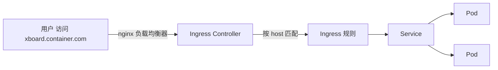

# Kubernetes 认证实战: 对外暴露应用访问（Service 与 Ingress）

Pod 和 Deployment 起来之后，还差最后一步：让别人访问得到。结论先给：**Service 负责在集群内找到并负载这一组 Pod，Ingress 负责用域名分流对外暴露**；写 Ingress yaml 时注意 1.18 起 `apiVersion` 要用 `networking.k8s.io/v1`。

## 纲要

- 创建 Service 并确认它关联上了 Pod
- Service 的 port / targetPort 怎么填
- 为什么需要 Ingress（NodePort 的短板）
- Ingress yaml 的两种写法与弃用警告
- 节点上必须跑 Ingress Controller
- 本地 hosts 模拟 DNS 验证

## 第一步：创建 Service

Service 的 `selector` 必须和 Deployment 里 Pod 模板的 labels **一致**，这样它才能通过标签选出这一组 Pod。

```yaml
apiVersion: v1
kind: Service
metadata:
  name: javademo
  namespace: default
spec:
  type: NodePort
  selector:
    app: javademo          # 与 Deployment 的 pod labels 一致
  ports:
    - port: 8080           # Service 端口
      targetPort: 8080     # 容器端口（镜像里应用监听的端口）
      nodePort: 30080      # 仅 NodePort 生效
      protocol: TCP
```

创建前先想清楚要生成哪几个文件：

```text
manifests/
├── javademo-svc.yaml        # Service：selector + ports
├── javademo-ingress.yaml    # Ingress：host + path → backend.service
└── ingress-nginx.yaml       # Ingress Controller（DaemonSet 部署）
```

创建后第一件事就是**确认它有没有关联上 Pod**：

```bash
kubectl apply -f javademo-svc.yaml
kubectl get svc javademo
# NAME       TYPE       CLUSTER-IP     EXTERNAL-IP   PORT(S)          AGE
# javademo   NodePort   10.96.123.45   <none>        8080:30080/TCP   20s

# 关键：看 endpoints 有没有挂上后端 Pod IP
kubectl get endpoints javademo
# NAME       ENDPOINTS
# javademo   10.244.1.10:8080,10.244.2.11:8080,10.244.3.12:8080
```

`ENDPOINTS` 有值 = 转发链路通；空 = selector 没匹配上，curl 必然无响应（这一步在 Service 排障里最经常被忽略）。

## Service 的三种类型

| 类型 | 暴露范围 | 特点 |
| --- | --- | --- |
| `ClusterIP`（默认） | 仅集群内 | 分配一个虚拟 IP，只能集群内访问 |
| `NodePort` | 节点网络 | 节点上开 30000-32767 端口，集群外可访问 |
| `LoadBalancer` | 公网 | 云厂商自动挂 LB（本次实战不用） |

> Service 和 Ingress 本质上都只暴露在**宿主机/内网网络**里。真实企业集群往往架在内网，公网用户是访问不到的 —— 所以项目要真正对外，还差一个公网负载均衡器（下一节讲）。

## 第二步：创建 Ingress

Ingress 的作用：**通过 Service 再关联到这一组 Pod，并且按域名做分流**。

### 两种写法与弃用



```yaml
# 1.18 之前的写法（已弃用，会有警告）
apiVersion: extensions/v1beta1
kind: Ingress
metadata:
  name: javademo
spec:
  rules:
    - host: xboard.container.com
      http:
        paths:
          - path: /
            backend:
              serviceName: javademo
              servicePort: 8080
```

```yaml
# 1.18 之后（推荐，也是考场上不会报错的写法）
apiVersion: networking.k8s.io/v1
kind: Ingress
metadata:
  name: javademo
  namespace: default
spec:
  ingressClassName: nginx
  rules:
    - host: xboard.container.com
      http:
        paths:
          - path: /
            pathType: Prefix
            backend:
              service:
                name: javademo
                port:
                  number: 8080
```

差异只有三处：**`apiVersion`**、**`backend` 从 `serviceName/servicePort` 改成 `service.name/service.port.number`**、多一个 **`pathType`**。

> 最佳实践：**多参考官方文档的示例**。官方永远是最新的，从网上复制的示例普遍滞后，照抄老写法会被打警告甚至弃用报错。

## 谁真正干活：Ingress Controller

Ingress 资源本身只是"规则"，真正转发的是跑在节点上的 **Ingress Controller**（本例用 DaemonSet 部署 `ingress-nginx`）。

```bash
# Controller 必须存在，否则 Ingress 规则不生效
kubectl get pods -A | grep ingress
kubectl get svc -A | grep ingress
```

因为是用 DaemonSet 部署的，**集群里哪个节点都能访问**（每个节点都跑了一个），所以把域名绑到任意节点 IP 都行。

## 本地验证：用 hosts 模拟 DNS

Ingress 按 host 分流，所以你得让域名解析到节点上。测试环境直接改 `hosts`：

```text
# /etc/hosts (macOS/Linux) 或 C:\Windows\System32\drivers\etc\hosts
192.168.31.62  xboard.container.com
192.168.31.63  xboard.container.com
```

绑定之后浏览器访问 `http://xboard.container.com:81` 就能打开页面；Ingress 日志会记录每一次请求，可以确认流量确实到了：

```bash
kubectl logs -n ingress-nginx -l app=ingress-nginx -f
```

## API 速览

| 目标 | 命令 |
| --- | --- |
| 快速建 Service | `kubectl expose deploy/javademo --type=NodePort --port=8080 --target-port=8080` |
| 看 Service | `kubectl get svc -o wide` |
| 看关联后端 | `kubectl get endpoints <svc>` / `kubectl get ep -o wide` |
| 看 Ingress | `kubectl get ingress` / `kubectl get ing` |
| Ingress 规则详情 | `kubectl describe ingress <name>` |
| 看 Ingress Controller | `kubectl get pods -A \| grep ingress` |
| 验证转发 | `curl -H "Host: xboard.container.com" http://<node-ip>:81` |

## Demo 示例

```bash
# 1. 建 Service
kubectl apply -f javademo-svc.yaml
kubectl get svc javademo
kubectl get ep javademo          # 必须非空

# 2. 建 Ingress（注意 apiVersion 用 networking.k8s.io/v1）
kubectl apply -f javademo-ingress.yaml
kubectl get ingress javademo
kubectl describe ingress javademo

# 3. 验证：不靠浏览器也能测
curl -H "Host: xboard.container.com" http://192.168.31.62:81 -I
curl -H "Host: xboard.container.com" http://192.168.31.63:81

# 4. 看流量到底走没走通
kubectl logs -n ingress-nginx -l app=ingress-nginx --tail=50 -f
```

```text
# 从 Service 到 Ingress 的完整路径
客户端
  └── Host: xboard.container.com:81
        └── Ingress Controller (DaemonSet，每个节点一个)
              └── 匹配 ingress 的 host 规则
                    └── Service javademo (ClusterIP)
                          └── endpoints: 10.244.1.10:8080 / 10.244.2.11:8080 / ...
```

### 总结

- Service 靠 `selector` 关联 Pod，建完第一件事就是 `kubectl get endpoints` 确认非空。
- `port` 是 Service 自己的端口，`targetPort` 是容器里应用真正监听的端口，两个别写混。
- **Ingress 做域名分流，Ingress Controller 才做转发**；Controller 没跑，Ingress 规则就是死的。
- 1.18 之后的 Ingress 要用 `networking.k8s.io/v1`，`backend` 改成 `service.name` + `service.port.number`，并补 `pathType`。
- 测试环境改 `hosts` 把域名指到节点 IP，配合 `curl -H "Host: ..."` 就能脱离浏览器验证整条链路。

