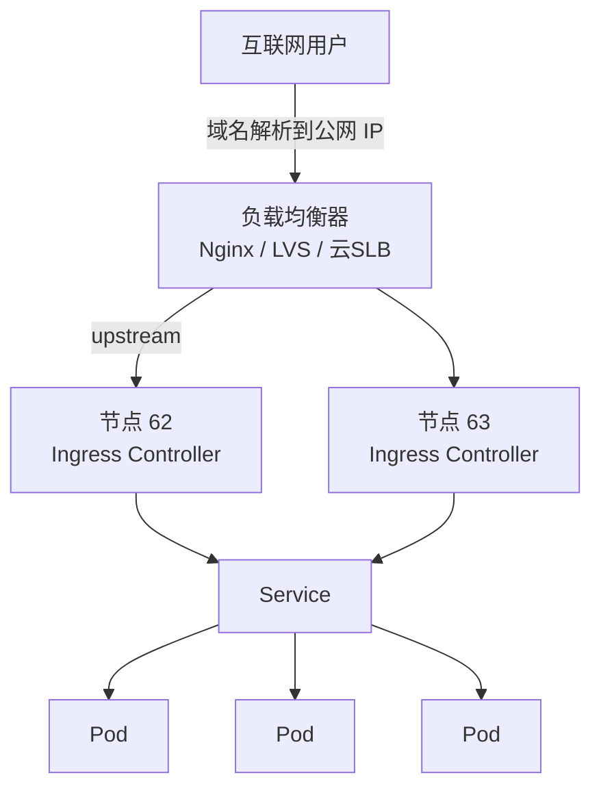

# Kubernetes 认证实战: 将项目暴露到公网访问（负载均衡器方案）

Service 和 Ingress 其实都只暴露在**内网/宿主机网络**里，互联网用户访问不到。结论先给：**公网入口必须挂一个带公网 IP 的负载均衡器（Nginx / LVS / 云厂商 SLB），它代理到各节点的 Ingress Controller，由 Ingress Controller 再按域名分流到 Pod**。

## 纲要

- 为什么要加一层负载均衡器
- 主流负载均衡器选型
- Nginx 作为统一流量入口的配置
- 必须透传 Host 头，否则 Ingress 无法按域名分流
- hosts 指向负载均衡器、端口冲突排查
- 从源码到公网：整条链路回顾

## 为什么 Service / Ingress 不够



企业里的 K8s 集群通常搭在内网，Service/Ingress 只是暴露在**节点所在的网络**里。想让公网用户进来，就得在前面再架一层：

- 公有云：**阿里云 SLB、腾讯云 LB** 等；
- 自建：**Nginx、LVS、HAProxy** 都行。

这层作为**所有项目的统一流量入口**，域名解析到它的公网 IP，它再转发到后面所有 Ingress Controller。

## 选型对比

| 方案 | 优点 | 注意点 |
| --- | --- | --- |
| 云厂商 LB（SLB/CLB） | 自带公网 IP、自动健康检查、省运维 | 要花钱，配置在控制台 |
| Nginx（自建） | 免费、配置透明、可复用现有机器 | 要自己保障高可用（keepalived） |
| LVS | 性能好、内核态转发 | 配置复杂，运维门槛高 |

## Nginx 配置

配置目录很简单，就两块（upstream 定义后端，server 定义域名）：

```text
/etc/nginx/
├── nginx.conf
│   └── http {
│       ├── upstream javademo      # 后端 = 所有跑 Ingress Controller 的节点
│       └── server {
│           ├── listen 81
│           ├── server_name xboard.container.com
│           └── location / → proxy_pass
│       }
│   }
└── conf.d/
```


```nginx
# /etc/nginx/nginx.conf 片段
http {
    # 后端就是所有跑着 Ingress Controller 的节点
    upstream javademo {
        server 192.168.31.62:81;
        server 192.168.31.63:81;
    }

    server {
        listen 81;
        server_name xboard.container.com;

        location / {
            proxy_pass http://javademo;
            proxy_set_header Host $host;          # ★ 必须：把用户传来的域名带进去
            proxy_set_header X-Real-IP $remote_addr;
            proxy_set_header X-Forwarded-For $proxy_add_x_forwarded_for;
            proxy_set_header X-Forwarded-Proto $scheme;
        }
    }
}
```

> **`proxy_set_header Host $host;` 是整条链路的关键**。不带进去的话，Ingress Controller 收到的 Host 是默认值，匹配不到你配的 host 规则，分流就失效了 —— 这也正好呼应了前面 Ingress 章节"必须传 Host"的结论。

```bash
nginx -t && systemctl reload nginx
```

## 端口冲突

80 端口常被别的服务（比如 harbor）占用，Nginx 起不来。解决办法是**换一个端口**（如 81），然后用户访问时带上端口：

```bash
# 查谁占了 80
ss -lntup | grep ':80'
# 结果发现是 harbor 用的 IPv6 :80，把它注释掉，或者干脆把 Nginx 换到 81
```

| 问题 | 处理 |
| --- | --- |
| 80 被 harbor 占用 | Nginx 改用 81 端口，浏览器访问加 `:81` |
| IPv6 的 `:80` 也冲突 | 把 Nginx 监听改成 `listen 81;` 即可绕开 |
| 多个域名共用一个 LB | 每个域名一个 `server` 块，`upstream` 可共用 |

## 修改 hosts 指向负载均衡器

原来域名绑的是 K8s 节点，现在要改成**负载均衡器的 IP**：

```text
# /etc/hosts
192.168.31.90   xboard.container.com   ← 负载均衡器（原来是 62/63 节点 IP）
```

```bash
curl -H "Host: xboard.container.com" http://192.168.31.90:81 -I
# HTTP/1.1 200 OK

# 看负载均衡器自己的访问日志，确认请求确实经过它
tail -f /var/log/nginx/access.log
```

日志里有记录 = 流量确实先到了负载均衡器，再由它转发到 Ingress Controller，最后落到 Pod。

## 整条链路回顾

```text
① 拿源码         git clone → mvn clean package -DskipTests → target/*.war
② 打镜像         Dockerfile: unzip war → 拷进 tomcat webapps/ROOT
③ build/run 验证 docker build -t javademo:v1  →  docker run -p 8888:8080
④ 推仓库         docker tag → docker login → docker push harbor.example.com/demo/javademo:v1
⑤ 控制器部署     imagePullSecrets + resources + readinessProbe/livenessProbe
⑥ 配置外置       ConfigMap 存 application.yml（volumeMounts.subPath）
⑦ 集群内暴露     Service（selector）→ endpoints 非空 → NodePort
⑧ 域名分流       Ingress（networking.k8s.io/v1）→ Ingress Controller（DaemonSet）
⑨ 公网入口       Nginx/LB 带公网 IP → upstream 到各节点 Ingress Controller
```

> **改了 ConfigMap 不会自动生效**，要 `kubectl rollout restart deployment/javademo` 或改镜像版本触发滚动升级，让新 Pod 重新挂载新配置。

## API 速览

| 目标 | 命令 |
| --- | --- |
| 看 Pod 是否全部就绪 | `kubectl get pods -l app=javademo` |
| 触发一次滚动升级 | `kubectl set image deploy/javademo web=<镜像>:v2` |
| 等升级完成 | `kubectl rollout status deploy/javademo` |
| 进容器验证配置 | `kubectl exec -it <pod> -- cat <配置路径>` |
| 看 Controller 日志 | `kubectl logs -n ingress-nginx -l app=ingress-nginx -f` |
| 验证公网链路 | `curl -H "Host: <域名>" http://<LB-IP>:81 -I` |

## Demo 示例

```bash
# 1. 确认应用与 Controller 都起来了
kubectl get pods -l app=javademo
kubectl get pods -A | grep ingress

# 2. 触发滚动升级（模拟发布新版本：改了首页代码 → build v2 → push v2）
kubectl set image deploy/javademo web=harbor.example.com/demo/javademo:v2
kubectl rollout status deploy/javademo

# 3. 进 Pod 验证挂载的是新配置
kubectl exec -it $(kubectl get pod -l app=javademo -o jsonpath='{.items[0].metadata.name}') \
  -- cat /usr/local/tomcat/webapps/ROOT/WEB-INF/classes/application.yml

# 4. 验证公网链路（不依赖浏览器）
curl -H "Host: xboard.container.com" http://192.168.31.90:81 -I
curl -H "Host: xboard.container.com" http://192.168.31.90:81 | grep -o '帅哥' | head -1

# 5. 看 Nginx 日志确认请求确实经过负载均衡器
tail -f /var/log/nginx/access.log
```

### 总结

- Service/Ingress 只在内网有效，**公网入口必须再挂一层带公网 IP 的负载均衡器**。
- 负载均衡器作为所有项目的统一入口，转发到各节点的 Ingress Controller，再由它按域名分流。
- Nginx 配置里 **`proxy_set_header Host $host;` 不能省**，否则 Ingress 匹配不到 host 规则。
- 80 端口被占就换端口（如 81），用户访问时带上端口；修改 hosts 指向负载均衡器 IP。
- 整条部署链路九步：源码 → 编译 → 镜像 → 仓库 → Deployment → ConfigMap → Service → Ingress → 公网 LB，每一环都有对应的排障入口。

