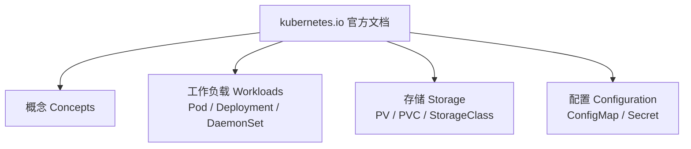
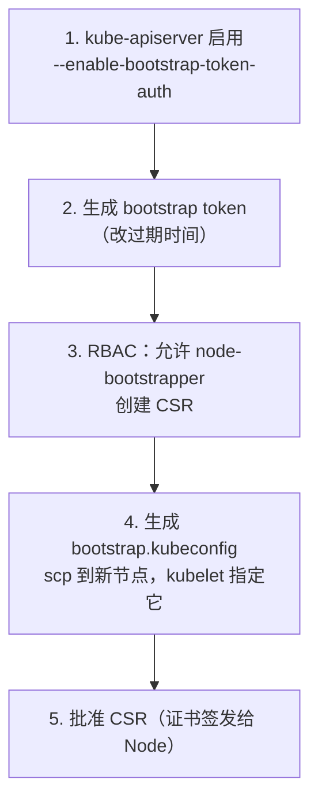

# Kubernetes 认证实战: 30 道 CKA 考试真题解析

CKA 卷面 **24 道实操题、3 小时、满分 100、76 分通过**。结论先给：**题目不难，难在时间 —— 考试时只能开两个浏览器标签（考试系统 + kubernetes.io），所以「会查官方文档 + 能用命令行一条出结果 + 不手写 yaml」才是拿分的关键。**

## 纲要

- 考试规则与拿分节奏
- 考试前的三个准备动作
- 命名空间与 Pod 类真题
- Deployment / Service / 网络类真题
- 调度与节点维护类真题
- 存储类真题
- 安全与集群维护类真题（最高分题）

## 考试规则

| 项 | 说明 |
| --- | --- |
| 题量 | 24 道题（演练版 27 道），全部**实操题** |
| 时长 | 3 小时；**2 小时内做完基本就能过** |
| 通过线 | 76 分；24 题里错 3~4 道也基本没问题 |
| 单题分值 | 按难度 1~8 分，最难的是 8 分题 |
| 参考资料 | 浏览器只能开 **2 个标签页**：考试系统 + `kubernetes.io` |
| 集群 | 共 4 套集群，题目会要求**切换 kubeconfig 上下文** |
| 判分 | 做完才统一判，**不会边做边提示对错** |

单题分值分布意味着：**先把简单题全拿稳，再去啃那几道 8 分题**。

## 考前必做的三件事

### 一、命令行补全

每个要操作的机器上都要装，能省大量敲命令的时间：

```bash
kubectl completion bash > /etc/bash_completion.d/kubectl
source /etc/bash_completion.d/kubectl   # 当前会话立即生效
# zsh 环境：kubectl completion zsh > "${fpath[1]}/_kubectl"
```

### 二、用记事本存草稿

Windows 考试机上有记事本，**考试期间可以开着它当草稿本**：把 yaml 先存进去，随时复制出来改字段。macOS 上没有的话就借一台 Windows 机器或用终端里的 vim。

### 三、官网书签

官方导航里最常翻的就是这几块：



**工作中 80% 的题都出在这四个入口下**，把它们加书签，考场上直接点开复制示例。

## 通用心法

1. **别手写 yaml** —— 官方复制 + 改字段，或命令行一条出结果；
2. **审题看三遍** —— 题干要求的名字、镜像、副本数、命名空间一个都不能错，"创建 Pod" 就别偷懒改成 Deployment；
3. **K8s 命令不够用就用 shell 凑** —— `grep` / `wc` / `sort` / `>` 重定向都是合法的完成方式；
4. **会切换集群** —— 题干都会提示切到哪个上下文，照做。

## 命名空间与 Pod 类

### 第 1 题：新建命名空间，并在其中创建 Pod

```text
# 解题前先把文件规范摆出来，考场上就不慌
/tmp/cka/
├── pod.yaml          # 从官方 Concepts 复制后改字段
├── deploy.yaml
├── ds.yaml
├── svc.yaml
└── secret.yaml
```

```bash
kubectl create namespace web

# 方式一：命令行（最快）
kubectl run nginx --image=nginx:1.21 -n web

# 方式二：官方复制 yaml 再改
#   Concepts → 工作负载 → Pod → 复制模板
kubectl apply -f pod.yaml
kubectl get pod -n web
```

```yaml
apiVersion: v1
kind: Pod
metadata:
  name: nginx
  namespace: web
  labels:
    app: nginx
spec:
  containers:
    - name: nginx
      image: nginx:1.21
      ports:
        - containerPort: 80
```

### 第 2 题：创建 Deployment 并暴露 Service

```bash
# 两个命令搞定
kubectl create deployment nginx-deploy --image=nginx:1.21 --replicas=2

kubectl expose deployment nginx-deploy \
  --port=80 --target-port=80 --type=NodePort
```

`kubectl expose` 后面跟两个端口：`--port` 是 Service 端口，`--target-port` 是容器端口。

### 第 3 题：列出命名空间下带指定标签的 Pod

```bash
# 看所有 Pod 的标签：--show-labels
kubectl get pods -A --show-labels

# 按标签筛选：-l（长格式 --selector）
kubectl get pods -n kube-system -l k8s-app=kube-dns
kubectl get pods -A -l k8s-app=kube-dns --show-labels
```

| 参数 | 长格式 | 作用 |
| --- | --- | --- |
| `--show-labels` | — | 多列显示所有标签 |
| `-l` | `--selector` | 按标签筛选，支持 `!=` |
| `-n` | `--namespace` | 指定命名空间 |

### 第 4 题：把 Pod 日志中含 error 的行记录到文件

**`kubectl logs` 不支持按关键字过滤**，用管道接 shell：

```bash
# -i 忽略大小写，grep 出 error 行，重定向到文件
kubectl logs $POD | grep -i error > /tmp/errors.log
kubectl logs $POD -c $CONTAINER | grep -i error > /tmp/errors.log

# 想连同之前的崩溃记录一起抓
kubectl logs $POD --previous | grep -i error > /tmp/errors.log
```

### 第 5 题：查看指定标签下 CPU 最高的 Pod 并记录

这道题依赖 **Metrics Server**，没部署时 `kubectl top` 会报错 `metrics not available`。

```bash
# 前提：Metrics Server 正常
kubectl get pod -n kube-system -l k8s-app=metrics-server
kubectl top node
kubectl top pod -l app=nginx --sort-by=cpu | head -1 | tee /tmp/top-cpu.txt
```

### 第 9 题：扩容 Deployment 副本数为 3

```bash
kubectl scale deployment nginx-deploy --replicas=3
kubectl get deploy nginx-deploy
```

### 第 10 题：一个 Pod 里跑四个容器

nginx / redis / memcached / consul，不算复杂 —— **复制一个 Pod 模板，往 `containers` 里加四项**：

```yaml
apiVersion: v1
kind: Pod
metadata:
  name: four-in-one
  namespace: default
spec:
  containers:
    - name: nginx
      image: nginx:1.21
    - name: redis
      image: redis:6
    - name: memcached
      image: memcached:1.6
    - name: consul
      image: consul:1.12
```

### 第 12 题：把 Deployment 导出成 json 文件，再删除它

```bash
# -o json 导出，-o go-template 也常用
kubectl get deployment nginx-deploy -o json > /tmp/deploy.json
kubectl delete -f /tmp/deploy.json   # 或 kubectl delete deployment nginx-deploy
```

`kubectl get` 支持的常用输出字段：`name`、`json`、`yaml`、`wide`、`jsonpath`。

```text
# 导出/查看的常用 -o 取值
kubectl get <res> -o wide        # 更多列（节点、IP）
kubectl get <res> -o name         # 只输出资源名
kubectl get <res> -o json         # JSON
kubectl get <res> -o yaml         # YAML
kubectl get <res> -o jsonpath='{...}'   # 自定义字段
```

### 第 13 题：生成一个 Deployment 的 yaml 文件

```bash
# --dry-run=client 只在本机生成，不发请求
kubectl create deployment web --image=nginx:1.21 \
  --dry-run=client -o yaml > /tmp/web.yaml

# 官方示例里常带 creationTimestamp，删掉它才好用
sed -i '/creationTimestamp/d' /tmp/web.yaml
```

> 题目如果要求"带指定标签"，记得把 `selector` 和 `template.metadata.labels` **两处都改**，少改一处控制器就选不中 Pod。

## Deployment 更新与回滚类

### 第 7 题：更新 Deployment 并记录发布命令

```bash
# --record 会记录这条命令到 rollout history（1.18 起已废弃，新集群用默认即可）
kubectl set image deployment/web nginx=nginx:1.22
kubectl rollout history deployment/web
```

在 1.18+ 上 `--record` 已被废弃，别再写；直接 `kubectl set image` + `kubectl rollout history` 就够。

### 第 8 题：回滚到上一个版本

```bash
# 回滚上一版
kubectl rollout undo deployment/web

# 回滚到指定 revision（--to-revision=N）
kubectl rollout undo deployment/web --to-revision=2

# 看 revisions
kubectl rollout history deployment/web

# 卡住时看进度
kubectl rollout status deployment/web
```

## 调度与节点维护类

### 第 14 题：创建 Pod 分配到带指定标签的 Node

关键是 `nodeSelector`，与 `containers` **同级**（写在 `spec` 下，不要缩进到容器里）：

```yaml
apiVersion: v1
kind: Pod
metadata:
  name: nginx-node1
spec:
  nodeSelector:
    hostname: node-1        # 节点上已有的标签
  containers:
    - name: nginx
      image: nginx:1.21
```

> **题干让你创建 Pod 就创建 Pod**，别图省事写 Deployment，资源类型不符直接 0 分。

### 第 15 题：确保每个节点跑一个 Pod（不考虑污点）

立刻想到 **DaemonSet**。但官方示例里默认带 `tolerations`，**题干说"不考虑污点"就必须把 tolerations 删掉**，否则算答错。

```yaml
apiVersion: apps/v1
kind: DaemonSet
metadata:
  name: node-exporter
  namespace: kube-system
spec:
  selector:
    matchLabels:
      app: node-exporter
  template:
    metadata:
      labels:
        app: node-exporter
    spec:
      # 不要把 tolerations 写进来
      containers:
        - name: node-exporter
          image: prom/node-exporter:v1.3.1
```

```bash
kubectl apply -f ds.yaml
kubectl get ds -A
```

> 注意：官方文档页面里那些**外链一个都别点**，点了等于跳去别的网站，算违规。

### 第 16 题：统计未就绪且不含某些污点的节点数量

```bash
# 看节点污点：describe 里有 Taints 字段
kubectl describe node | grep -A2 Taint

# 统计 Ready 节点数量（--no-headers 去掉表头，否则 wc 会多算 1）
kubectl get nodes --no-headers | grep -c Ready
kubectl get nodes --no-headers | grep -c 'NotReady'

# 输出节点名到文件
kubectl get nodes -o name > /tmp/nodes.txt
```

`--no-headers` + `wc -l` 是计数题的标准组合，漏了表头就会多统计一个。

### 第 17 题：节点下线维护（cordon → drain）

这是**节点维护的标准两步**，很多题都套这个流程：

```bash
# 第一步：标记为不可调度（cordon）。后续新 Pod 不再往这调度
kubectl cordon node-2

# 第二步：驱逐节点上的 Pod（drain）
kubectl drain node-2 --ignore-daemonsets --force --delete-emptydir-data

# 如果是真下线，最后删节点
kubectl delete node node-2

# 恢复：重新标记为可调度
kubectl uncordon node-2
```

| 参数 | 作用 |
| --- | --- |
| `--ignore-daemonsets` | DaemonSet 本来就要每节点一个，别去驱逐它 |
| `--force` | 强制删除受控 Pod（Deployment 管的） |
| `--delete-emptydir-data` | 连 emptyDir 数据一起删，否则 drain 会卡住 |

顺序不能反：**先 cordon 再 drain** —— cordon 之后才不会有新 Pod 调度上来跟驱逐过程打架。

## 网络与 DNS 类

### 第 11 题：为 Pod 创建 Service，通过 ClusterIP 访问

Service 不只服务于 Deployment，**直接给一个裸 Pod 建 Service 也可以**，写法是把 `selector` 对准这个 Pod 的标签：

```bash
kubectl run nginx --image=nginx:1.21 --labels=app=nginx
kubectl expose pod nginx --port=80 --target-port=80 --type=NodePort
kubectl get svc nginx
kubectl get endpoints nginx
    # 执行前先给下面的占位变量赋值，如 NODE_NAME=node1，否则变量为空会导致命令行为不符合预期
curl ${CLUSTER_IP}:80
```

### 第 18 题：创建 Deployment + Service，用 busybox `nslookup` 解析

```bash
kubectl create deployment nginx --image=nginx:1.21
kubectl expose deployment nginx --port=80

# busybox 用 1.28.4，新版本 nslookup 行为有差异
kubectl run dns-test --image=busybox:1.28.4 --restart=Never -it --rm -- \
  nslookup nginx.default.svc.cluster.local
```

不加 `--` 后面的命令，容器起完就退（busybox 没有常驻进程），所以要写成上面这种"起容器 + 直接执行命令"的形式。

### 第 19 题：列出 Service 关联的 Pod 名称并写入文件

`get endpoints` 看的是 IP，题目要**名字**，那就顺着 Service 的 selector 去筛 Pod：

```bash
# 先看这个 Service 的 selector
kubectl get svc nginx-deploy -o yaml | grep -A3 selector
#   selector:
#     app: nginx

# 按标签筛出 Pod 名，只输出 name 列
kubectl get pods -l app=nginx -o name > /tmp/pods.txt

# 想要纯名字（不带 pod/ 前缀）：
kubectl get pods -l app=nginx -o custom-columns=NAME:.metadata.name --no-headers >> /tmp/pods.txt
```

## 存储类

### 第 20 题：创建 Secret，并用两种方式引用

一个 Pod 挂卷读、一个 Pod 用环境变量（对应 `secretKeyRef`）：

```bash
kubectl create secret generic my-secret \
  --from-literal=username=admin \
  --from-literal=password=123456
```

```yaml
# 两个资源可放在同一个文件里，中间用文档分隔符隔开
apiVersion: v1
kind: Pod
metadata:
  name: secret-volume-pod
spec:
  volumes:
    - name: secret-volume
      secret:
        secretName: my-secret
  containers:
    - name: app
      image: busybox:1.28.4
      command: ["sleep", "3600"]
      volumeMounts:
        - name: secret-volume
          mountPath: /etc/secret-volume
          readOnly: true
---
apiVersion: v1
kind: Pod
metadata:
  name: secret-env-pod
spec:
  containers:
    - name: app
      image: busybox:1.28.4
      command: ["sleep", "3600"]
      env:
        - name: ABC
          valueFrom:
            secretKeyRef:
              name: my-secret
              key: password
```

验证：

```bash
kubectl exec -it secret-env-pod -- printenv ABC
kubectl exec -it secret-volume-pod -- cat /etc/secret-volume/password
```

> Secret 的 value 是 **base64 编码**存的（不是加密），别被"敏感数据"吓到。

### 第 21 题：创建 PV

按题干要求的**类型（如 hostPath）、容量、访问模式**改官方示例：

```yaml
apiVersion: v1
kind: PersistentVolume
metadata:
  name: my-pv
spec:
  capacity:
    storage: 1Gi
  accessModes:
    - ReadWriteOnce
  hostPath:
    path: /data/pv1
  storageClassName: ""
```

在官方文档里找：Concepts → 存储 → PersistentVolume / 卷。**一个文档页里常有多个代码块，要分清哪个是 PV、哪个是 PVC，别复制错**。

### 第 22 题：创建 Pod 挂数据卷，但不能用持久卷

题干明说"不可以用持久卷"，那就用 `emptyDir` 或 `hostPath`：

```yaml
apiVersion: v1
kind: Pod
metadata:
  name: redis-data
spec:
  containers:
    - name: redis
      image: redis:6
      volumeMounts:
        - name: cache
          mountPath: /data
  volumes:
    - name: cache
      emptyDir: {}      # 或 hostPath: { path: /data/redis }
```

### 第 23 题：PV 按名称/容量排序保存到文件

```bash
# 按名称排序
kubectl get pv -o custom-columns=NAME:.metadata.name,CAPACITY:.spec.capacity.storage \
  --sort-by=.metadata.name > /tmp/pv.txt

# 按容量排序
kubectl get pv -o custom-columns=NAME:.metadata.name,CAPACITY:.spec.capacity.storage \
  --sort-by=.spec.capacity.storage > /tmp/pv.txt
```

用 `kubectl get pv --help` 确认当前版本 `sort-by` 支持的字段。

## 集群维护类（最难，8 分题）

### 第 24 题：bootstrap token 方式新增 Node

这是**全场最难的一题，8 分**。五步走：



```bash
# 1. 先确认 apiserver 启用了 token 认证（kubeadm 默认已启用）
grep enable-bootstrap-token-auth /etc/kubernetes/manifests/kube-apiserver.yaml

# 2. 生成新的 bootstrap token（token 有过期时间，别照抄旧文档里的过期值）
kubeadm token create --ttl 24h0m0s
# 或输出一段 token 定义文本（含 tokenID / tokenSecret）
kubeadm token create --print-join-command

# 3. RBAC：允许 CSR 创建（官方示例复制）
kubectl apply -f csr-rbac.yaml
```

```yaml
# 允许 node-bootstrapper 创建 CSR 的 ClusterRoleBinding
apiVersion: rbac.authorization.k8s.io/v1
kind: ClusterRoleBinding
metadata:
  name: node2-bootstrap
subjects:
  - apiGroup: rbac.authorization.k8s.io
    kind: Group
    name: system:bootstrappers:kubernetes
roleRef:
  apiGroup: rbac.authorization.k8s.io
  kind: ClusterRole
  name: system:node-bootstrapper
```

```bash
# 4. 在新节点上生成 bootstrap.kubeconfig（master 上生成后 scp 过去）
kubeadm config print initdefaults > kubeadm.yaml
kubeadm phase bootstrap-token add --config kubeadm.yaml
# 然后把生成的 bootstrap.kubeconfig 放到新节点：
#   /etc/kubernetes/bootstrap.kubeconfig
# kubelet 启动参数指定它（另一个 --kubeconfig 指向自动生成的空路径即可）
#   --bootstrap-kubeconfig=/etc/kubernetes/bootstrap.kubeconfig
#   --kubeconfig=/etc/kubernetes/kubelet.conf
systemctl restart kubelet

# 5. 批准证书请求
kubectl get csr
kubectl certificate approve $CSR_NAME
```

**动手能力不够就多练这一道** —— 它值 8 分，做对了可以容忍另外错两三道。

### 第 25 题：etcd 备份

etcd 是静态 Pod，`hostPath` 把数据存在宿主机 `/var/lib/etcd`：

```bash
# 证书和地址从 etcd 静态 Pod 的 manifest 里抄
ETCD_CERT=/etc/kubernetes/pki/etcd/server.crt
ETCD_KEY=/etc/kubernetes/pki/etcd/server.key
ETCD_CACERT=/etc/kubernetes/pki/etcd/ca.crt
ENDPOINT=https://127.0.0.1:2379

ETCDCTL_API=3 etcdctl snapshot save /backup/etcd-$(date +%F).db \
  --endpoints=$ENDPOINT \
  --cert=$ETCD_CERT --key=$ETCD_KEY --cacert=$ETCD_CACERT
```

> **etcd v2 / v3 的参数名不一样**：v3 用 `--cert`，v2 用 `--cert-file`。执行报错先 `etcdctl snapshot save --help` 看一下当前版本认哪个。现在基本都是 v3。

### 第 26/27 题：排查管理节点 / 工作节点组件异常

题干不会明说哪坏了，就是"管理节点有异常，你找出来修好"：

```bash
# 1. 一步定位：哪个组件不健康
kubectl get cs
# NAME               STATUS      MESSAGE
# controller-manager  Unhealthy   `{}`

# 2. 判断 kubeadm 还是二进制（决定怎么修）
kubectl get pods -n kube-system | grep -E 'apiserver|controller|scheduler|etcd'

# 3. 修复 + 开机自启
systemctl start kube-controller-manager && systemctl enable kube-controller-manager
# kubeadm 场景：把 /etc/kubernetes/manifests/kube-controller-manager.yaml 放回去即可
```

工作节点同理 —— 通常是 kubelet 被关掉了，进节点 `systemctl start kubelet && systemctl enable kubelet`。

## API 速览

| 意图 | 命令 |
| --- | --- |
| 创建 ns | `kubectl create namespace <n>` |
| 创建 Pod（命令行） | `kubectl run <n> --image= -n <ns>` |
| 创建 Deployment | `kubectl create deployment <n> --image= --replicas=N` |
| 暴露 Service | `kubectl expose deployment <n> --port=80 --target-port=80 --type=NodePort` |
| 只看标签 | `kubectl get pods --show-labels` |
| 按标签筛 | `kubectl get pods -l k=v` |
| 日志过滤 | `kubectl logs <p> \| grep -i error > file` |
| 崩溃前日志 | `kubectl logs <p> --previous` |
| 资源用量 | `kubectl top pod --sort-by=cpu`（需 Metrics Server） |
| 扩容 | `kubectl scale deploy/<n> --replicas=3` |
| 导出 json/yaml | `kubectl get <res> <n> -o json > f.json` |
| 生成清单 | `kubectl create ... --dry-run=client -o yaml > f.yaml` |
| 更新镜像 | `kubectl set image deploy/<n> <c>=` |
| 发布历史 | `kubectl rollout history deploy/<n>` |
| 回滚 | `kubectl rollout undo deploy/<n> --to-revision=2` |
| 节点不可调度 | `kubectl cordon <node>` |
| 驱逐节点 Pod | `kubectl drain <node> --ignore-daemonsets --force` |
| 恢复调度 | `kubectl uncordon <node>` |
| 标记未就绪节点计数 | `kubectl get nodes --no-headers \| grep -c Ready` |
| 建 Secret | `kubectl create secret generic <n> --from-literal=k=v` |
| 建 PV | yaml 里 `PersistentVolume` + `hostPath` |
| 排序输出 | `kubectl get pv --sort-by=.metadata.name -o custom-columns=...` |
| 批准 CSR | `kubectl certificate approve <csr>` |
| etcd 备份 | `ETCDCTL_API=3 etcdctl snapshot save ...` |
| 组件健康 | `kubectl get cs` |

## Demo 示例：一条"解题模板"

```bash
#!/usr/bin/env bash
# 题干：在 ns=web 下创建名字为 nginx 的 Deployment，镜像 nginx:1.21，副本 3，并暴露 NodePort

NS=web
NAME=nginx
IMG=nginx:1.21

kubectl create namespace "$NS" 2>/dev/null || true

kubectl create deployment "$NAME" \
  --image="$IMG" \
  --replicas=3 \
  -n "$NS" \
  --dry-run=client -o yaml | sed 's/^  creationTimestamp: null$//' | kubectl apply -f -

kubectl expose deployment "$NAME" \
  --port=80 --target-port=80 --type=NodePort -n "$NS"

# —— 交卷前必做的三件事 ——
kubectl get deploy "$NAME" -n "$NS"
kubectl get svc "$NAME" -n "$NS"
kubectl get endpoints "$NAME" -n "$NS"      # 非空才是真的通了
kubectl get pods -n "$NS" -o wide
```

### 总结

- **24 题 / 3 小时 / 76 分通过，题型固定是实操**；先把简单题全拿稳，8 分题做完还能容忍错 3~4 道。
- 考前三件事：装 **kubectl 补全**、开记事本当草稿本、把官网 Concepts/工作负载/存储/配置 四块加书签。
- **不手写 yaml** —— 官方复制 + 改字段，或 `kubectl create ... --dry-run=client -o yaml` 直接生成。
- 高频考点：DaemonSet（注意题干说不考虑污点就删 tolerations）、`cordon → drain → uncordon` 维护流程、Secret 的两种引用方式、PV 创建与 `--sort-by` 排序。
- 最难的是 **bootstrap token 加 Node（8 分）** 和 **etcd 备份**：前者五步 RBAC + CSR，后者注意 v2/v3 参数名差异；这两道练熟，通过就稳了。

