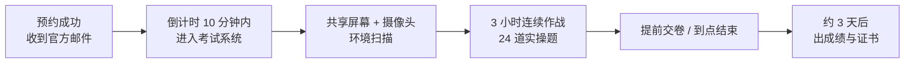

# Kubernetes 认证实战: CKA考试准备（考试形式、环境要求与答题技巧）

很多同学考 CKA 挂掉，不是不会，是**考场上浪费了时间在环境上**。结论先给：CKA 是 3 小时连续做完 24 道实操题、76 分及格；考场上只允许开 2 个浏览器标签，不能刷新页面；答题过程中**第一件事是确认自己在哪个集群上下文、在哪个节点**，做完要退回原环境，否则题目直接判 0 分。

## 纲要

- 考试形式：时长、题量、分值、及格线
- 考试环境要求：封闭房间、摄像头扫场、证件与网络自检
- 考试界面：只准开两个标签，绝不刷新页面
- 多集群上下文：动手前先看 `kubectl config get-contexts`
- 答题技巧：笔记本 + 复制粘贴 + `--help` 查示例
- 考前一页速查清单

## 考试形式



| 项目 | 实际值 | 说明 |
| --- | --- | --- |
| 总时长 | 3 小时（连续，不可暂停） | 中途退出即结束 |
| 题目数量 | 24 道实操题 | 全机操作，没有多选简答 |
| 单题分值 | 1 ~ 8 分不等 | 越难越值钱，通常 1~2 道 8 分题 |
| 及格线 | 76 分 | 换算下来大约要做对 15~18 道 |
| 出分周期 | 约 3 天 | 官网查询或邮件通知 |
| 可查资料 | 官方文档 kubernetes.io | 只能开 2 个标签页 |

> **8 分题通常是大头**：比如新增一个节点、etcd 快照备份恢复这类，一步没做对整题归零，先把它们当「必拿分」反复练。

## 考试环境要求

1. **封闭无人的独立房间**，桌面只留电脑，摄像头会先扫一遍周边，有杂物会被要求拿走。
2. **证件**：护照优先；没有护照用身份证；如果考官要求「英文名证明」（注册时用的是英文名），信用卡也可以作为辅助证明。
3. **网络**：考前进系统自检页跑一遍，通过了基本没问题，不通过就多试几次；**建议约在早上**，早上网络最稳。
4. **监考**：全程共享屏幕 + 摄像头，人脸和桌面都在画面里，别动歪心思。

## 考试界面与浏览器限制

```text
考试浏览器窗口
├── 顶栏（左）
│   ├── 题目列表（点题目切换 / 打勾标记）
│   └── 语言切换（支持中/英等多国语言）
├── 顶栏（右）
│   ├── 共享屏幕
│   ├── 共享摄像头
│   └── 小工具（计时器、计算器、笔记本入口）
└── 主区域
    └── 终端窗口（粘贴命令执行）
```

三条硬规则，写了墙壁纸都不为过：

| 规则 | 后果 |
| --- | --- |
| 最多开 **2 个** 标签页（考试系统 + 官方文档） | 开第 3 个会警告，不关可能被判违规 |
| **不要刷新页面**（不按 F5、不用 Ctrl+R） | 在线系统按当前页面状态计时，刷新直接终止考试 |
| 文档语言**中英对照**看 | 中文机翻常有偏差，英文看不懂就对着看 |

## 多集群上下文：最容易丢分的地方

CKA 会给你**多个集群**，题目要求「在指定集群内完成操作」。很多同学一上来就 `kubectl apply`，结果操作到了默认上下文那个集群，题目直接判错。

进考场第一件事，按顺序敲这三行：

```bash
# 1. 看有哪些集群上下文
kubectl config get-contexts

# 2. 确认当前默认用的是哪个
kubectl config current-context

# 3. 看节点主机名，确认你人在哪台机器上
kubectl get nodes -o wide
```

输出长这样：

```text
CURRENT   NAME             CLUSTER              AUTHINFO             NAMESPACE
*         work-k8s         work-cluster          kubernetes-admin     default
          cka-k8s-a        cka-cluster-a         cka-user-a           default
          cka-k8s-b        cka-cluster-b         cka-user-b           default
```

`*` 号那一行就是当前上下文。题目要求切到 `cka-k8s-a` 时：

```bash
kubectl config use-context cka-k8s-a
kubectl config current-context          # 确认切换成功
kubectl get nodes                       # 再看节点，确认是目标集群
```

做之前再确认一遍 `kubectl config current-context` —— **这个动作 3 秒，能救你 8 分**。

另外，**默认终端落在 master 节点上**。有些题让你在 node 上操作（比如看 kubelet 日志、改 `/etc/kubernetes/manifests/`），要 ssh 过去，做完好退出来：

```bash
ssh root@192.168.31.63
# ... 在 node 上操作 ...
exit        # 退回到 master，别把会话停在别的机器上
```

## 答题技巧

- **提前把命令录进笔记本**：考试界面右侧小工具里就带一个笔记本，打开像本机记事本，命令写完直接复制粘贴到终端，**不要手敲**。
- **开启自动补全**：考前在本地练熟 `Ctrl` 补全自动，考场上敲错一个字母就白丢时间。
- **别死记 YAML**：理解资源结构即可，写不出来就用 `--dry-run=client -o yaml` 让命令帮你生成，照着改。
- **忘参数就查 `--help`**：`kubectl taint --help`、`kubectl create job --help` 里都有现成示例，比背快。
- **3 小时不是富余，是刚好**：熟练的人时间够用，不熟练的人 3 小时都不够。所以**先做有把握的题**，卡住的先标记，回头再来。

## 浏览器书签速查

把官方文档这几页提前加书签，考场上一点就到：

```text
kubernetes.io 书签栏
├── Concepts           # 概念层：Pod / Service / Volume 等名词解释
├── 工作负载           # 示例最多：Deployment / StatefulSet / Job / CronJob
├── 概念               # 任务栏：Tasks，一步步的操作示例
└── 存储 / 配置        # PV/PVC/StorageClass、ConfigMap/Secret
```

## API 速览

| 目标 | 命令 |
| --- | --- |
| 列出全部上下文 | `kubectl config get-contexts` |
| 看当前上下文 | `kubectl config current-context` |
| 切换上下文 | `kubectl config use-context <context-name>` |
| 看集群节点与版本 | `kubectl get nodes -o wide` |
| 看集群组件健康 | `kubectl get cs` |
| 生成资源模板 | `kubectl run demo --image=nginx --dry-run=client -o yaml` |
| 查某命令参数示例 | `kubectl taint --help` |
| 导出本机补全脚本 | `kubectl completion bash > /tmp/k8s-complete.sh` |

## Demo 示例

考前一整套环境自检，花 5 分钟跑完，上场心态完全不同：

```bash
# 1. 客户端与服务端版本对得上
kubectl version --short

# 2. 节点都 Ready，没有 NotReady / Unschedulable
kubectl get nodes

# 3. 控制面组件全 Healthy（这步最容易考，也最容易在真cluster上装不上 dashboard 时卡住）
kubectl get cs

# 4. 上下文确认（★ 不做这步，很容易在错的集群里答题）
kubectl config get-contexts
kubectl config current-context

# 5. 让补全在终端里立刻生效，不用重开窗口
source <(kubectl completion bash)

# 6. 起一个临时 Pod 练手，确认网络与镜像拉取都通
kubectl run cka-test --image=nginx:1.26 --restart=Never --dry-run=client -o yaml | kubectl apply -f -
kubectl get pod cka-test -w

# 7. 练完清掉
kubectl delete pod cka-test --force --grace-period=0
```

如果第 6 步卡在 `ErrImagePull`，说明考试环境的镜像仓库不可达 —— 这属于环境坑，真到考场上只能改用题目给的镜像名，或者看题目里已经预置好的 Deployment 照着改。

### 总结

- CKA = 3 小时 / 24 道实操题 / 单题 1~8 分 / 76 分及格，全靠动手，没有理论简答题。
- 考场环境：封闭房间 + 摄像头扫场 + 共享屏幕，护照优先证件，网络自检过了就别折腾。
- 浏览器**最多 2 个标签，绝对不能刷新页面**，刷新等于考试终止。
- **动手前先 `kubectl config get-contexts` 确认集群**，跨节点操作记得 ssh 进去、做完 `exit` 退回来 —— 这是最典型的 0 分陷阱。
- 考场上策略：笔记本记命令 + 全程复制粘贴 + `--help` 查示例 + 先易后难，把时间留给 8 分题。

