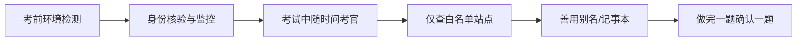

# CKA 考试期间注意事项

CKA 是远程线上实操考试，整个过程中你都可以与考官（Proctor）在线交流，有任何问题都可以随时询问。考前考官也会主动提示注意事项；没记住或没讲到的，他会在现场提醒，按他说的规矩做即可。国外考官通常比较人性化，遇到意外情况大胆沟通。

下面把「考试当天」需要注意的事项做一次系统梳理，结合课程讲解与通用 CKA 考试经验（部分细则以官方报名页与考前邮件为准）。

## 纲要

- 与考官的全程沟通机制：可随时在线提问
- 身份核验与考场监控流程：证件、摄像头环绕、屏幕监控
- 考试环境要求：网络、独处、安静
- 允许查阅的白名单文档站点
- 善用记事本、kubectl 别名与 context 切换等提效手段
- 时间管理与提交确认

## 身份核验与监控流程

考试一开始，考官会要求你：

1. **出示证件**：通常是护照或带照片的官方 ID，确保与报名信息一致。
2. **摄像头环绕一圈**：用摄像头展示考试房间四周、桌面与屏幕，证明环境合规。
3. **屏幕监控**：考官会要求共享屏幕，全程监控你的操作。
4. **口述注意事项**：包括记事本（Noteboard）的使用方式、可访问的文档站点白名单等。

考试过程中，**你的头要始终保持在监控画面中**，不要做大幅度小动作——动作过大会被系统或考官误判为作弊嫌疑。尽量让摄像头对准脸部、保持安静、不频繁离座。

## 考试环境准备

| 项目 | 建议 |
| --- | --- |
| 网络 | 稳定有线网络优先，避免公共 Wi-Fi 抖动 |
| 环境 | 独处、安静、光线充足，桌面整洁无违规资料 |
| 设备 | 摄像头、麦克风正常，提前跑通系统检测 |
| 备用 | 准备手机热点，万一断网可快速切换 |

## 允许查阅的文档白名单

CKA 考试**开卷**，但只能访问官方白名单内的站点（以考前邮件 / 考试说明页为准，常见包括）：

- `kubernetes.io` 及其子域 `kubernetes.io/docs/`、`kubernetes.io/blog/`
- GitHub 上的 `kubernetes.io` 仓库与 `kubernetes` 组织相关文档
- 部分版本的 `github.com/kubernetes` 代码仓库

不能访问论坛、博客、视频站等第三方内容。考前把常用文档页（如 `kubectl` 速查、各类资源 YAML 示例）提前收藏，能大幅节省检索时间。

## 现场提效手段

考试终端是 bash，可以预先设置一些别名和默认上下文来提速：

```bash
# 给 kubectl 设别名（若环境已提供可跳过）
alias k=kubectl

# 查看当前 context，考试常涉及多集群切换
kubectl config get-contexts
kubectl config use-context ctx-1

# 用 --dry-run 快速生成 YAML 骨架，避免手抄出错
kubectl create deployment web --image=nginx --dry-run=client -o yaml > web.yaml
```

考试终端通常自带一个**记事本（Noteboard）**，可以用来临时记录切换前的 context、已完成的题目编号等，避免慌乱中误操作。

## 时间管理与答题策略



| 策略 | 说明 |
| --- | --- |
| 先易后难 | 把有把握的高分题先拿下，难题留到最后 |
| 逐题确认 | 每做完一题立即验证（`kubectl get ...`），再做下一题 |
| 善用 --dry-run | 复杂 YAML 用 dry-run 生成骨架，减少手误 |
| 及时求助 | 终端、环境异常第一时间联系考官，不要硬扛 |

## 考试环境检查清单

把考前要确认的事项按目录结构梳理，临场逐项核对能避免低级失误：

```dir
├── 考前检查
    ├── 身份与设备
    │   ├── 证件（护照/官方ID）
    │   ├── 摄像头环绕房间
    │   └── 麦克风/网络自检
    ├── 终端环境
    │   ├── kubectl 别名已设
    │   ├── context 列表已确认
    │   └── 记事本可正常使用
    └── 资料白名单
        ├── kubernetes.io/docs
        └── kubernetes GitHub 仓库
```

## 提交与收尾

考试结束前，确认所有已做题的答案都已正确落盘（资源确实创建在正确 context 的命名空间）。提交后按考官指引结束监控会话即可。整体心态上，把它当作一次平常的实操练习，规规矩矩地做，基本不会出大问题。

## 总结

- 全程可与考官在线交流，遇到意外（断网、环境异常）立即沟通，不要闷头硬扛。
- 考前完成身份核验与摄像头环绕，考试中保持头部在画面内、不做可疑小动作。
- 仅能查阅官方白名单站点，提前收藏高频文档可显著提速。
- 预设 kubectl 别名、用 `--dry-run` 生成 YAML、用记事本记录 context，是现场提效关键。
- 先易后难、逐题验证、做完确认，心态平常即可顺利拿下 CKA。
