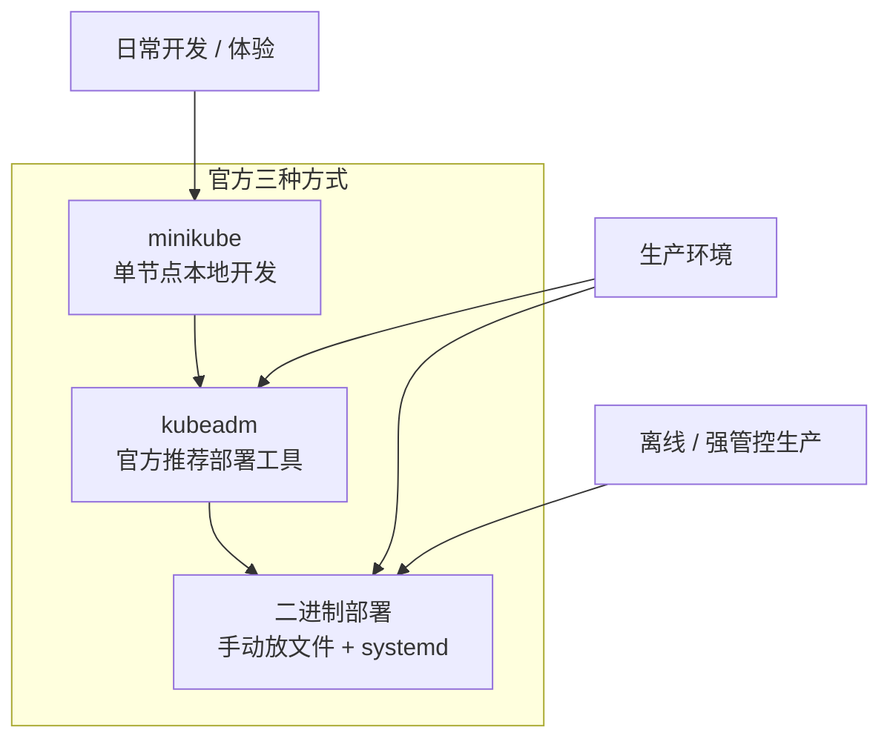

# Kubernetes 认证实战: 环境准备（集群规划、主机初始化与部署方式选型）

前面几节全是概念，听懵了很正常。从这一节开始上实操。结论先给：**Kubernetes 集群本质上只有三种搭建方式 —— minikube（放弃）、kubeadm（推荐，本文主线）、二进制（推荐，适合长期维护）**；主机侧只需要做六件事：关防火墙、关 SELinux、关 swap、配主机名与 hosts、开网桥转发、同步时间。做完这六步，剩下的就是 `kubeadm init` 加 `kubeadm join` 两条命令。

## 纲要

- 三种部署方式对比：minikube / kubeadm / 二进制
- 集群规划：几台机器、什么配置、什么系统
- 第一步：关闭防火墙并清空默认规则
- 第二步：关闭 SELinux（临时 + 永久）
- 第三步：关闭 swap（kubeadm 的硬性要求）
- 第四步：设置主机名与 `/etc/hosts` 解析
- 第五步：开启 iptables 网桥转发（两个必填 sysctl）
- 第六步：时间同步 chrony（证书强依赖时间）
- 主机初始化前后对比与完整命令串

## 三种部署方式怎么选

官方其实只提供了三种「你要用别人的工具，本质上也就是封装了其中一种」。



| 方式 | 适合场景 | 优点 | 缺点 |
| --- | --- | --- | --- |
| minikube | 本地单机开发体验 | 一条命令起集群 | 测不了多节点，**生产/测试环境都上不去**，学了意义不大 |
| kubeadm | 开发、测试、一般生产 | 两条命令建集群，官方维护，版本跟得上 | **高度封装**，装完只剩控制台输出，内部细节看不见，排障与二次维护门槛高 |
| 二进制 | 需要长期维护的生产集群 | 看得见每个组件的二进制、配置文件和启动参数，**最利于排障** | 组件多、配置多，第一次搞很劝退 |

> 选型建议：**考 CKA、做实验 → kubeadm**；**公司里真要长期维护的集群 → 二进制**（或基于二进制的自研 ansible 一键脚本）。课程配套的离线二进制部署脚本也放在 GitHub 上，纯内网机器十分钟就能装完一套。
>
> 一句话：**你熟悉哪个就用哪个**。

## 集群规划

最低配置 **2 核 2 G** —— 官方硬性要求，你给到 1 核 2 G，kubeadm 启动时会直接报错拒绝初始化。

```text
实验集群规划（3 台，同一内网网段，互通）
├── 192.168.31.61   k8s-master   master 节点（控制面）
├── 192.168.31.62   k8s-node1    worker 节点
└── 192.168.31.63   k8s-node2    worker 节点
```

| 项 | 建议 |
| --- | --- |
| 机器数量 | 3 台（1 master + 2 node）就够覆盖后面所有实验，与考试环境基本一致 |
| CPU / 内存 | 最低 2C2G，实验环境给到 2C4G 更舒服 |
| 操作系统 | **CentOS 7.5 / 7.6 / 7.7** 都行；7.3 之前不建议（内核有 bug） |
| 系统版本 | 装 **Mini 版**（带 GUI 的完整版纯占资源，实验没意义） |
| 系统状态 | **完全纯净**的新装系统，没装过 docker / 没改过内核参数 |
| 网络 | 节点之间走**内网互通**；master 与 node 都不需要暴露公网，**能拉外网镜像即可** |
| 预算逻辑 | 集群是资源池，池子大小决定能跑几个项目；测试环境够用就行，**生产环境上不封顶** |

> **Offline（无外网）场景**：To B 客户（运营商、国企）的内网机器往往不能上外网。解决办法是**在有网机器先把镜像拉下来 `docker save` 导出，再 `docker load` 导入到内网机器**，麻烦一点但完全可行。

## 第一步：关闭防火墙并清空默认规则

**实验环境直接关掉防火墙**；生产环境不关，但要**清空默认拦截规则**，因为 k8s 自己的 kube-proxy 要用 iptables 写代理规则，默认规则会挡路。

```bash
# 停掉并禁用（实验环境）
systemctl stop firewalld
systemctl disable firewalld

# 如果保留 firewalld，就换个思路：把默认 zone 改成 trusted，等于全放行
firewall-cmd --set-default-zone=trusted

# 无论用哪种，都要清空 iptables 默认链（新装系统这堆规则有七八十条，全是干扰项）
iptables -F
iptables -X
iptables -L -n | head
```

> **原理**：firewalld / iptables 底层都是走 Linux 内核的 **netfilter** 做包过滤，换成 firewalld 只是换了操作姿势，本质没变。k8s 装完后 kube-proxy 会自己往 iptables（或 ipvs）里写规则，所以防火墙不用了，但它还得开着。

## 第二步：关闭 SELinux

SELinux 是强制访问控制机制，实验环境下 90% 以上的互联网公司（含大厂）也都是关的，直接关，别犹豫。

```bash
# 临时生效（重启后恢复）
setenforce 0
getenforce              # 输出 Permissive 即生效

# 永久生效（改配置文件）
sed -i 's/^SELINUX=enforcing/SELINUX=disabled/' /etc/selinux/config
grep SELINUX /etc/selinux/config
```

## 第三步：关闭 swap（kubeadm 的硬性要求）

swap 是物理内存不够时拿磁盘顶替的空间，**磁盘比内存慢好几个数量级**，一旦触发性能断崖式下跌。k8s 为了不让性能被拖累，**强制禁用 swap** —— 不关，集群根本起不来。

```bash
# 临时关闭
swapoff -a
swapon -s                # 或者 free -h，看到 swap 全 0 就对了

# 永久关闭：把 /etc/fstab 里的 swap 行注释掉
sed -i '/swap/d' /etc/fstab
cat /etc/fstab | grep -v '^#'
```

> 更省事的做法：**装系统的时候直接不分配 swap 分区**，从根上解决。

## 第四步：设置主机名与 hosts 解析

先规划好名字（做任何项目都该先出文档再动手），再按规划逐台设置：

```bash
# master 上执行
hostnamectl set-hostname k8s-master
# node1 上执行
hostnamectl set-hostname k8s-node1
# node2 上执行
hostnamectl set-hostname k8s-node2
```

改完重开一个 shell（`bash`）才会显示新主机名。

然后**所有节点**都要加 hosts 解析：

```text
# /etc/hosts（三台机器都加一样的）
192.168.31.61   k8s-master
192.168.31.62   k8s-node1
192.168.31.63   k8s-node2
```

> **master 节点必须加自己这一条（`192.168.31.61 k8s-master`）**。`kubeadm init` 初始化时会拿当前主机名做连通性测试，DNS 解析不通它就直接卡住，后面的引导流程根本走不下去。

## 第五步：开启 iptables 网桥转发

这是官方文档明确要求加的两个参数，不加的话 Service 转发时**会有流量丢失**（官方原话，没细说具体场景，但照做没坏处）：

```bash
cat > /etc/sysctl.d/k8s.conf <<'EOF'
net.bridge.bridge-nf-call-iptables=1
net.bridge.bridge-nf-call-ip6tables=1
EOF

# 加载 br_netfilter 模块（关了防火墙后可能没有）
modprobe br_netfilter

# 让配置立即生效
sysctl --system

# 验证
sysctl net.bridge.bridge-nf-call-iptables
```

| 参数 | 作用 |
| --- | --- |
| `net.bridge.bridge-nf-call-iptables=1` | 网桥流量进入 iptables 的 FORWARD 链参与过滤 |
| `net.bridge.bridge-nf-call-ip6tables=1` | IPv6 的网桥流量同理 |
| `net.ipv4.ip_forward=1` | （生产建议再加）开启 IPv4 转发 |

## 第六步：时间同步

**证书生成严重依赖时间**。三台机器时间不同步，会导致证书签发校验失败、节点间通信报 x509 错误，而且这种错极难查。

```bash
yum install -y chrony
systemctl enable --now chronyd
timedatectl                     # 确认NTP active: yes

# 恢复快照之后，第一时间再同步一次
chronyc sources
```

## 主机初始化前后对比

```text
初始化前（纯净 CentOS 7.6 Mini）
├── firewalld    running  ← 停掉
├── SELinux      enforcing ← 关
├── swap         2G       ← swapoff -a + 注释 fstab
├── /etc/hosts   只有 localhost 相关 ← 加 3 条集群解析
├── /etc/sysctl.d/k8s.conf  不存在 ← 新建
└── 时间        可能偏差数分钟 ← chronyd 同步

初始化后（kubeadm init 之后）
├── /etc/kubernetes/            ← 所有组件配置文件与证书
│   ├── admin.conf
│   ├── kubelet.conf
│   ├── controller-manager.conf
│   ├── scheduler.conf
│   └── manifests/              ← 静态 Pod 清单（etcd / apiserver / scheduler / ccm）
├── /etc/containerd/ 或 /etc/docker/
├── /var/lib/kubelet/
└── ~/.kube/config              ← 管理员凭据，拷到别处可远程管理
```

## API 速览

| 目标 | 命令 |
| --- | --- |
| 看内核参数是否生效 | `sysctl net.bridge.bridge-nf-call-iptables` |
| 看 swap 是否已关 | `free -h` / `swapon -s` |
| 看 SELinux 状态 | `getenforce` |
| 看防火墙状态 | `systemctl status firewalld` |
| 看主机名 | `hostnamectl status` |
| 看时间同步状态 | `timedatectl` |
| 看 iptables 链 | `iptables -L -n -t filter` |
| 看内核模块是否加载 | `lsmod | grep br_netfilter` |

## Demo 示例

```bash
#!/usr/bin/env bash
# 342-init-host.sh —— 新机器到手后的主机初始化，全部节点执行
set -euo pipefail

echo "==> 1. 关闭防火墙"
systemctl stop firewalld   || true
systemctl disable firewalld || true
iptables -F
iptables -X

echo "==> 2. 关闭 SELinux"
setenforce 0 || true
sed -i 's/^SELINUX=enforcing/SELINUX=disabled/' /etc/selinux/config

echo "==> 3. 关闭 swap"
swapoff -a || true
sed -i '/swap/d' /etc/fstab

echo "==> 4. hosts 解析"
cat >> /etc/hosts <<'HOSTS'
192.168.31.61   k8s-master
192.168.31.62   k8s-node1
192.168.31.63   k8s-node2
HOSTS

echo "==> 5. 网桥转发"
cat > /etc/sysctl.d/k8s.conf <<'SYSCTL'
net.bridge.bridge-nf-call-iptables=1
net.bridge.bridge-nf-call-ip6tables=1
SYSCTL
modprobe br_netfilter
sysctl --system

echo "==> 6. 时间同步"
yum install -y chrony -q
systemctl enable --now chronyd

echo "==> 校验"
getenforce
free -h | grep -i swap
sysctl net.bridge.bridge-nf-call-iptables
timedatectl | grep -i ntp
```

逐项自检一遍，都符合预期再往下走 `kubeadm init`：

```bash
# 一条命令看全貌，任何一项不符合都要先修
hostnamectl status | grep -i hostname
grep -c . /etc/hosts
swapon -s
getenforce
systemctl is-enabled firewalld || echo "firewalld 已禁用"
sysctl net.bridge.bridge-nf-call-iptables
```

如果第 4 步的 `/etc/hosts` 漏加了 master 自己，接下来 `kubeadm init` 会卡在域名解析这里 —— 报错长这样，看到就回去补 hosts：

```text
couldn't fetch the default set of images...
unable to resolve hostname "k8s-master"
```

### 总结

- **部署方式三选一**：minikube 只能本地玩，kubeadm 快速上手，二进制最利于生产维护；课程主线用 kubeadm，离线二进制脚本另附。
- **主机最低 2C2G**，官方硬性要求，不到 2 核直接初始化失败；3 台（1 master + 2 node）足够覆盖全部实验与考试场景。
- 系统用 **CentOS 7.5/7.6/7.7 的 Mini 版**，7.3 之前别用（内核有 bug）。
- 初始化六步：关防火墙（清空规则）→ 关 SELinux → **关 swap** → 设主机名 + 加 hosts（**master 必须解析自己**）→ 开网桥转发两个 sysctl → chrony 同步时间。
- **swap 和时间是两颗雷**：swap 不关集群起不来；时间不同步证书就废，恢复快照后第一时间再同步一次。

