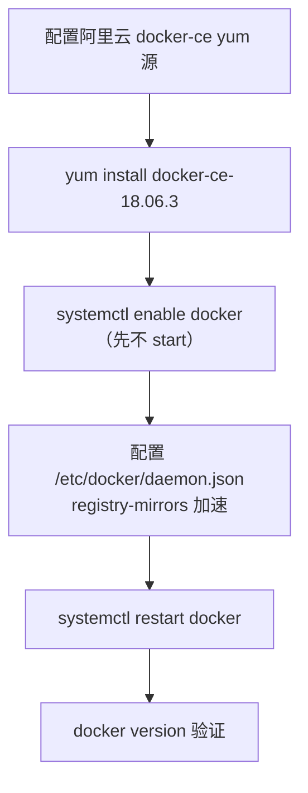
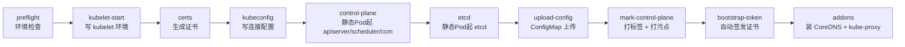

# Kubernetes 认证实战: 部署Master（容器引擎安装与 kubeadm 初始化十步）

主机初始化完之后，就进入真正的建集群动作。结论先给：**所有节点装 Docker CE 18.06 + kubeadm/kubelet/kubectl 1.18（注意 kubelet 装完不要启动），然后在 master 上跑一条 `kubeadm init`，后面的一切都是它自动完成的 —— 拉镜像、发证书、写 kubeconfig、起静态 Pod、打污点、发 bootstrap token、装 CoreDNS 和 kube-proxy。**

## 纲要

- 装 Docker CE 18.06（为什么选这个版本）
- 配置镜像加速源，解决拉镜像慢
- 添加 Kubernetes yum 源并安装 kubeadm 三件套
- **kubelet 装完不要启动**（配置文件还没生成）
- `kubeadm init` 五个核心参数
- 初始化流程十步拆解（拉镜像 → 证书 → kubeconfig → 静态 Pod → 污点 → bootstrap token → 插件）
- 初始化后证书与配置文件都落在哪
- 单节点实验怎么办：去掉 master 污点

## 安装 Docker（所有节点）



### 版本怎么选

**建议装 Docker CE 18.06（18.06.3.ce）**，因为这一版是和 Kubernetes 官方做过兼容性测试的。Kubernetes 和 Docker 是两家公司（ respectively 是 CNCF 与 Docker Inc.）的产品，要紧密配合，没测过的版本上生产有风险。

> **学习可以「学新不学旧」，生产绝对不能**。最新版本加了一堆新特性，主干代码就容易出幺蛾子，最后背锅的是运维。

```bash
# 装依赖
yum install -y yum-utils device-mapper-persistent-data lvm2

# 加阿里云 docker-ce 源（官方源在国外，慢）
yum-config-manager --add-repo http://mirrors.aliyun.com/docker-ce/linux/centos/docker-ce.repo

# 指定版本安装
yum install -y docker-ce-18.06.3.ce-3.el7

# 开机启动，但【先不启动】
systemctl enable docker
```

### 配置镜像加速源

```bash
mkdir -p /etc/docker
cat > /etc/docker/daemon.json <<'EOF'
{
  "registry-mirrors": ["https://xxxxxx.mirror.aliyuncs.com"]
}
EOF

systemctl restart docker
docker info | grep -A2 Registry Mirrors     # 能看到镜像地址 = 生效
docker pull nginx                            # 这时候拉就很快了
```

> 国内镜像站是跟 Docker Hub **实时同步**的代理，直接配进 `registry-mirrors`，后面拉什么镜像都走国内。

## 安装 kubeadm 三件套（所有节点）

刚才加的是 **docker 源**，现在要加的是 **Kubernetes 源**，两个是不同的源：

```bash
cat > /etc/yum.repos.d/kubernetes.repo <<'EOF'
[kubernetes]
name=Kubernetes
baseurl=https://mirrors.aliyun.com/kubernetes/yum/repos/kubernetes-el7-x86_64
enabled=1
gpgcheck=1
repo_gpgcheck=1
gpgkey=https://mirrors.aliyun.com/kubernetes/yum/doc/yum-key.gpg
       https://mirrors.aliyun.com/kubernetes/yum/doc/yum-key.pub
EOF

yum install -y kubelet-1.18.0 kubeadm-1.18.0 kubectl-1.18.0
systemctl enable kubelet
```

> **版本不必纠结**：1.16 / 1.17 / 1.18 核心功能几乎没差别，主要是把测试中的功能往 GA（生产可用）推进和性能优化。对 CKA 考试也基本没影响。**但 `kubeadm` 组件装的是 1.18，`init` 时就必须指定 `v1.18.0`，写成 1.17 会直接报错。**

### ⚠️ kubelet 不要手动启动

```bash
# 千万不要执行
# systemctl start kubelet        ← 会一直重启失败，因为它自己的配置文件还没生成
```

kubeadm 把除了 kubelet 和容器引擎之外的所有控制面组件都**容器化**了：kube-apiserver、kube-controller-manager、kube-scheduler、etcd，全都是跑在容器里的（通过 kubelet 拉起）。而 kubelet 自己尚未容器化 —— 它得直接操作宿主机的东西，容器化反而更麻烦，所以至今官方没这么做，仍由 systemd 管理。

所以 **`systemd start kubelet` 现在起不来是对的**，别折腾，交给 `kubeadm init` 去引导。

## kubeadm init 的五个参数

```bash
kubeadm init \
  --apiserver-advertise-address=192.168.31.61 \
  --image-repository=registry.aliyuncs.com/k8sxio \
  --kubernetes-version=v1.18.0 \
  --service-cidr=10.96.0.0/12 \
  --pod-network-cidr=10.244.0.0/16
```

| 参数 | 作用 | 坑 |
| --- | --- | --- |
| `--apiserver-advertise-address` | apiserver 暴露给其他节点的 IP | **双网卡机器要填内网 IP**，填公网或错网卡后面 node 永远连不上 |
| `--image-repository` | 镜像仓库地址 | **不指定就默认去 k8s.gcr.io 拉，国内基本拉不动**，这是最常见的卡死点 |
| `--kubernetes-version` | 跟已装组件对齐的版本 | 必须带 `v` 前缀，且必须和 kubelet 版本一致 |
| `--service-cidr` | Service 虚拟 IP 段 | **别和你现有内网物理网段冲突**（你内网用了 10.196.x 就别再指定它） |
| `--pod-network-cidr` | Pod IP 段 | 同上，更要避免冲突；后续 CNI 插件网段要能跟它对齐 |

> **`--service-cidr` 和 `--pod-network-cidr` 可以改，但新手先照抄上面两组**。改了也行，前提是不与现有物理网络重叠 —— 80% 的诡异网络问题都出在这两个网段撞车。

## 初始化到底干了什么十步

`kubeadm init` 其实和二进制部署做的是同一件事，只是帮你全自动了。看它的阶段输出就知道：



| 阶段 | 实际动作 |
| --- | --- |
| `preflight` | **检查环境**：CPU 够不够（1 核直接拒绝）、swap 关没关、`/proc/sys/net/bridge` 是否配好 —— 上一步没做全，这里就卡住 |
| `kubelet-start` | 生成 kubelet 所需的环境文件和参数 |
| `certs` | 生成两套证书（apiserver 一套、etcd 一套），落在 `/etc/kubernetes/pki` |
| `kubeconfig` | 生成 `admin.conf` / `kubelet.conf` / `controller-manager.conf` / `scheduler.conf`，里面记录连接 apiserver 的地址与凭据 |
| `control-plane` | 把 apiserver、controller-manager、scheduler 以**静态 Pod** 方式起起来 |
| `etcd` | 以静态 Pod 方式起 etcd |
| `upload-config` | 把 kubeadm 配置作为 ConfigMap 存到集群里，方便后续复用 |
| `mark-control-plane` | 给 master 打 `node-role.kubernetes.io/master` 标签，并**打上 `NoSchedule` 污点** |
| `bootstrap-token` | 生成 bootstrap token，为后续 node 加入时**自动颁发证书** |
| `addons` | 装两个必备插件：**CoreDNS**（集群内部域名解析）、**kube-proxy**（Pod 网络转发） |

其中 `preflight` 阶段真正执行的拉镜像命令是 `kubeadm config images pull`，你也可以单独拿出来先跑，避免 long-running 卡住不知道进度：

```bash
kubeadm config images pull --image-repository=registry.aliyuncs.com/k8sxio
# 或者查看还有哪些参数
kubeadm init --help
```

## 初始化后东西都落在哪

```text
/root 或 /etc/kubernetes
├── pki/                          ← 所有证书
│   ├── ca.crt / ca.key
│   ├── apiserver.crt / apiserver.key
│   ├── apiserver-etcd-client.crt
│   ├── etcd/ca.crt, server.crt, peer.crt ...
│   ├── front-proxy-ca.crt / front-proxy-client.crt
│   └── sa.key / sa.pub           ← ServiceAccount 密钥对
├── admin.conf                    ← 管理员凭据（重点！）
├── kubelet.conf
├── controller-manager.conf
├── scheduler.conf
└── manifests/                    ← ★ 静态 Pod 清单目录
    ├── etcd.yaml
    ├── kube-apiserver.yaml
    ├── kube-controller-manager.yaml
    └── kube-scheduler.yaml
```

> **静态 Pod 机制**：只要把这个 `yaml` 扔进 `/etc/kubernetes/manifests/`，kubelet 就会自动把它拉起来，不需要你手动 create。这就是为什么 init 输出里反复出现 `Creating static Pod manifest for "kube-apiserver"` —— kubeadm 其实就是在往这个目录里丢文件。

## 收尾：把 admin.conf 拷到当前目录

init 跑完会提示你执行两条命令，本质是**拷贝配置文件**：

```bash
mkdir -p $HOME/.kube
cp -i /etc/kubernetes/admin.conf $HOME/.kube/config
chown $(id -u):$(id -g) $HOME/.kube/config

# 验证
kubectl get nodes
kubectl get pods -n kube-system
```

> `admin.conf` 就是 kubeconfig，里面记着 apiserver 地址、证书、用户。**这个文件拷到任何装了 kubectl 的机器上都能直接连这个集群**。命令行不指定它，只是因为默认从 `$HOME/.kube/config` 读 —— 换个用户跑就得用 `--kubeconfig` 显式指定。

看到 `NotReady` 是正常的，因为还没装 CNI 网络插件（下一节就装）。

## API 速览

| 目标 | 命令 |
| --- | --- |
| 初始化 master | `kubeadm init --kubernetes-version=v1.18.0` |
| 单独拉镜像 | `kubeadm config images pull --image-repository=<仓库>` |
| 看 init 全部参数 | `kubeadm init --help` |
| 重置踢掉这次初始化 | `kubeadm reset` |
| 给 node 生成 join 命令 | `kubeadm token create --print-join-command` |
| 看 kubelet 状态 | `systemctl status kubelet` |
| 看控制面 Pod | `kubectl get pods -n kube-system` |
| 去掉 master 污点 | `kubectl taint nodes k8s-master node-role.kubernetes.io/master-` |

## Demo 示例

```bash
#!/usr/bin/env bash
# 在【master 节点】执行，且只执行一次
set -euo pipefail

MASTER_IP=192.168.31.61
ALIYUN_MIRROR=registry.aliyuncs.com/k8sxio

echo "==> 1. 预拉镜像（单独跑，方便看进度）"
kubeadm config images pull --image-repository="$ALIYUN_MIRROR"

echo "==> 2. 初始化控制面"
kubeadm init \
  --apiserver-advertise-address="$MASTER_IP" \
  --image-repository="$ALIYUN_MIRROR" \
  --kubernetes-version=v1.18.0 \
  --service-cidr=10.96.0.0/12 \
  --pod-network-cidr=10.244.0.0/16 2>&1 | tee /tmp/kubeadm-init.log

echo "==> 3. 拷贝管理员配置"
mkdir -p "$HOME/.kube"
cp -i /etc/kubernetes/admin.conf "$HOME/.kube/config"
chown "$(id -u):$(id -g)" "$HOME/.kube/config"

echo "==> 4. 看控制面组件（4 个都是 1/1 Running）"
kubectl get pods -n kube-system -o wide

echo "==> 5. 看 master 上的污点（实验环境要去掉才能跑 Pod）"
kubectl describe node k8s-master | grep -i taint

echo "==> 6. 保存 join 命令，node 加入时要用"
kubeadm token create --print-join-command | tee /tmp/join.cmd
```

如果 init 中途报错想重来：

```bash
kubeadm reset          # 清掉这次半成品
systemctl restart kubelet
# 修好问题（比如补 hosts、关 swap）后再重新 init
```

**验证控制面是否真的起来了**：

```bash
# 静态 Pod 本质是 kubelet 直接起的，可以看 systemd + docker 两层
docker ps | grep -E 'kube-apiserver|etcd|kube-scheduler'
kubectl get componentstatuses          # 或简写 kubectl get cs
```

输出里 scheduler / controller-manager / etcd 三行全是 `Healthy`，说明这套 master 才算真的立住了。

### 总结

- Docker 装 **CE 18.06.3** 这个与 K8s 做过兼容测试的版本；配 `registry-mirrors` 加速，拉 nginx 验证生效。
- kubelet / kubeadm / kubectl 三件套指定 **1.18.0**，装完 `systemctl enable kubelet` **但不要 start**。
- **`kubeadm init` 五个参数**：`--apiserver-advertise-address`（填内网 IP）、`--image-repository`（不填就拉不动）、`--kubernetes-version`（必须带 v 且与组件一致）、`--service-cidr`、`--pod-network-cidr`（两个网段别和物理网络撞车）。
- **init 十步**：环境检查 → kubelet 配置 → 证书 → kubeconfig → 静态 Pod 起 apiserver/scheduler/controller-manager → 静态 Pod 起 etcd → 配置存 ConfigMap → 打标签加 NoSchedule 污点 → bootstrap token → 装 CoreDNS 和 kube-proxy。
- **收尾必须拷 `admin.conf` 到 `$HOME/.kube/config`**，否则 `kubectl` 无权访问集群；节点状态 `NotReady` 是因为 CNI 还没装，属正常。
- 想让 master 也能跑 Pod（单节点实验）就 `kubectl taint nodes k8s-master node-role.kubernetes.io/master-`。

