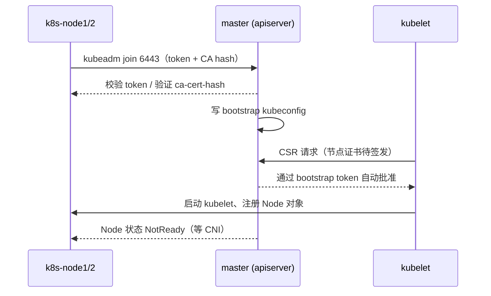

# Kubernetes 认证实战: 部署Node（kubeadm join 加入节点与 NotReady 定位）

master 初始化完会吐出最后一行命令，那就是给 node 的入场券。结论先给：**把 join 命令原样存进文本文件（别手敲），到 node 上执行；加入成功后节点一定是 `NotReady`，这是正常的 —— 因为 CNI 网络插件还没装，看 kubelet 日志就能确认，不是你操作错了。**

## 纲要

- 先备份 init 输出的 join 命令
- 在 node 上执行 join
- 加入失败一：swap 没关（重启后被 fstab 复活）
- 加入失败二：节点名/IP 重复，提示「已注册」
- 用 `kubeadm reset` 清空节点残留
- 加入成功但 NotReady：查 kubelet 日志确认是 CNI 问题
- 日志在哪、怎么看

## join 命令从哪来

`kubeadm init` 跑完的最后几行一定是这个：

```text
kubeadm join 192.168.31.61:6443 --token 7f8c9d.2e4f6a1b3c5d7e9f \
    --discovery-token-ca-cert-hash sha256:ab12cd34...
```

**第一时间把它粘到文本文件里存下来**，后面 node 加入、新加节点都要反复用。如果当时没存（比如重新 init 过），在 master 上再生成一条即可：

```bash
# 重新造一个 token 并直接打印完整 join 命令
kubeadm token create --print-join-command
```

## 执行 join



在 **node 节点**上执行（不是 master）：

```bash
# 把刚才存的命令执行掉，示例：
kubeadm join 192.168.31.61:6443 \
  --token 7f8c9d.2e4f6a1b3c5d7e9f \
  --discovery-token-ca-cert-hash sha256:ab12cd34...
```

## 两个最常见的加入失败

### 失败一：swap 又开了

重启机器之后，如果你上次只做了临时关闭，swap 会被 `/etc/fstab` 重新拉起来，join 时会直接报错：

```text
[preflight] Running pre-flight checks
error: /proc/swaps contains "swap";
       please disable swap temporarily
```

临时 + 永久一起关，然后重跑：

```bash
swapoff -a
sed -i '/swap/d' /etc/fstab
swapon -s                  # 全 0 才算干净
```

### 失败二：节点名或 IP 重复

同一个节点要么没清干净，要么你 ssh 串了机器，会提示「已经注册过了」—— 系统会校验 IP 是否和已有 Node 对象重复。

```text
error: node "k8s-node1" already exists in cluster
```

处理办法就是**把当前节点环境清空再重来**：

```bash
# ★ 记住这条：不想玩了 / 搞乱了，直接清场
kubeadm reset
systemctl restart kubelet
```

> 建议：**join 前先在 node 上 `kubeadm reset` 洗一遍再执行 join**，能省掉一半的脏状态。

顺手确认一下自己连的是哪台机器，别像录屏里那样 IP 串了导致「咦怎么两个节点一样」：

```bash
hostname        # 应该是 k8s-node1 / k8s-node2
ip addr | grep inet
hostname -I
```

## 加入成功，但节点是 NotReady？这是正常的

回到 master 看节点列表：

```bash
kubectl get nodes
```

```text
NAME         STATUS     ROLES    AGE   VERSION
k8s-master   NotReady   master   10m   v1.18.0
k8s-node1    NotReady   <none>   20s   v1.18.0
k8s-node2    NotReady   <none>   10s   v1.18.0
```

**状态全是 `NotReady`，别慌，这不是操作失败。** 证据在 kubelet 日志里：

```bash
# 看 kubelet 自身日志（推荐）
journalctl -u kubelet --no-pager -n 100

# 或者直接看系统日志
tail -100 /var/log/messages | grep kubelet
```

关键报错一行：

```text
NodeNotReady: container runtime network not ready
```

> **含义**：容器运行时的网络没准备好 —— 翻译成人话就是 **CNI 网络插件还没装**。集群里 Pod 之间跨节点通信靠它，没装之前 kubelet 不敢把节点标记为 Ready。装上网络插件，稍等片刻自动恢复 Ready。

所以流程是：**先 join 完所有 node → 再去装 CNI 插件 → 全部 Ready**。

## 日志在哪

```text
/var/log/            ← CentOS 7 传统 syslog 落盘位置
├── messages         # kubelet 的常规输出都在这一坨里
└── ...

journalctl（systemd 管理，推荐）
├── -u kubelet           # 只看 kubelet unit
├── -f                   # 实时跟随，join 时开着这个最有感
├── -n 100               # 最近 100 行
└── -o cat               # 纯文本，不分页
```

| 想看什么 | 命令 |
| --- | --- |
| kubelet 实时日志 | `journalctl -u kubelet -f` |
| kubelet 最近 100 行 | `journalctl -u kubelet --no-pager -n 100` |
| 系统总日志 | `tail -f /var/log/messages` |
| join 请求有没有到 master | `journalctl -u kubelet -f` 里搜 `bootstrap` |
| 看节点到底为何不 Ready | `kubectl describe node k8s-node1` 的 Conditions |
| 看 kubelet 配置有没有生效 | `systemctl cat kubelet` |

## API 速览

| 目标 | 命令 |
| --- | --- |
| 看集群节点状态 | `kubectl get nodes` |
| 看单节点详情与 Conditions | `kubectl describe node k8s-node1` |
| 重新生成 join 命令 | `kubeadm token create --print-join-command` |
| 清空本节点的 kubeadm 状态 | `kubeadm reset` |
| 看 kubelet 日志 | `journalctl -u kubelet --no-pager -n 100` |
| 删除误加的节点 | `kubectl delete node k8s-node2` |
| 加/去污点（准备跑单节点） | `kubectl taint nodes k8s-master node-role.kubernetes.io/master-` |

## Demo 示例

```bash
#!/usr/bin/env bash
# 在【node 节点】执行
set -euo pipefail

JOIN_TOKEN="7f8c9d.2e4f6a1b3c5d7e9f"
CA_HASH="sha256:ab12cd34..."
MASTER_IP=192.168.31.61

echo "==> 0. 先确认自己在这台 node 上，且 swap 已关"
hostname
swapon -s

echo "==> 1. 洗一遍环境，避免脏状态"
kubeadm reset || true
rm -f /etc/cni/net.d/*           # 清掉旧的 CNI 配置

echo "==> 2. 执行 join"
kubeadm join "${MASTER_IP}:6443" \
  --token "${JOIN_TOKEN}" \
  --discovery-token-ca-cert-hash "${CA_HASH}" 2>&1 | tee /tmp/join.log

echo "==> 3. 实时看 kubelet，盯住 'network not ready' 这条"
journalctl -u kubelet -f

echo "==> 4. 回到 master 确认节点已注册（此时 NotReady 属正常）"
kubectl get nodes
kubectl describe node k8s-node1 | grep -A3 Conditions
```

如果 join 完超过 3 分钟还是 NotReady，按这个顺序排查：

```bash
# ① token 过期？重新生成一条
kubeadm token list
kubeadm token create --print-join-command

# ② 6443 通不通（apiserver 端口）
telnet 192.168.31.61 6443

# ③ 镜像没拉下来？看 kubelet 日志里有没有 ErrImagePull
journalctl -u kubelet --no-pager | grep -i 'errimagepull\|ImagePullBackOff'

# ④ 证书 CSR 没批？看 pending 的请求
kubectl get csr
```

> 第 ④ 步的 CSR 如果卡在 Pending，说明节点证书没被批准（多半是 bootstrap 阶段出问题），先看 `kubectl get csr` 输出再决定要不要手动 `kubectl certificate approve`。

### 总结

- join 命令来自 `kubeadm init` 最后一行输出，**先存文本再执行**，手敲必错；丢了就用 `kubeadm token create --print-join-command` 重造。
- **join 在 node 上执行，绝不在 master 上执行**。
- 两大加入失败：swap 没关（重启后被 fstab 复活）、节点名/IP 重复（提示已注册）；前者重跑 `swapoff -a` + 注释 fstab，后者先 `kubeadm reset` 洗场。
- **加入成功后 `NotReady` 是预期状态** —— 日志里那句 `container runtime network not ready` 直指 CNI 插件没装，不是你操作错了。
- 查日志认准两个入口：`journalctl -u kubelet -f` 和 `/var/log/messages`；Ready 的唯一解药是装 CNI 网络插件。

