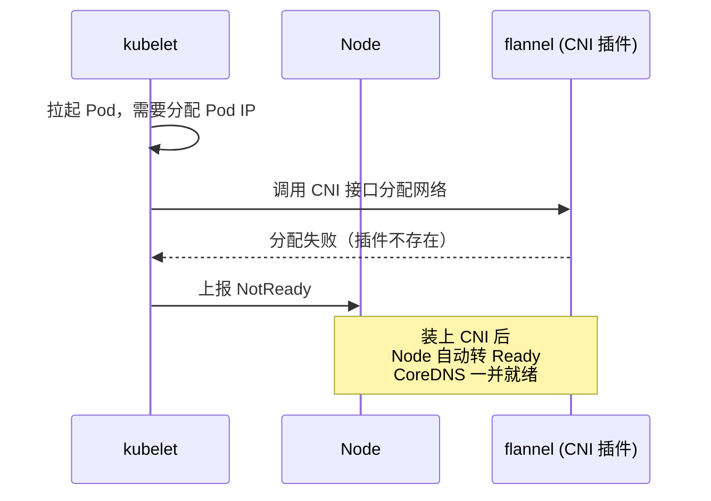
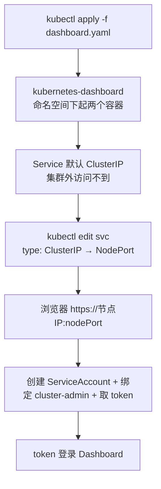

# Kubernetes 认证实战: 部署CNI插件与Dashboard（节点Ready与token登录）

上一节留下一个 `NotReady` 的悬案，这一节直接结案。结论先给：**装 CNI 网络插件（flannel）只需要 `kubectl apply -f` 一个 yaml，装完全部节点立刻 `Ready`，CoreDNS 也跟着就绪；再 `kubectl apply` 一个 Dashboard yaml，把它的 Service 改成 NodePort，再建 ServiceAccount、绑 cluster-admin、取 token，三步就能浏览器登录。**

## 纲要

- 为什么不上 CNI 节点就 Ready 不了
- 装 flannel：一条 apply 搞定
- 这个文件为什么有一堆「重复」内容
- 镜像地址必须换（默认在国外）
- CoreDNS 与网络插件的依赖关系
- 部署 Dashboard：同样是一条 apply
- 把 Service 从 ClusterIP 改成 NodePort 才能访问
- 三步创建登录账号：ServiceAccount + ClusterRoleBinding + token
- HTTPS 证书告警与 token 登录完整流程

## 为什么必须先装 CNI



CNI（Container Network Interface）是容器网络接口标准。**没有它，Pod 连 IP 都拿不到**，kubelet 就会把节点标成 NotReady。日志里那句 `container runtime network not ready` 就是这么来的。

## 部署 flannel

```bash
kubectl apply -f https://raw.githubusercontent.com/coreos/flannel/master/Documentation/kube-flannel.yml
```

就这一条命令。装完它会直接跑到 **`kube-system` 命名空间**下：

```bash
kubectl get pods -n kube-system
```

| 时间 | 现象 |
| --- | --- |
| 刚 apply | `kube-flannel-ds-amd64-xxxxx` 处于 ContainerCreating |
| 拉完镜像 | `Running`，同时 kubelet 自动把节点刷成 `Ready` |
| 稍等片刻 | `coredns-xxxxx` 从 Pending/ContainerCreating 变 `Running` |

> **CoreDNS 也依赖网络插件**。没装 CNI 之前它一直起不来，节点 Ready 之后它才「即将准备就绪」—— 这就是为什么两件事要一起做。

### 这个文件里为什么有「重复」内容

`kube-flannel.yml` 内容特别长，看着像有一堆重复段落，其实是**它同时打了 amd64 / arm / arm64 等多个 CPU 架构的镜像**，方便你在任何平台上都能用。国内绝大多数机器都是 **amd64（x86_64）**，只改这一处镜像地址就行。

### 镜像地址必须换

默认镜像在 `quay.io`，国内网络基本拉不动，先把它换成国内源：

```bash
# 原始镜像
quay.io/coreos/flannel:v0.13.0-amd64

# 改成国内可拉取的仓库（前提：本机 docker 已配好 registry-mirrors）
registry.aliyuncs.com/google_containers/flannel:v0.13.0-amd64
```

改法：把 yaml 下载下来、改完镜像、再 apply，跟直接下载是同一回事：

```bash
curl -o kube-flannel.yml https://raw.githubusercontent.com/coreos/flannel/master/Documentation/kube-flannel.yml
grep -n 'image:' kube-flannel.yml
sed -i 's#quay.io/coreos/flannel#registry.aliyuncs.com/google_containers#g' kube-flannel.yml
kubectl apply -f kube-flannel.yml
```

到此为止 **K8s 集群就算真正搭起来了**。

## 部署 Dashboard



Dashboard 的部署同样是**一条 apply 搞定**，这背后就是 K8s 被称为容器编排利器的原因 —— 任何应用基本都是丢一个 yaml 的事。

```bash
kubectl apply -f https://raw.githubusercontent.com/kubernetes/dashboard/v2.0.0-rc6/aio/deploy/recommended.yaml
kubectl get pods -n kubernetes-dashboard -o wide
```

### 把 Service 改成 NodePort

这个 yaml 自带在 Docker Hub 上，不用换镜像；但它的 Service 默认类型是 `ClusterIP`，**集群外访问不到**，得改：

```bash
kubectl edit svc kubernetes-dashboard -n kubernetes-dashboard
# 把 type: ClusterIP 改成 type: NodePort，保存退出
```

```bash
kubectl get svc -n kubernetes-dashboard
```

```text
NAME                   TYPE       CLUSTER-IP      EXTERNAL-IP   PORT(S)         AGE
service/kubernetes-dashboard   NodePort   10.96.32.107   <none>        443:32431/TCP   2m
```

看到 `443:32431/TCP` 后面那个 **32431 就是 NodePort**，浏览器直接访问它：

```bash
https://192.168.31.62:32431
```

> **一定是用 HTTPS，不是 HTTP**。页面报「it looks like you're trying to visit the dashboard over HTTPS」是正常的 —— 因为 Dashboard 自带证书，你按提示「高级 → 继续前往」加个例外就行。

## 三步创建登录账号

Dashboard 的登录支持 **kubeconfig** 和 **token** 两种方式，实操都用 token。三步走：

```bash
# ① 创建一个服务账号
kubectl create serviceaccount dashboard-admin -n kubernetes-dashboard

# ② 给它绑定集群管理员权限（cluster-admin 是集群里权限最大的角色）
kubectl create clusterrolebinding dashboard-admin \
  --clusterrole=cluster-admin \
  --serviceaccount=kubernetes-dashboard:dashboard-admin

# ③ 取这个账号的 token
kubectl -n kubernetes-dashboard get secret \
  $(kubectl -n kubernetes-dashboard get sa dashboard-admin -o jsonpath='{.secrets[0].name}') \
  -o jsonpath='{.data.token}' | base64 -d
```

> 老版本文档里常写 `kubectl -n kubernetes-dashboard describe secret dashboard-admin`，把上面那一大串密钥打印出来自己 base64 解码也能用，但不如上面这条一行出结果。

浏览器选 **Token** 登录，把打印出来的 token 粘进去，就进去了。

## 目录结构：装了什么进去

```text
集群里新增的两个命名空间
├── kube-system
│   ├── kube-flannel-ds-amd64-xxxxx   ← 网络插件（DaemonSet，每个节点一份）
│   ├── coredns-xxxxx                  ← 集群内部 DNS
│   ├── kube-proxy-xxxxx               ← 网络转发（每个节点一份）
│   ├── kube-apiserver-k8s-master
│   ├── kube-controller-manager-k8s-master
│   ├── kube-scheduler-k8s-master
│   └── etcd-k8s-master
└── kubernetes-dashboard
    ├── dashboard-metrics-scraper-xxxxx
    └── kubernetes-dashboard-xxxxx
```

| 资源 | 部署形态 | 作用 |
| --- | --- | --- |
| flannel | DaemonSet（每节点一个） | Pod 跨节点通信 |
| kube-proxy | DaemonSet（每节点一个） | Service 负载均衡与转发 |
| CoreDNS | Deployment | Service 域名解析 |
| Dashboard | Deployment + Service | Web 管理界面 |

### Dashboard 能干什么

- **看资源**：按命名空间切，下面所有资源都跟着命名空间过滤（default / kube-system / kubernetes-dashboard）。
- **简单 debug**：点进 Deployment → 进 Pod → **看日志**、**进容器执行命令**、**直接编辑 yaml**、**删除**、**简单创建**。

> 生产环境基本没几个人用官方这个 Dashboard，官方自己也没重投入。做个简单排障还行，想满足更多需求就别指望它了。

## API 速览

| 目标 | 命令 |
| --- | --- |
| 装网络插件 | `kubectl apply -f kube-flannel.yml` |
| 看 kube-system 下所有组件 | `kubectl get pods -n kube-system` |
| 看节点是否 Ready | `kubectl get nodes` |
| 部署 Dashboard | `kubectl apply -f recommended.yaml` |
| 把 Service 改 NodePort | `kubectl edit svc kubernetes-dashboard -n kubernetes-dashboard` |
| 看 NodePort 端口号 | `kubectl get svc -n kubernetes-dashboard` |
| 建登录账号 | `kubectl create serviceaccount dashboard-admin -n kubernetes-dashboard` |
| 绑管理员权限 | `kubectl create clusterrolebinding dashboard-admin --clusterrole=cluster-admin --serviceaccount=kubernetes-dashboard:dashboard-admin` |
| 取 token | `kubectl -n kubernetes-dashboard get secret $(kubectl -n kubernetes-dashboard get sa dashboard-admin -o jsonpath='{.secrets[0].name}') -o jsonpath='{.data.token}'` |

## Demo 示例

```bash
#!/usr/bin/env bash
set -euo pipefail

echo "==> 1. 装 CNI（flannel）"
curl -o /tmp/kube-flannel.yml https://raw.githubusercontent.com/coreos/flannel/master/Documentation/kube-flannel.yml
sed -i 's#quay.io/coreos/flannel#registry.aliyuncs.com/google_containers#g' /tmp/kube-flannel.yml
kubectl apply -f /tmp/kube-flannel.yml

echo "==> 2. 等节点 Ready（flannel 起来通常 10 秒内）"
sleep 10
kubectl get nodes
kubectl -n kube-system get pods

echo "==> 3. 装 Dashboard"
kubectl apply -f https://raw.githubusercontent.com/kubernetes/dashboard/v2.0.0-rc6/aio/deploy/recommended.yaml
kubectl rollout status deploy/kubernetes-dashboard -n kubernetes-dashboard

echo "==> 4. 改成 NodePort"
kubectl patch svc kubernetes-dashboard -n kubernetes-dashboard \
  -p '{"spec":{"type":"NodePort"}}'
kubectl get svc kubernetes-dashboard -n kubernetes-dashboard

echo "==> 5. 建账号并取 token，复制整段输出粘到浏览器"
kubectl create serviceaccount dashboard-admin -n kubernetes-dashboard
kubectl create clusterrolebinding dashboard-admin \
  --clusterrole=cluster-admin \
  --serviceaccount=kubernetes-dashboard:dashboard-admin || true
kubectl -n kubernetes-dashboard get secret \
  $(kubectl -n kubernetes-dashboard get sa dashboard-admin -o jsonpath='{.secrets[0].name}') \
  -o jsonpath='{.data.token}' | base64 -d
echo
```

> 第 4 步用 `kubectl patch` 改类型，比 `kubectl edit` 手工编辑更适合写进脚本；`edit` 的方式是 `kubectl edit svc kubernetes-dashboard -n kubernetes-dashboard` 然后把 `type: ClusterIP` 改成 `type: NodePort`。

**验收三件事**：

```bash
# ① 节点全 Ready
kubectl get nodes

# ② kube-system 里 flannel / coredns / kube-proxy 全 Running
kubectl get pods -n kube-system

# ③ Dashboard 的 NodePort 拿到了，浏览器能开
kubectl get svc -n kubernetes-dashboard
# 另外在 node 上确认 6443（apiserver）与 dashboard 端口都在监听
ss -lntup | grep -E '6443|32431'
```

如果 flannel 起不来，先看它自己的 Pod 日志和节点上的 CNI 配置目录：

```bash
kubectl logs -n kube-system -l app=flannel -f
ls -l /etc/cni/net.d/
```

### 总结

- **不上 CNI 节点就 Ready 不了**：`kubectl apply -f` 一个 flannel yaml 之后，节点立刻转 Ready，CoreDNS 跟着就绪，集群才算搭完。
- `kube-flannel.yml` 里那些「重复」内容是 **amd64 / arm / arm64 多架构**镜像，国内机器只改 **amd64 那一条的镜像地址**（`quay.io/coreos/flannel` → 国内源），否则拉不动。
- Dashboard 也是**一条 apply 装完**，但它的 Service 默认 `ClusterIP`，必须改成 **`NodePort`** 才能从浏览器访问。
- 访问地址是 **`https://节点IP:NodePort`**，用 HTTPS 加证书例外，别改成 HTTP 去试。
- **三步登录账号**：`create serviceaccount` → `create clusterrolebinding`（绑 `cluster-admin`）→ `get secret` 取 token，登录时选 Token 方式。
- Dashboard 定位是**看资源 + 简单 debug（看日志、进容器、编辑 yaml、删）**，别指望它干重活。

