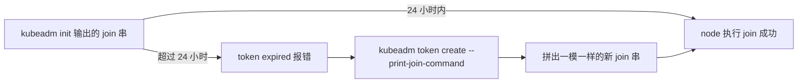
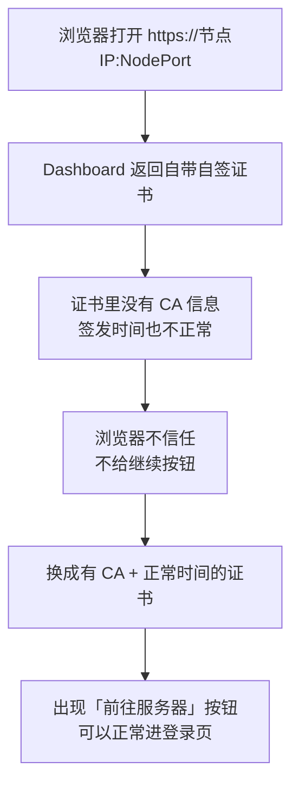
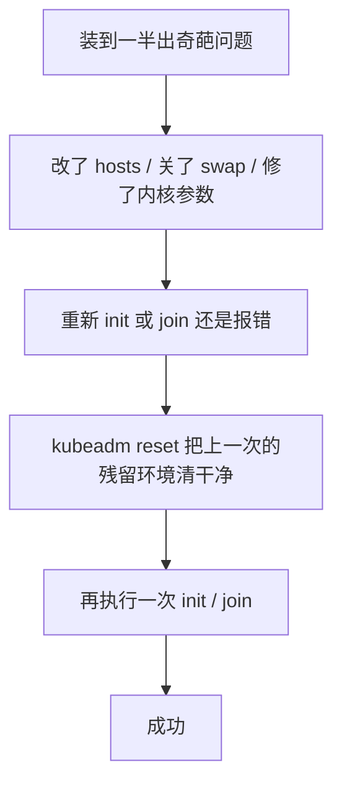

# Kubernetes 认证实战: 部署过程中3个常见问题（Token过期、证书不受信、kubeadm reset）

集群搭完，实验路上一定还会撞这三块石头。结论先给：**Token 默认 24 小时过期，过期就 `kubeadm token create --print-join-command` 重造一条；Dashboard 默认自带自签证书（无 CA、时间异常），浏览器一律不认，得把证书塞进 Secret 并重建 Pod；`kubeadm reset` 是一键清场，用它之前先想清楚集群要不要。**

## 纲要

- 问题一：join 命令里 token 过期了怎么办
- token 的三段结构拆解
- 问题二：浏览器访问 Dashboard 报证书不受信
- 证书为什么不被认（CA 缺失 + 时间异常）
- 用 kube-apiserver 现成证书替换 Dashboard 默认证书
- 改 Deployment 挂载与启动参数，重建 Pod 验证
- 问题三：`kubeadm reset` 的威力与使用场景
- 三个问题的速查对照表

## 问题一：Token 过期

`kubeadm init` 结束后输出的那条 join 串，节点就是靠它入伙的：

```bash
kubeadm join 192.168.31.61:6443 \
  --token 7f8c9d.2e4f6a1b3c5d7e9f \
  --discovery-token-ca-cert-hash sha256:ab12cd34...
```

| 片段 | 含义 |
| --- | --- |
| `192.168.31.61:6443` | master 的 apiserver 地址，默认端口 **6443** |
| `--token` | 一次性加入凭据，**默认有效期 24 小时** |
| `--discovery-token-ca-cert-hash` | CA 证书哈希，防中间人篡改 |

> **坑点**：你可能 init 完先去忙别的，隔天才想起来 join，这时候再执行就报 token 过期 —— token 超过 24 小时直接作废，必须**重新生成**。



一条命令就够，输出直接就是完整的 join 串，跟 init 时打印的那样：

```bash
kubeadm token create --print-join-command
```

```text
kubeadm join 192.168.31.61:6443 --token a1b2c3d4.5e6f7a8b9c0d1e2f \
	--discovery-token-ca-cert-hash sha256:9f8e7d6c5b4a3z2y1x0w9v8u7t6s5r4q3p2o1n0m9l8k7j6i5h4g3f2e1d0
```

> **`--print-join-command` 就等于帮你把 token + CA hash 拼成命令**，不用自己手拼，手拼必错。

## 问题二：Dashboard 证书不受信

迎新的同学用火狐还顺利，换成 Chrome / IE 就懵了 —— 页面直接给你一个「TLS 安全配置有问题 / 此站点不安全」，而且**连「继续前往」的按钮都没有**，看着像服务器没起来。



### 为什么会这样

Dashboard 镜像里**默认自带一份证书**，这份证书有两个硬伤：

| 缺陷 | 后果 |
| --- | --- |
| 里面**没有 CA 信息** | 浏览器不认这个签发者，直接判为不受信 |
| **签发时间异常**（不是合理区间） | 校验时间直接失败，连下一步的机会都不给 |

自己用 openssl 签的证书一般浏览器都认，是因为它 **CA 字段、有效期、签发机构**都齐活了。默认那一份是远远不够的。

### 解法：拿 apiserver 的现成证书顶上

集群部署时已经生成过两套 CA 签发的证书（apiserver 一套、etcd 一套），位于 `/etc/kubernetes/pki/`，**偷懒直接用现成的就行**，不用重新生成（二进制部署本来就得自己签这一套）。

```bash
# master 上确认证书在
ls -l /etc/kubernetes/pki/apiserver.crt /etc/kubernetes/pki/apiserver.key
```

Dashboard 的证书不是写在容器里的，**它是存在 K8s 里的一个 Secret（`kubernetes-dashboard-certs`）**。你去看这个 Secret，内容是空的（值长度 0）—— 因为证书**实际打进了镜像里**，Secret 只是占了个位。

```bash
kubectl get secret kubernetes-dashboard-certs -n kubernetes-dashboard \
  -o jsonpath='{.data}' ; echo
# 输出 {} 或空 —— 说明镜像自带证书
```

所以要做的事就是：**把我们自己的证书塞进这个 Secret + 改 Deployment 挂载与参数 + 重建 Pod**。

```bash
# 1. 删掉占位用的空 Secret
kubectl delete secret kubernetes-dashboard-certs -n kubernetes-dashboard

# 2. 用 apiserver 的证书重新创建（名字必须与 yaml 里 secretName 一致）
kubectl create secret generic kubernetes-dashboard-certs \
  -n kubernetes-dashboard \
  --from-file=/etc/kubernetes/pki/apiserver.crt \
  --from-file=/etc/kubernetes/pki/apiserver.key
```

`Secret` 就是专门存敏感信息（证书、密码、token）的资源对象，证书只是它支持的数据类型之一。

### 改 Deployment：挂进去 + 指定文件名

证书进了 Secret，但 **web 服务在容器里，光存着没用，必须挂载到容器目录**。`recommended.yaml` 里本来就有一段挂载配置（`kubernetes-dashboard-certs` → `/certs`），问题是：

> Secret 挂载后文件名 = 源文件名，既然我们叫的是 `apiserver.crt` / `apiserver.key`，**而 Dashboard 默认只认它自己那两个文件名**，所以必须额外告诉它实际文件名。

```bash
kubectl edit deploy kubernetes-dashboard -n kubernetes-dashboard
```

找到 `args`，在 `--auto-generate-certificates` 下面补三行：

```yaml
        args:
          - --auto-generate-certificates
          - --cert-dir=/certs
          - --tls-cert-file=apiserver.crt
          - --tls-key-file=apiserver.key
```

| 参数 | 作用 |
| --- | --- |
| `--cert-dir=/certs` | 证书目录（yaml 里 Secret 就挂在这里） |
| `--tls-cert-file=apiserver.crt` | 指定实际的证书文件 |
| `--tls-key-file=apiserver.key` | 指定实际的私钥文件 |

保存后 apply 一次，会触发一次**滚动更新**：旧容器被杀、新容器起来，新配置连同新证书一起生效。

```bash
kubectl apply -f recommended.yaml
kubectl get pods -n kubernetes-dashboard -w
```

### 验证

再开浏览器访问 `https://节点IP:NodePort`，对比一下：

| 替换前 | 替换后 |
| --- | --- |
| 只有「TLS 配置有问题」，**没有任何按钮** | 多出一个「前往服务器 / 继续前往」的跳转链接 |
| 点也没用 | 点进去就是正常登录页 |
| 证书详情里**没有 CA 名称** | 证书签发者显示为 **kubernetes**（CA 机构名） |

> 本质上就三步：**准备一份合法证书 → 塞进 Secret 替换默认的 → 重建 Pod 让它读到新证书**。用 openssl 给自己签一份域名证书效果一样，更正规的做法是买域名证书。

### 证书在集群里怎么流转

```text
master 本地磁盘                    集群内                    容器内
/etc/kubernetes/pki/        →    Secret                  →    容器 /certs/
├── apiserver.crt    ┐
├── apiserver.key    ┘
├── ca.crt / ca.key  ┐
└── etcd/            ┘（另一套 CA 签发的，也能拿来用）

kubectl create secret generic kubernetes-dashboard-certs \
    --from-file=/etc/kubernetes/pki/apiserver.crt \
    --from-file=/etc/kubernetes/pki/apiserver.key

对应的 Deployment 挂载片段（recommended.yaml 里已有）：
volumes:
  - name: kubernetes-dashboard-certs
    secret:
      secretName: kubernetes-dashboard-certs
volumeMounts:
  - name: kubernetes-dashboard-certs
    mountPath: /certs          ← 证书落在这里，故 --cert-dir=/certs
```

> 二进制部署和 kubeadm 部署这一步**没有本质区别**，唯一差别在引用证书的路径：kubeadm 有固定约定路径，二进制你自己放哪都行，只要 `kubectl` 引用对得上文件即可。

## 问题三：`kubeadm reset` 慎用

```bash
kubeadm reset
```

| 执行位置 | 后果 |
| --- | --- |
| master 执行 | 引导过程中产生的所有环境全部清空，**整个集群当场消失** |
| node 执行 | 该节点上 kubelet 起的容器、加入集群的痕迹全部清空 |

执行时会问你一句 `y/n`，回 `y` 才会真删。



**什么场景该用**：环境搞乱了、修完问题后重新 init 还是报错，这时候先 `reset` 洗场再跑，成功率明显更高。反之，**能不 reset 就别 reset** —— 它是把「当前引导产生的环境」连同集群一起抹掉的危险操作。

实操建议：想反复重来，**先给纯净系统拍快照**再折腾，比 reset 安全得多。

## 三问题速查表

| 问题 | 典型报错 | 一句解法 |
| --- | --- | --- |
| token 过期 | `token has expired` | `kubeadm token create --print-join-command` 重造 join 串 |
| 证书不受信 | 无「继续前往」按钮 / TLS 配置有问题 | 用 apiserver 证书建 `kubernetes-dashboard-certs` Secret，改 Deployment args 指定文件名，重建 Pod |
| 残留环境作祟 | 修完参数重新 init 仍失败 | `kubeadm reset`（慎用），或还原系统快照 |

## API 速览

| 目标 | 命令 |
| --- | --- |
| 重造 join 命令 | `kubeadm token create --print-join-command` |
| 看现有 token | `kubeadm token list` |
| 看 Dashboard Secret 是否为空 | `kubectl get secret kubernetes-dashboard-certs -n kubernetes-dashboard -o jsonpath='{.data}'` |
| 用文件创建证书 Secret | `kubectl create secret generic kubernetes-dashboard-certs -n kubernetes-dashboard --from-file=证书 --from-file=私钥` |
| 改 Dashboard 启动参数 | `kubectl edit deploy kubernetes-dashboard -n kubernetes-dashboard` |
| 重建 Pod 触发滚动更新 | `kubectl rollout restart deploy/kubernetes-dashboard -n kubernetes-dashboard` |
| 一键清场（慎用） | `kubeadm reset` |
| 看证书签发者 | 浏览器地址栏点锁图标 → 证书详细信息 |

## Demo 示例

```bash
#!/usr/bin/env bash
set -euo pipefail

NS=kubernetes-dashboard
CRT=/etc/kubernetes/pki/apiserver.crt
KEY=/etc/kubernetes/pki/apiserver.key

echo "==> 场景一：token 过期，重造 join 串"
kubeadm token create --print-join-command

echo "==> 场景二：替换 Dashboard 证书"
kubectl delete secret kubernetes-dashboard-certs -n "$NS" || true
kubectl create secret generic kubernetes-dashboard-certs \
  -n "$NS" --from-file="$CRT" --from-file="$KEY"

echo "==> 指定实际证书文件名（默认文件名对不上，web 服务读不到）"
# 交互方式：kubectl edit deploy kubernetes-dashboard -n "$NS"，
# 在 args 的 --auto-generate-certificates 下补三行：
#   - --cert-dir=/certs
#   - --tls-cert-file=apiserver.crt
#   - --tls-key-file=apiserver.key

echo "==> 重建 Pod，让新证书生效"
kubectl rollout restart deploy/kubernetes-dashboard -n "$NS"
kubectl rollout status deploy/kubernetes-dashboard -n "$NS"

echo "==> 场景三：环境乱了要洗场（明确需要时才跑）"
# kubeadm reset
```

更干净的做法是直接改 yaml 再 apply，不进编辑器：

```bash
curl -o recommended.yaml https://raw.githubusercontent.com/kubernetes/dashboard/v2.0.0-rc6/aio/deploy/recommended.yaml
grep -n -A6 'args:' recommended.yaml
# 在 args 里补上 --cert-dir=/certs / --tls-cert-file=apiserver.crt / --tls-key-file=apiserver.key
kubectl apply -f recommended.yaml
kubectl get pod -n kubernetes-dashboard -w
```

**验收**：浏览器打开 `https://192.168.31.62:<NodePort>`，能出现「前往服务器」链接，点进去输入 token 能进 Dashboard，证书详情里签发者能看到 `kubernetes` 字样。

### 总结

- **token 24 小时过期**，过期别手拼，用 `kubeadm token create --print-join-command` 直接输出完整 join 串；join 串 = apiserver 地址:6443 + token + CA hash。
- **Dashboard 默认自带证书没 CA 信息、时间还不对**，Chrome/IE 下连「继续前往」按钮都没有；换成 kube-apiserver 现成的 `apiserver.crt/key`（或自己 openssl 签的）即可。
- 替换三步走：**删空 Secret → 用 `--from-file` 重建 `kubernetes-dashboard-certs` → 改 Deployment 在 `/certs` 挂载并指定 `--tls-cert-file` / `--tls-key-file` 实际文件名 → 重建 Pod**。
- 文件名不一致是这里最容易卡的一关：Secret 挂载后文件名就是源文件名，而 Dashboard 默认只认自己的那两个名字。
- **`kubeadm reset` 是把当前引导环境和整个集群一起清掉的危险操作**，只在「修完问题重新 init 仍失败」时用，平时优先用系统快照回滚。

