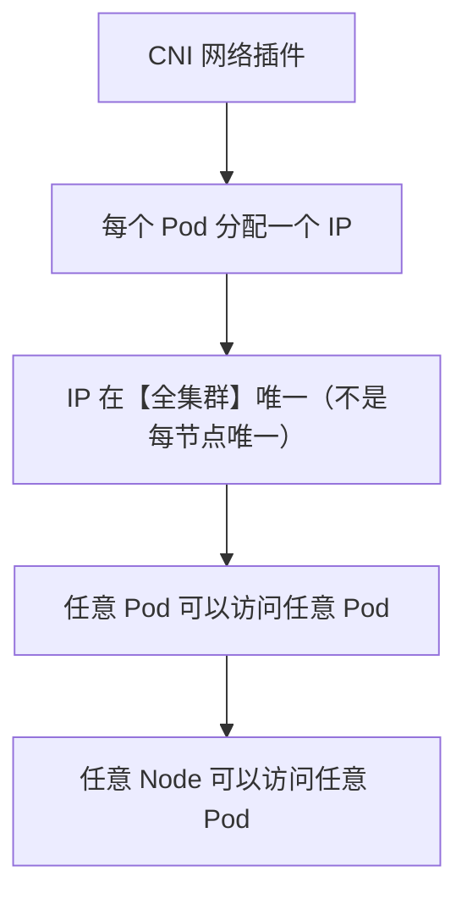
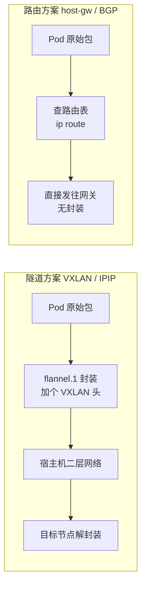
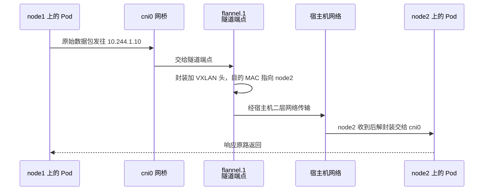

# Kubernetes 认证实战: CNI网络方案选型（Flannel 路由/隧道模式与 VXLAN 原理）

上节直接丢了一个 yaml 就把 flannel 装上了。这一节把它讲透。结论先给：**CNI 解决的是「跨主机 Pod 通信」；所有网络插件只有两种实现路线 —— 路由方案（性能好、要求二层可达）与隧道方案（只要三层可达、有封装开销）；flannel 支持 vxlan / host-gw / udp 三种，udp 已弃用；Calico 用 BGP（路由）+ IPIP（隧道）。另外 CKA 会考 **NetworkPolicy**，它就是 Pod 的 ACL / 安全组。**

## 纲要

- CNI 是什么，它必须满足哪三个约束
- 路由方案 vs 隧道方案（怎么选）
- flannel 三种工作模式
- 怎么从 yaml 里看出当前用的是哪个模式
- VXLAN 隧道模式的工作过程（cni0 + flannel.1 + 路由表）
- host-gw 的路由表长什么样
- Calico：BGP（路由）与 IPIP（隧道）
- CKA 考点延伸：NetworkPolicy（Pod 的 ACL）

## CNI 是什么

**CNI = Container Network Interface（容器网络接口）**，是 Kubernetes 提出的一套标准接口。flannel、calico、weave 这些插件都必须按这个接口接入，并满足同样的硬性约束：



| 约束 | 说明 |
| --- | --- |
| Pod 拿到唯一 IP | 这个 IP 在整个集群唯一，是**跨主机通信的前提** |
| Pod ↔ Pod 互通 | 不管 Pod 在 node1 还是 node2，都能互相访问 |
| Node ↔ Pod 互通 | 每个节点都能访问集群里任意 Pod |

> **CNI 真正解决的是「跨主机网络通信」**。同一台机器上的两个 Pod，用 loopback 或网桥就通了，根本不需要 CNI；但 node1 上的 Pod 要访问 node2 上的 Pod，没插件就是不通。

## 路由方案 vs 隧道方案

选网络插件，本质上就两步：**先定用 flannel 还是 calico，再定用哪种模式**。模式的本质区别就是数据怎么走：

- **隧道方案**：原始数据包**再封装一层**，走宿主机的网络出去，到目的节点再解封装。
- **路由方案**：**直接按路由表转发**，数据包不额外封装，给它一条路由丢过去就完事。



| 维度 | 隧道方案（VXLAN / IPIP） | 路由方案（host-gw / BGP） |
| --- | --- | --- |
| 前提条件 | **只要三层可达**（两个 node 之间能通） | 要求 node 之间**二层可达**，且能**写路由表** |
| 性能 | 有封装/解封装开销，稍差 | **最好**，直接路由转发，零封装 |
| 公有云 | 基本都可用 | **很多云主机不允许你写路由表**（写了可能影响现有网络），跑不起来 |
| 默认选择 | flannel **默认就是 vxlan** | 网络条件允许时**优先选路由方案** |

> **一句话选型**：自建机房、二层通、能改路由表 → 路由方案；公有云 / 网络受限 → 隧道方案。

## flannel 的三种模式

| 模式 | 类型 | 现状 |
| --- | --- | --- |
| **vxlan** | 隧道 | flannel 默认且主流；公有云 VPC 对接也用它 |
| **host-gw** | 路由 | 性能好，要求各 node 二层直连、能加路由表 |
| **udp** | 隧道 | 最早支持，用**用户态**自己做封装解封装，**性能极差，已弃用** |

flannel 不只能对接自建网络，**也能对接公有云的 VPC**（AWS VPC、阿里云 VPC 等），只是在那上面要额外研究怎么跟厂商的 VPC 对接，底层还是这两种模式。

### 怎么看出当前用的是哪个模式

fnannel 的配置就写在 ConfigMap 里，从 yaml 里能直接看到：

```bash
kubectl get cm kube-flannel-cfg -n kube-system -o yaml
```

关键部分（`NetConf` 字段是一段 JSON）：

```yaml
kind: ConfigMap
data:
  net-conf.json: |
    {
      "Network": "10.244.0.0/16",
      "Backend": {
        "Type": "vxlan"
      }
    }
```

`"Type": "vxlan"` 就说明当前跑的是隧道模式。

## VXLAN 隧道模式怎么工作



具体在机器上会看到三样东西：

```text
每个节点上（vxlan 模式）
├── cni0          ← Linux 网桥，所有本节点的 Pod 都挂在它上面
├── flannel.1    ← VXLAN 隧道端点（VETH 设备），负责封装/解封装
├── flannel.0    ← 早期的 udp 模式端点，现在基本不用
└── 本机路由表 / 转发规则
```

**路由表的作用**：匹配到目的 IP 的数据包丢进 `flannel.1` 这个设备里去封装：

```bash
# 看本机设备
ip link show | grep -E 'cni0|flannel'
# 3: flannel.1: <BROADCAST,MULTICAST,UP,LOWER_UP> ...

# 看路由，目的 Pod 网段都指向 flannel.1
ip route
# 10.244.1.0/24 dev cni0
# 10.244.2.0/24 dev flannel.1

# 看 VXLAN 转发表（FDB），决定封装成谁的目的 MAC
bridge fdb show dev flannel.1
# 00:00:00:00:00:00 dst 192.168.31.63 via eth0
```

## host-gw 路由模式长什么样

换成 host-gw 之后，节点上多的是**一条直连的路由**，没有任何隧道设备：

```bash
ip route
# 10.244.1.0/24 dev cni0 proto kernel
# 10.244.2.0/24 via 192.168.31.63 dev eth0     ← 直接指到对端节点 IP
```

这就是路由方案「零封装」的体现 —— 目的 IP 段直接 `via` 对端宿主机，包原样就发出去了，所以它性能最好，代价是**必须能写这条路由**，云主机往往会拦你。

## Calico：两种都支持

| Calico 模式 | 类型 | 说明 |
| --- | --- | --- |
| **BGP** | 路由方案 | 用 BGP 在节点间广播路由，性能最好，同样要求能改路由表 |
| **IPIP** | 隧道方案 | 经典 IP-in-IP 封装，三层可达就行 |

Calico 自带 BGP 路由分发，是生产上更「正统」的选择；而 flannel 胜在简单，一条 yaml 就完事。**没有标准答案，看你的网络现状。**

## CKA 考点：NetworkPolicy（Pod 的 ACL）

这是本节最该记住的知识点。CNI 网络有个特点：**默认是扁平化的** —— 所有节点、所有 Pod 默认都能互通，一个 Pod 能访问全集群任何地方。

想在多租户场景下**细粒度地限制 Pod 的出/入流量**，就得引入 **NetworkPolicy**（Pod 的 ACL，性质等同公有云的安全组）：

```text
默认扁平网络（谁都能访问谁）
├── Pod A  →  Pod B     ✅
├── Pod A  →  ClusterIP Service  ✅
└── Pod A  →  外网       ✅

加了 NetworkPolicy 之后（按规则收紧）
├── Pod A  →  Pod B     ❌ 不在 selector 里，直接拒
└── Pod A  →  Pod C     ✅ 命中 policy
```

> 注意：**NetworkPolicy 必须 CNI 插件支持才生效**。flannel 原生不支持，要配 `calico` 或 `cilium` 这类支持 NetworkPolicy 的插件；这也是生产上选 Calico 的重要理由之一。

## API 速览

| 目标 | 命令 |
| --- | --- |
| 看当前 CNI 工作模式 | `kubectl get cm kube-flannel-cfg -n kube-system -o yaml` |
| 看 flannel 是否运行 | `kubectl get pods -n kube-system -l app=flannel` |
| 看节点上的网桥与隧道设备 | `ip link show` |
| 看 Pod 网段路由 | `ip route` |
| 看 VXLAN 转发表 | `bridge fdb show dev flannel.1` |
| 看本节点 Pod 网段 | `kubectl get nodes -o wide` / `ip route` |
| 看 kube-proxy 用的转发模式 | `kubectl logs -n kube-system -l k8s-app=kube-proxy \| grep proxy-mode` |
| 建 NetworkPolicy | `kubectl apply -f networkpolicy.yaml` |

## Demo 示例

```bash
#!/usr/bin/env bash
set -euo pipefail

echo "==> 1. 当前集群用的是哪个 CNI"
kubectl get pods -A | grep -E 'flannel|calico|cilium'

echo "==> 2. flannel 的工作模式（Type 字段）"
kubectl get cm kube-flannel-cfg -n kube-system \
  -o jsonpath='{.data.net-conf.json}'; echo

echo "==> 3. 节点上的网络设备"
ip -d link show flannel.1 | head -5
ip link show cni0 | head -3

echo "==> 4. 路由表：注意目的 Pod 网段的出口"
ip route | grep 10.244

echo "==> 5. VXLAN 转发表：决定封装成哪个目的 MAC"
bridge fdb show dev flannel.1

echo "==> 6. 实测跨节点 Pod 连通性（确认 CNI 真的在干活）"
kubectl run net-test --image=busybox:1.32 --restart=Never -- sleep 3600
kubectl exec net-test -- ip addr
POD_IP=$(kubectl get pod net-test -o jsonpath='{.status.podIP}')
kubectl exec net-test -- ping -c 2 "$POD_IP"
kubectl delete pod net-test --force --grace-period=0
```

**NetworkPolicy 的最小示例**（支持它的 CNI 才生效）：

```yaml
apiVersion: networking.k8s.io/v1
kind: NetworkPolicy
metadata:
  name: allow-app-to-db
  namespace: default
spec:
  podSelector:
    matchLabels:
      app: db
  policyTypes:
    - Ingress
  ingress:
    - from:
        - podSelector:
            matchLabels:
              app: web
      ports:
        - protocol: TCP
          port: 3306
```

这条策略的意思是：**只有带 `app=web` 的 Pod 能 `3306` 进 `app=db`，其余全部拒绝**（默认拒绝 + 显式放行，正好和扁平默认反过来）。

### 总结

- **CNI = 容器网络接口**，解决的是**跨主机 Pod 通信**；它保证 Pod IP 全集群唯一、Pod↔Pod 互通、Node↔Pod 互通。
- **两种实现路线**：路由方案（不封装、性能最好，但要二层可达 + 能写路由表）vs 隧道方案（封装一层、只要三层可达，公有云首选）。
- **flannel 三种模式**：`vxlan`（隧道，默认）、`host-gw`（路由，性能最好）、`udp`（用户态封装，**已弃用别用**）。
- 工作模式写在 `kube-flannel-cfg` 这个 ConfigMap 的 `net-conf.json` 里，改完 `kubectl rollout restart` flannel 的 Pod 才生效。
- VXLAN 模式下每节点有 **cni0 网桥 + flannel.1 隧道端点 + 一条指向 flannel.1 的路由**；host-gw 模式下只有一条 `via 对端节点IP` 的路由。
- **CKA 会考的在这儿**：CNI 默认扁平互通，多租户要限制流量就得上 **NetworkPolicy**（Pod 的 ACL / 安全组），而且它必须靠支持该特性的 CNI（Calico / Cilium）才生效。

