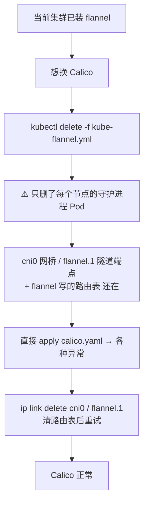
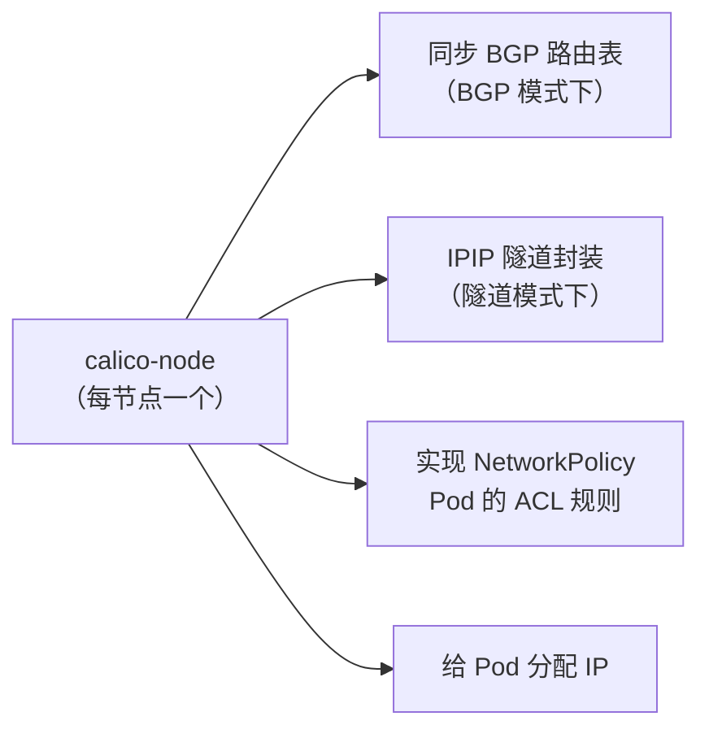
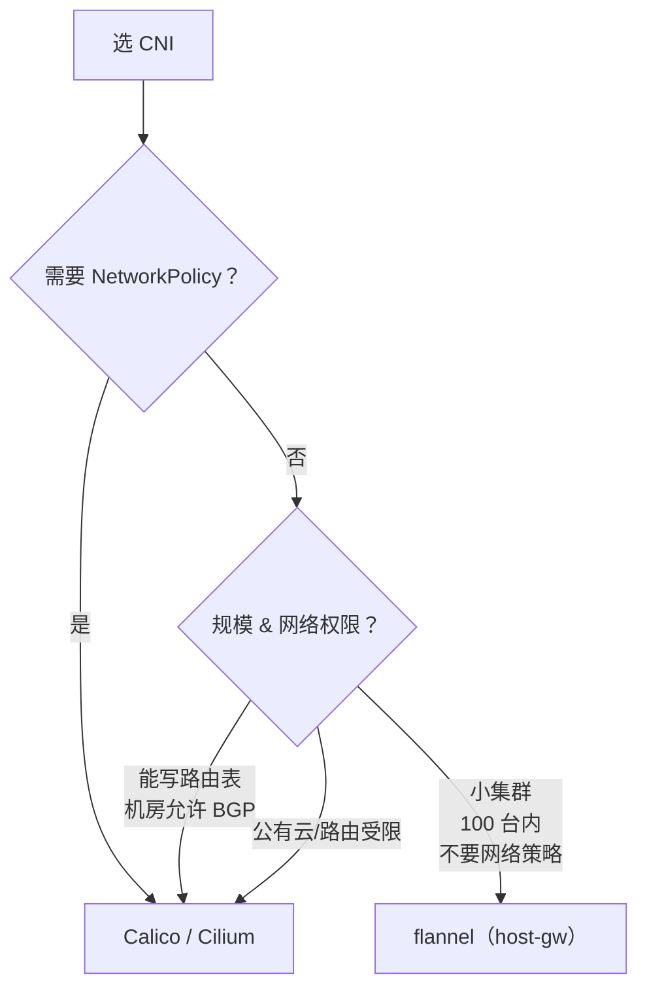

# Kubernetes 认证实战: 网络方案之Calico（从flannel切换、Pod网段与IPIP模式）

上节装的 flannel 能不能换？能，但要小心。结论先给：**一个集群只跑一个 CNI，换 Calico 前必须先把 flannel 删干净（`delete -f` 只删 Pod，cni0 网桥、flannel.1 隧道端点、路由表都是残留，必须 `ip link delete` 手动清）；部署时只改两处 —— Pod 网段 Pod 网段必须和集群初始化时对齐、IPIP 开关决定隧道还是路由；切完旧 Pod 的 IP 还是 flannel 给的，要重建。**

## 纲要

- 一个集群只能有一个 CNI
- 删 flannel 只删了一半：残留设备与路由
- 切换时网络通不通？看你是 vxlan 还是路由模式
- 部署 Calico：两步修改 Pod 网段与 IPIP
- 每节点跑的 calico-node 守护进程干什么
- 切换常见坑：CNI 没清干净、控制器没就绪、旧 Pod 网段没换
- 选型对照表：规模 / 网络策略 / 路由权限 / 维护成本

## 一个集群只能有一个 CNI



## 第一步：卸载 flannel

```bash
kubectl delete -f kube-flannel.yml
kubectl get pods -n kube-system | grep flannel
```

**但这只删掉了每个节点上跑的那几个 Pod（守护进程）。** 它在机器上留下的三样东西全在：

| 残留 | 命令查看 | 必须清掉 |
| --- | --- | --- |
| `cni0` 网桥 | `ip link show cni0` | ✅ |
| `flannel.1` 隧道端点 | `ip link show flannel.1` | ✅ |
| flannel 写的路由表 | `ip route` | ✅ |

```bash
ip link delete cni0
ip link delete flannel.1
ip route                 # 确认没有 10.244.x.x dev flannel.1 这类条目
```

> 删完 `ip link` 如果提示「设备忙 / 有进程占用」，说明还有容器在用它，先 `kubectl delete pod --all` 把业务 Pod 清一轮再删。

### 一个反直觉的现象

删掉 flannel 进程之后：

- **vxlan（隧道）模式：网络彻底不通** —— 封装全靠守护进程，进程没了就没人干活了。
- **host-gw（路由）模式：还能通** —— 它只靠路由表转发，守护进程在不在无所谓。

这就是为什么切换前的清理要认真做，别以为删了 Pod 就完事。

## 第二步：部署 Calico

仍是老套路 —— **一个 yaml 搞定**：

```bash
curl -O https://docs.projectcalico.org/manifests/calico.yaml
kubectl apply -f calico.yaml
```

但这个文件里**有两个地方必须（或建议）改**：

### 必改一：Pod 网段

`calico.yaml` 里 Pod 网段的默认值是 `192.168.x.x`，必须改成**你集群初始化时指定的 Pod 网段**，否则路由对不上：

```bash
grep -n '192.168' calico.yaml
```

```yaml
            - name: CALICO_IPV4POOL_CIDR
              value: "10.244.0.0/16"
```

> **这个网段必须和 `kubeadm init --pod-network-cidr` 时指定的一致**（我们这里是 `10.244.0.0/16`）。K8s 自己有记录，网络组件对不上就只能看日志猜，排查半天没结果。

### 必改二（可选）：工作模式

Calico 同样支持路由和隧道两种：

```yaml
            - name: CALICO_IPV4POOL_IPIP
              value: "Always"
```

| `CALICO_IPV4POOL_IPIP` | 模式 | 适用场景 |
| --- | --- | --- |
| `Always`（默认） | **IPIP 隧道方案** | 只要三层可达就行，公有云 / IDC / 虚拟机通吃，**保持默认** |
| `Never` | **BGP 路由方案** | 性能最好，但要求节点能写路由表、机房没禁用 BGP |

> 默认给 `Always` 是有道理的：**隧道方案对现有网络依赖几乎为零**，而路由方案可能被云厂商或机房卡死。**没特殊情况就别改，保持默认。**

改完保存，再 apply：

```bash
kubectl apply -f calico.yaml
```

## 第三步：看 calico-node 在干什么

Calico 会在**每个节点**跑一个 calico-node 守护进程（类似 flannel 的 DaemonSet）：

```bash
kubectl get pods -n kube-system -l k8s-app=calico-node -o wide
```



它除了转发，还多干了一件 flannel 干不了的事 —— **实现 Pod 的 ACL（NetworkPolicy）规则**。这正是上一节说的：flannel 原生不支持 NetworkPolicy，要网络策略就得上 Calico（或 Cilium）。

等一两分钟让镜像拉完，再确认：

```bash
watch kubectl get pods -n kube-system
# 三个节点全部 Running 才算正常

kubectl describe pod -n kube-system -l k8s-app=calico-node | tail -20
```

## 切换时的四个坑

```text
切换前 / 切换中的清理清单
├── kubectl delete -f kube-flannel.yml        删 DaemonSet + Pod
├── ip link delete cni0                       删网桥（可能第一次没删掉）
├── ip link delete flannel.1                  删隧道端点
├── ip route | grep 10.244                    确认旧路由表清干净
└── 三台机器都要做！master 那台最容易漏
```

| 现象 | 原因 | 处理 |
| --- | --- | --- |
| calico-node 一直 ContainerCreating / 不就绪 | **flannel 环境没清干净**，cni0 又冒出来了 | 再 `ip link delete cni0`，把节点上残留设备全删 |
| calico-kube-controllers 异常 | 它和节点调度撞一起，网络组件没就绪就抢跑 | 删掉让它重建：`kubectl delete pod -n kube-system -l k8s-app=calico-kube-controllers` |
| Pod 网段还是 `10.244.1.x` 但 ping 不通 | **旧 Pod 的 IP 仍是 flannel 分配的**，Calico 没接管 | 把旧 Pod 删了重建，让它重新拿 IP |
| 节点之间 Ping 不通 | 只在一台机器上清了设备 | **每台机器都要清** |

> 切换网络在既有集群上是**成本高、风险大**的活儿：所有现有 Pod 的 IP 都要变，业务断连是必然的。前期规划选对 CNI，比事后切换省心太多。

## 切完之后验证

```bash
# 1. 新 Pod 应该拿到 Calico 分配的 IP（同网段）
kubectl get pods -A -o wide

# 2. 在每个节点上 ping 任意 Pod IP，能通就说明网络 OK
kubectl get pods -A -o wide | awk '{print $6}' | grep -E '^[0-9]' | sort -u | while read IP; do
  ping -c 1 -W 1 "$IP" >/dev/null && echo "$IP OK" || echo "$IP FAIL"
done

# 3. 看 Calico 自己建的隧道网卡（与 flannel.1 性质相同）
ip link show tunl0
ip route | grep 10.244
```

## CNI 怎么选



| 考量维度 | 结论 |
| --- | --- |
| **集群规模** | 一百台以内的开发测试集群，flannel 完全够用 |
| **是否需要网络策略** | **flannel 不支持 NetworkPolicy，要它就必须 Calico / Cilium** |
| **现有网络限制** | 不能写路由表、机房禁用了 BGP → 只能用隧道方案（IPIP / VXLAN） |
| **维护成本** | flannel 简单、成本低；Calico 复杂、维护成本高 |

> 一句话：**小集群图省事选 flannel；要安全组/网络策略、或网络条件受限，就上 Calico。**

## API 速览

| 目标 | 命令 |
| --- | --- |
| 卸掉 flannel | `kubectl delete -f kube-flannel.yml` |
| 删残留网桥与隧道端点 | `ip link delete cni0` / `ip link delete flannel.1` |
| 部署 Calico | `kubectl apply -f calico.yaml` |
| 看 Calico 是否每节点都起 | `kubectl get pods -n kube-system -l k8s-app=calico-node -o wide` |
| 看 Pod 网段配置 | `grep -n 'CALICO_IPV4POOL_CIDR' calico.yaml` |
| 看 IPIP 模式 | `grep -n 'CALICO_IPV4POOL_IPIP' calico.yaml` |
| 看 Calico 隧道设备 | `ip link show tunl0` |
| 重建控制器 | `kubectl delete pod -n kube-system -l k8s-app=calico-kube-controllers` |
| 看节点 Available 的 Pod CIDR | `kubectl get node k8s-node1 -o jsonpath='{.spec.podCIDR}'` |

## Demo 示例

```bash
#!/usr/bin/env bash
set -euo pipefail

echo "==> 0. 先看集群初始化时定的 Pod 网段（决定 CALICO_IPV4POOL_CIDR）"
kubectl get node k8s-master -o jsonpath='{.spec.podCIDR}'; echo

echo "==> 1. 卸 flannel（三台机器都要做）"
kubectl delete -f kube-flannel.yml

for H in k8s-master k8s-node1 k8s-node2; do
  ssh root@"$H" 'ip link delete cni0; ip link delete flannel.1; ip route | grep 10.244' || true
done

echo "==> 2. 装 Calico"
curl -O https://docs.projectcalico.org/manifests/calico.yaml
# 改两处：CALICO_IPV4POOL_CIDR → 10.244.0.0/16
#         CALICO_IPV4POOL_IPIP  → Always（默认，可不改）
grep -n -A2 'CALICO_IPV4POOL_CIDR\|CALICO_IPV4POOL_IPIP' calico.yaml
kubectl apply -f calico.yaml

echo "==> 3. 等三个节点的 calico-node 起来（约 1~2 分钟）"
kubectl rollout status ds/calico-node -n kube-system --timeout=180s

echo "==> 4. 重建旧 Pod，让 Calico 重新分配 IP"
kubectl delete pod -A --all --force --grace-period=0

echo "==> 5. 每个节点 ping 所有 Pod IP 验证"
# 下面命令中的变量按你的集群环境赋值后再执行
kubectl get pods -A -o wide | awk 'NR>1&&$7!="$NONE"{print $7}' | sort -u | while read IP; do
  ping -c 1 -W 1 "$IP" >/dev/null 2>&1 && echo "$IP OK" || echo "$IP FAIL"
done

echo "==> 6. 看 Calico 隧道设备与路由"
ip link show tunl0
ip route | grep 10.244
```

> 第 4 步 `--all --force` 是把所有 Pod 重建一遍，既有集群上**别在生产环境这么干**；这里是为了演示切换后的 IP 重分配。

### 总结

- **一个集群只跑一个 CNI**，flannel 和 Calico 不能共存；切换前必须把 flannel 卸干净。
- **`kubectl delete -f` 只删 Pod**，`cni0` 网桥、`flannel.1` 隧道端点、它写的路由表全是残留 —— 每台机器都要 `ip link delete` 清一遍，这是切换失败的头号原因。
- 顺带一个反直觉点：**vxlan 删完进程网络就不通了，host-gw 只靠路由表，删了进程还通**。
- **Calico 只改两处**：`CALICO_IPV4POOL_CIDR` 必须和集群初始化的 Pod 网段一致（默认 192.168 段要改）；`CALICO_IPV4POOL_IPIP=Always` 默认走隧道，改 `Never` 才是 BGP 路由。
- **calico-node 每节点一个**，负责同步路由/BGP、隧道封装，以及 **flannel 没有的 NetworkPolicy（Pod ACL）**。
- 切完老 Pod 的 IP 还是 flannel 给的，**必须重建 Pod** 才会被 Calico 接管；生产上切换网络成本高、风险大，前期选型比事后切换重要得多。
- 选型：小集群求稳选 flannel；要网络策略或网络受限（不能写路由表/禁 BGP）就上 Calico。

