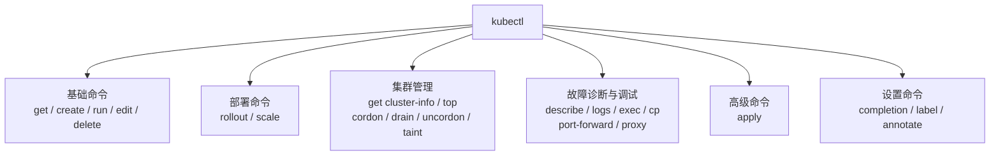

# Kubernetes 认证实战: kubectl 命令行工具（命令分类、自动补全与通用选项）

集群搭完，接下来所有操作都靠 `kubectl`。结论先给：**kubectl 的命令按功能分成六大类（基础 / 部署 / 集群管理 / 故障调试 / 高级 / 设置），常用的其实就十来个子命令；真正拉开效率差距的是两件事 —— 配好自动补全，以及吃透那几个通用选项（`-f`、`--dry-run`、`-o`、`-A`、`-l`、`--sort-by`）。**

## 纲要

- kubectl 的六大命令分类
- 最该记住的子命令
- 装 `bash-completion` 并开启自动补全（三步）
- `kubectl api-resources`：K8s 里到底有哪些资源
- 资源缩写速查表（考试高频）
- 通用选项：任何命令都能用的那几个
- `--help` 该看哪一段（Examples + Flags）

## 六大命令分类



| 分类 | 代表命令 | 说明 |
| --- | --- | --- |
| 基础命令 | `get` `create` `run` `edit` `delete` | 日常用得最多，创建/查看/编辑/删除资源 |
| 部署命令 | `rollout` `scale` | 发布、查看发布状态/历史、回滚；扩缩容 Pod 数量 |
| 集群管理 | `cluster-info` `top` `cordon` `drain` `uncordon` `taint` | 看集群信息、看资源利用率、节点调度与隔离 |
| 故障诊断 | `describe` `logs` `exec` `cp` `port-forward` `proxy` | 查看资源详情、看日志、进容器、拷文件、端口转发 |
| 高级命令 | `apply` | 部署和更新资源，日常基本只用这一个 |
| 设置命令 | `completion` `label` `annotate` | 自动补全、打标签、打注解 |

> 上面这些里**至少 80% 后面的章节都会用到**，先混个脸熟，具体场景再细讲。

## 最该先记住的几条

```bash
kubectl get pods                       # 看 Pod
kubectl get pods -A                    # 所有命名空间
kubectl describe pod "$POD"            # 看详情（Events 在这）
kubectl logs -f "$POD"                 # 跟日志
kubectl exec -it "$POD" -- sh           # 进容器（新版本推荐 exec）
kubectl create -f demo.yaml            # 建资源
kubectl apply -f demo.yaml             # 建/更新资源，日常主力
kubectl delete -f demo.yaml            # 删资源
kubectl edit deploy/"$DEPLOY"          # 在线改资源
kubectl scale deploy/"$DEPLOY" --replicas=3
kubectl run demo --image=nginx --port=80
kubectl expose deploy/"$DEPLOY" --type=NodePort --port=80
kubectl cp "$POD":/etc/hosts /tmp/hosts  # 容器与宿主机互拷
```

> 进容器那条要注意：老写法 `kubectl attach` 已废弃，**新版本推荐 `kubectl exec -it <pod> -- sh`**，跟 `docker exec -it` 一模一样。

## 开启自动补全

这是**性价比最高的一件事**，敲错一个字母就白丢时间。


三步（CentOS 7 默认没装这个包，必须装）：

```bash
# ① 装依赖包
yum install -y bash-completion

# ② 加载系统级补全手册
source /usr/share/bash-completion/bash_completion

# ③ 加载 kubectl 自己的补全（支持 bash / zsh）
source <(kubectl completion bash)
```

> 想一劳永逸就写进配置文件，以后每个新窗口都生效：

```bash
kubectl completion bash > /etc/bash_completion.d/kubectl
echo 'source /etc/bash_completion.d/kubectl' >> ~/.bashrc
```

配完的效果：

- 按 Tab 直接补全资源名（比如 `kubectl get po<Tab>` 会列出当前 default 命名空间里的所有 Pod）；
- 输入 `-` 或 `--` 会**把后面所有可选项列出来**；
- 输一个字母（比如 `de` / `dp`）就自动补全成 `deploy` / `po`。

自动补全只补命令和资源名，**补不了参数值**（比如镜像名、端口号），但参数名能补，这对新手帮助最大。

## K8s 里到底有哪些资源

```bash
kubectl api-resources
```

输出里两列最关键：**完整资源名** 和 **短格式（缩写）**。

```text
NAME                   SHORTNAMES   APIVERSION   NAMESPACED   KIND
nodes                  no           v1           false        Node
namespaces             ns           v1           false        Namespace
pods                   po           v1           true         Pod
deployments            deploy       apps/v1      true         Deployment
services               svc          v1           true         Service
configmaps             cm           v1           true         ConfigMap
secrets                -            v1           true         Secret
serviceaccounts        sa           v1           true         ServiceAccount
events                 ev           v1           true         Event
persistentvolumes      pv           v1           false        PersistentVolume
persistentvolumeclaims pvc          v1           true         PersistentVolumeClaim
componentstatuses      cs           v1           false        ComponentStatus
...（总共六十多个，常用的就十来个）
```

> **资源 = K8s 从 API 层面提供、用来实现某个功能的对象**。你部署一个应用，背后就是创建若干资源、各自负责一件事。

### 缩写速查（考试高频）

| 短格式 | 完整名 | 短格式 | 完整名 |
| --- | --- | --- | --- |
| `po` | pods | `svc` | services |
| `no` | nodes | `cm` | configmaps |
| `ns` | namespaces | `sa` | serviceaccounts |
| `deploy` | deployments | `pv` / `pvc` | persistentvolumes / claims |
| `cs` | componentstatuses | `ev` | events |

> 看集群组件状态就 `kubectl get cs`，和写全 `componentstatuses` 是一回事。

## 通用选项：几乎任何命令都能用

这几个是**跨命令通用**的，吃透它们等于吃透一半语法：

| 选项 | 作用 | 例子 |
| --- | --- | --- |
| `-f` | 指定资源文件 | `kubectl create -f demo.yaml` |
| `--dry-run` | **只试跑不执行**，用来校验语法 | `kubectl run demo --image=nginx --dry-run=client` |
| `-o` | 指定输出格式 `wide/json/yaml/name` | `kubectl get pod -o wide`、`-o json` |
| `-A` | 所有命名空间（等价于 `--all-namespaces`） | `kubectl get pods -A` |
| `-n` | 指定命名空间 | `kubectl get pods -n kube-system` |
| `-l` | 标签选择器 | `kubectl get pods -l app=nginx` |
| `--show-labels` | 显示资源自带的标签 | `kubectl get pods --show-labels` |
| `--sort-by` | 按字段排序 | `kubectl get pods --sort-by=metadata.name` |
| `--help` | 看这条命令的用法与示例 | `kubectl run --help` |

> **`--dry-run` 是 CKA 高频考点**：考试时不让你真建资源，得加 `--dry-run=client`，再配 `-o yaml` 把模板导出来改。
>
> 注意 `--dry-run` 和 `-o` **要连着用**才有意义：`kubectl run demo --image=nginx --dry-run=client -o yaml` 会把 yaml 打到标准输出，不落库。

## 怎么看 `--help`

```bash
kubectl run --help
```

输出结构固定，重点看两段：

```text
Examples:                      ← ★ 重点：给你这条命令怎么写的活例子
   kubectl run my-nginx --image=nginx
   kubectl run my-nginx --image=nginx --port=80
  ...

Flags:                          ← 参数列表，带 - 的都能 Tab 补全
   --image string    ...
   --port int        ...
   --dry-run string  ...
```

| 输出段 | 怎么看 |
| --- | --- |
| **Examples** | `run` 只有一个示例说明它用法单一；示例多的说明有多种写法，重点抄 |
| **Flags** | 每个命令独有的参数；以 `-` 开头的都支持自动补全 |
| 最上面一行 | 通常指向官方文档对应页，讲官方文档时那页就是这里 |

**不信命令后半截怎么写？先看 help，再看补全。** 熟练了以后直接敲 `-` 让 Tab 给你列。

## 目录：常用命令都在这张图里

```text
kubectl 命令速查
├── 基础
│   ├── get        查看
│   ├── create     新建
│   ├── run        快速跑一个 Pod
│   ├── edit       在线编辑
│   └── delete     删除
├── 部署
│   ├── rollout    status / history / undo
│   └── scale      扩缩容副本数
├── 集群管理
│   ├── cluster-info  集群信息
│   ├── top           （依赖 Metrics Server）
│   ├── cordon / uncordon / drain
│   └── taint
├── 故障调试
│   ├── describe  详情与 Events
│   ├── logs      日志
│   ├── exec      进容器
│   ├── cp        文件互拷
│   └── port-forward
├── 高级
│   └── apply     部署/更新（主力）
└── 设置
    ├── completion  自动补全
    ├── label       打标签
    └── annotate    打注解
```

## API 速览

| 目标 | 命令 |
| --- | --- |
| 看所有资源类型 | `kubectl api-resources` |
| 看客户端/服务端版本 | `kubectl version` |
| 看集群组件状态 | `kubectl get cs` |
| 看集群信息 | `kubectl cluster-info` |
| 装自动补全 | `yum install -y bash-completion && source <(kubectl completion bash)` |
| 常驻自动补全 | `kubectl completion bash > /etc/bash_completion.d/kubectl` |
| 只看不建（试跑） | `kubectl run demo --image=nginx --dry-run=client` |
| 导出 yaml 模板 | `kubectl run demo --image=nginx --dry-run=client -o yaml` |
| 按标签过滤 | `kubectl get pods -l app=nginx --show-labels` |
| 按名称排序 | `kubectl get pods --sort-by=metadata.name` |
| 看某条命令用法 | `kubectl <子命令> --help` |

## Demo 示例

```bash
#!/usr/bin/env bash
set -euo pipefail

echo "==> 1. 配好自动补全（每台用 kubectl 的机器都该配）"
yum install -y bash-completion
source /usr/share/bash-completion/bash_completion
kubectl completion bash > /etc/bash_completion.d/kubectl
echo 'source /etc/bash_completion.d/kubectl' >> ~/.bashrc
# 立刻生效（不用重开窗口）：
source <(kubectl completion bash)

echo "==> 2. 认识资源与缩写"
kubectl api-resources | head -15
kubectl get cs                      # 组件状态

echo "==> 3. 通用选项实战"
kubectl run demo --image=nginx:1.26 --port=80 --dry-run=client -o yaml > /tmp/demo.yaml
grep -E 'kind:|image:|name:' /tmp/demo.yaml

echo "==> 4. 标签与排序"
kubectl apply -f /tmp/demo.yaml
kubectl get pods --show-labels
kubectl get pods -l app=nginx
kubectl get pods --sort-by=metadata.name

echo "==> 5. 所有命名空间 + 宽格式"
kubectl get pods -A -o wide

echo "==> 6. 看 help，抄示例"
kubectl run --help | sed -n '/Examples/,/^$/p'
```

> 第 3 步生成的 `/tmp/demo.yaml` 就是标准模板 —— **CKA 里「写不出来资源yaml」的解法就是这个**：先 `--dry-run=client -o yaml` 生成，再改字段。

### 总结

- kubectl 按功能分**六类**：基础、部署（rollout/scale）、集群管理（cluster-info/top/cordon/drain/taint）、故障调试（describe/logs/exec/cp）、高级（apply）、设置（completion/label/annotate）；常用子命令十来个就够。
- **自动补全三步**：装 `bash-completion` → `source /usr/share/bash-completion/bash_completion` → `source <(kubectl completion bash)`；想常驻就写进 `~/.bashrc`。
- `kubectl api-resources` 看全部资源；**缩写记牢**：`po` `no` `ns` `deploy` `svc` `cm` `sa` `pv` `pvc` `cs` `ev`；看集群组件状态用 `kubectl get cs`。
- **通用选项跨命令通用**：`-f` 指定文件、`--dry-run` 只试跑、`-o` 输出格式（wide/json/yaml）、`-A` 全命名空间、`-n` 指定命名空间、`-l` 标签过滤、`--show-labels` 显示标签、`--sort-by` 排序。
- **`--dry-run=client -o yaml` 是 CKA 必考组合** —— 不会写资源 yaml 就让它给你生成。
- 不会写某个命令后半截？`kubectl <子命令> --help`，**重点看 Examples 和 Flags** 两段。

