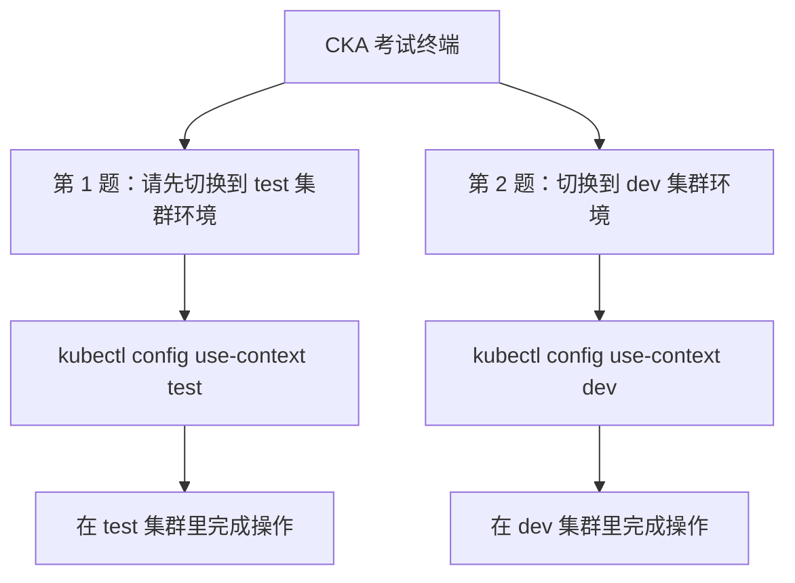
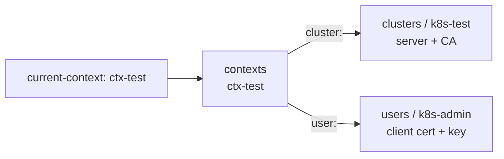
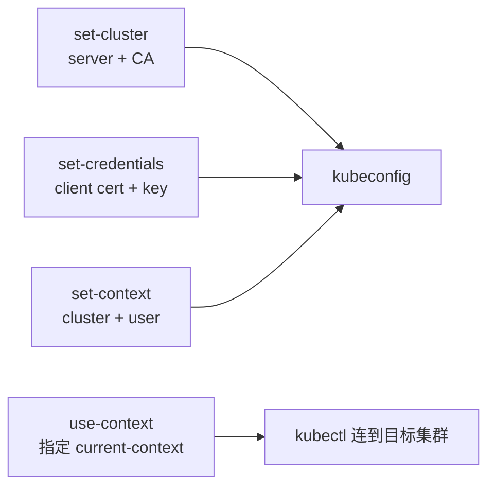

# Kubernetes 认证实战: kubectl 多集群管理（kubeconfig 结构与上下文切换）

**这是 CKA 的头号隐形陷阱** —— 考试里五六个集群轮着切，题目第一步往往是「请切换到某某集群环境再操作」。结论先给：**kubectl 靠 `~/.kube/config` 里的 kubeconfig 连集群，这个文件分四段（cluster / user / context / current-context）；一个配置文件里可以塞多个集群，切换只是一条 `kubectl config use-context`；切错上下文，做得再对也是 0 分。**

## 纲要

- 为什么 CKA 必须先切集群
- kubectl 凭什么有权限：kubeconfig
- kubeconfig 的四段结构，context 是「桥梁」
- 默认路径与两种指定方式
- 生成 kubeconfig 的四条 set 命令
- 实战：一个文件管两个集群
- **易错点：`use-context` 才切，`set-context` 不切**
- 多集群下的考试操作范式

## 为什么必须先切集群



考试通常给你 **5 个甚至 6 个集群**，每道题开头一句「请切换到 xxx 环境」，下面才是任务。**如果没切就动手，你所有操作都落在别的集群里，题目直接判 0 分** —— 这是最常见的技术性失分。

## kubectl 凭什么有权限

访问 K8s 必须授权。`kubeadm init` 最后让你拷的那个文件，就是**管理员授权文件**：

```bash
mkdir -p $HOME/.kube
cp -i /etc/kubernetes/admin.conf $HOME/.kube/config
chmod 644 $HOME/.kube/config
```

这个文件叫 **kubeconfig**，里面存的是「连接哪个 apiserver + 用什么凭据」。**拷到任何装了 kubectl 的机器上都能直接操作这个集群**。

### 认证就两种方式

| 方式 | 适用 | 说明 |
| --- | --- | --- |
| **kubeconfig** | 用户（人）连接集群 | 存连接地址与授权信息，日常用这个 |
| **token** | 程序（Pod / API 调用） | 一般存集群里，用于 API 间认证，Dashboard 登录也支持它 |

Dashboard 登录界面给你两个选项（kubeconfig / token），就是这两种。底层实现上证书、token、用户名密码都支持，但目前 K8s 主流是**证书认证**。

## kubeconfig 的四段结构

```yaml
apiVersion: v1
kind: Config
current-context: ctx-test          # ④ 当前激活的上下文

clusters:                          # ① 集群信息
  - name: k8s-test
    cluster:
      server: https://192.168.31.61:6443
      certificate-authority-data: <CA 证书(base64)>

users:                             # ② 用户认证信息（客户端证书）
  - name: k8s-admin
    user:
      client-certificate-data: <客户端证书(base64)>
      client-key-data: <客户端私钥(base64)>

contexts:                          # ③ 上下文 = 集群 + 用户的关联
  - name: ctx-test
    context:
      cluster: k8s-test            # ← 关联上面哪个集群
      user: k8s-admin              # ← 关联上面哪个用户
  - name: ctx-dev
    context:
      cluster: k8s-dev
      user: k8s-admin2
```



> **context（上下文）就是一座桥**：上面关联集群信息，下面关联用户认证信息。`current-context` 决定你现在走哪座桥。
>
> 这个文件的证书都是 **base64 编码**存在里面的，`-o yaml` 导出来看到的就是编码后的串。

## 默认路径与指定方式

```text
kubectl 找配置文件的顺序
├── ① $KUBECONFIG 环境变量（多个用 : 分隔，会合并）
├── ② --kubeconfig=<路径> 命令行参数（只认这一个）
└── ③ ~/.kube/config      ← 默认，admin.conf 拷到这里才有权限
```

```bash
# 把默认的改名，kubectl 立刻就找不到配置了（Permission denied）
mv ~/.kube/config ~/.kube/config.bak
kubectl get pods              # 报错：请设置 --kubeconfig

# 指定别的位置也能用
kubectl get pods --kubeconfig=/tmp/my-kubeconfig
```

> 记一个细节：**重命名默认文件后操作就失效**，反过来拷过去就生效 —— 这正好证明 kubectl 默认读的就是那个路径。

## 生成 kubeconfig 的四条命令

给同事/用户授权、或者要一个文件管多个集群时，用 `kubectl config` 的四个子命令拼出来：

| 目的 | 命令 | 对应 kubeconfig 段 |
| --- | --- | --- |
| 设集群信息 | `kubectl config set-cluster` | `clusters` |
| 设用户凭证 | `kubectl config set-credentials` | `users` |
| 设上下文（关联） | `kubectl config set-context` | `contexts` |
| **切上下文** | `kubectl config use-context` | `current-context` |



一条 `set` 命令一般都要跟 `--kubeconfig=` 指定写到哪个文件，否则默认写 `~/.kube/config`。

## 实战：一个文件管两个集群

```bash
#!/usr/bin/env bash
set -euo pipefail

KUBE=/root/multi-kubeconfig
CLUSTER_A=192.168.31.61      # 环境 A（test）
CLUSTER_B=192.168.31.73      # 环境 B（dev）

echo "==> 1. 为集群 A 设置集群信息"
kubectl config set-cluster k8s-test \
  --kubeconfig="$KUBE" \
  --server="https://${CLUSTER_A}:6443" \
  --certificate-authority=/etc/kubernetes/pki/ca.crt \
  --embed-certs=true

echo "==> 2. 设置客户端证书认证（复用 apiserver 这套 CA 签的证书）"
kubectl config set-credentials k8s-admin \
  --kubeconfig="$KUBE" \
  --client-certificate=/etc/kubernetes/pki/apiserver.crt \
  --client-key=/etc/kubernetes/pki/apiserver.key \
  --embed-certs=true

echo "==> 3. 建上下文，把集群和用户关联起来"
kubectl config set-context ctx-test \
  --kubeconfig="$KUBE" \
  --cluster=k8s-test \
  --user=k8s-admin

echo "==> 4. 切到 A（use-context 才是切）"
kubectl config use-context ctx-test --kubeconfig="$KUBE"
kubectl config current-context
kubectl get nodes
```

然后再往同一个文件里加第二个集群：

```bash
kubectl config set-cluster k8s-dev \
  --kubeconfig=/root/multi-kubeconfig \
  --server="https://192.168.31.73:6443" \
  --certificate-authority=/etc/kubernetes/pki/ca.crt \
  --embed-certs=true

kubectl config set-credentials k8s-admin2 \
  --kubeconfig=/root/multi-kubeconfig \
  --client-certificate=/etc/kubernetes/pki/apiserver.crt \
  --client-key=/etc/kubernetes/pki/apiserver.key \
  --embed-certs=true

kubectl config set-context ctx-dev \
  --kubeconfig=/root/multi-kubeconfig \
  --cluster=k8s-dev \
  --user=k8s-admin2

kubectl config get-contexts --kubeconfig=/root/multi-kubeconfig
```

```text
CURRENT   NAME       CLUSTER    AUTHINFO    NAMESPACE
*         ctx-test   k8s-test   k8s-admin
          ctx-dev    k8s-dev    k8s-admin2
```

**一个文件管两个集群，想看哪个就看哪个。**

> 生成客户端证书其实可以用 `cfssl` 配一个 CSR JSON 自己签（课程里演示的就是这条路径），但**日常没必要** —— 直接复用 apiserver 那套现成证书就行，思路一样。
>
> 注意：证书本身不代表权限，**这个账号实际能干多少事，由后面的 RBAC 角色决定**。

## 易错点：切上下文用的是 use，不是 set

这是录制里真实踩过的坑：

```bash
# ❌ 错：set-context 只是「新增/修改」上下文，不会切换
kubectl config set-context ctx-dev
kubectl config current-context        # 还停在 ctx-test

# ✅ 对：use-context 才会改 current-context
kubectl config use-context ctx-dev
kubectl config current-context        # ctx-dev
```

| 命令 | 语义 |
| --- | --- |
| `kubectl config set-context <名>` | 创建/修改一个上下文（**不切换**） |
| `kubectl config use-context <名>` | **真正切换**当前上下文 |
| `kubectl config current-context` | 看当前用的是哪个 |
| `kubectl config get-contexts` | 列出所有上下文（带 `*` 的是当前的） |

## 考试操作范式

```text
① 读题，第一行一定写着「请切换到 xxx 集群环境」
② kubectl config use-context <集群名>      ← 第一件事，3 秒
③ kubectl get nodes / kubectl config current-context   ← 确认切对了
④ 在正确的集群里把题目做完
⑤ 下题再来一次 use-context
```

> **漏掉第 ② 步，第 ④ 步做的所有操作都白做**。在 CKA 里这属于「会做但拿 0 分」的典型。

## 目录：kubeconfig 在机器上的位置

```text
/root/
├── .kube/
│   ├── config            ← 默认 kubeconfig（admin.conf 拷过来）
│   └── config.bak        ← 改名前备份，用来验证「默认路径」的说法
└── multi-kubeconfig      ← 多集群用的合并配置文件
    └── 里面同时含 k8s-test 与 k8s-dev 两套 context
```

etc/kubernetes 下原始证书（生成 kubeconfig 时要引用）：

```text
/etc/kubernetes/pki/
├── ca.crt / ca.key                  ← 集群 CA，set-cluster 的 certificate-authority
├── apiserver.crt / apiserver.key    ← 客户端证书，set-credentials 的 client-*（偷懒复用）
└── ...
```

## API 速览

| 目标 | 命令 |
| --- | --- |
| 看当前上下文 | `kubectl config current-context` |
| 列出所有集群与上下文 | `kubectl config get-contexts` |
| **切换上下文（核心）** | `kubectl config use-context <名字>` |
| 看完整 kubeconfig | `kubectl config view` |
| 设集群信息 | `kubectl config set-cluster <名> --server=... --certificate-authority=...` |
| 设用户凭证 | `kubectl config set-credentials <名> --client-certificate=... --client-key=...` |
| 建上下文 | `kubectl config set-context <名> --cluster=... --user=...` |
| 指定配置文件 | `kubectl <命令> --kubeconfig=<路径>` |
| 确认当前连的是哪个集群 | `kubectl cluster-info` |

## Demo 示例

```bash
#!/usr/bin/env bash
set -euo pipefail

CFG=/root/multi-kubeconfig

echo "==> 1. 考试第一步：先看有几个集群、当前在哪个"
kubectl config get-contexts
kubectl config current-context

echo "==> 2. 做题前先切（题目让你切哪个就切哪个）"
kubectl config use-context ctx-test
kubectl config current-context
kubectl get nodes -o wide              # 看节点 IP 确认切对了

echo "==> 3. 做完了，下一题再切一次"
kubectl config use-context ctx-dev
kubectl config current-context
kubectl get pods -A -o wide

echo "==> 4. 指定别的文件也能连（不切当前上下文的做法）"
kubectl get nodes --kubeconfig="$CFG"

echo "==> 5. 用环境变量方式（多配置文件会合并）"
export KUBECONFIG="$CFG"
kubectl config view | head -20
unset KUBECONFIG
```

**验收切没切对**（三步确认，别嫌啰嗦）：

```bash
kubectl config current-context                 # 名字对不对
kubectl get nodes -o wide                      # 节点 IP/主机名是不是题目的那个集群
kubectl config view --minify -o jsonpath='{.clusters[0].cluster.server}'   # server 地址
```

### 总结

- **CKA 五六个集群轮着切**，题目第一步就是「请切换到 xxx 集群」，**漏切 = 会做也 0 分**。
- kubectl 靠 `~/.kube/config`（kubeconfig）连集群：拷过来就有权限，改名就立刻没权限 —— 这条能帮你验证默认路径。
- kubeconfig 四段：`clusters`（server + CA）、`users`（客户端证书）、`contexts`（把集群和用户关联起来）、`current-context`（当前激活）。
- 生成自己的 kubeconfig 用四条命令：`set-cluster` / `set-credentials` / `set-context` / `use-context`；前三条是「写」，第四条是「用」。
- **易错点：切上下文是 `use-context`，不是 `set-context`**；`get-contexts` 里带 `*` 的就是当前上下文；`current-context` + `get nodes -o wide` 双确认最保险。
- 一个 kubeconfig 可以塞多个集群，用 `--kubeconfig=` 或 `KUBECONFIG` 环境变量指定；证书只是身份，**权限多少由 RBAC 决定**。

