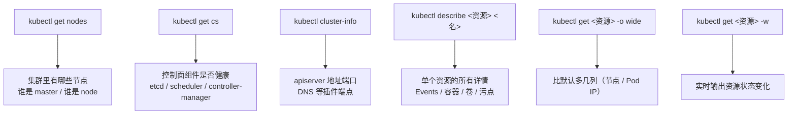
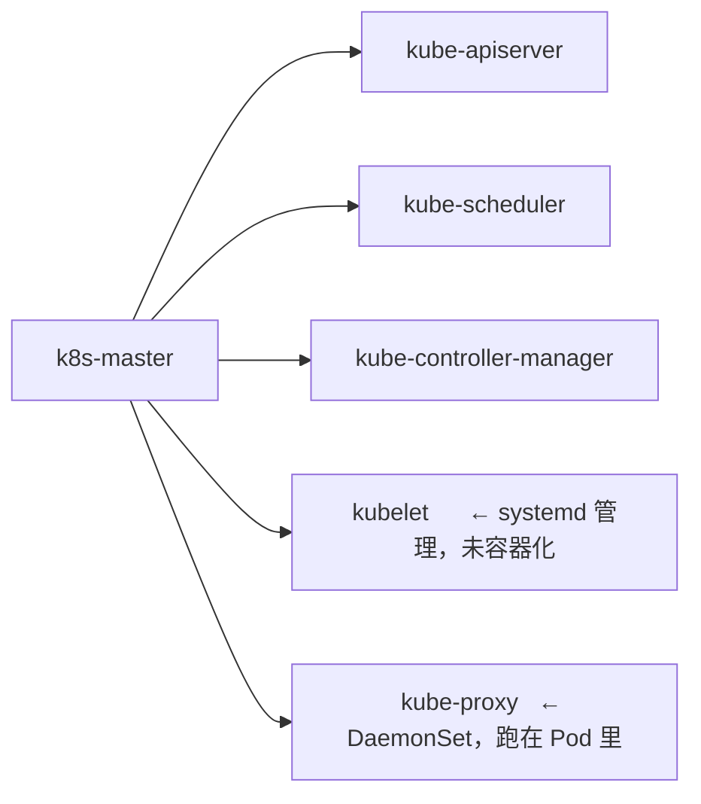
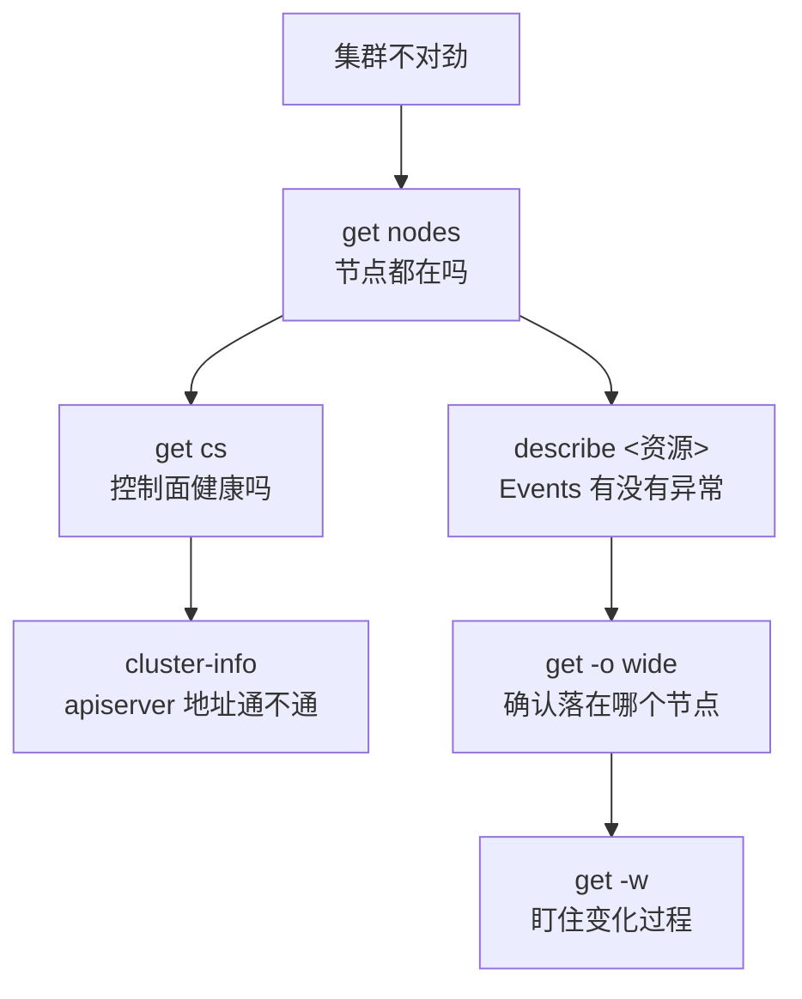

# Kubernetes 认证实战: 5个命令查看集群资源状况（get nodes / cs / cluster-info / describe / watch）

监控日志这块的 CKA 考点很朴素：**就考你不会不会看。** 结论先给：**五个命令 —— `get nodes`（看节点）、`get cs`（看控制面组件）、`cluster-info`（看集群入口）、`describe`（看任意资源详情）、`get -o wide -w`（看更多信息 + 实时盯变化）；其中「`get cs` 里为什么没有 apiserver」是最常被问到的一道题。**

## 纲要

- 五条命令总览
- `get nodes`：master 为什么也出现在这
- `get cs`：控制面组件状态，为什么不含 apiserver
- `cluster-info`：集群入口地址与插件端点
- `describe`：任何资源的详细信息都在这
- `-o wide`：多出来的那几列是什么
- `-w`：实时盯资源变化
- 组合使用与排查顺序

## 五条命令总览



| 命令 | 看什么 | 典型输出 |
| --- | --- | --- |
| `get nodes` | 节点列表与角色 | NAME / STATUS / ROLES / AGE |
| `get cs` | 控制面组件健康 | etcd / scheduler / controller-manager |
| `cluster-info` | 集群入口与插件 | Kubernetes master is running at ... |
| `describe` | **单个资源的全部详情** | 含最新 Events |
| `get -o wide` | 多几列关键属性 | NODE / IP |
| `get -w` | 实时变化 | 创建/删除/重启实时刷屏 |

## 第一条：`kubectl get nodes`

```bash
kubectl get nodes
```

```text
NAME         STATUS   ROLES              AGE   VERSION
k8s-master   Ready    master             30m   v1.18.0
k8s-node1    Ready    <none>             28m   v1.18.0
k8s-node2    NotReady <none>             25m   v1.18.0
```

### 一个有意思的问题：master 为什么也在这



`get nodes` 能列出 master，是因为 **master 同时也是个 node（它身上跑着 kubelet 和 kube-proxy）**。验证一下：

```bash
kubectl get pods -n kube-system -o wide | grep -E 'kube-proxy|kubelet'
# kube-proxy 在 master 上也有 → 说明 master 兼 worker
```

> 生产上 master **一般不跑业务 Pod**（减轻 master 压力 + 安全考虑：Pod 出问题不至于把 master 拖垮），所以很多文档里 `get nodes` 只列 worker。但**实验环境和有些集群里 master 兼 node，这时它就会出现在列表里**。
>
> 顺带一提，kubelet **没有容器化**，它是被 systemd 直接管理的，这点跟 apiserver 那几个不一样。

## 第二条：`kubectl get cs`

```bash
kubectl get cs
```

```text
NAME                 STATUS    MESSAGE             ERROR
etcd-0               Healthy   {"health":"true"}
kube-controller-manager   Healthy   ""
kube-scheduler          Healthy   ""
```

### 坑点：为什么列表里没有 apiserver

这是考试和面试都爱问的：

| 组件 | 在 `get cs` 里吗 | 原因 |
| --- | --- | --- |
| etcd | ✅ 有 | 独立组件，可探测 |
| kube-controller-manager | ✅ 有 | 独立组件 |
| kube-scheduler | ✅ 有 | 独立组件 |
| **kube-apiserver** | ❌ **没有** | **apiserver 自己就是 `kubectl` 的出口** |

**逻辑是这样的**：`kubectl get cs` 要连 apiserver 才能拿到数据。**只要这条命令能正常输出，本身就证明 apiserver 是通的** —— 那还有什么必要再「显示」它一次呢？反过来，**如果 `get cs` 报超时或错误，第一个该怀疑的就是 apiserver 挂了**。

```bash
kubectl get cs              # 输出异常 → apiserver 有问题
kubectl cluster-info        # 再看 apiserver 地址能不能连
```

> **记牢这个推论**：`cs` 不 Healthy / 超时 = apiserver 有问题；`cs` 里三个都 Healthy = 控制面核心健康。

## 第三条：`kubectl cluster-info`

```bash
kubectl cluster-info
```

```text
Kubernetes master is running at https://192.168.31.61:6443
CoreDNS is running at https://192.168.31.61:6443/api/v1/namespaces/kube-system/services/kube-dns/proxy
```

| 你能看到 | 说明 |
| --- | --- |
| apiserver 的 **IP 和端口** | `https://<master>:6443` |
| 各插件的**代理端点** | CoreDNS 注册进来后这里就会出现 |

后面加 `--dump` 会**输出极其详细的信息**（从 etcd 里刷一大堆状态和事件到标准输出），一般问题用不上它，只有遇到「不符合常规」的疑难杂症时才翻：

```bash
kubectl cluster-info dump > /tmp/dump.txt
wc -l /tmp/dump.txt
grep -i -E 'error|warn' /tmp/dump.txt | head
```

## 第四条：`kubectl describe`

`describe` 是**看单个资源全部详情**的万能命令，`kubectl api-resources` 列出的资源它基本都能用：

```bash
kubectl describe pod "$POD"
kubectl describe deploy "$DEPLOY"
kubectl describe svc "$SVC"
kubectl describe node "$NODE"
kubectl describe pv "$PV"
```

用法是 **`describe <资源类型> <资源名>`** —— 注意是两个参数：先资源类型（就是 `api-resources` 第一列那个），再具体名字。

以 Pod 为例，输出里都有这些块：

```text
Name:         cka-demo-7d9f8b6c4-x2z9p
Namespace:    default
Node:         192.168.31.62/192.168.31.62
Start Time:   Fri, 02 Oct 2026 18:20:11 +0800
Labels:       app=cka-demo
Annotations:  <none>
Status:       Running
Containers:
  web:
    Image:   nginx:1.26
    Port:    80/TCP
    State:   Running   ...
Volumes:
  <none>
Events:            ← ★ 排障最该看的一段
  Type    Reason     Age   From     Message
  Normal  Pulled     2m    kubelet  Container image already present
  Normal  Created    2m    kubelet
  Normal  Started    2m    kubelet
```

| 区块 | 内容 |
| --- | --- |
| Name / Namespace / Node | 身份与落在哪个节点 |
| Start Time / Labels / Annotations | 元信息 |
| Status / Containers | 状态、镜像、端口、资源、事件状态 |
| Volumes | 挂载的卷 |
| **Events** | **最近的事件流，排障第一手证据** |

> **Events 是 describe 的精华**：Pod 起不来、镜像拉不到、调度失败，原因都写在 Events 里。这也是为什么排障顺序是 `get` → `describe` → `logs`，**顺序不能反**。

## 第五条：`-o wide` 与 `-w`

### `-o wide`：多出来的那几列

```bash
kubectl get pods -o wide
```

```text
NAME    READY   STATUS    RESTARTS   AGE   IP           NODE          NOMINATED NODE   READINESS GATES
web-xxx 1/1     Running   0          5m    10.244.1.7   192.168.31.62  <none>           <none>
```

默认 `get pods` 只有 5 列，`-o wide` 会**多出 Pod IP、所在节点（NODE）** 等更关键的属性。

其他常用输出格式：

```bash
kubectl get pods -o wide        # 加关键列
kubectl get pods -o json        # 原生 JSON（脚本解析用）
kubectl get pod web -o yaml     # 当前运行态的完整 yaml
kubectl get pods -o name        # 只输出资源名，适合 xargs
```

### `-w`：实时盯变化

```bash
kubectl get pods -w
```

```text
NAME    READY   STATUS    RESTARTS   AGE
web-1   1/1     Running   0          5m
web-1   1/1     Terminating 0        6m      ← 删了
web-2   0/1     ContainerCreating   0      0s  ← Deployment 立刻补上
web-2   1/1     Running              0      3s
```

> **用途**：部署完一个资源想看它的完整生命周期（创建中 → 运行中 → 被杀 → 重建），或者盯有状态应用**按顺序启动**的 Pod，就 `-w` 挂着看。缩写就是 `-w`。

## 组合排查顺序



| 场景 | 用哪条 |
| --- | --- |
| 集群有几台机器 | `get nodes` |
| 控制面是不是坏了 | `get cs` |
| apiserver 地址/端口对不对 | `cluster-info` |
| 某个 Pod 为什么起不来 | `describe pod` 看 Events |
| Pod 在哪个节点、IP 多少 | `get pods -o wide` |
| 扩容/重建过程实时观察 | `get pods -w` |
| 疑难杂症翻全部状态 | `cluster-info --dump` |

## 命令速查树

```text
看集群的五个入口
├── get nodes
│   └── 列表：NAME / STATUS / ROLES / AGE / VERSION
│       └── master 出现在这 = 它兼了 worker 角色
├── get cs
│   └── 列表：etcd / controller-manager / scheduler
│       └── 没有 apiserver（kubectl 能输出就说明 apiserver 通）
├── cluster-info
│   ├── 默认：apiserver 地址 + CoreDNS 等插件端点
│   └── --dump：从 etcd 里刷全量状态与事件
├── describe <资源类型> <资源名>
│   └── Name / Node / Status / Containers / Volumes / Events
└── get <资源> [-o wide] [-w]
    ├── 默认列 → 加 -o wide 多出 IP / NODE
    └── 加 -w 实时追踪状态变化
```

## API 速览

| 目标 | 命令 |
| --- | --- |
| 看节点 | `kubectl get nodes` |
| 看控制面组件 | `kubectl get cs`（短格式 = componentstatuses） |
| 看集群入口与插件 | `kubectl cluster-info` |
| 导出集群全量状态 | `kubectl cluster-info dump > dump.txt` |
| 看某资源详情 | `kubectl describe <资源> <名字>` |
| 查看全部资源类型 | `kubectl api-resources` |
| 多列关键信息 | `kubectl get pods -o wide` |
| 实时观察 | `kubectl get pods -w` |
| 输出 JSON | `kubectl get pod <名> -o json` |
| 只看资源名 | `kubectl get pods -o name` |

## Demo 示例

```bash
#!/usr/bin/env bash
set -euo pipefail

POD=cka-demo

echo "==> 1. 五看：节点 / 组件 / 集群入口"
kubectl get nodes
kubectl get cs
kubectl cluster-info

echo "==> 2. 起一个 Pod 做实验"
kubectl run "$POD" --image=nginx:1.26 --port=80 --dry-run=client -o yaml | kubectl apply -f -
kubectl get pods -o wide

echo "==> 3. 看详情，重点在 Events"
kubectl describe pod "$POD"

echo "==> 4. 实时盯它跑起来（另开一窗口对比效果最好）"
kubectl get pods -w

echo "==> 5. 删掉，同时 -w 看它怎么被重建"
kubectl delete pod "$POD" &
kubectl get pods -w
wait
```

**一条命令体检集群**：

```bash
# 所有节点 Ready？
kubectl get nodes | grep -v ' Ready ' || echo "全部节点 Ready"

# 控制面组件有没有不健康的
kubectl get cs | grep -v ' Healthy ' || echo "控制面健康"

# kube-system 里有没有非 Running 的
kubectl get pods -n kube-system --field-selector status.phase!=Running
```

> 第 3 步的 `describe` 输出里，只要看到 `Events` 段有 `FailedScheduling` / `ErrImagePull` / `CrashLoopBackOff` / `BackOff` 这类 Reason，就知道为什么 Pod 起不来了。

### 总结

- **五条命令**：`get nodes` 看机器、`get cs` 看控制面、`cluster-info` 看集群入口、`describe <资源> <名>` 看单个资源详情、`get -o wide -w` 看更多列 + 实时变化。
- `get nodes` 能列出 master，是因为 **master 兼了 worker 角色**（跑 kubelet + kube-proxy）；生产环境 master 一般不跑业务 Pod。
- **`get cs` 里没有 apiserver** —— 因为 `kubectl` 本来就要连 apiserver 才能输出，输出成功即代表 apiserver 通；反过来 `get cs` 超时/报错 = apiserver 有毛病。
- `describe` 输出最值钱的是末尾的 **Events**，排障第一步就在这；命令格式是「资源类型 + 资源名」两个参数。
- `-o wide` 多出 **Pod IP 和所在 NODE** 两列关键属性；`-w` 实时显示创建/终止/重建过程，缩写就是 `-w`。
- 排查顺序固定：**`get` 看有没有 → `describe` 看 Events → 再决定看 `logs` 还是 `exec`**，顺序反了会白费时间。

