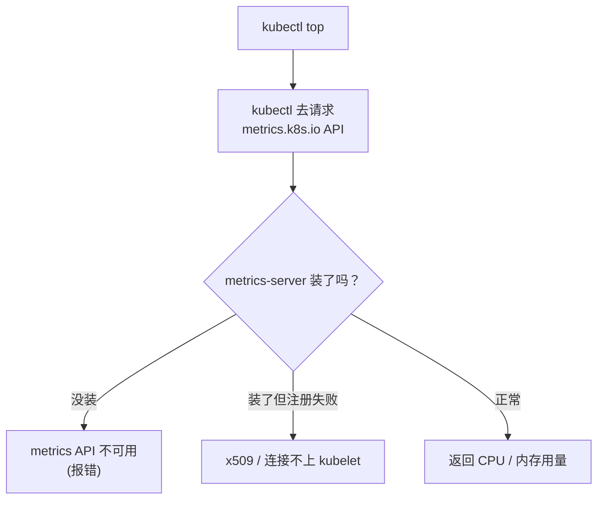
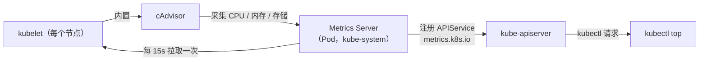

# Kubernetes 认证实战: Metrics Server 部署（打通 kubectl top 数据链路）

`kubectl top` 是 CKA 常考的操作题，但**新集群上直接跑一定报错**。结论先给：**`kubectl top` 自己不采集数据，它去问 `metrics.k8s.io` 这个 API；这个 API 由 Metrics Server 提供，而 Metrics Server 要靠 kubelet 内置的 cAdvisor 采集、再以 APIService 形式注册进 apiserver。所以必须单独部署 Metrics Server，并且通常要改镜像地址、加 `--kubelet-insecure-tls` 和 `--kubelet-preferred-address-types=InternalIP` 两个参数。**

## 纲要

- `kubectl top` 报错的本质
- heapster 已被废弃，Metrics Server 接棒
- 数据链路：cAdvisor → Metrics Server → apiserver → kubectl
- 部署 Metrics Server：三种资源分别干什么
- 必改的三处：镜像地址 + 两个 kubelet 参数
- 部署后验证 `kubectl top nodes/pods`
- 常见报错与定位

## 报错长什么样

```bash
kubectl top node
kubectl top pod
```

两个子命令都跑不通，提示里一定会提到 **metrics-server / metrics API 找不到** 这一类信息。



**为什么会这样？** `kubectl top` 要展示 CPU、内存、存储的使用率，这些数字不可能凭空冒出来，背后一定得有个组件提供。`kubectl top` 只是**展示端**，真正的数据源要单独部署。

## heapster → Metrics Server

| 组件 | 状态 | 说明 |
| --- | --- | --- |
| **heapster** | **K8s 1.13 起完全废弃** | 最早的监控组件，自身逻辑设计复杂、缺陷多 |
| **Metrics Server** | ✅ 现行 | 官方社区开发的替代者，一个**聚合器** |

> 注意「聚合器」这三个字：**Metrics Server 本身不直接采集**，它是**从别人那拿数据再汇总**。真正采集的活儿在别处。

## 数据链路



| 环节 | 谁来做 |
| --- | --- |
| **采集** | **cAdvisor** —— 它**内置在 kubelet 里**，不用单独装 |
| **聚合** | **Metrics Server** —— 拉各节点 kubelet 的指标，汇总 |
| **对外** | 以 **APIService** 注册到 apiserver，暴露 `metrics.k8s.io` |
| **展示** | `kubectl top nodes` / `kubectl top pods` |

> 所以链路是：**kubelet（内置 cAdvisor）采集 → Metrics Server 聚合 → 注册到 apiserver → kubectl top 查 apiserver → 展示**。少了中间任何一环，`top` 都不好用。

## 部署 Metrics Server

yaml 官方地址在 GitHub 的 `metrics-server/deploy/kubernetes/` 目录下：

```bash
curl -O https://raw.githubusercontent.com/kubernetes-sigs/metrics-server/master/manifests/components.yaml
kubectl apply -f components.yaml
```

打开 yaml 看，里面其实就 **三类资源**：

| 资源 | 作用 |
| --- | --- |
| **Deployment** | 跑 metrics-server 这个 Pod |
| **Service** | 暴露 metrics-server 自身 |
| **APIService** | **把 metrics.k8s.io 注册进 K8s API**（核心！） |
| ClusterRole / Role / Binding 等 | 授权它访问 apiserver |

### 为什么要注册（APIService）

Metrics Server 是个 Pod，凭啥 `kubectl top` 能直接调到它？**因为它把自己注册成了 apiserver 的一个聚合层 API。** 注册之后，`kubectl top` 里写死的连接方式就能直接连到它 —— 你不用在 kubectl 里配任何东西。

> 反过来想：**没注册成功 = `top` 报错**，所以部署完第一件事是确认 APIService 是 `Available`。

### 必改的三处

新下载的 yaml 在国内网络直接 `apply` 大概率失败，要动三处：

#### ① 改镜像地址（默认在境外）

```yaml
        image: registry.cn-hangzhou.aliyuncs.com/google_containers/metrics-server-amd64:v0.3.7
# 原来是 k8s.gcr.io / gcr.io 的境外地址，国内拉不动
```

另外确认本机 docker 已配好 `registry-mirrors` 加速源。

#### ② 加 `--kubelet-insecure-tls`

**这个参数高三考**：Metrics Server 连 kubelet 的 `https://<node>:10250` 端口，默认走 HTTPS。**kubelet 的证书单独配置很麻烦**，所以干脆让 Metrics Server 以**非安全方式**连 kubelet。

#### ③ 加 `--kubelet-preferred-address-types=InternalIP`

节点注册集群时用的是**主机名**，但主机名背后才是 IP。**没配 DNS 的情况下，Metrics Server 默认拿主机名去连根本连不通。** 改成用 InternalIP 连：

```yaml
        args:
          - --cert-dir=/tmp
          - --secure-port=4443
          - --kubelet-certificate-authority=/etc/kubernetes/pki/ca.crt
          - --kubelet-use-node-status-port
          - --metric-resolution=15s
          - --kubelet-insecure-tls                              # ★ 加的
          - --kubelet-preferred-address-types=InternalIP        # ★ 加的
```

> 参数来源：kubelet 注册时上报的 `InternalIP` 字段就在 `status.addresses` 里，用这个地址连就不会卡在 DNS 解析上。

## 部署与验证

```bash
kubectl apply -f components.yaml

# 装在 kube-system 命名空间下
kubectl get pods -n kube-system -l k8s-app=metrics-server
kubectl get deploy -n kube-system metrics-server
```

> **注意 `-n kube-system` 一定要带上**。Metrics Server 默认就跑在这个自带命名空间里，你到下边去 `kubectl get pods` 找不到，会误以为部署失败。

```bash
# 1. 看 Pod 起来没
kubectl get pod -n kube-system -l k8s-app=metrics-server -w

# 2. 看 APIService 注册成功没（★ 这步最关键）
kubectl get apiservices | grep metrics
# v1beta1.metrics.k8s.io     kube-system/metrics-server   Available   True

# 3. 终于可以用了
kubectl top nodes
kubectl top pods -A
```

```text
NAME         CPU(cores)   CPU%   MEMORY(bytes)   MEMORY%
k8s-master   128m         6%     1064Mi         54%
k8s-node1    92m          4%     772Mi          39%
k8s-node2    75m          3%     741Mi          37%

NAMESPACE     NAME                        CPU(cores)   MEMORY(bytes)
kube-system    kube-proxy-lm7xp            2m          18Mi
kube-system    kube-flannel-ds-amd64-x9k2  4m          25Mi
kubernetes-dashboard-xxx                   3m          60Mi
```

## 常见报错定位

| 现象 | 原因 | 处理 |
| --- | --- | --- |
| `top node` / `top pod` 都报 metrics 找不到 | 压根没装 | 部署 components.yaml |
| Pod `CrashLoopBackOff` / `Running` 但 `top` 还报错 | APIService 没注册成功 | `kubectl get apiservices` 看 Available |
| 报 x509 / 证书校验不过 | 缺 `--kubelet-insecure-tls` | 加这个参数，重建 Pod |
| 报连不上主机名 / DNS 解析失败 | 缺 `--kubelet-preferred-address-types=InternalIP` | 加这个参数，重建 Pod |
| 镜像拉不动 `ImagePullBackOff` | 境外镜像 | 换国内镜像地址 |
| 部署完在 default 命名空间找不到 | 它在 kube-system | 记得加 `-n kube-system` |

**重建 Pod 让新参数生效**：

```bash
kubectl rollout restart deploy/metrics-server -n kube-system
kubectl logs -n kube-system -l k8s-app=metrics-server -f
```

## 目录：Metrics Server 在集群里长什么样

```text
kube-system 命名空间
├── metrics-server-5d7f9c8b6-abcde     ← 新增（Deployment 起的 Pod）
├── coredns-xxxxx
├── kube-proxy-xxxxx
├── kube-flannel-ds-amd64-xxxxx
├── kube-apiserver-k8s-master
├── kube-controller-manager-k8s-master
├── kube-scheduler-k8s-master
└── etcd-k8s-master

集群级 API（不在命名空间里）
└── apiservices/v1beta1.metrics.k8s.io   ← 把 metrics.k8s.io 注册进来
```

## API 速览

| 目标 | 命令 |
| --- | --- |
| 看节点资源用量 | `kubectl top nodes` |
| 看 Pod 资源用量 | `kubectl top pods` |
| 所有命名空间一起看 | `kubectl top pods -A` |
| 看某个 Pod | `kubectl top pod <名> -n <ns>` |
| 部署 Metrics Server | `kubectl apply -f components.yaml` |
| **看 APIService 注册** | `kubectl get apiservices`（看 Available） |
| 看 Metrics Server 日志 | `kubectl logs -n kube-system -l k8s-app=metrics-server -f` |
| 重建让它生效 | `kubectl rollout restart deploy/metrics-server -n kube-system` |
| 看它用的哪个镜像与参数 | `kubectl get deploy -n kube-system metrics-server -o yaml` |

## Demo 示例

```bash
#!/usr/bin/env bash
set -euo pipefail

echo "==> 1. 先看问题：top 跑不通"
kubectl top nodes || echo "（预期：metrics 相关报错）"

echo "==> 2. 下载官方 yaml 并改三处"
curl -O https://raw.githubusercontent.com/kubernetes-sigs/metrics-server/master/manifests/components.yaml

# 换国内镜像
sed -i 's#k8s.gcr.io/metrics-server/metrics-server#registry.cn-hangzhou.aliyuncs.com/google_containers/metrics-server#g' components.yaml
# 加两个 kubelet 参数（不同版本写法略有差异，可先 sed 替换再补）
grep -n -A12 'args:' components.yaml | head -20

echo "==> 3. 部署"
kubectl apply -f components.yaml

echo "==> 4. 等它起来"
kubectl rollout status deploy/metrics-server -n kube-system --timeout=120s

echo "==> 5. 关键验证：APIService 是不是 Available"
kubectl get apiservices | grep metrics
kubectl get pods -n kube-system -l k8s-app=metrics-server

echo "==> 6. 终于能用 top 了"
kubectl top nodes
kubectl top pods -A

echo "==> 7. 出问题了看日志"
kubectl logs -n kube-system -l k8s-app=metrics-server --tail=50
```

> 第 2 步如果 sed 之后 args 里还是没有那两个参数，直接 `kubectl edit deploy -n kube-system metrics-server`，在 `args` 下手动补：
> `--kubelet-insecure-tls` 与 `--kubelet-preferred-address-types=InternalIP`。

### 总结

- **`kubectl top` 只是展示层**，它问的是 `metrics.k8s.io` 这个 API；这个 API 由 **Metrics Server** 提供，所以必须单独部署，不然 `top` 一定报错。
- **heapster 已废弃（K8s 1.13）**，Metrics Server 是官方替代者；它本质是**聚合器**，不是采集器。
- 数据链路：**kubelet 内置 cAdvisor 采集 → Metrics Server 拉取汇总 → 注册 APIService 到 apiserver → `kubectl top` 查到并展示**。
- **必改三处**：镜像换国内源；加 `--kubelet-insecure-tls`（绕开 kubelet 的 HTTPS 证书配置）；加 `--kubelet-preferred-address-types=InternalIP`（绕开 DNS 解析主机名失败）。
- **验证关键看 `kubectl get apiservices | grep metrics` 是否 `Available`**，以及 Pod 在 `kube-system` 命名空间下 —— 忘加 `-n kube-system` 是新手最常见的「以为部署失败」。
- 装完 `kubectl top nodes` / `kubectl top pods -A` 就能看到 CPU 与内存的实时用量。

