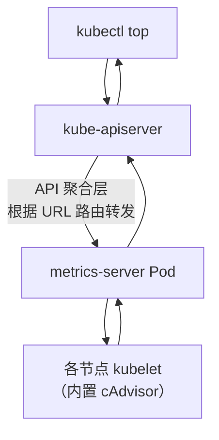
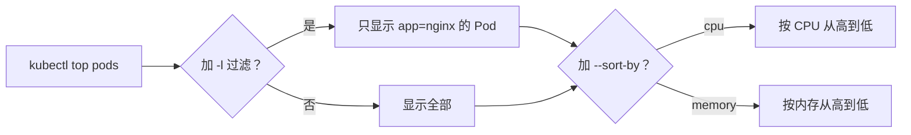
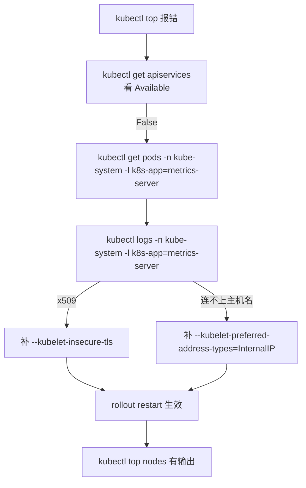

# Kubernetes 认证实战: 监控资源利用率（API 聚合层、top 排序与 CPU 单位）

上一节把 Metrics Server 装上了，这一节讲透它背后的机制和使用技巧。结论先给：**Metrics Server 是靠 apiserver 的「API 聚合层」注册进来的 —— apiserver 本身就有代理转发能力，第三方组件只要注册成 APIService，`kubectl` 就能像访问原生 API 一样调它；`kubectl top` 再加 `--sort-by=cpu|memory` 和 `-l` 标签过滤，是 CKA 的常考操作题。**

## 纲要

- 什么是 API 聚合层
- apiserver 的代理转发机制
- `kubectl get apiservices`：看注册成功没有
- `kubectl top` 两个维度与 CPU 单位换算
- `--sort-by` 按 CPU / 内存排序（考试题）
- 标签过滤 + 排序组合用法
- 完整排查与验证链路

## API 聚合层是什么

apiserver 除了自己那一套原生 API，还内置了一个**代理转发**能力。设计目的很直接：**以后第三方开发的组件，也想按 apiserver 的方式对外暴露接口，怎么办？**



**流程**：`kubectl top` 请求的是一个**带 `apiserver` 前缀的代理地址**，apiserver 收到后按 URL 路由转发到对应后端（这里是 metrics-server 的 Pod），Pod 再去各节点 kubelet 拿数据，原路返回给 kubectl 展示。

> 你可以这么理解：**访问 K8s 的 API，就等于访问这些后端；只不过用户不是直接连后端，而是经过 apiserver 这一层代理。**

这套机制**不是为了第三方才有的**，apiserver 自己也把它当成模块化入口 —— 以后想给核心功能加东西，都以这种方式接入。

## 怎么确认注册成功

```bash
kubectl get apiservices
```

| 你要看什么 | 关键列 |
| --- | --- |
| 名字里有没有 `metrics.k8s.io` | NAME = `v1beta1.metrics.k8s.io` |
| 后端指向谁 | SERVICE = `kube-system/metrics-server` |
| **有没有真的可用** | **AVAILABLE = True** |

```text
NAME                       SERVICE                       AVAILABLE   AGE
v1beta1.metrics.k8s.io     kube-system/metrics-server    True        5m
v1.                        -                             True        30m
v1beta1                    -                             True        30m
```

> **`AVAILABLE=False` 就说明注册失败** —— 这时候 `kubectl top` 一定还是报错，回去看 metrics-server 的 Pod 状态和日志（大概率还是那两个 kubelet 参数没加对）。

## kubectl top 的两个维度

| 维度 | 命令 | 看什么 |
| --- | --- | --- |
| 节点 | `kubectl top nodes` | 每个节点总共消耗多少 CPU / 内存、百分比 |
| Pod | `kubectl top pods` | 每个 Pod 消耗多少 |

```text
# kubectl top nodes
NAME         CPU(cores)   CPU%   MEMORY(bytes)   MEMORY%
k8s-master   128m         6%     1064Mi         54%
k8s-node1    92m          4%     772Mi          39%
k8s-node2    75m          3%     741Mi          37%

# kubectl top pods -A
NAMESPACE     NAME                        CPU(cores)   MEMORY(bytes)
kube-system    kube-flannel-ds-amd64-x9k2  4m          25Mi
kube-system    kube-proxy-lm7xp            2m          18Mi
default        cka-demo-7d9f8b6c4-x2z9p    6m          22Mi
```

> **节点那列 CPU 是「合计」**：所有 Pod 在该节点上的 CPU 加起来。比如某节点所有 Pod 一共 `367m`，换算不到 0.4 核 —— 没跑任务的时候利用率通常都低到可以忽略。

## CPU 单位怎么算

这是新手最容易懵的地方，记住一句话：**1000m = 1 核**。

| 写法 | 换算 |
| --- | --- |
| `1000m` | 1 核 |
| `100m` | 0.1 核 |
| `6m` | 0.006 核 |
| `367m` | 0.367 核 |

> 经验判断：**只有上百 m 才值得看**，几十 m、几 m 属于噪声范围。

内存就直白多了，**分配多少就是多少 Mi**（Mi = MiB，1Mi ≈ 1.05 MB）。

## `--sort-by` 排序：CKA 常考题

Pod 一多，看 `top` 的原始顺序就没意义了，得排序。**支持排序的字段只有两个：`cpu` 和 `memory`。**

```bash
# 按内存占用排序（从高到低）
kubectl top pods --sort-by=memory

# 按 CPU 占用排序
kubectl top pods --sort-by=cpu

# 所有命名空间一起排
kubectl top pods -A --sort-by=memory

# 按标签过滤 + 排序（组合技）
kubectl top pods -l app=nginx --sort-by=memory

# 指定了命名空间
kubectl top pods -n kube-system --sort-by=memory
```



> **考试原题长这个样子**：「查看当前节点中资源利用率最高的 Pod，按内存排序并输出到文件」—— 拆成三步就是：
> `kubectl top pods --sort-by=memory` → 挑出最高那个 → `> 文件名` 重定向。

### 过滤用的 `-l`，复习一下

```bash
# 先看所有 Pod 都带什么标签
kubectl get pods --show-labels

# 只看某个标签的 Pod
kubectl get pods -l app=nginx
kubectl get pods -l app=nginx --show-labels

# 组合到 top 里一样用
kubectl top pods -l app=nginx --sort-by=memory
```

## 完整验证链路



| 步骤 | 命令 | 通过标准 |
| --- | --- | --- |
| 1 看注册 | `kubectl get apiservices` | `v1beta1.metrics.k8s.io` 的 `AVAILABLE=True` |
| 2 看 Pod | `kubectl get pods -n kube-system` | metrics-server Pod 是 Running |
| 3 看日志 | `kubectl logs -n kube-system -l k8s-app=metrics-server` | 无 x509 / 无连接失败 |
| 4 看数据 | `kubectl top nodes` | 能列出 CPU / 内存列 |

## 目录：聚合层下挂了什么

```text
kube-apiserver 暴露的 API 入口
├── 原生 API
│   ├── /api/v1                     ← Pod / Service / ConfigMap 等
│   └── /apis/                       ← apps/v1、networking.k8s.io/v1 等分组
├── 聚合层（第三方注册的）
│   └── /apis/metrics.k8s.io        ← ★ metrics-server 注册进来
└── 浏览器/插件端点
    └── /ui/                         ← cluster-info 里能看到的那类代理接口
```

## API 速览

| 目标 | 命令 |
| --- | --- |
| **看聚合层注册了谁** | `kubectl get apiservices` |
| 看节点资源利用率 | `kubectl top nodes` |
| 看 Pod 资源利用率 | `kubectl top pods` |
| 所有命名空间一起看 | `kubectl top pods -A` |
| 按内存排序 | `kubectl top pods --sort-by=memory` |
| 按 CPU 排序 | `kubectl top pods --sort-by=cpu` |
| 标签过滤 + 排序 | `kubectl top pods -l app=nginx --sort-by=memory` |
| 看 Pod 有哪些标签 | `kubectl get pods --show-labels` |
| 把 top 结果写入文件 | `kubectl top pods --sort-by=memory > /tmp/top.txt` |

## Demo 示例

```bash
#!/usr/bin/env bash
set -euo pipefail

echo "==> 1. 聚合层注册情况（关键看 AVAILABLE）"
kubectl get apiservices

echo "==> 2. 起几个 Pod 制造数据"
kubectl run web-a --image=nginx:1.26 --restart=Never
kubectl run web-b --image=nginx:1.26 --restart=Never
kubectl run busy --image=busybox:1.32 --restart=Never -- sh -c 'while true; do :; done'

echo "==> 3. 看标签，记住过滤条件"
kubectl get pods --show-labels

echo "==> 4. 排序：找出最吃资源的"
kubectl top pods --sort-by=memory
kubectl top pods --sort-by=cpu

echo "==> 5. 过滤 + 排序组合"
kubectl top pods -l app= --sort-by=memory || true
kubectl top pods -A --sort-by=memory

echo "==> 6. 导出成文件（考试要你「输出到文件」就用这句）"
kubectl top pods --sort-by=memory > /tmp/top-memory.txt
cat /tmp/top-memory.txt

echo "==> 7. 看节点整体"
kubectl top nodes
```

> 第 3 步 `--show-labels` 的输出就是第 5 步 `-l` 的取值来源：先 `show-labels` 看真实标签长什么样，再拿去 `-l` 过滤，**别猜标签名**。

### 总结

- **API 聚合层 = apiserver 的代理转发**：第三方组件注册成 APIService 后，`kubectl` 就能像调原生 API 一样调它；`kubectl get apiservices` 是唯一确认注册成功的入口，看 `AVAILABLE` 列。
- 完整链路：`kubectl top` → apiserver 聚合层按 URL 转发 → metrics-server Pod → 各节点 kubelet（内置 cAdvisor）→ 原路返回。
- `kubectl top` 两个维度：`nodes` 看节点合计、`pods` 看单个 Pod；`-A` 看所有命名空间。
- **CPU 单位 1000m = 1 核**：`100m` = 0.1 核，`6m` = 0.006 核；只有上百 m 才值得关注。内存就是 Mi，分配多少显示多少。
- **`--sort-by` 只支持 `cpu` 和 `memory` 两个字段**；搭配 `-l` 标签过滤（先用 `--show-labels` 确认标签）就是考试的标准组合技。
- 验证顺序固定：`get apiservices`（Available）→ `get pods -n kube-system` → `logs` 看 x509 → 补参数 → `rollout restart` → `top` 有输出。

