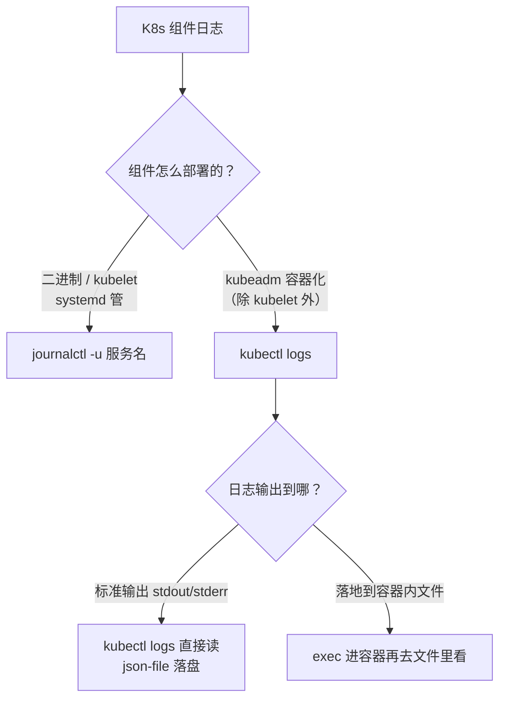
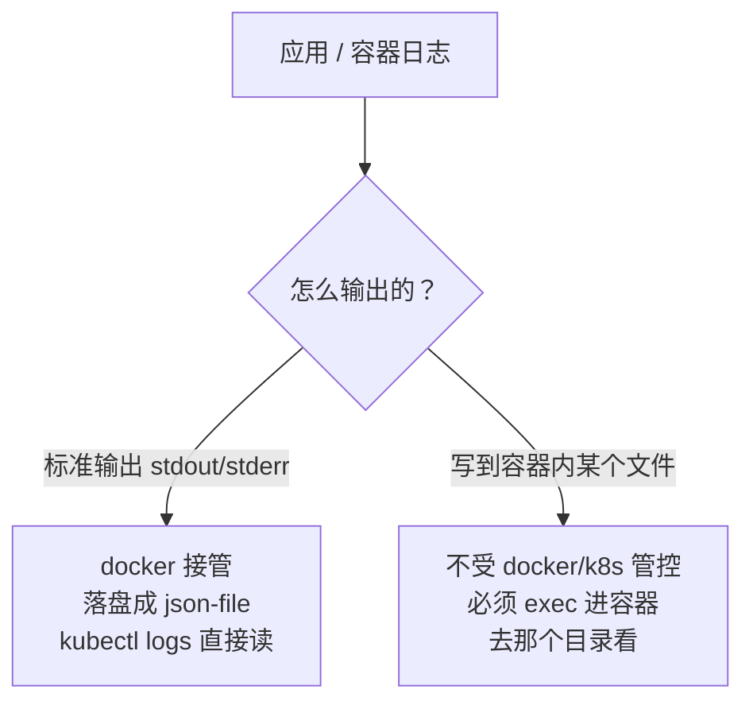

# Kubernetes 认证实战: 管理 K8s 组件日志（journalctl、kubectl logs 与两类日志形态）

查日志排障有两条明线，搞混了就只能干瞪眼。结论先给：**K8s 有两种部署方式，日志看法就不同 —— 二进制部署和 kubelet 走 `journalctl -u <服务名>`；除了 kubelet 以外的组件在 kubeadm 下都是容器化的，走 `kubectl logs -n kube-system`；而容器日志只可能是两种形态：标准输出（被 docker 接管成 json-file）或落地到容器内的文件（只能 `kubectl exec` 进容器看）。**

## 纲要

- 部署方式决定日志查看方式
- 二进制 / kubelet：`journalctl -u`
- 容器化组件：`kubectl logs -n <命名空间>`
- `--tail` 与 `-f` 两个高频选项
- 容器日志的两种形态
- 标准输出：docker 接管，json-file 在哪
- 落地文件：只能进容器看
- 排障时先看谁

## 部署方式决定看法



| 部署方式 | 组件形态 | 查看方式 |
| --- | --- | --- |
| **二进制** | 裸跑在宿主机，systemd 管 | `journalctl -u <服务名>`，或去它自定的日志目录看文件 |
| **kubeadm** | **除 kubelet 外全容器化** | `kubectl logs <pod> -n kube-system` |
| **kubelet**（无论哪种部署） | systemd 直接管，没容器化 | `journalctl -u kubelet` |

## 一、二进制与 kubelet：`journalctl -u`

先看 kubelet 这个「特殊分子」—— 它**没有容器化**，是被 systemd 直接管理的：

```bash
# systemd 单元文件在哪
systemctl status kubelet
systemctl cat kubelet       # 能看到它的启动参数与配置文件位置

# 看 kubelet 配置文件与引导文件
ls -l /etc/kubernetes/kubelet.conf      # kubelet.conf：连集群的配置
cat /etc/systemd/system/kubelet.service.d/10-kubeadm.conf
```

它的配置文件（`/var/lib/kubelet/config.yaml`）里能看到一堆关键参数：

| 参数 | 说明 |
| --- | --- |
| 认证配置 | 用什么方式认证 |
| webhook 配置 | 与 apiserver 通信方式 |
| clusterDNS | **CoreDNS 的地址** |
| clusterDomain | **DNS 域名后缀** |
| staticPodPath | **静态 Pod 的清单目录**（下节讲） |

### 看日志

```bash
# 直接执行会刷一大堆，先是系统日志
journalctl -u kubelet

# 只看 kubelet 这个 unit
journalctl -u kubelet -f              # 实时跟随（排障最常用）
journalctl -u kubelet -n 100          # 最近 100 行，不分页
journalctl -u kubelet --no-pager      # 不分页一次看完

# 重定向到文件，再用 less / vi 看，比刷屏清楚得多
journalctl -u kubelet > /tmp/kubelet.log
less /tmp/kubelet.log
grep -i error /tmp/kubelet.log
```

> **kubelet 日志是排障第一现场**。上节节点 `NotReady` 时那句 `container runtime network not ready` 就是从这里出来的。
>
> 二进制部署的其他服务同理：`journalctl -u kube-apiserver` / `-u etcd` 这样按 unit 名看。

## 二、容器化组件：`kubectl logs`

kubeadm 部署下，apiserver、etcd、scheduler、controller-manager、flannel、CoreDNS 全是 Pod：

```bash
# 控制面组件在 kube-system 下看，一定记得带 -n
kubectl logs kube-apiserver-k8s-master -n kube-system
kubectl logs kube-apiserver-k8s-master -n kube-system --tail=10
kubectl logs -f kube-apiserver-k8s-master -n kube-system
```

```bash
# 网络插件 / CoreDNS 这类也一样
kubectl logs -n kube-system -l app=flannel -f
kubectl logs -n kube-system -l k8s-app=kube-dns --tail=50
kubectl logs -n kube-system -l k8s-app=metrics-server
```

### `--tail` 与 `-f`

| 选项 | 作用 | 例子 |
| --- | --- | --- |
| `--tail=N` | 只显示**最后 N 行**（最新日志） | `--tail=10` |
| `-f` / `--follow` | **实时流**，新日志立刻刷出来 | `kubectl logs -f` |
| `--since=1h` | 只看最近一小时 | `kubectl logs --since=1h` |
| `-p` | 看**上一次**容器的日志（容器重启过才有效） | `kubectl logs -p` |

> **不加 `--tail` 会输出全部历史日志**，容器跑久了直接刷屏。所以默认习惯：`kubectl logs <pod> --tail=10`。
>
> 容器经历过重启（CrashLoopBackOff），当前日志是空的，**要看上一个容器的日志就得加 `-p`**。

## 容器日志只有两种形态



### 形态一：标准输出（最常见）

容器把日志打到 `stdout` / `stderr`，**docker 会自动接管并落盘成 json 文件**：

```bash
# docker 的日志驱动默认 json-file，路径规则固定
ls -l /var/lib/docker/containers/<容器ID>/<容器ID>-json.log
tail -f /var/lib/docker/containers/<容器ID>/<容器ID>-json.log
```

> `kubectl logs` 本质上就是**读取 docker 接管后的这个日志文件再打出来**。所以——
>
> **`kubectl logs` 只能看到「输出到控制台」的日志**。

### 形态二：落地到容器内文件

如果你的应用把日志写到 `/usr/local/nginx/logs/access.log` 这种文件里（而不是打到控制台），**docker 和 K8s 都管不着**，只能：

```bash
# 进容器，去它落地那个目录看
kubectl exec -it <pod名> -- sh
# 容器里：
tail -f /usr/local/nginx/logs/access.log
cat /usr/local/nginx/logs/error.log
```

> 类比虚拟机：**日志写到哪个目录，就去哪个目录看**，容器也一样，只是它更密集 —— 一个应用七八个、十几个容器还分散在不同节点，挨个 `exec` 进去看会累死。
>
> 解决办法（课程未讲完的部分）：**把日志目录挂载持久化出来**，或者在容器里直接输出控制台，或者上日志采集系统（EFK / Loki）。

## 目录：日志都落在哪

```text
宿主机
├── /var/log/messages                    ← 系统总日志，kubelet 常规输出也在里头
├── /var/log/pods/                       ← K8s 标准输出日志（容器运行时接管）
│   └── <命名空间>_<Pod名>_<哈希>/
│       └── <容器名>/                ← kubectl logs 读的就是这一层
├── /var/lib/docker/containers/
│   └── <容器ID>/
│       └── <容器ID>-json.log             ← docker json-file 驱动落盘
├── /etc/systemd/system/kubelet.service.d/
├── /var/lib/kubelet/config.yaml          ← kubelet 主配置（DNS、静态Pod路径...）
└── /etc/kubernetes/kubelet.conf          ← kubelet 连集群的配置

容器内部（若日志落地文件）
└── /usr/local/nginx/logs/
    ├── access.log
    └── error.log
```

## API 速览

| 目标 | 命令 |
| --- | --- |
| 看 kubelet 日志 | `journalctl -u kubelet -f` |
| 看 kubelet 最近日志落文件 | `journalctl -u kubelet > /tmp/kubelet.log` |
| 看系统总日志 | `tail -f /var/log/messages` |
| 看容器日志 | `kubectl logs <pod>` |
| 只看最后 10 行 | `kubectl logs <pod> --tail=10` |
| 实时跟日志 | `kubectl logs -f <pod>` |
| 看上次容器（重启过） | `kubectl logs -p <pod>` |
| 按标签看一组容器 | `kubectl logs -n kube-system -l app=flannel -f` |
| 看控制面组件 | `kubectl logs kube-apiserver-<节点名> -n kube-system` |
| 进容器看落地文件 | `kubectl exec -it <pod> -- sh` |
| 直接看 docker 落盘日志 | `tail -f /var/lib/docker/containers/<容器ID>/<容器ID>-json.log` |

## Demo 示例

```bash
#!/usr/bin/env bash
set -euo pipefail

POD=cka-demo

echo "==> 1. kubelet（非容器化，走 systemd）"
journalctl -u kubelet --no-pager -n 50
journalctl -u kubelet > /tmp/kubelet.log
grep -i 'error\|fail' /tmp/kubelet.log | tail -20

echo "==> 2. 容器化组件（kube-system）"
kubectl get pods -n kube-system
kubectl logs kube-apiserver-k8s-master -n kube-system --tail=10
kubectl logs -n kube-system -l app=flannel -f &

echo "==> 3. 业务 Pod 日志：tail + follow 组合"
kubectl run "$POD" --image=nginx:1.26 --restart=Never
kubectl logs "$POD" --tail=10
kubectl logs -f "$POD" &

echo "==> 4. 容器重启过，看上一次的日志"
kubectl logs "$POD" -p --tail=20

echo "==> 5. 进容器看落地型日志（应用写文件而非控制台）"
kubectl exec -it "$POD" -- sh -c 'ls -l /var/log/nginx/; tail -5 /var/log/nginx/access.log'

echo "==> 6. 找到标准输出被 docker 存在哪"
docker inspect --format '{{.Id}} {{.LogPath}}' "$POD"

echo "==> 7. 收尾"
kill %1 %2 2>/dev/null || true
kubectl delete pod "$POD" --force --grace-period=0
```

> 第 6 步的 `docker inspect --format '{{.LogPath}}'` 会直接告诉你那个 `-json.log` 的完整路径，比手工拼 ID 稳。

### 总结

- **看日志先分清组件形态**：kubelet 和二进制组件用 `journalctl -u <服务名>`；kubeadm 下除 kubelet 外全容器化，用 `kubectl logs -n kube-system`。
- `journalctl -u kubelet` 是**排障第一现场**（节点 NotReady、CNI 未就绪都在这儿报），日志多就重定向到文件再用 `grep error` 筛。
- `kubectl logs` 高频选项：`--tail=N` 只看最后 N 行（**默认会刷全量**）、`-f` 实时跟随、`-p` 看上次容器、`--since=1h` 按时间。
- **容器日志只有两种**：标准输出（docker 接管，`kubectl logs` 能读）和落地文件（docker/k8s 管不着，`kubectl exec` 进容器去看）。
- 标准输出的落盘位置：`/var/lib/docker/containers/<容器ID>/<容器ID>-json.log`，用 `docker inspect --format '{{.LogPath}}'` 拿最稳。
- 落地型日志多且分散时，靠 `exec` 挨个看不现实 —— 要么让应用输出到控制台，要么把日志目录持久化，要么上日志采集系统。

