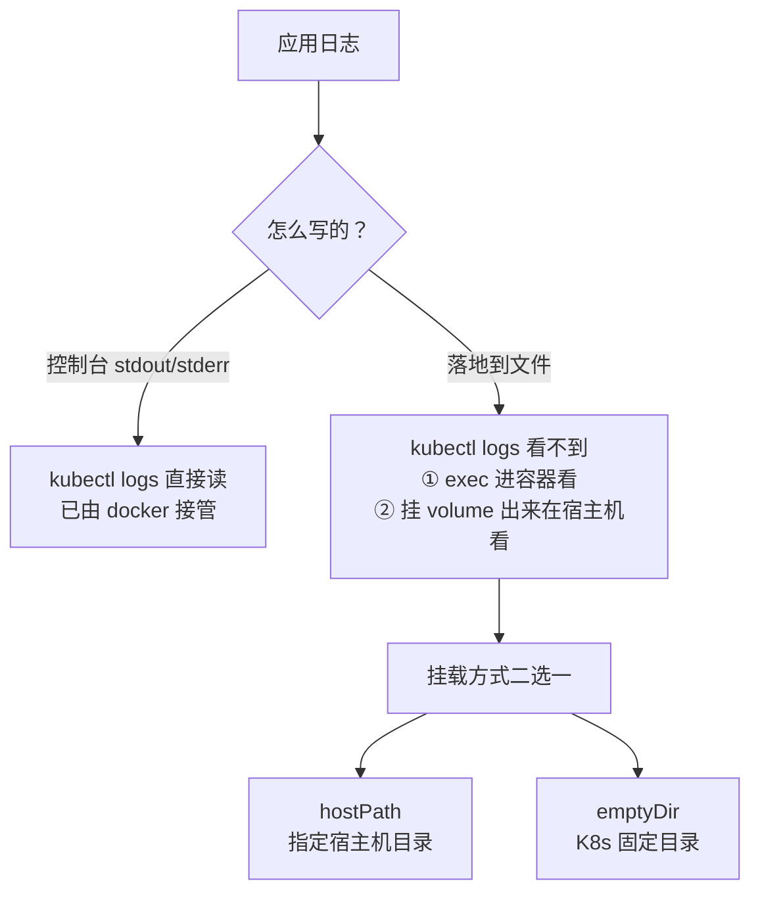
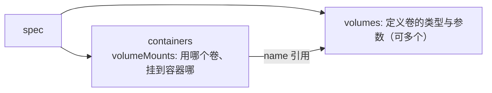
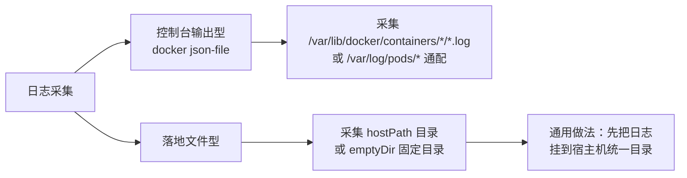

# Kubernetes 认证实战: 管理 K8s 应用程序日志（hostPath 与 emptyDir 挂载）

上一节留了个尾巴：日志落到容器里的文件，`kubectl logs` 看不到，挨个 `exec` 进去看又太累。结论先给：**解决办法是拿 volume 把日志目录挂出来 —— `hostPath` 挂到你指定的宿主机目录（最直观），`emptyDir` 由 K8s 管在固定目录（Pod 一删就没）；另外多容器 Pod 必须加 `-c <容器名>` 才知道看谁的日志。**

## 纲要

- 回顾：应用日志的两种形态
- Volumes 到底是什么，怎么在 Pod 里引用
- `hostPath`：挂到宿主机指定目录
- `emptyDir`：K8s 管的临时目录，路径固定
- 两者对比与选型
- 多容器 Pod：`kubectl logs -c`
- 日志采集的两种思路

## 先把日志形态捋清楚



> 落地到文件的日志，本质跟虚拟机一样：**日志写到哪个目录，就去哪个目录看**。麻烦的是容器密集又分散，所以正确姿势是**把它挂到宿主机上统一看**。

## Volumes 是什么，怎么引用

K8s 里的 volume 和 docker 的 volume 意思差不多，但它是 **K8s 自己实现的**。跟 docker 对应起来：

| docker | K8s |
| --- | --- |
| volume（docker 管理） | **emptyDir**（K8s 管理） |
| bind mount（挂宿主机文件/目录） | **hostPath** |

Pod yaml 里分两块写，**两边名字必须对上**：



```text
① 先在 spec.volumes 里定义卷（可定义多个，用 - 列出来）
② 再在容器 volumeMounts 里用 name 引用它
③ 通过 mountPath 决定挂到容器里的哪个目录
④ 一个卷可以被多个容器引用
```

## 方案一：hostPath 挂到宿主机目录

```yaml
apiVersion: v1
kind: Pod
metadata:
  name: mypod
spec:
  containers:
    - name: web
      image: registry.example.com/demo/nginx-php:v1
      volumeMounts:
        - name: log-volume        # 引用下面定义的卷
          mountPath: /usr/local/nginx/logs   # 挂到容器里的日志目录
  volumes:
    - name: log-volume
      hostPath:
        path: /data/nginx/logs    # ★ 宿主机上的目录
        type: DirectoryOrCreate   # 目录不存在自动创建
```

> **`type: DirectoryOrCreate`** 是 `hostPath` 的常用取值：目录存在就用，不存在就自动建。其他取值还有 `Directory` / `File` / `FileOrCreate` 等。

### 验证：日志真的挂出来了

```text
# Pod 被调度到哪个节点，就去那台机器上看
kubectl get pod mypod -o wide
```

```bash
# 在 k8s-node2 上（Pod 落在这台）
ls -l /data/nginx/logs/
# access.log  error.log     ← ★ 容器写进去的日志文件已经落在这儿了

tail -f /data/nginx/logs/access.log
```

```text
# 模拟请求：curl 一下 Pod 的 IP
10.244.2.15 - - "GET / HTTP/1.1" 200
10.244.2.15 - - "GET /index.php HTTP/1.1" 200
```

**宿主机上一个请求就多一行 access 日志，说明挂载成功**。以后查日志不用 `exec` 进容器，直接上宿主机统一目录看。

## 方案二：emptyDir 由 K8s 管固定目录

改成 `emptyDir` 就两个字段，没有路径参数：

```yaml
  volumes:
    - name: log-volume
      emptyDir: {}
```

### 它的目录在哪

`emptyDir` 由 K8s 自己管，**路径固定，你在 yaml 里指定不了**：

```text
/var/lib/kubelet/pods/<Pod UID>/volumes/kubernetes.io~empty-dir/<卷名>/
```

> ⚠️ 这里的 `<Pod UID>` 是 **Pod 的 UID（不是 Pod 名）**，而且 `kubernetes.io~empty-dir` 里的 `~` 是把原始类型名 `kubernetes.io/empty-dir` 里的斜杠替换成了 `~`。

```bash
# 找容器在那个节点、拿到 Pod UID
docker ps | grep mypod
POD_UID=$(kubectl get pod mypod -o jsonpath='{.metadata.uid}')

cd /var/lib/kubelet/pods/"$POD_UID"/volumes/kubernetes.io~empty-dir/log-volume/
ls -l
tail -f access.log
```

> **`emptyDir` 是生命周期跟随 Pod 的**：Pod 删了，目录和日志一起没了。所以它适合临时中转，不适合长期留存应用日志。

## 两者对比

| 维度 | `hostPath` | `emptyDir` |
| --- | --- | --- |
| 目录由谁定 | **你自己在 yaml 里指定** | K8s 固定路径，指定不了 |
| 目录在哪 | 你指定的宿主机路径 | `/var/lib/kubelet/pods/<UID>/...` |
|  Pod 删除后 | **日志还在**（在宿主机上） | **一起没了** |
| 多节点问题 | 要去 Pod 所在的那台机器看 | 同上 |
| 典型用途 | **日志/配置持久化到宿主机** | 容器间共享临时文件 |

> **要「宿主机上统一看日志、Pod 删了日志还在」→ 用 hostPath；只是容器间临时共享文件 → 用 emptyDir。**

## 多容器 Pod：`kubectl logs -c`

一个 Pod 里可以跑多个容器（比如 nginx + php-fpm）。这时 `kubectl logs` 会**提示你选看哪个**：

```bash
kubectl logs mypod
# 会让你选择：web / php 中的哪一个？
```

直接指定容器名就不用选了：

```bash
kubectl logs -c web mypod
kubectl logs -c php mypod -f
kubectl logs -c web mypod --tail=10
```

```yaml
    containers:
      - name: web          # ← 这个 name 就是 -c 的值
        image: nginx-php:v1
      - name: php
        image: php-fpm:v1
```

> **考试提示**：题目说「查看某容器中某日志」，多容器 Pod 一定记得 `-c`。

## 日志采集的两种思路



| 日志类型 | 默认落点 | 采集方式 |
| --- | --- | --- |
| 输出到控制台 | `/var/lib/docker/containers/<ID>/<ID>-json.log`、`/var/log/pods/<ns>_<pod>_<uid>/<容器名>/` | 用 `*` 通配递归采集即可 |
| 落地到文件 | `hostPath` 指定目录 / `emptyDir` 固定目录 | 把日志目录**先挂到宿主机**，再去采集那个目录 |

> 一句话：**落地文件型日志，靠 volume 挂到宿主机统一目录，采集端只需配一个路径**，以后上 EFK / Loki 就是这么干。

## 目录：日志挂载前后

```text
宿主机（k8s-node2）
├── /data/nginx/logs/                        ← hostPath 指定目录（Pod 删了还在）
│   ├── access.log
│   └── error.log
├── /var/lib/kubelet/pods/<Pod UID>/
│   └── volumes/kubernetes.io~empty-dir/log-volume/   ← emptyDir 固定目录
│       ├── access.log
│       └── error.log
├── /var/log/containers/                     ← 控制台输出的标准落点（推荐采集这层）
│   └── mypod_web_xxxx.log
└── /var/lib/docker/containers/<容器ID>/
    └── <容器ID>-json.log

容器内部
└── /usr/local/nginx/logs/                   ← volumeMounts 挂进来，写哪都行
```

## API 速览

| 目标 | 命令 |
| --- | --- |
| 看 Pod 日志（单容器） | `kubectl logs <pod>` |
| 看多容器 Pod 里某个容器 | `kubectl logs -c <容器名> <pod>` |
| 只看最后 N 行 | `kubectl logs <pod> --tail=10` |
| 实时跟 | `kubectl logs -f <pod>` |
| 看上次容器日志 | `kubectl logs -p <pod>` |
| 找 Pod 落在哪个节点 | `kubectl get pod <pod> -o wide` |
| 拿 Pod UID | `kubectl get pod <pod> -o jsonpath='{.metadata.uid}'` |
| 拿容器名 | `kubectl get pod <pod> -o jsonpath='{.spec.containers[*].name}'` |
| 看容器里的挂载 | `kubectl get pod <pod> -o yaml \| grep -A5 volumeMounts` |

## Demo 示例

```bash
#!/usr/bin/env bash
set -euo pipefail

echo "==> 1. hostPath：把容器日志挂到宿主机 /data/nginx/logs"
# 先确认目录建好（有 DirectoryOrCreate 也可以不建）
ssh root@k8s-node2 'mkdir -p /data/nginx/logs'

kubectl apply -f - <<'YAML'
apiVersion: v1
kind: Pod
metadata:
  name: mypod
spec:
  containers:
    - name: web
      image: registry.example.com/demo/nginx-php:v1
      volumeMounts:
        - name: log-volume
          mountPath: /usr/local/nginx/logs
  volumes:
    - name: log-volume
      hostPath:
        path: /data/nginx/logs
        type: DirectoryOrCreate
YAML

echo "==> 2. 看 Pod 落在哪台机器，去那台机器看"
kubectl get pod mypod -o wide
ssh root@k8s-node2 'ls -l /data/nginx/logs/'

echo "==> 3. 造点请求，日志立刻出现在宿主机"
POD_IP=$(kubectl get pod mypod -o jsonpath='{.status.podIP}')
curl -s -o /dev/null "http://${POD_IP}/"
curl -s -o /dev/null "http://${POD_IP}/index.php"
ssh root@k8s-node2 'tail -5 /data/nginx/logs/access.log'

echo "==> 4. 多容器：看指定容器"
kubectl logs -c web mypod --tail=10
kubectl logs -c php mypod --tail=10

echo "==> 5. emptyDir：改一下卷类型，看固定路径"
kubectl get pod mypod -o jsonpath='{.metadata.uid}'
ssh root@k8s-node2 'ls -d /var/lib/kubelet/pods/*/volumes/kubernetes.io~empty-dir/*'
```

> 第 1 步用 `kubectl apply -f -` 接 here-doc 是**最省事的写法** —— 临时验证不用先落文件。

### 总结

- 落地到文件的容器日志，`kubectl logs` 看不见；要么 `exec` 进容器，要么**用 volume 挂到宿主机统一看**。
- **K8s volume 对应 docker**：`emptyDir` ≈ docker volume（K8s 管），`hostPath` ≈ docker bind mount（挂宿主机）。
- 用法分两块：`spec.volumes` 定义卷（一个卷用 `-` 定义多个），容器里 `volumeMounts` 用 `name` 引用 + `mountPath` 指定挂载点，**两边名字必须一致**。
- **`hostPath` 挂你自己指定的宿主机目录**（`type: DirectoryOrCreate` 可自动建目录），Pod 删了日志还在；**`emptyDir` 是 K8s 固定路径** `/var/lib/kubelet/pods/<Pod UID>/volumes/kubernetes.io~empty-dir/<卷名>/`，Pod 删了日志也没了。
- 多容器 Pod 看日志必须加 **`-c <容器名>`**，否则会让你二选一。
- 采集思路：控制台输出型直接采 `/var/log/containers/` 或 docker 的 json-file；落地文件型**先把日志挂到宿主机统一目录，再采那个目录**。

