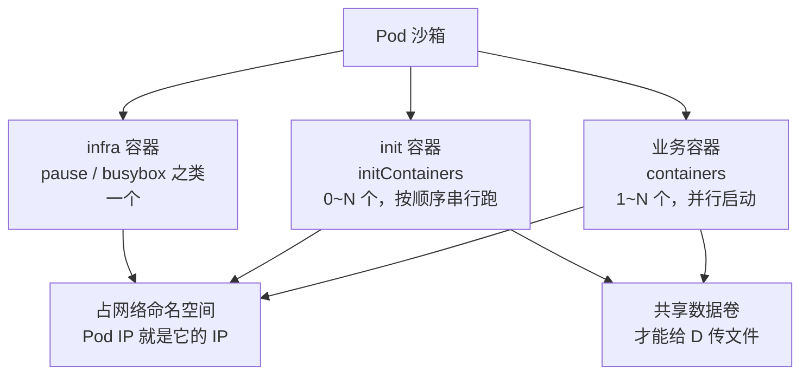
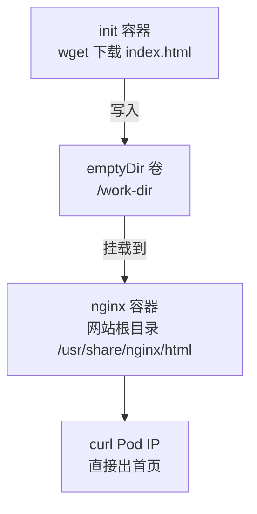

## 纲要

- 一个 Pod 里的三类容器：infra 容器、init 容器、业务容器
- InitContainer 的两条硬特性：配置与普通容器完全通用、串行优先于业务容器执行
- 为什么要有 init 容器：依赖等待、配置生成、代码拉取、工具集镜像
- 文件系统默认是隔离的，跨容器传文件必须靠共享卷（emptyDir）
- 一个完整 Demo：init 容器下载首页 → nginx 容器直接发布
- 考试易错点：init 容器不支持探针、失败后的 Pod 状态长什么样

## 正文

### 先看清 Pod 里到底有几个容器

一个 Pod 启动之后，你在 `kubectl describe` 里看到的容器并不只有你在 yaml 里写的那几个。Pod 一共会派生出三类容器：



| 容器类型 | 数量 | 是否可见 | 作用 |
| --- | --- | --- | --- |
| infra（pause） | 恒为 1 | 业务看不到，但占着 Pod IP 与 netns | 网络命名空间、PID 命名空间维护 |
| init | 0 ~ N | `kubectl describe` 里单独一列 Init Containers | 跑完就退，给业务容器铺路 |
| 业务 | 1 ~ N | `kubectl get pod` 默认看到的 | 真正干活、收流量 |

infra 容器是 kubelet 自动起的，你写 yaml 里没有它；业务容器才是你日常配置的 `containers`。init 容器介于两者之间：它写在独立的 `initContainers` 字段里，不显示成业务容器，也不接流量。

### InitContainer 的两条硬特性

**特性一：配置参数和普通容器完全通用**

init 容器也是容器，它支持 `image`、`command`、`args`、`env`、`volumeMounts`、`resources`、`securityContext` 这些几乎全部字段。所以不要把它理解成某种特殊对象，它就是"一个先跑、跑完就退的普通容器"。

**特性二：串行、优先执行**

这是它设计的出发点。对比一下两种容器的启动方式：

| | 启动方式 | 失败行为 |
| --- | --- | --- |
| 业务容器 | 从上到下**并行**一起起，谁先就绪谁先服务 | 起不来就一直 CrashLoopBackOff |
| init 容器 | 按 yaml 里**从上到下串行**执行，前一个成功才跑下一个 | 前一个失败，Pod 卡在 Init 状态 |

关键点在于：业务容器之间是完全并行的，你写三个容器它们就同时起。而 init 容器必须一个跑完、退出码为 0、下一个才动手。整个 init 阶段全部成功之后，业务容器才会并行启动。

另外两点容易忘：

- init 容器**只跑一次**，业务容器是长期运行的。init 容器每次 Pod 起来都会重跑，所以它的命令必须幂等。
- init 容器**不显示**在 `kubectl get pod` 的 Ready 列里，也没人给它发流量。它跑完就退，之后就不在了。

### 四种典型应用场景


| 场景 | 业务容器说了什么 | init 容器干什么 | 真实例子 |
| --- | --- | --- | --- |
| 依赖等待 | "连不上 DB 我起也没意义" | 用 `nc -z` / `wget` 轮询探测 DB 端口，通了才退出 | Web 服务依赖 MySQL、Redis |
| 配置生成 | "我不知道该连谁" | 从已有节点读信息拼出配置文件，写进共享目录 | etcd / zookeeper 集群首次拉起 |
| 拉代码 | "镜像里没带代码" | `git clone` 到共享目录，需要就顺手编译 | PHP 这类不编译的脚本语言 |
| 工具集镜像 | "我不想为了 sed 把镜像撑大" | 用带 git/jq/sed 的工具镜像改配置模板 | 开发/测试/生产环境的 DB 地址不同 |

场景④ 尤其值得记：为了精简主镜像，业务镜像里常常连 `git`、`jq`、`awk`、`sed` 都没有。与其在每个业务镜像里都塞一遍环境替换脚本，不如单独做一个"工具集镜像"给 init 容器用——每次启动让它去改数据库连接地址、缓存地址就行，业务容器照原样启动。这样既不用给每个项目镜像打同一段逻辑，耦合也降下来了。

### 最大的坑：文件系统是隔离的

init 容器就算生成了配置文件，业务容器也**看不见**——因为它们各有各的独立文件系统，互相看不到对方的文件。

这一点正是 Pod 的设计者们刻意打破的两处机制之一：

- **网络命名空间**：共享（所以 init 容器里 `localhost:3306` 就是业务容器里的 `localhost:3306`，Pod IP 也通）
- **文件系统**：隔离（所以必须靠共享数据卷传文件）

想通这一点，Demo 的结构就是自然结论了：



写一个空卷，两边一起挂：init 容器往里写，nginx 容器把它当网站根目录。文件一落进共享卷，就等于落到了宿主机的真实目录上，对方自然读得到。

### Pod 的状态会停在 Init

init 阶段没跑完时，`kubectl get pod` 的状态列长这样：

| 阶段 | 状态显示 | 含义 | 排查动作 |
| --- | --- | --- | --- |
| 还没开始跑 | `Init:0/1` | 第一个 init 容器正在跑 | 看 init 容器的日志 |
| 第一个在重试 | `Init:Error` / `Init:CrashLoopBackOff` | init 容器退出了但没成功，在重启 | `describe` 看 Events + 看日志 |
| 卡在拉取镜像 | `Init:ImagePullBackOff` | init 镜像名写错或拉不动 | `describe` 看 Events |
| init 全部成功 | `Running` | 业务容器正在并行启动 | 正常 |

注意 init 容器不会出现在 `kubectl get pod` 的行里，要单独 `describe` 才会看到它属于 Init Containers，`kubectl logs` 也要指名 init 容器的名字。

Pod 目录结构长这样，方便你去宿主机上肉眼核对：

```
/var/lib/kubelet/pods/
└── <Pod UID>/
    ├── volumes/
    │   └── kubernetes.io~empty-dir/
    │       └── work-dir/            ← 空卷挂在宿主机上的真实目录
    │           └── index.html       ← init 容器 wget 下来的首页
    └── containers/
        ├── init-demo/               ← init 容器跑完就退，目录留着
        └── nginx/                   ← 业务容器
```

那个 `~` 是目录名里的斜杠被转义的结果：`kubernetes.io~empty-dir` 实际对应 `kubernetes.io/empty-dir`。

## API 速览

| API / 字段 | 说明 |
| --- | --- |
| `spec.initContainers[]` | init 容器列表，从上到下串行执行 |
| `spec.containers[]` | 业务容器列表，并行启动 |
| `spec.volumes[]` | 数据卷定义，init 与业务共享靠它 |
| `spec.containers[].volumeMounts[]` | 容器侧挂载点，靠 `name` 关联卷 |
| `spec.restartPolicy` | init 容器失败后是否重启（默认 Always） |
| `kubectl logs <pod> -c <init名>` | 看 init 容器日志，`-c` 必填 |
| `kubectl describe pod <pod>` | Events 段能看到 init 阶段的报错 |

常用写法模板：

```bash
# 变量先备好，后面全靠它
POD=init-demo
NS=default
INIT_NAME=download

# 看 init 阶段卡在哪
kubectl get pod "$POD" -n "$NS"
kubectl describe pod "$POD" -n "$NS" | grep -A5 -i init

# init 容器的日志必须指名容器名（业务容器看不到它）
kubectl logs "$POD" -c "$INIT_NAME" -n "$NS"

# 上一次的 init 容器日志（它已经退出了）
kubectl logs "$POD" -c "$INIT_NAME" -p -n "$NS"

# 业务容器（nginx）的日志
kubectl logs "$POD" -c nginx -n "$NS"

# 进业务容器看挂载进去的共享目录
kubectl exec -it "$POD" -c nginx -n "$NS" -- sh -c 'ls -l /usr/share/nginx/html'
```

## Demo 示例

目标：init 容器用 `wget` 从官网拉一个首页，落到空卷；nginx 容器把这个卷当网站根目录，访问 Pod IP 直接出这个首页。

```yaml
apiVersion: v1
kind: Pod
metadata:
  name: init-demo
spec:
  volumes:
    - name: work-dir          # 空卷，init 与 nginx 共用
      emptyDir: {}
  initContainers:
    - name: download          # init 容器名，记下来给 logs -c 用
      image: busybox:1.32
      command:
        - wget
        - "-O"
        - "/work-dir/index.html"
        - "https://kubernetes.io/"
      volumeMounts:
        - name: work-dir
          mountPath: /work-dir
  containers:
    - name: nginx
      image: nginx:1.19
      ports:
        - containerPort: 80
      volumeMounts:
        - name: work-dir
          mountPath: /usr/share/nginx/html    # nginx 的默认网站根目录
```

落地执行：

```bash
# 1. 起 Pod（用管道直接喂给 apply，不用先落文件）
cat <<'EOF' | kubectl apply -f -
apiVersion: v1
kind: Pod
metadata:
  name: init-demo
spec:
  volumes:
    - name: work-dir
      emptyDir: {}
  initContainers:
    - name: download
      image: busybox:1.32
      command: ["wget", "-O", "/work-dir/index.html", "https://kubernetes.io/"]
      volumeMounts:
        - name: work-dir
          mountPath: /work-dir
  containers:
    - name: nginx
      image: nginx:1.19
      ports:
        - containerPort: 80
      volumeMounts:
        - name: work-dir
          mountPath: /usr/share/nginx/html
EOF

# 2. 起手先看到 Init 状态，说明 init 容器正在跑
kubectl get pod init-demo
# NAME        READY   STATUS     RESTARTS   AGE
# init-demo   0/1     Init:0/1   0          3s

# 3. init 跑完才轮到业务容器，状态才变 Running
kubectl get pod init-demo -w
# 等它变成 Running 1/1 再往下走

# 4. 拿到 Pod IP 直接访问
POD_IP=$(kubectl get pod init-demo -o jsonpath='{.status.podIP}')
curl "http://${POD_IP}:80" | head -5
```

验证共享卷到底通没通：

```bash
# 进 nginx 容器看首页是不是 init 容器下下来的
kubectl exec -it init-demo -c nginx -- sh -c 'ls -l /usr/share/nginx/html'

# 去宿主机上找这个空卷对应的真实目录（Pod 在哪个节点就去哪台机器）
NODE=$(kubectl get pod init-demo -o jsonpath='{.spec.nodeName}')
echo "Pod 在节点: ${NODE}"
# 在这台机器上：
# /var/lib/kubelet/pods/<Pod UID>/volumes/kubernetes.io~empty-dir/work-dir/index.html
```

如果你把 init 容器换成 `git clone`，整段逻辑一模一样，只需要把 `command` 换成 shell 数组的 `["sh", "-c", "git clone <仓库> /work-dir && cd /work-dir && make"]` 就行——下拉、编译、生成配置，全塞在 init 阶段，业务容器还是那个纯镜像。

### 总结

init 容器的价值就一句话：**把"业务启动前必须先做完的事"从应用脚本里搬出来，交给集群编排层**。DB 没起来就别起来、配置文件没生成就别起来、代码没拉下来就别起来——这些判断以前要每个镜像自己写一遍，现在声明在 `initContainers` 里就行。

考试里要记住三个判分点：一是 init 容器**串行**跑、业务容器**并行**起来；二是两者文件系统隔离，传文件必须挂同一个 `volumes` 里的卷；三是看日志要 `kubectl logs <pod> -c <init 容器名>`，init 容器不出现在默认列表里。另外 init 容器不支持 `livenessProbe` 和 `readinessProbe`，别在它上面写探针。

