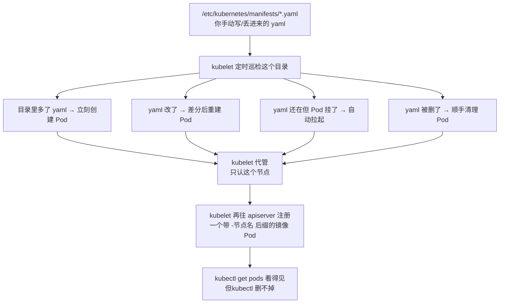
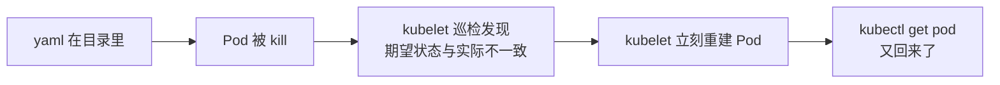
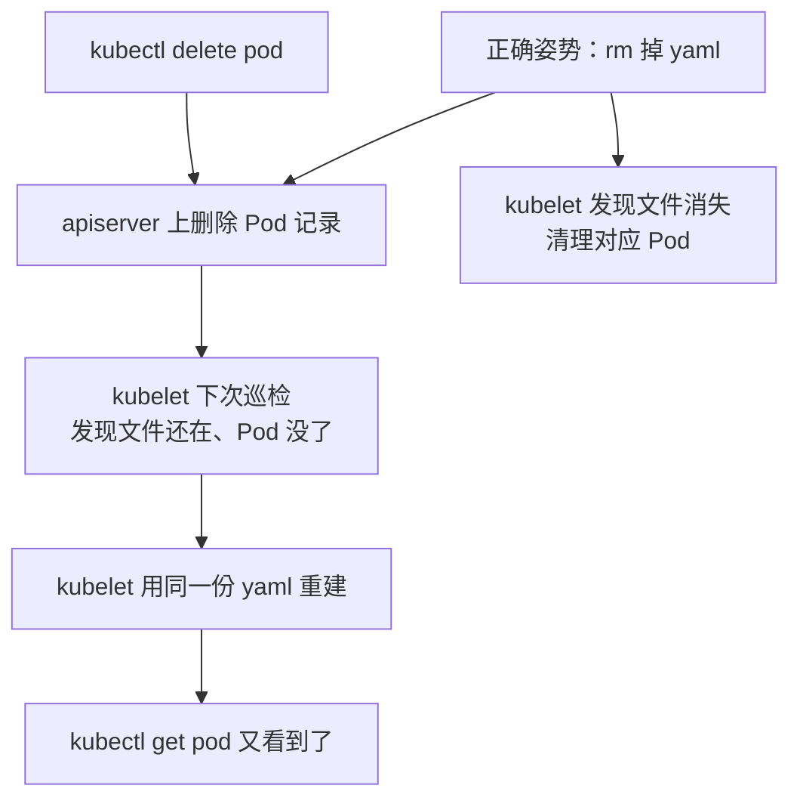
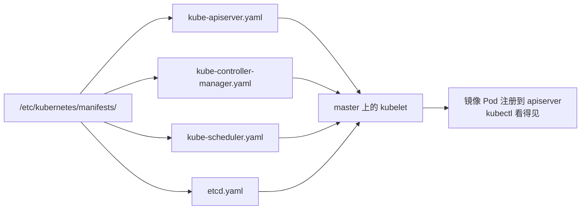

## 纲要

- 静态 Pod 是什么：kubelet 直接盯着一个目录，目录里的 yaml 就是 Pod 定义
- 四个特点：只在本地节点、没有控制器、挂了自动拉起、kubelet 持续巡检目录
- 控制面组件（apiserver / scheduler / controller-manager / etcd）本身就是静态 Pod
- 怎么起、怎么删，以及为什么 `kubectl delete` 删不掉它
- CKA 出题话术：「在某个节点上创建一个由 Kubernetes 托管的 Pod」直接对应静态 Pod

## 正文

### 静态 Pod 就从 kubeadm 装集群那一步带出来的

回想一下 kubeadm init 的十阶段，其中 control-plane 阶段干的事，就是把 apiserver、kube-scheduler、kube-controller-manager 三个组件的 Pod 定义直接丢进 master 上的一个固定目录，然后由 kubelet 把它们跑起来。这个目录就是静态 Pod 的工作目录。



### 目录从哪来、在哪配

kubeadm 装的集群，默认路径是 `/etc/kubernetes/manifests`，它由 kubelet 配置文件指定：

| 配置位置 | 写法 | 说明 |
| --- | --- | --- |
| kubelet 启动参数 | `--pod-manifest-path=/etc/kubernetes/manifests` | 老版本常见 |
| kubelet 配置文件 | `staticPodPath: /etc/kubernetes/manifests` | 1.18 起 `config.yaml` 里这么写 |

查看当前节点用的是哪条：

```bash
# 看 kubelet 的启动参数
ps -ef | grep kubelet | head -1
# 看 kubelet 配置文件里的静态 Pod 路径
grep -i staticpod /var/lib/kubelet/config.yaml
cat /etc/kubernetes/kubelet.conf
```

master 上这个目录是满的，node 上是空的——因为只有部署了控制面组件的地方才会往里丢文件：

```
/etc/kubernetes/manifests/
├── kube-apiserver-master.yaml
├── kube-controller-manager-master.yaml
├── kube-scheduler-master.yaml
└── etcd.yaml
# 业务节点上这个目录是空的（或不存在）
```

### 四个特点（考试就考这些）

**特点一：只在特定节点上由那个节点的 kubelet 管理**

静 态 Pod 不能像普通 Pod 那样 `kubectl run` 出来。你在 apiserver 上没有权限也没有入口去创建它，它只认"某个节点上的 kubelet"。想在哪台机器起，就 ssh 到那台机器，把 yaml 放到那台机器的目录里。

**特点二：没有任何控制器**

普通 Pod 背后挂着 ReplicaSet / Deployment，静态 Pod 背后什么都没有。没有副本数、没有滚动更新、没有 HPA 的那一套编排能力。

**特点三：Pod 挂了 Kubernetes 会自动拉起**



**特点四：kubelet 持续巡检目录本身**

这是最容易考、也最容易翻车的一条。新增 yaml → 起 Pod；yaml 还在的时候你 `kubectl delete pod` → 过两秒它又回来；真正想删，只能把 yaml 从目录里拿掉。

### 起一个静态 Pod 试试

目标：在 node1 上放一个 nginx 的 Pod 定义，看它被 kubelet 接管起来：

```bash
# 1. 到目标节点上（必须物理登录那台机器）
ssh root@node1

# 2. 确认目录是空的
ls /etc/kubernetes/manifests/
# 业务节点这里通常是空的

# 3. 写一个最简 Pod yaml 丢进去
cat > /etc/kubernetes/manifests/static-nginx.yaml <<'EOF'
apiVersion: v1
kind: Pod
metadata:
  name: static-nginx
  labels:
    app: static-nginx
spec:
  containers:
    - name: nginx
      image: nginx:1.19
      ports:
        - containerPort: 80
EOF

# 4. 回到任意能连集群的节点，看它已经被创建出来
kubectl get pods -A
# kube-system   static-nginx-node1   1/1     Running   0   10s
#                              ↑ 注意名字后面自动拼了节点名
```

注意看结果里的两个细节：

- Pod 名字后面被 kubelet 自动加了一个 `-<节点名>` 后缀，`static-nginx` 变成了 `static-nginx-node1`。
- 它出现在 `kube-system` 之外的默认命名空间里，但状态归 kubelet 管。

### 为什么 kubectl delete 删不掉

现在把刚起的 Pod 删掉试试：

```bash
# 删掉试试
kubectl delete pod static-nginx-node1
kubectl get pods
# 名称列还空着，或者过两秒又冒出来
# 再看一遍：
kubectl get pods -o wide
# static-nginx-node1   1/1   Running   0   3s   ← 又活了
```

原因就在特点三、四：kubelet 一直在比"目录里的 yaml"和"集群里的真实状态"，你把 Pod 删了，yaml 还在，kubelet 判定为"需要补一个"，立刻重建。完整链路：



正确删除姿势只有一条：**把 yaml 从目录里删掉**。

```bash
# 在 node1 上执行
rm -f /etc/kubernetes/manifests/static-nginx.yaml

# 确认 Pod 真的是被清理的，不是短暂消失
kubectl get pods
# 什么都不显示了
```

如果删 yaml 之后 `kubectl get pods` 里还留着一个残留的镜像 Pod 记录，就把它从 apiserver 上补删一次：

```bash
kubectl delete pod static-nginx-node1 --grace-period=0 --force
```

补齐迁移场景：想给静态 Pod 做版本升级，不用先删后加，**直接覆盖写同名的 yaml 文件**，kubelet 对比哈希发现变了，会自动重建这个 Pod。

### 镜像 Pod（Mirror Pod）是什么

静态 Pod 由 kubelet 在本地跑，但 apiserver 上完全看不到来源，所以 kubelet 会额外往 apiserver 注册一个"镜像"——一个有 annotation 的特殊 Pod 对象：

```bash
kubectl get pod static-nginx-node1 -o yaml | grep -A4 annotations
# kubernetes.io/config.mirror: ...
# kubernetes.io/config.source: file        ← 这一条就是静态 Pod 的身份证
```

`kubernetes.io/config.source: file` 这一行注释就是判断依据：看到它就说明这个 Pod 来源是本地文件，别想着用控制器去管它。

## API 速览

| 对象 / 字段 | 说明 |
| --- | --- |
| `spec.staticPodPath` | kubelet 配置里的静态 Pod 目录路径 |
| `--pod-manifest-path` | kubelet 启动参数等价写法（老版本） |
| `/etc/kubernetes/manifests/` | kubeadm 集群默认静态 Pod 目录 |
| annotation `kubernetes.io/config.source` | 值为 `file` 表示这是 kubelet 从目录管的 Pod |
| annotation `kubernetes.io/config.mirror` | 镜像 Pod 上的标记 |
| Pod 名称后缀 `-<nodeName>` | 静态 Pod 创建出来会自动带上节点名 |

排查与操作命令：

```bash
# 确认 kubelet 用的是哪个静态目录
systemctl show kubelet -p ExecMainStartTimestamp >/dev/null
ps -ef | grep "[k]ubelet" | grep -o -- "--pod-manifest-path=[^ ]*"
grep -A2 staticPodPath /var/lib/kubelet/config.yaml

# 看 kubelet 对静态 Pod 的操作日志
journalctl -u kubelet -f | grep -i "static\|manifests"

# 静态 Pod 列表里认 source=file 的
kubectl get pods -A -o custom-columns=\
NAME:.metadata.name,NODE:.spec.nodeName,SOURCE:.metadata.annotations.'kubernetes\.io/config\.source'

# 起 / 删（在节点本地执行）
CAT=/etc/kubernetes/manifests/static-nginx.yaml
cat "$CAT"
rm -f "$CAT"
```

## Demo 示例

在指定节点上起一个静态 Pod，并完整演示"删不掉 → 正确删除"：

```bash
#!/usr/bin/env bash
set -euo pipefail

NODE=node1
MANIFEST=/etc/kubernetes/manifests/static-nginx.yaml

# 1) 登录到目标节点（必须在那台机器上放文件）
ssh "root@${NODE}" "mkdir -p /etc/kubernetes/manifests"

cat > "$MANIFEST" <<EOF
apiVersion: v1
kind: Pod
metadata:
  name: static-nginx
  labels:
    app: static-nginx
spec:
  containers:
    - name: nginx
      image: nginx:1.19
      ports:
        - containerPort: 80
EOF

# 2) 等 kubelet 巡检到，Pod 出现
kubectl get pods -w &
sleep 5
kubectl get pods

# 3) 故意 delete，验证它会自动回来
kubectl delete pod static-nginx-"${NODE}"
sleep 5
kubectl get pods
# → 又 Running 了，证明 delete 无效

# 4) 正确的删除：把 yaml 拿掉
ssh "root@${NODE}" "rm -f $MANIFEST"
kubectl get pods
# → 空
```

如果用 kubeadm 装的集群，master 上四个控制面组件就是这个机制的活标本：



### 总结

静态 Pod 的考点非常固定：题目如果说「在某某节点上创建一个由 Kubernetes 托管的 Pod」「Pod 不用 kubectl 创建」「删了又自己冒出来」，答案就是静态 Pod。做法只有一步——ssh 到那台机器，把 Pod 的 yaml 丢进 `/etc/kubernetes/manifests/`（或 kubelet 配置里 `staticPodPath` 指向的目录）。

三个必须记住的行为：kubelet 只管**本地节点**、Pod 挂了它**自己拉起、`kubectl delete` 没用**、想删只能**删 yaml**。另外静态 Pod 名字会自带 `-<节点名>` 后缀，apiserver 上能看到但带着 `kubernetes.io/config.source: file` 注解，这些细节都是判断题的常客。实际生产用得不多，主要就是 kubeadm 用它拉起控制面组件。

