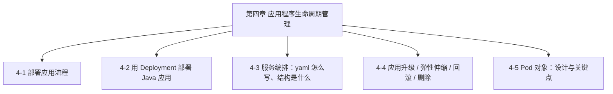
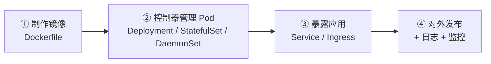
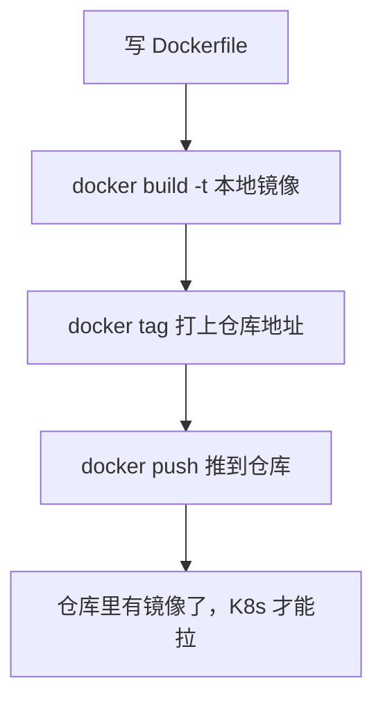
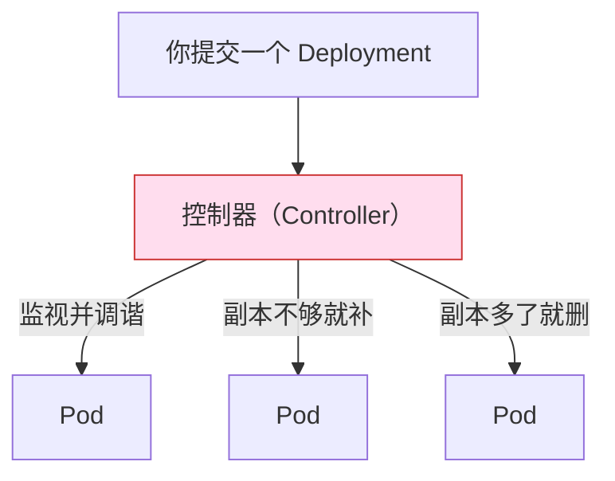
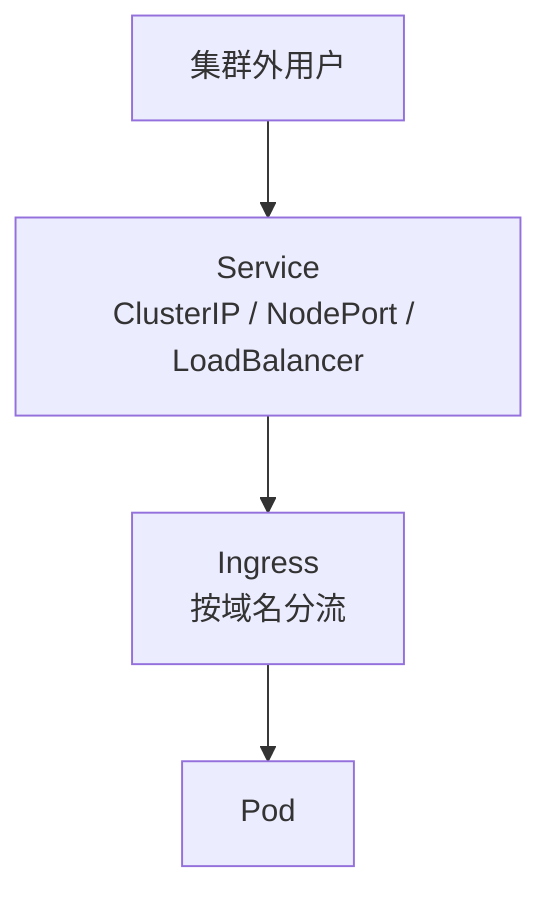

# Kubernetes 认证实战: 在 K8s 部署应用的四步流程（镜像 → 控制器 → 暴露 → 发布）

前面几节零散地跑过几个应用，这一节把「部署一个应用到 K8s」这件事串成完整链条。结论先给：**四步 —— ① 用 Dockerfile 制作/获取镜像 → ② 用**控制器**管理 Pod（不要裸跑 Pod）→ ③ 用 Service / Ingress 把应用暴露出去 → ④ 对外发布并接上日志监控。其中「为什么必须用控制器而不是直接跑 Pod」是本章的核心命题。**

## 纲要

- 第四章五小节地图
- 第一步：制作镜像，K8s 其实不关心你怎么构建的
- 为什么要自制镜像（定制化 / 标准化）
- 第二步：用控制器管理 Pod
- 控制器实现了什么（滚动更新 / 回滚 / 扩缩容）
- 第三步：暴露应用 Service 与 Ingress
- 第四步：发布、日志与监控
- 完整命令链

## 第四章地图



| 小节 | 主题 |
| --- | --- |
| 4-1 | 在 K8s 部署应用程序的整体流程 |
| 4-2 | 用 Deployment 部署一个 Java 应用 |
| 4-3 | 服务编排：yaml 的写法与结构 |
| 4-4 | 升级、弹性伸缩、回滚、删除 |
| 4-5 | Pod 对象本身的设计与要点 |

## 四步流程



## 第一步：制作镜像



- 构建方式：**`Dockerfile`** 是唯一入口，所以要回头补一下 docker 基础（三五天就能上手）。
- 镜像来源两个：**官方镜像**（`hub.docker.com` 上数百万个，docker 默认就从这里拉）或**自己构建**。

> **对 K8s 来说，它根本不关心你的镜像是怎么构建出来的** —— K8s 只负责「把你的镜像在节点上跑起来」这一层更高级的调度与编排管理。

### 那为什么还要自己造镜像？

```text
自制镜像的三个真实动机
├── 定制化   官方镜像缺模块 → 自己把模块打进去
│            例：给 MySQL 装插件、给 nginx 启用某个默认没开的模块
├── 标准化   每个企业的规范不同 → 软件装哪个目录、默认启用哪些参数
│            例：目录约定、启动参数、调优项，官方镜像很难全符合
└── 其余     本质上都源于上面两条（合规、基线、安全加固等）
```

| 场景 | 用官方镜像 | 自制镜像 |
| --- | --- | --- |
| 直接跑一个 nginx 对外提供静态页 | ✅ | 不必 |
| 官方缺你需要的模块 | ❌ | ✅ |
| 企业有统一的目录/参数规范 | ❌ | ✅ |
| 需要塞入内部证书、配置基线 | ❌ | ✅ |

## 第二步：用控制器管理 Pod

这是本章**最重要的认知转变**。



> **不要直接裸跑 Pod。** 控制器（Deployment / StatefulSet / DaemonSet）才是管理 Pod 的标准姿势。

### 控制器到底解决了什么

| 能力 | 裸 Pod 有没有 | 控制器 |
| --- | --- | --- |
| 副本数维持 | ❌ 挂了就永久没了 | ✅ 控制器自动重建 |
| 滚动更新 | ❌ | ✅ 控制器分层实现 |
| 回滚 | ❌ | ✅ 记录历史版本可 undo |
| 扩缩容 | ❌ 手改 | ✅ `kubectl scale` |
| 有状态/每节点一份 | ❌ | StatefulSet / DaemonSet 各自支持 |

**滚动更新、回滚这些能力都是在「控制器层」实现的，不是 Pod 自己能干的。**

## 第三步：把应用暴露出去

镜像跑进 Pod 了，但**集群外访问不到**。这就轮到 Service 和 Ingress：



> Service 解决「怎么找到 Pod（服务发现 + 负载均衡）」，Ingress 解决「按域名/路径对外暴露」。这两个会有专门章节展开。

## 第四步：发布、日志与监控

应用跑起来之后，剩下的活儿：

```text
④ 对外发布之后
├── 对外发布     域名接入、LB、灰度
├── 日志         组件日志 / 应用日志（上一章讲过两种形态）
└── 监控         kubectl top + 完整监控方案
```

## 完整命令链

```bash
#!/usr/bin/env bash
set -euo pipefail

echo "==> ① 镜像：Dockerfile 构建 + 打标签 + 推送"
docker build -t demo-javademo:v1 .
docker tag demo-javademo:v1 harbor.example.com/demo/demo-javademo:v1
docker push harbor.example.com/demo/demo-javademo:v1

echo "==> ② 控制器：用 Deployment 管 Pod（不是裸 Pod）"
kubectl create deployment javademo \
  --image=harbor.example.com/demo/demo-javademo:v1 \
  --port=8080 --replicas=2

kubectl get deploy
kubectl get rs              # ReplicaSet 是 Deployment 管 Pod 的中间层
kubectl get pods -o wide

echo "==> ③ 暴露：Service"
kubectl expose deploy javademo --type=NodePort --port=8080
kubectl get svc

echo "==> ④ 发布后：日志与监控"
kubectl logs -f deploy/javademo --tail=10
kubectl top pods
```

> ② 里的 **`kubectl create deployment`（控制器）替代了裸 `kubectl run pod`**，这是后面几节的 main 主线。

## API 速览

| 目标 | 命令 |
| --- | --- |
| 构建镜像 | `docker build -t <名>:<tag> .` |
| 打标签 | `docker tag <本地名> <仓库>/<名>:<tag>` |
| 推镜像 | `docker push <仓库>/<名>:<tag>` |
| 用控制器建应用 | `kubectl create deployment <名> --image=镜像 --replicas=2` |
| 暴露成 Service | `kubectl expose deploy <名> --type=NodePort --port=<端口>` |
| 看控制器与 Pod | `kubectl get deploy,rs,pods` |
| 看 Pod 落在哪 | `kubectl get pods -o wide` |
| 看应用日志 | `kubectl logs deploy/<名> --tail=10` |

## Demo 示例

一条命令走完四步的「最小可跑版本」：

```bash
# ① 镜像里得有东西（这里用官方 nginx 顶替自制镜像）
# ② 控制器
kubectl create deployment demo-web --image=nginx:1.26 --replicas=2 --port=80

# ③ 暴露
kubectl expose deployment demo-web --type=NodePort --port=80
kubectl get svc demo-web
# 拿到 NodePort 后：curl http://<节点IP>:<NodePort>

# ④ 验证
kubectl get pods -o wide
kubectl logs deploy/demo-web --tail=5
kubectl top pods
```

要把「第 ① 步自制镜像」接进来的完整形态：

```bash
# Dockerfile 示例（自制镜像的最小骨架）
cat <<'EOF' > Dockerfile
FROM nginx:1.26
COPY ./index.html /usr/share/nginx/html/index.html
RUN echo 'server_tokens off;' >> /etc/nginx/conf.d/default.conf
EOF

docker build -t demo-web:v1 .
docker tag demo-web:v1 harbor.example.com/demo/demo-web:v1
docker push harbor.example.com/demo/demo-web:v1

kubectl create deployment demo-web \
  --image=harbor.example.com/demo/demo-web:v1 --replicas=2 --port=80
kubectl expose deployment demo-web --type=NodePort --port=80
```

### 总结

- 部署应用到 K8s 就**四步**：制作镜像 → 控制器管 Pod → Service/Ingress 暴露 → 对外发布 + 日志监控。
- **Dockerfile 是制作镜像的唯一入口**；官方镜像（hub.docker.com）够用时直接用，不够就自己造 —— 动机主要是**定制化（补官方缺的模块）**和**标准化（目录约定、启动参数、企业规范）**。
- **K8s 不关心镜像怎么构建**，它只负责把镜像在节点上跑起来；构建与推送环节由 docker 负责。
- **绝不裸跑 Pod** —— 副本维持、滚动更新、回滚、扩缩容这些能力全在**控制器层**实现，Deployment / StatefulSet / DaemonSet 各管一摊。
- Service 解决「找到 Pod」，Ingress 解决「按域名对外暴露」，两者缺一不可。
- 命令行主线：`create deployment` 代替 `run pod`，`expose deployment` 生成 Service，再加 `logs` 与 `top` 收尾。

