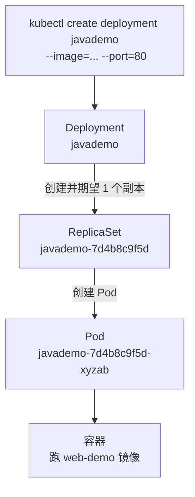
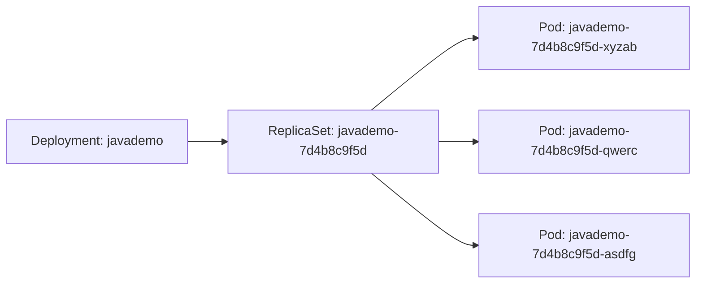
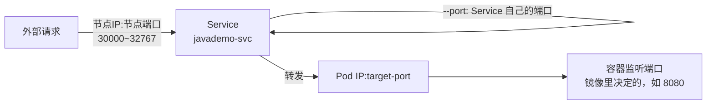
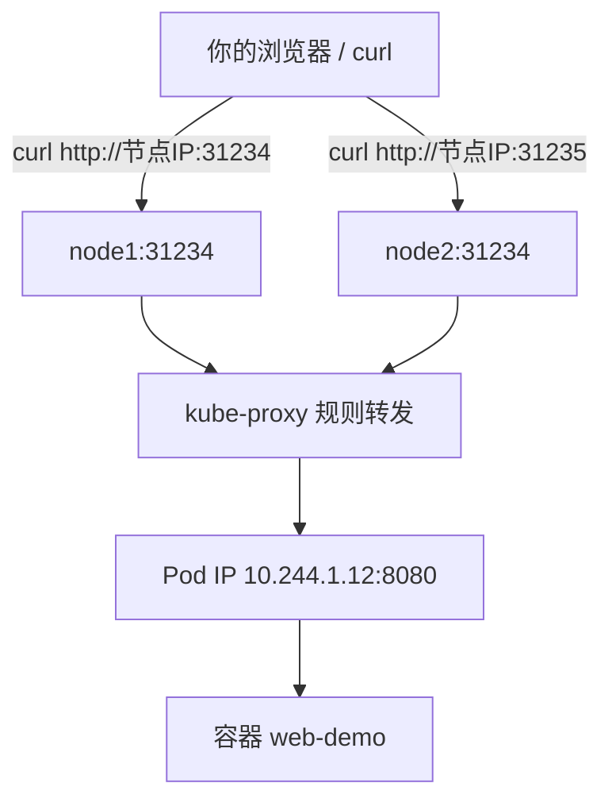

## 纲要

- 为什么 CKA 优先用 `kubectl create` 而不是手写 yaml
- `kubectl create deployment` 的完整参数与镜像地址怎么读
- 创建后集群里多出来哪三层资源：Deployment → ReplicaSet → Pod
- Pod 名字后面那一大串随机后缀是怎么来的
- `kubectl expose` 的 `--port` 与 `--target-port` 到底谁是谁的端口
- 从 ClusterIP 访问不通到 NodePort 访问成功的完整验证

## 正文

### 为什么这节课开始全用命令行

前面第四章讲"部署应用的四步"，第一步是打镜像、第二步是用控制器管理 Pod。这一步在考试里千万别去手写 yaml：

> CKA 三小时做 24 道题，时间很紧。如果你的第一反应是"我要先把 Deployment 的 yaml 敲一遍"，光字段名就能卡掉你五分钟。

所以从这节课开始，所有常用资源一律先学会用 `kubectl` 命令行创建，再去回头熟 yaml 格式。命令行快、还不容易写错字段名，考场上就是这个思路。

顺带记一条硬知识：`kubectl create` 是**命令式**（imperative），资源已存在会直接报 `AlreadyExists`；`kubectl apply` 是**声明式**（declarative），同一份资源反复 apply 只会更新。考场上用 `create` 起临时资源最顺手。

### 第一步：先把镜像地址看明白

`kubectl create deployment` 后面跟的就是镜像。镜像地址长得像这样：

```
registry.example.com/account/imagename:tag
│                    │        │        └─ 版本标签，不写默认 latest
│                    │        └────────── 镜像名
└──────────────────────────── 仓库地址（域名或 IP）
                     └────── Docker Hub 上就是你的账号名
```

| 段 | 含义 | 例子 |
| --- | --- | --- |
| 仓库地址 | 中心仓库或私有仓库的地址 | `registry.cn-hangzhou.aliyuncs.com` |
| 账号名 | Docker Hub 上你的用户名，私有仓库则是命名空间 | `mycompany` |
| 镜像名 | 镜像仓库名 | `web-demo` |
| tag | 版本，Java 这类常用 `1.0`、`1.1` 区分 | `:1.0` |

**任何镜像在部署前先验证能不能拉下来**，别等 Pod 卡在 `ImagePullBackOff` 才发现地址写错：

```bash
# 先在本地 docker pull 试一遍
docker pull registry.example.com/mycompany/web-demo:1.0

# 拉不动就先把地址敲对，再往下走
```

### 第二步：创建 Deployment



```bash
# --name 可以省略（ positional 参数就是名字），写全更清楚
kubectl create deployment javademo \
  --image=registry.example.com/mycompany/web-demo:1.0 \
  --port=80
```

`--port` 是**给 Deployment 打的标记**，告诉它这个容器对外提供哪个端口。真正决定 Pod 里监听哪个端口的是镜像本身（Tomcat 就是 8080），`--port` 只是起个声明作用，考试里随手写成 80 就行。

执行完看两层资源：

```bash
# 看控制器
kubectl get deploy
# NAME       READY   UP-TO-DATE   AVAILABLE   AGE
# javademo   1/1     1            1           30s

# 看 Pod（注意名字比 Deployment 长一大截）
kubectl get pods
# NAME                              READY   STATUS    RESTARTS   AGE
# javademo-7d4b8c9f5d-xyzab         1/1     Running   0          30s
```

| 列 | 含义 |
| --- | --- |
| `READY` | 就绪副本数 / 期望副本数 |
| `UP-TO-DATE` | 已经滚动到最新镜像版本的副本数 |
| `AVAILABLE` | 实际能对外提供服务的副本数 |
| `AGE` | 运行时间 |

### Pod 名字那串尾巴是什么

`javademo` 是你起的 Deployment 名，后面的 `7d4b8c9f5d-xyzab` 不是随机的——它是**层级生成的**：



- ReplicaSet 那一段 `7d4b8c9f5d` 是 RS 的名字，跟你选的镜像名强相关——**镜像一变，这段 hash 就变**，这正是后面回滚能回到旧版本的根因。
- 最后一段是 kubelet 自动加的随机字符串，一个副本一个。

资源树看清楚就是这三层：

```
default/
├── deployment.apps/javademo              ← 你声明的期望状态
│   └── replicaset.apps/javademo-7d4b8c9f5d   ← 副本数与版本控制
│       ├── pod/javademo-7d4b8c9f5d-xyzab     ← 最小部署单元
│       │   └── container: web-demo           ← 真正的进程
│       ├── pod/javademo-7d4b8c9f5d-qwerc
│       └── pod/javademo-7d4b8c9f5d-asdfg
└── service/javademo                      ← 暴露层（下一步创建）
```

### Deployment、ReplicaSet 各自管什么

很多人搞不清为什么创建个 Deployment 会多出个 RS，记住分工：

| 资源 | 缩写 | 负责什么 | 你会不会直接创建 |
| --- | --- | --- | --- |
| Deployment | `deploy` | 声明期望状态、滚动更新、回滚 | **会，日常只用它** |
| ReplicaSet | `rs` | 维护副本数量、配合做回滚 | 不会，由 Deployment 生成 |
| ReplicationController | `rc` | 更老的副本控制器 | 基本淘汰 |
| Pod | `po` | 最小部署单元，容器的高级抽象 | 不直接裸建 |

一句话：**Deployment 管"想要什么样"，ReplicaSet 管"现在有几个"，Pod 是真正跑起来的那一层。**

### 第三步：暴露服务

现在 Pod 起来了，但它只有一个集群内部的 Pod IP，你在自己电脑上访问不到——Pod IP 是私有内网地址，你的机器根本没有路由到它。

```bash
# 先看一眼这个内部 IP
kubectl get pods -o wide
# NAME                             READY  STATUS  IP           NODE
# javademo-7d4b8c9f5d-xyzab        1/1    Running 10.244.1.12  node1
#                                          ↑ 集群内部 IP，外网不可达
```

这时候用 `kubectl expose`：

```bash
kubectl expose deployment javademo \
  --name=javademo-svc \
  --type=NodePort \
  --port=80 \
  --target-port=8080
```

**这四个参数是最容易记混的地方，务必分清：**



| 参数 | 它属于谁 | 说明 |
| --- | --- | --- |
| `--port` | **Service 自己的端口** | 集群内其他 Pod 访问这个 Service 时用的端口，默认 TCP |
| `--target-port` | **Pod / 容器上的端口** | 请求转发到 Pod 时打在哪个端口，必须镜像里真在监听 |
| `--type=NodePort` | Service 类型 | 把服务开到每个节点的固定端口上 |
| `--name` | Service 名 | 不给就默认跟 Deployment 同名（后面的课用得上） |
| 协议 | — | 默认 TCP；UDP 要显式 `--protocol=UDP` |

对照上面那条命令：Service 在 80 端口收请求，转发到 Pod 的 8080（Tomcat 端口）。

创建完验证：

```bash
kubectl get svc
# NAME           TYPE        CLUSTER-IP      EXTERNAL-IP   PORT(S)        AGE
# javademo-svc   NodePort    10.96.23.155    <none>        80:31234/TCP   20s
#                                                                    │
#                                                      └─ 30000~32767 里的节点端口
```

### 第四步：终于能从外面访问了



```bash
# 用节点 IP + NodePort 直接访问（不是 Pod IP，也不是 ClusterIP）
NODE_IP=192.168.62.61
NODE_PORT=$(kubectl get svc javademo-svc -o jsonpath='{.spec.ports[0].nodePort}')
curl "http://${NODE_IP}:${NODE_PORT}"
```

注意规则：

- 访问地址是 **节点 IP + NodePort 端口**，Pod IP 和 ClusterIP 在你的机器上都不通。
- NodePort 端口是自动分配在 `30000~32767` 区间里的，也可以用 `--node-port=30080` 显式指定。
- 集群里**任意节点**的 IP + 同一个 NodePort 都能通，kube-proxy 会把请求转给真正在跑的那个 Pod。

## API 速览

| 命令 | 作用 |
| --- | --- |
| `kubectl create deployment <名> --image=<镜像>` | 起一个 Deployment，默认 1 副本 |
| `kubectl create deployment <名> --image=<镜像> --replicas=3` | 指定副本数 |
| `kubectl create deployment <名> --image=<镜像> --dry-run=client -o yaml` | **只试跑不创建，打印 yaml**，考场救命参数 |
| `kubectl get deploy / rs / pods` | 三层资源分别看 |
| `kubectl describe deploy <名>` | 看 Events、镜像、选择器 |
| `kubectl expose deployment <名> --port=80 --target-port=8080 --type=NodePort` | 生成 Service |
| `kubectl get svc -o wide` | 看 CLUSTER-IP 与 PORT(S) |
| `kubectl delete deploy <名>` | 连带删掉它的 RS 和 Pod |

试跑出 yaml 再改，是考场上最稳的做法：

```bash
kubectl create deployment javademo \
  --image=registry.example.com/mycompany/web-demo:1.0 \
  --dry-run=client -o yaml > javademo.yaml
# 输出的是合法 yaml，等会儿 apply 到集群里
```

## Demo 示例

从零到能在浏览器里打开，一气呵成：

```bash
#!/usr/bin/env bash
set -euo pipefail

IMAGE=registry.example.com/mycompany/web-demo:1.0
DEPLOY=javademo
SVC=javademo-svc

# 0) 先确认镜像拉得下来
docker pull "$IMAGE"

# 1) 创建 Deployment
kubectl create deployment "$DEPLOY" --image="$IMAGE" --port=80

# 2) 等它真的 Ready（考试里加这条能避免后面全部连锁报错）
kubectl rollout status deployment/"$DEPLOY" --timeout=60s
kubectl get deploy
kubectl get pods -o wide

# 3) 暴露成 NodePort
kubectl expose deployment "$DEPLOY" \
  --name="$SVC" \
  --type=NodePort \
  --port=80 \
  --target-port=8080

kubectl get svc "$SVC" -o wide
# javademo-svc   NodePort   10.96.23.155   <none>   80:31234/TCP   10s

# 4) 取节点端口，从集群外访问
NODE_PORT=$(kubectl get svc "$SVC" -o jsonpath='{.spec.ports[0].nodePort}')
NODE_IP=$(kubectl get pods -o wide | awk 'NR==2 {print $7}')
echo "访问地址: http://${NODE_IP}:${NODE_PORT}"
curl -s "http://${NODE_IP}:${NODE_PORT}" | head -20

# 5) 收尾：一把清干净
kubectl delete svc "$SVC"
kubectl delete deploy "$DEPLOY"
```

想看这一条命令到底往集群里塞了几个对象，用 `kubectl get` 三级查：

```bash
kubectl get deploy,job
kubectl get deploy
kubectl get rs
kubectl get pods
kubectl get pods --show-labels
# NAME                              LABELS
# javademo-7d4b8c9f5d-xyzab          pod-template-hash=7d4b8c9f5d,app=javademo
#                                                        ↑ 这一串就是 RS 名字的来源
```

`pod-template-hash` 这个标签注意一下：它既是 Pod 被 RS 选中的依据，也解释了为什么换了镜像 RS 名字会变。

### 总结

Deployment 是 K8s 里最常用的控制器，API 服务、网站、微服务基本都靠它。考场上的标准动作就两条命令：

```
kubectl create deployment <名> --image=<能拉到的镜像> --port=80
kubectl expose deployment <名> --type=NodePort --port=80 --target-port=<容器端口>
```

三个最容易丢分的地方：一是**镜像必须预先 `docker pull` 验证**，写错地址 Pod 就卡在 `ImagePullBackOff`；二是 **`--port` 是 Service 端口、`--target-port` 才是容器端口**，混淆了访问就全通；三是**外部访问用节点 IP + NodePort**，Pod IP 和 ClusterIP 都不可达。另外记住"创建 Deployment 会顺带生成 ReplicaSet，ReplicaSet 再管 Pod"这个链条，后面讲滚动更新和回滚全靠它。

