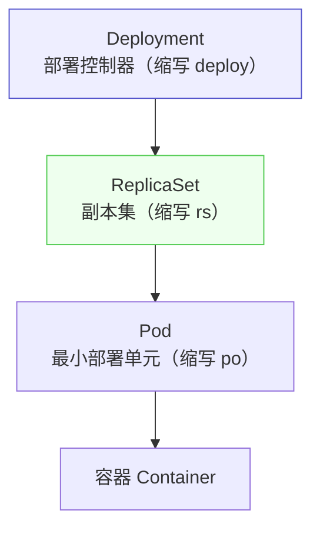
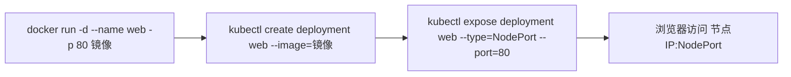
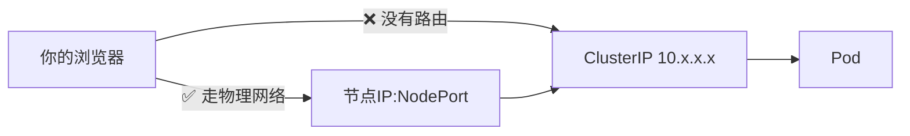

# Kubernetes 认证实战: 用 Deployment 部署应用（命令行快跑 + expose 暴露）

有了镜像之后，把一个应用跑进 Kubernetes 只需要两条命令：`kubectl create deployment` 和 `kubectl expose`。结论先给：**先学会用命令行创建资源（CKA 考试时间紧，写 YAML 太慢），再回头补 YAML 的字段结构；而 `create deployment` 背后真正的关系是三层 —— Deployment 管 ReplicaSet，ReplicaSet 管 Pod。**

## 纲要

- 先命令行后 YAML 的学习顺序
- 从 `docker run` 到 `kubectl create deployment`
- 镜像地址怎么读：仓库地址 / 账号名 / 镜像名 / tag
- 部署前必须先验证镜像能拉取
- Deployment、ReplicaSet、Pod 的三层关系
- 用 `kubectl expose` 把应用暴露到集群外
- `--port` 与 `--target-port` 到底谁是谁
- ClusterIP 访问不到，NodePort 才能从外部访问

## 三层关系



> 日常工作中**几乎不会直接创建 Pod**，都是创建 Deployment 这类控制器，由控制器按你的期望副本数去创建并维持 Pod。

| 资源 | 缩写 | 职责 | 要不要手工创建 |
| --- | --- | --- | --- |
| Deployment | `deploy` | 部署控制器，管 Web/API/微服务这类无状态应用 | ✅ 主要用它 |
| ReplicaSet | `rs` | 副本集，管副本数量、支撑回滚 | ❌ Deployment 自动建 |
| Pod | `po` | 最小部署单元，容器的高级抽象 | ❌ 由 RS 建 |

```text
一次 create deployment 实际产出的东西
├── Deployment  javademo                  ← 你给的名字
│   └── ReplicaSet  javademo-5d9f7c8b4    ← 名字 = 控制器名 + 随机串
│       └── Pod  javademo-5d9f7c8b4-x2klp ← 名字 = RS 名 + 随机串
└── Service  javademo（expose 之后才有）
```

## 从 docker run 到 kubectl create deployment

当年用 docker 跑一个容器是这样的：`docker run -d --name web -p 80:80 -e A=123 镜像名`。
在 Kubernetes 里思路类似 —— 引用一个镜像把它「拉起」，只是要换成 kubectl 自己的语法。



| docker 里的概念 | Kubernetes 对应物 |
| --- | --- |
| `docker run` | `kubectl create deployment` |
| `--name web` | Deployment 名字（资源声明名，随便起） |
| `-p 80:80` | `--port` + `--target-port` + Service 类型 |
| `-e A=123` | 后面章节的 ConfigMap / Secret / `env` |
| 镜像名 | `--image=` |

## 镜像地址怎么读

```text
harbor.example.com   /   demo      /   javademo   :   v1
└── 中心仓库地址          └── 仓库      └── 镜像名      └── tag（版本）
    （IP 或域名）             （docker hub 上就是账号名）   （默认 latest）
```

- **中心仓库地址**：公司私有仓库就是它的 IP 或域名；用 docker hub 时这一段直接是**账号名**。
- **tag**：同一个仓库下可以有多个镜像，版本靠 tag 区分（`v1`、`v2`…），不写默认 `latest`。

> **部署任何镜像之前，先确保这个镜像能拉下来。** 直接 `docker pull` 试一下，拉不动就去检查地址写没写对，不要等到 Pod 卡在 `ImagePullBackOff` 才回头查。

## 部署并暴露：完整命令链

```bash
#!/usr/bin/env bash
set -euo pipefail

IMAGE=harbor.example.com/demo/javademo:v1

echo "==> 0. 先验证镜像可拉取"
docker pull "$IMAGE"

echo "==> 1. 用控制器部署应用"
kubectl create deployment javademo --image="$IMAGE"

echo "==> 2. 看三层资源"
kubectl get deploy
kubectl get rs
kubectl get pods

echo "==> 3. 暴露成 Service（NodePort 才能出集群）"
kubectl expose deployment javademo \
  --name=javademo-svc \
  --port=80 \
  --target-port=8080 \
  --type=NodePort \
  --protocol=TCP

kubectl get svc
```

### --port 与 --target-port

| 参数 | 含义 | 例子 |
| --- | --- | --- |
| `--port` | **Service 自己暴露的端口**，集群内部访问这个服务用的端口 | `80` |
| `--target-port` | **容器里应用真正监听的端口**（镜像里写死的那个） | `8080`（Tomcat 默认） |
| `--protocol` | 协议，默认 `TCP`，UDP 才需要显式指定 | `TCP` |
| `--type` | Service 类型，`NodePort` 才能把服务暴露到节点之外 | `NodePort` |

## 为什么 ClusterIP 访问不到



- `kubectl get svc` 里看到的 ClusterIP 是**集群内部的虚拟 IP**，你本机没有到它的路由，所以在浏览器里访问会一直转圈。
- 想在集群外访问，就用 **`--type=NodePort`**，然后用 **任意节点 IP + 分配出来的 NodePort** 访问。

## API 速览

| 目标 | 命令 |
| --- | --- |
| 部署应用 | `kubectl create deployment <名> --image=<镜像>` |
| 看控制器 | `kubectl get deploy` |
| 看副本集 | `kubectl get rs` |
| 看 Pod | `kubectl get pods`（`-o wide` 看落在哪个节点） |
| 暴露服务 | `kubectl expose deployment <名> --port=80 --target-port=8080 --type=NodePort` |
| 看服务 | `kubectl get svc` |
| 验证镜像 | `docker pull <镜像>` |
| 查所有资源类型 | `kubectl api-resources` |

## Demo 示例

用官方镜像跑一遍完整流程（不需要自己构建镜像）：

```bash
# ① 部署：用 nginx 官方镜像代替自制镜像
kubectl create deployment web --image=nginx:1.26 --port=80 --replicas=2

# ② 观察三层
kubectl get deploy,rs,pods

# ③ 暴露：NodePort 才能从集群外访问
kubectl expose deployment web --port=80 --target-port=80 --type=NodePort

# ④ 拿到节点端口后访问
NODE_PORT=$(kubectl get svc web -o jsonpath='{.spec.ports[0].nodePort}')
echo "访问地址: http://<节点IP>:$NODE_PORT"

# ⑤ 验证
curl -sS -o /dev/null -w "%{http_code}\n" "http://127.0.0.1:$NODE_PORT"
```

带私有仓库镜像的形态（和课程里的 Java demo 一致）：

```bash
IMAGE=harbor.example.com/demo/javademo:v1

kubectl create deployment javademo --image="$IMAGE"
kubectl expose deployment javademo --port=80 --target-port=8080 --type=NodePort

kubectl get pods -o wide
kubectl get svc javademo
```

### 总结

- **先命令行后 YAML**：CKA 考试时间紧，能一条命令建出来的资源就不要手写 YAML；YAML 后面再进阶补。
- **`create deployment` 一次产出三层资源**：Deployment → ReplicaSet → Pod，日常只管 Deployment，RS 和 Pod 都是自动生成的。
- **镜像地址四段**：中心仓库地址（IP/域名，docker hub 上就是账号名）/ 仓库名 / 镜像名 / tag（默认 `latest`）。
- **部署前先 `docker pull` 验证**，别让 Pod 卡在拉取镜像上。
- **`--port` 是 Service 的端口，`--target-port` 是容器里应用的端口**，两者别搞反。
- **ClusterIP 是集群内部 IP，外部访问不到**；要出集群就用 `--type=NodePort`，走 `节点IP:NodePort`。

