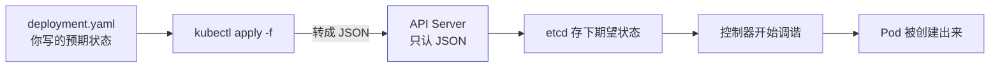
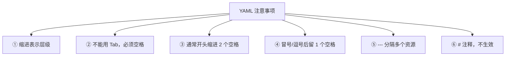

# Kubernetes 认证实战: 用 YAML 创建资源对象（上）—— 服务编排与格式铁律

上一节用两条命令就把应用跑起来了，这一节换成 YAML 做同样的事。结论先给：**Kubernetes 之所以叫「容器编排引擎」，编排二字最直接的体现就是「你给它一个描述文件，它按文件里描述的预期状态把应用部署出来」，这个文件的格式约定就是 YAML；kubectl 会把 YAML 转成 JSON 再提交给 API Server，因为 API Server 只认 JSON。**

## 纲要

- 服务编排：给一个文件，按预期部署
- `kubectl apply -f` 与 YAML → JSON 的转换
- 用 YAML 复现上一节的两条命令
- 命令行 vs YAML 的各自适用场景
- YAML 格式的六条注意事项
- 缩进、tab、空格的那些坑

## 服务编排是怎么发生的



> **API Server 是一个 HTTP 接口服务，只认 JSON。** 你写的 YAML 是给人看的，kubectl 会帮你转成 JSON 再提交。

## 用 YAML 复现命令行

上一节的 `create deployment` + `expose`，写成 YAML 是两份清单：

```yaml
apiVersion: apps/v1
kind: Deployment
metadata:
  name: javademo2
  namespace: default
spec:
  replicas: 1
  selector:
    matchLabels:
      app: javademo2
  template:
    metadata:
      labels:
        app: javademo2
    spec:
      containers:
      - name: javademo
        image: harbor.example.com/demo/javademo:v1
        ports:
        - containerPort: 8080
```

```yaml
apiVersion: v1
kind: Service
metadata:
  name: javademo2
  namespace: default
spec:
  type: NodePort
  selector:
    app: javademo2
  ports:
  - port: 80
    targetPort: 8080
    protocol: TCP
```

```bash
kubectl apply -f deployment.yaml
kubectl apply -f service.yaml

kubectl get deploy
kubectl get pods
kubectl get svc
```

```text
一个 YAML 文件里放多份清单
├── deployment.yaml
│   ├── apiVersion / kind / metadata   ← 上半部分：控制器自身
│   └── spec.template                  ← 下半部分：Pod 模板
└── service.yaml
    ├── spec.selector                  ← 必须命中 Pod 的 labels
    └── spec.ports
```

## 命令行 vs YAML

| 维度 | 命令行 | YAML |
| --- | --- | --- |
| 上手速度 | ✅ 一条命令就完事 | ❌ 要写一堆字段 |
| 考试（CKA） | ✅ **优先用命令行**，省时间 | ❌ 时间紧容易写错缩进 |
| 复用 | ❌ 命令敲完就没了 | ✅ 复制一份改个名字就能部署第二个 |
| 管理/版本化 | ❌ 不好归档 | ✅ 进 Git，可 review、可回滚 |
| 描述复杂结构 | ❌ 参数一多就爆炸 | ✅ 层级清晰 |

> 结论：**命令行求快，YAML 求稳**。考试用命令行，生产用 YAML 入库管理。

## YAML 格式的六条注意事项



| 序号 | 规则 | 反例后果 |
| --- | --- | --- |
| ① | **缩进表示层级关系**，每一个缩进都是下一级 | 位置错了资源就归错层 |
| ② | **不能用 Tab 键**，必须一个一个按空格 | 直接语法错误 |
| ③ | 通常**开头缩进两个空格**，且全文一致 | 混用 2/4 空格易出错 |
| ④ | `:` `,` 这类字符**后面缩进一个空格** | 解析失败 |
| ⑤ | `---` 表示一个 YAML 资源的开始，多资源靠它分割 | 多清单不分隔只解析到第一份 |
| ⑥ | `#` 注释，该行不生效 | —— |

> 初学时 90% 的报错都来自**缩进关系写错**，kubectl 抛语法错误却又半天调不出来 —— 因为每个资源字段所在的层级都不一样。

## API 速览

| 目标 | 命令 |
| --- | --- |
| 应用一份清单 | `kubectl apply -f <文件>` |
| 应用整个目录 | `kubectl apply -f ./dir/` |
| 删掉清单里的资源 | `kubectl delete -f <文件>` |
| 看清单将被如何解析 | `kubectl apply -f <文件> --dry-run=client -o yaml` |
| 导出已有资源的 YAML | `kubectl get deploy web -o yaml > web.yaml` |
| 导出 Service 清单 | `kubectl get svc web -o yaml` |
| 查所有资源类型 | `kubectl api-resources` |

## Demo 示例

一份文件放两个资源，用 `---` 分隔，直接一次 `apply`：

```yaml
apiVersion: apps/v1
kind: Deployment
metadata:
  name: web
spec:
  replicas: 2
  selector:
    matchLabels:
      app: web
  template:
    metadata:
      labels:
        app: web
    spec:
      containers:
      - name: nginx
        image: nginx:1.26
        ports:
        - containerPort: 80
---
apiVersion: v1
kind: Service
metadata:
  name: web
spec:
  type: NodePort
  selector:
    app: web
  ports:
  - port: 80
    targetPort: 80
    protocol: TCP
```

```bash
kubectl apply -f web.yaml
kubectl get deploy,rs,pods
kubectl get svc web

NODE_PORT=$(kubectl get svc web -o jsonpath='{.spec.ports[0].nodePort}')
echo "NodePort = $NODE_PORT"
```

### 总结

- **编排 = 给文件，按预期部署**；这个文件用 YAML 描述，kubectl 转成 JSON 提交给 API Server。
- **YAML 能完整复现命令行做的所有事**，而且方便复用、好归档、能进 Git 做版本管理。
- **考试求快用命令行，生产求稳用 YAML**，两者不是替代关系而是互补。
- **格式铁律六条**：缩进表层级、禁用 Tab、开头两空格、冒号后一空格、`---` 分多资源、`#` 注释。
- 报错先怀疑**缩进位置**，别急着怀疑字段拼写。
- 记命令：`kubectl apply -f`、`kubectl get <资源> -o yaml > x.yaml`。

