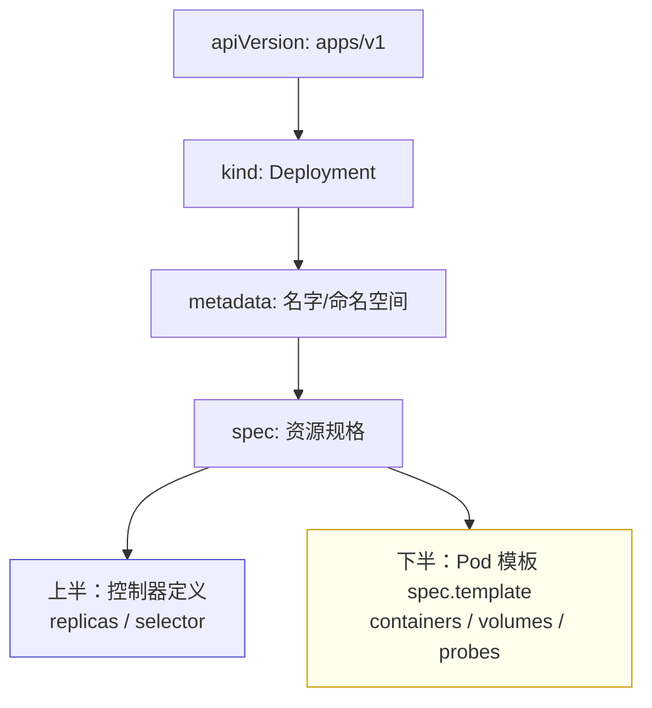
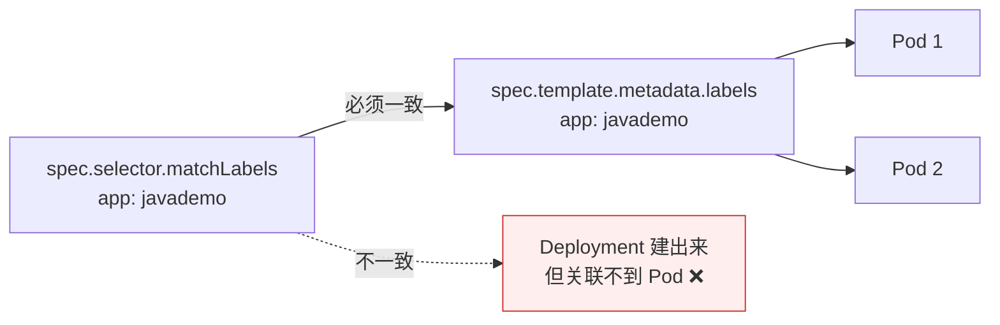

# Kubernetes 认证实战: 用 YAML 创建资源对象（下）—— 字段结构与选择器对齐

上一节解决了 YAML 的格式问题，这一节拆字段。结论先给：**一份部署用的 YAML 就两大块 —— 上半部分是控制器自身的定义（apiVersion / kind / metadata / spec），下半部分是 Pod 模板（`spec.template`）；其中最容易踩坑的一条是 `spec.selector.matchLabels` 必须和 `spec.template.metadata.labels` 完全对上，对不上控制器就找不到自己该管的 Pod。**

## 纲要

- 第一行的 `apiVersion`：版本怎么选、去哪查最新
- 第二行的 `kind`：资源类型从哪来
- `metadata`：命名空间与资源名
- `spec`：资源规格，控制器定义 vs Pod 模板
- 标签选择器：控制器靠什么关联 Pod
- 上固定下常改：真正要动的是 `containers`

## 一份 Deployment 清单的骨架



| 字段 | 作用 | 取值要点 |
| --- | --- | --- |
| `apiVersion` | API 接口的版本 | Deployment 用 `apps/v1` |
| `kind` | 资源类型 | `Deployment` / `Service` / `Pod` … |
| `metadata` | 资源元数据 | `name`、所属 `namespace` |
| `spec` | 资源规格（期望状态） | 分成控制器定义 + Pod 模板两半 |

## apiVersion：别用被弃用的旧版本

```text
Deployment 的 apiVersion 演进
├── extensions/v1beta1   ← 1.16 之前，已弃用
├── apps/v1beta1         ← 中途版本，已弃用
├── apps/v1beta2         ← 中途版本，已弃用
└── apps/v1              ← 1.16 之后统一用它 ✅
```

> 用了被弃用的版本会**直接报错**。最新版本去哪查最靠谱？**官网文档里 Kubernetes 官方给的 Deployment 示例**，里面用的就是当前版本。

`kind` 能填什么？一条命令就能看到全部资源类型：

```bash
kubectl api-resources
```

| 常用 kind | apiVersion |
| --- | --- |
| Pod | `v1` |
| Service | `v1` |
| ConfigMap | `v1` |
| Secret | `v1` |
| Namespace | `v1` |
| Deployment | `apps/v1` |
| DaemonSet | `apps/v1` |
| StatefulSet | `apps/v1` |

## 标签选择器：控制器和 Pod 的握手



- 部署应用时 Pod 会有很多个，**控制器靠标签选择器去筛选「哪一组 Pod 归我管」**。
- 如果 `spec.selector` 与 `spec.template.metadata.labels` **对不上**，YAML 照样能创建成功，但 Deployment 关联不到下面创建的 Pod，工作起来就不正常。

## 完整骨架（含注释）

```yaml
# ---- 上半部分：控制器自身定义（基本固定） ----
apiVersion: apps/v1
kind: Deployment
metadata:
  name: javademo
  namespace: default
spec:
  replicas: 2
  selector:
    matchLabels:
      app: javademo
  # ---- 下半部分：Pod 模板（最常改的地方） ----
  template:
    metadata:
      labels:
        app: javademo
    spec:
      containers:
      - name: javademo
        image: harbor.example.com/demo/javademo:v1
        ports:
        - containerPort: 8080
```

```text
spec 的两半，谁固定谁常改
├── spec.replicas        副本数（由 ReplicaSet 落实）   ← 偶尔改
├── spec.selector        和 Pod 模板 labels 对齐         ← 对齐即可，很少改
└── spec.template        Pod 模板
    ├── metadata.labels  被 selector 选中
    └── spec.containers  ★ 镜像/端口/资源限制/探针/挂载都在这
        ├── name / image
        ├── ports.containerPort
        └── （后续章节继续加：resources / probes / volumeMounts）
```

> 上面那半部分「基本都固定了」，用 Deployment 就是这些内容；**整个 YAML 里最不固定、后面学习要反复动的就是 `template.spec.containers` 这一块**。

## API 速览

| 目标 | 命令 |
| --- | --- |
| 查所有资源及 apiVersion | `kubectl api-resources` |
| 查某资源的字段说明 | `kubectl explain deployment.spec.selector` |
| 逐层展开字段 | `kubectl explain pod.spec.containers --recursive` |
| 按标签筛 Pod | `kubectl get pods -l app=javademo` |
| 看 Pod 的标签 | `kubectl get pods --show-labels` |
| 给已有资源打标签 | `kubectl label pod $POD env=prod` |

## Demo 示例

故意把 selector 写错，观察 Deployment 建出来却关联不到 Pod 的现象：

```bash
cat <<'EOF' > bad-selector.yaml
apiVersion: apps/v1
kind: Deployment
metadata:
  name: bad-demo
spec:
  replicas: 1
  selector:
    matchLabels:
      app: wrong-label
  template:
    metadata:
      labels:
        app: right-label
    spec:
      containers:
      - name: nginx
        image: nginx:1.26
EOF

# 这条会直接被 API Server 拒掉：selector 与 template.labels 不匹配
kubectl apply -f bad-selector.yaml
```

正确写法与验证：

```bash
cat <<'EOF' > good.yaml
apiVersion: apps/v1
kind: Deployment
metadata:
  name: web
spec:
  replicas: 2
  selector:
    matchLabels:
      app: web
  template:
    metadata:
      labels:
        app: web
    spec:
      containers:
      - name: nginx
        image: nginx:1.26
        ports:
        - containerPort: 80
EOF

kubectl apply -f good.yaml
kubectl get deploy web
kubectl get pods -l app=web --show-labels
kubectl explain deployment.spec.selector
```

### 总结

- **一份部署清单两大块**：上半是控制器自身定义，下半是 Pod 模板。
- **`apiVersion` 要用 `apps/v1`**，`extensions/v1beta1` 那一批在 1.16 之后已被弃用，用了就报错；最新版本以官网示例为准。
- **`kind` 的取值范围 = `kubectl api-resources` 列出来的那些资源**。
- **`spec.selector.matchLabels` 必须与 `spec.template.metadata.labels` 对齐**，否则控制器关联不到 Pod，应用起不来。
- **`replicas` 由 ReplicaSet 落实**，是副本数量的唯一真相来源。
- **真正要反复改的是 `template.spec.containers`** —— 镜像、端口、资源限制、探针、挂载全在这一层。

