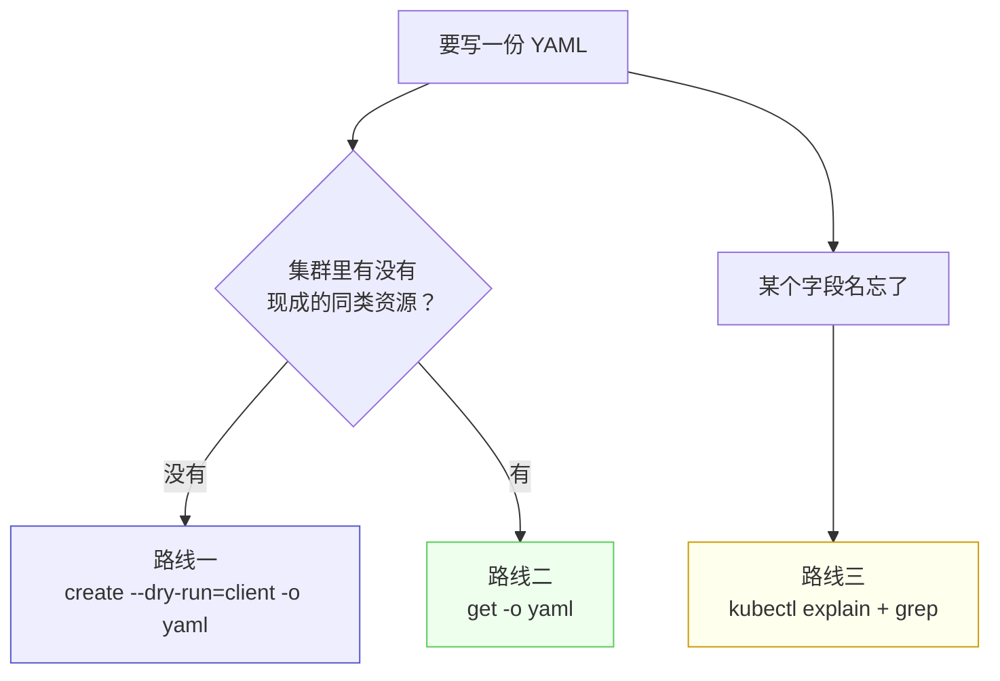
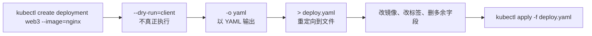

# Kubernetes 认证实战: 字段太多记不住怎么办 —— dry-run 生成 + 导出改写 + explain 查询

一份 Deployment 清单几十行，全靠手背是不现实的。结论先给：**记住两条路就够了 —— ① 用 `kubectl create ... --dry-run=client -o yaml` 生成一份新资源的模板；② 用 `kubectl get <资源> <名字> -o yaml` 把集群里已有的资源导出来改。`kubectl explain` 只用来查某个字段怎么拼，不适合当主力。**

## 纲要

- 不要死记硬背，生成 + 改写才是正解
- 路线一：`--dry-run=client -o yaml` 生成模板
- 路线二：从已有资源导出再删字段
- 导出的 YAML 里哪些字段该删
- 路线三：`kubectl explain` 查字段（辅助）
- 接手一个陌生集群时的读清单套路

## 三条路线怎么选



| 路线 | 命令 | 适用 | 推荐度 |
| --- | --- | --- | --- |
| ① 生成模板 | `kubectl create ... --dry-run=client -o yaml > x.yaml` | 从零创建新资源 | ⭐⭐⭐ |
| ② 导出现有 | `kubectl get <res> <name> -o yaml > x.yaml` | 照抄/接手已有集群 | ⭐⭐⭐ |
| ③ 查字段 | `kubectl explain <path>` | 忘了某个字段怎么拼 | ⭐ |

## 路线一：--dry-run=client -o yaml

`--dry-run=client` 的意思是**尝试运行但不真正创建**，只做一次探测；再叠加 `-o yaml` 就把这条命令对应的清单打印出来。



```bash
# 只探测，不创建
kubectl create deployment web3 --image=nginx:1.26 --dry-run=client

# 探测 + 导出成 YAML 文件
kubectl create deployment web3 --image=nginx:1.26 \
  --dry-run=client -o yaml > deploy.yaml

# 改掉镜像和标签后再真正部署
kubectl apply -f deploy.yaml
```

> 只要资源能用 `kubectl create` 建出来，就都能在后面加 `--dry-run=client -o yaml` 把模板导出来 —— 这一招通吃几乎所有资源类型。

## 路线二：从已有资源导出

```bash
# 导出某一个 Service
kubectl get svc javademo -o yaml > svc.yaml

# 不加名字 = 导出该类型下所有资源
kubectl get svc -o yaml > all-svc.yaml

# 导出 Deployment
kubectl get deploy javademo -o yaml > deploy.yaml
```

> `kubectl get ... --export` 这个老参数**已经被弃用**，直接用 `-o yaml` 即可。

### 导出后必须删掉的字段

```text
kubectl get -o yaml 导出的清单里，需要清理的部分
├── metadata.creationTimestamp      创建时间戳      ← 删
├── metadata.resourceVersion        资源版本号      ← 删
├── metadata.uid / selfLink         内部标识        ← 删
├── metadata.generation             代数            ← 删
├── metadata.managedFields          ★ 管理字段一大坨 ← 整块删
├── status                          ★ 调度/创建时回填的状态 ← 整块删
└── metadata 保留三项即可
    ├── name        资源名
    ├── namespace   命名空间
    └── labels      标签
```

| 字段 | 为什么删 |
| --- | --- |
| `managedFields` | 最近版本新加的一整块管理信息，写清单时不用指定 |
| `status` | 是 Kubernetes 调度、创建时**自动回填**的，不是你该声明的 |
| `creationTimestamp` / `uid` / `resourceVersion` | 集群内部标识，带上去反而会冲突 |
| `spec.clusterIP` / `nodePort`（Service） | 不指定时由集群自动分配，手填容易撞 |

## 路线三：kubectl explain（辅助查字段）

```bash
# 看 Pod 容器下有哪些字段
kubectl explain pod.spec.containers

# 递归展开
kubectl explain pod.spec.containers --recursive

# 忘了 image 相关字段怎么拼？过滤一下
kubectl explain pod.spec.containers --recursive | grep -i image
```

- `explain` 输出很长，**只适合「某个单词忘了，快速确认一下」**的场景，不适合从头拼一份清单。
- 后期 `containers` 下会越加越多（`env`、`resources`、`volumeMounts`、`probes`…），值得先用 `explain` 熟悉一遍。

## API 速览

| 目标 | 命令 |
| --- | --- |
| 生成新资源模板 | `kubectl create <res> <name> [参数] --dry-run=client -o yaml > x.yaml` |
| 导出现有资源 | `kubectl get <res> <name> -o yaml > x.yaml` |
| 导出全部同类资源 | `kubectl get <res> -o yaml > x.yaml` |
| 查字段说明 | `kubectl explain <资源路径>` |
| 递归查字段 | `kubectl explain <资源路径> --recursive` |
| 过滤字段 | `kubectl explain pod.spec.containers --recursive \| grep -i 关键字` |
| 查资源清单 | `kubectl api-resources` |

## Demo 示例

一次性走完「生成 → 清理 → 复用」：

```bash
# ① 生成 Deployment 模板
kubectl create deployment web --image=nginx:1.26 --replicas=2 \
  --dry-run=client -o yaml > web.yaml

# ② 清掉 status / managedFields / 时间戳这类回填字段
/usr/local/bin/python3 - <<'PY'
import re
src = open("web.yaml").read()
# 演示：把 status 段和 managedFields 段整块切掉
src = re.sub(r"\nstatus:\n(?:\n| .*\n)*", "\n", src)
src = re.sub(r"\n  managedFields:\n(?:\n|    .*\n|      .*\n)*", "\n", src)
open("web.clean.yaml", "w").write(src)
print("cleaned")
PY

# ③ 改个名字就能部署第二个应用
sed 's/name: web$/name: web2/' web.clean.yaml > web2.yaml
kubectl apply -f web2.yaml
kubectl get deploy
```

接手陌生集群时，先把关键资源导出来读：

```bash
kubectl get deploy -A -o yaml > all-deploy.yaml
kubectl get svc -A -o yaml > all-svc.yaml
kubectl explain pod.spec.containers --recursive | grep -iE "env|resources|volumeMounts"
```

### 总结

- **字段不用背**：先生成/导出，再改吧改吧就能用，这是日常效率最高的工作流。
- **路线一 `--dry-run=client -o yaml`**：只探测不创建，把命令对应的清单导出来；凡 `kubectl create` 能建的资源都吃这一招。
- **路线二 `kubectl get -o yaml`**：导出现有资源，删掉 `status`、`managedFields`、时间戳等回填字段，`metadata` 只留 `name` / `namespace` / `labels`。
- **`--export` 已弃用**，别再用了。
- **路线三 `kubectl explain`** 只用来确认字段拼写，配合 `grep` 过滤才好用。
- CKA 考试里按这两条路生成模板，比去官网搜 YAML 再复制快得多。

