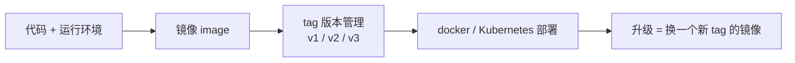
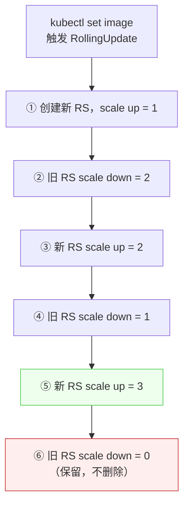
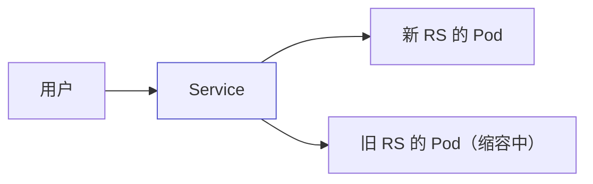

# Kubernetes 认证实战: 应用升级、弹性伸缩、回滚与删除（滚动更新原理）

应用部署完之后，剩下的日常就是升级、扩缩容、回滚、下线。结论先给：**容器化的交付物是镜像，所以「应用升级」本质就是「换一个新 tag 的镜像」；`kubectl set image` 会触发 Deployment 默认的 RollingUpdate 策略 —— 新建一个 ReplicaSet 逐步扩容，旧的 ReplicaSet 逐步缩容到 0 但不删除，回滚就是把这个过程反着做一遍。**

## 纲要

- 交付物是镜像，升级就是换镜像
- `kubectl set image` 升级与容器名
- 弹性伸缩 `kubectl scale`
- 发布历史 `kubectl rollout history` 与 `--record`
- 回滚：`undo` 上一版本 / `--to-revision` 指定版本
- 滚动更新原理：新旧 RS 一升一降
- 旧 RS 为什么还在（保留用做回滚）
- 删除要删控制器，删 Pod 会被拉起来

## 交付物是镜像



- 容器化时代之前交付物是 jar 包、war 包；现在**不管用 docker 还是 Kubernetes 部署，本质都是部署一个镜像**。
- docker 能在一众容器技术里胜出，**镜像的版本管理能力强**是很关键的一条 —— 代码和环境封装进完整镜像，拿这个镜像可以在任何 docker / Kubernetes 上跑。

## 升级：kubectl set image

```bash
# 部署一个 1.16 版本
kubectl create deployment web --image=nginx:1.16
kubectl expose deployment web --port=80 --target-port=80 --type=NodePort

# 升级到 1.17（容器名必须写对）
kubectl set image deployment web nginx=nginx:1.17

# 顺手记录这条命令到发布历史
kubectl set image deployment web nginx=nginx:1.18 --record
```

| 片段 | 含义 |
| --- | --- |
| `kubectl set image` | 改镜像的专用子命令 |
| `deployment web` | 资源类型 + 资源名 |
| `nginx=nginx:1.17` | **容器名=新镜像** |

> 容器名不确定？导出 YAML 看一下：`kubectl get deploy web -o yaml`，`spec.template.spec.containers[].name` 就是。默认等于镜像名（如 `nginx`）。

## 弹性伸缩：kubectl scale

```bash
kubectl scale deployment web --replicas=3
kubectl get deploy web
kubectl describe deploy web
```

```text
scale 背后发生了什么
├── 你：kubectl scale deploy web --replicas=3
├── Deployment：把期望副本数改成 3
└── ReplicaSet：执行 scale up，把 Pod 补到 3 个
    └── Pod 多了就删，少了就拉起（周期性检查）
```

## 发布历史与 --record

```bash
# 看发布历史
kubectl rollout history deployment web

# 看某个版本的详情
kubectl rollout history deployment web --revision=2
```

- 不带 `--record` 时，历史里**只有版本号，看不出每个版本用的是什么镜像**，这在回滚时很痛苦。
- 加上 `--record`，**执行的命令会被记进发布记录**，一看就知道每个版本干了什么、用的哪个镜像。

| 参数 | 作用 |
| --- | --- |
| `--record` | 把本次执行的命令写进发布历史（便于识别版本） |
| `--revision=N` | 查看第 N 个版本的详细信息 |

## 回滚

```bash
# 回滚到上一个版本
kubectl rollout undo deployment web

# 回滚到指定版本
kubectl rollout undo deployment web --to-revision=1

# 再看历史：回滚本身也会产生一个新版本号
kubectl rollout history deployment web
```

> 回滚不是删除历史，而是**把旧版本重新应用一遍**，并生成一个新的 revision 号。

## 滚动更新原理：新旧 RS 一升一降



以期望副本数 3 为例：

| 步 | 新 RS | 旧 RS |
| --- | --- | --- |
| 初始 | — | 3 |
| ① | 1 | 3 |
| ② | 1 | 2 |
| ③ | 2 | 2 |
| ④ | 2 | 1 |
| ⑤ | 3 | 1 |
| ⑥ | 3 | **0（保留）** |



- **回滚就是逆向的滚动更新**：旧 RS 重新 scale up 到期望副本，当前在用的 RS 慢慢 scale down。
- **为什么 `kubectl get rs` 会看到好几个 RS 但只有一个在用**：每次换镜像都会产生一个新 RS，旧的缩容到 0 后**不会被删除**，留着就是为了能回滚。

## 删除：删控制器，不要删 Pod

```text
为什么删了 Pod 它又活了
├── 你：kubectl delete pod web-xxx
├── ReplicaSet：发现副本数 < 期望值
└── ReplicaSet：立刻拉起一个新的 Pod ❗
```

> Kubernetes 有**自修复能力**，而这个能力就是控制器给的：控制器周期性检查当前 Pod 数是否等于期望副本数，**多了就删、少了就拉起**。所以想下线应用，得删掉它的「指挥者」。

```bash
# ❌ 没用：会被 RS 重新拉起
kubectl delete pod web-7c9f-demo

# ✅ 正确：删控制器，Pod 自然跟着没
kubectl delete deployment web
kubectl delete svc web
```

## API 速览

| 目标 | 命令 |
| --- | --- |
| 升级镜像 | `kubectl set image deployment <名> <容器名>=<新镜像>` |
| 升级并记录 | `kubectl set image deployment <名> <容器名>=<镜像> --record` |
| 扩缩容 | `kubectl scale deployment <名> --replicas=<数>` |
| 看发布历史 | `kubectl rollout history deployment <名>` |
| 看某版本详情 | `kubectl rollout history deployment <名> --revision=<N>` |
| 回滚上一版 | `kubectl rollout undo deployment <名>` |
| 回滚指定版 | `kubectl rollout undo deployment <名> --to-revision=<N>` |
| 看滚动过程 | `kubectl describe deploy <名>` |
| 下线应用 | `kubectl delete deployment <名>` / `kubectl delete svc <名>` |

## Demo 示例

一条龙：部署 → 升级 → 伸缩 → 看历史 → 回滚 → 下线。

```bash
# ① 部署 1.16 并暴露
kubectl create deployment web --image=nginx:1.16
kubectl expose deployment web --port=80 --target-port=80 --type=NodePort

# ② 扩容到 3 副本
kubectl scale deployment web --replicas=3
kubectl get rs -l app=web

# ③ 升级到 1.18（带 --record）
kubectl set image deployment web nginx=nginx:1.18 --record

# ④ 观察滚动过程与 RS 变化
kubectl rollout status deployment web
kubectl get rs -l app=web
kubectl describe deployment web

# ⑤ 发布历史
kubectl rollout history deployment web

# ⑥ 回滚到上一版，再回滚到第 1 版
kubectl rollout undo deployment web
kubectl rollout undo deployment web --to-revision=1

# ⑦ 下线（删控制器，不要只删 Pod）
kubectl delete deployment web
kubectl delete svc web
```

验证「删 Pod 会被拉起」这件反直觉的事：

```bash
POD=$(kubectl get pods -l app=web -o jsonpath='{.items[0].metadata.name}')
kubectl delete pod "$POD"
kubectl get pods -l app=web      # 立刻又有一个新的 Pod 在跑
```

### 总结

- **容器化的交付物是镜像**，应用升级 = 换一个带新 tag 的镜像，镜像的 tag 就是项目版本。
- **`kubectl set image`** 升级，格式是 `容器名=新镜像`，容器名不确定就 `kubectl get deploy -o yaml` 查。
- **升级触发的是默认的滚动更新（RollingUpdate）**：新 RS 逐档 scale up，旧 RS 逐档 scale down 到 0。
- **旧 RS 缩到 0 也不删除** —— 这正是回滚能秒回的物理基础；回滚就是把这个过程逆向做一遍。
- **`--record` 把命令写进发布历史**，否则 `rollout history` 里只有版本号，分辨不出哪个版本对应哪个镜像。
- **回滚：`undo` 回上一版、`--to-revision=N` 回指定版**；回滚自身也会产生新 revision。
- **下线要删控制器（Deployment / Service）**，只删 Pod 会被 ReplicaSet 的自修复机制重新拉起。

