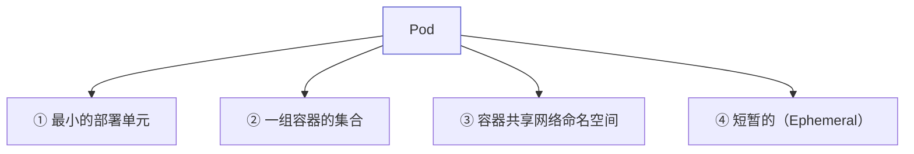
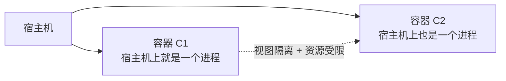
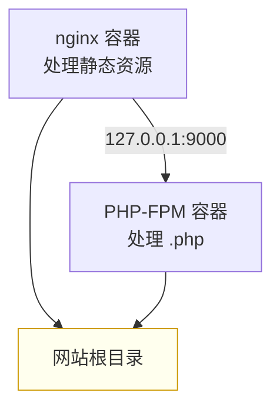
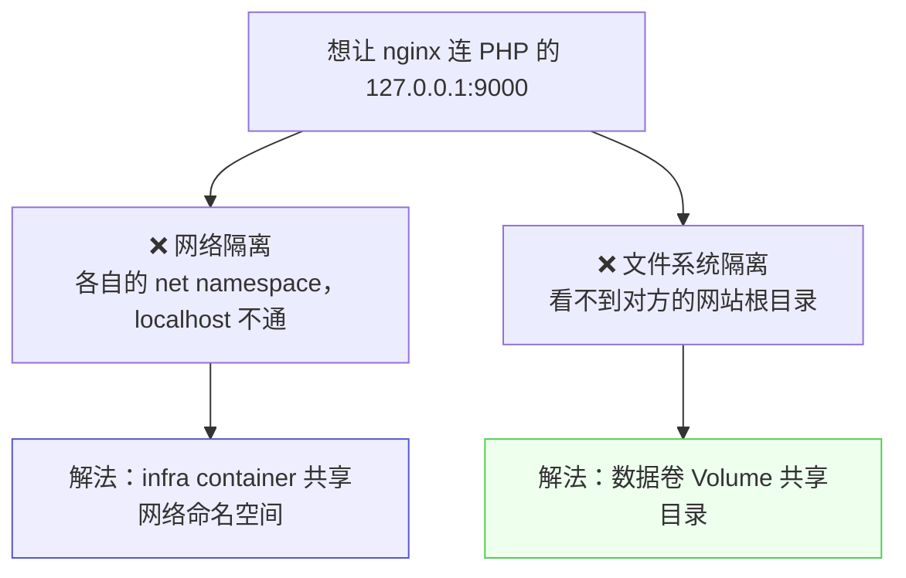

# Kubernetes 认证实战: Pod 存在的意义（最小部署单元与亲密型应用）

学 docker 时容器就是最小单元，到了 Kubernetes 却突然多出一个 Pod。结论先给：**容器的设计原则是「单进程模型」—— 一个容器只该跑一个应用；而 Pod 就是 Google 把「进程组」这个概念搬进容器世界的产物，它为「必须部署在一起、必须共享网络与文件」的亲密型应用而生的更高层抽象。**

## 纲要

- Pod 的四个基本特征
- 为什么一个容器只跑一个应用
- 单进程模型：容器 = 宿主机上一个被隔离的进程
- PID 1 挂了会怎样
- 进程组：从进程到 Pod 的类比
- 亲密型应用：nginx + PHP 的例子
- 原生容器满足不了亲密型应用的两个原因

## Pod 的四个基本特征



| 特征 | 说明 | 怎么体会 |
| --- | --- | --- |
| 最小部署单元 | 调度的最小粒度，不再直接调度容器 | 调度模块里会体现 |
| 一组容器的集合 | 一个 Pod 里可以有多个容器 | 直接写多容器清单验证 |
| 共享网络命名空间 | Pod 内所有容器看到同一个 IP | 进容器看 IP 一模一样 |
| 短暂的 | 一次滚动更新 Pod IP 就变了 | 不需要专门验证 |

> 前三条后面都能验证，第四条不用验证 —— **触发一次滚动更新，Pod 的 IP 就变了**，它天生就不具备永久性。

## 为什么一个容器只跑一个应用



- **容器本质上就是宿主机上的一个进程**，只不过被 namespace 做了视图隔离、被 cgroup 做了资源限制。
- 在宿主机上 `ps` 能看到容器里的进程 —— 你起了 5 个 nginx 容器，宿主机上就能看到 5 个 nginx 进程。

```text
一个容器里跑两个应用会怎样
├── 容器里 PID=1 的进程 = 你的应用本身
│   （例：Tomcat 容器里 PID 1 就是 java 进程）
├── PID 1 是父进程，负责管理子进程、回收资源
└── 若 PID 1 挂掉
    └── 下面的进程没人管 → 成孤儿进程 → 应用不可用 ❌
```

> 所以**一个容器只跑一个应用**是最佳实践：应用挂了就是容器挂了，语义清晰；跑两个应用则会互相牵扯，一个崩了连累另一个。

## 进程组 → Pod

```text
宿主机进程模型              容器世界
├── 宿主机管理所有进程   →   ├── Pod 管理一组容器
├── 进程 A                    ├── 容器 A（单进程模型）
├── 进程 B                    ├── 容器 B（单进程模型）
└── 进程 C                    └── 容器 C
    └── 进程组（Process Group）    └── Pod（更高层抽象）
```

- 宿主机上跑再多进程，总体上都是受宿主机管理的；**进程组**负责把关系密切的进程归拢到一起。
- 容器之间默认是**完全隔离**的：容器 A 访问不了容器 B 的文件，要访问只能走 IP，网络、文件系统、PID 全都隔离。
- **Pod 就是为了打破这种隔离**而做的更高一级抽象 —— 让关系密切的容器能共享网络与文件。

> **Pod 是为亲密型应用而生的。**

## 什么样的应用算「亲密型」

以经典的 **nginx + PHP-FPM** 组合为例：



| 亲密型应用的判据 | nginx + PHP 是否满足 |
| --- | --- |
| 必须部署在同一台机器上 | ✅ nginx 通过 `127.0.0.1:9000` 连本地 PHP |
| 需要共享某些信息 | ✅ 两者都要读同一个网站根目录 |
| 之间通信频繁/延迟敏感 | ✅ 每个请求都要走一次 FastCGI |

反过来，两个毫无关系、可以各自独立伸缩的服务，**就不该塞进同一个 Pod**。

## 原生容器为什么满足不了



| 隔离项 | 原生容器 | Pod 怎么打通 |
| --- | --- | --- |
| 网络 namespace | 各自独立 | **infra container（pause）** 先建并持有一份 net namespace，业务容器全部加入 |
| 文件系统 | 各自独立 | **数据卷 Volume**，把要共享的目录挂载到同一个卷 |
| PID / IPC | 各自独立 | 按需共享（下一节展开） |

## API 速览

| 目标 | 命令 |
| --- | --- |
| 看 Pod 里有哪些容器 | `kubectl get pods <pod> -o jsonpath='{.spec.containers[*].name}'` |
| 看 Pod 的 IP | `kubectl get pods -o wide` |
| 进容器看进程树 | `kubectl exec -it <pod> -- ps -ef` |
| 看容器内 PID 1 是谁 | `kubectl exec -it <pod> -- ps -p 1 -o pid,comm` |
| 看宿主机上的容器进程 | `docker ps` / `ps -ef \| grep java` |
| 看 Pod 详情（容器列表） | `kubectl describe pod <pod>` |

## Demo 示例

验证「容器里 PID 1 就是应用本身」和「Pod 内容器共享网络」：

```bash
# 起一个 Pod 并进去看 PID 1
kubectl run web --image=nginx:1.26
kubectl exec -it web -- ps -p 1 -o pid,comm

# 看宿主机上能看到的容器进程（容器 = 被隔离的进程）
docker ps | head
ps -ef | grep -c "[n]ginx"

# 多容器 Pod：两个业务容器共享同一份网络命名空间
cat <<'EOF' > pod-multi.yaml
apiVersion: v1
kind: Pod
metadata:
  name: nginx-php
spec:
  containers:
  - name: nginx
    image: nginx:1.26
    ports:
    - containerPort: 80
  - name: php
    image: php:8.2-fpm
    ports:
    - containerPort: 9000
EOF

kubectl apply -f pod-multi.yaml
kubectl get pod nginx-php -o wide
kubectl exec -it nginx-php -c nginx -- sh -c "hostname -i"
kubectl exec -it nginx-php -c php -- sh -c "hostname -i"
```

> 两个容器 `hostname -i` 输出的 IP 完全一样 —— 这就是「Pod 内共享网络命名空间」的直接证据。

### 总结

- **Pod 四个特征**：最小部署单元、一组容器的集合、容器共享网络命名空间、短暂（滚动更新即换 IP）。
- **容器是单进程模型**：本质是宿主机上一个被视图隔离、资源受限的进程；所以一个容器只跑一个应用。
- **PID 1 是应用的父进程**，它挂了下面的进程就成孤儿 —— 这是「一容器一应用」的根本原因。
- **Pod = 进程组概念的容器化实现**，把关系密切的容器归拢到一起做更高级的抽象。
- **Pod 为亲密型应用而生**：必须同机部署、要共享网络与文件、通信频繁，典型就是 nginx + PHP-FPM 通过 `127.0.0.1:9000` 协作。
- **打通方式**：网络靠 infra container 共享 net namespace，文件靠数据卷 Volume 共享目录。

