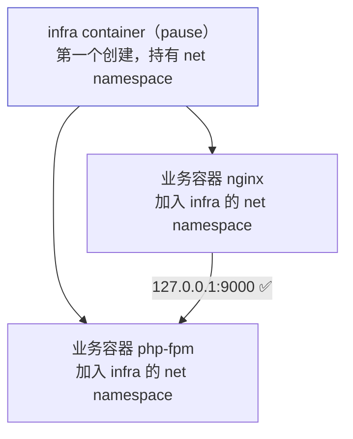
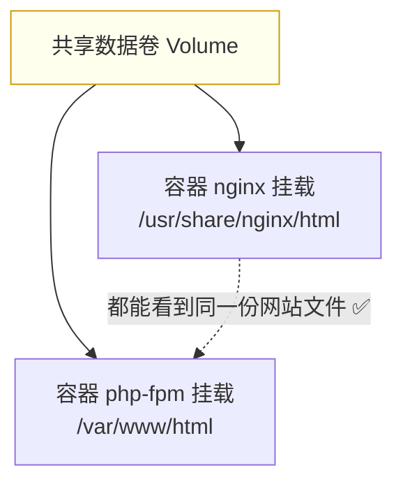

# Kubernetes 认证实战: Pod 中的三类容器（infra / init / 业务容器）

一个 Pod 里不只有你写在 YAML 里的那些容器。结论先给：**Pod 中实际有三类容器 —— ① infra container（pause），第一个被创建、负责整个 Pod 的网络，用户看不见；② init container，先于业务容器执行；③ 业务容器，就是你在 `spec.containers` 里定义的那些。亲密型应用的两大障碍，网络靠 infra container 打通，文件靠数据卷打通。**

## 纲要

- 网络怎么打通：infra container
- 文件怎么打通：数据卷
- Pod 中的三类容器
- infra container：看不见但第一个被创建
- init container：先于业务容器执行
- 业务容器：可定义多个，但现实里很少
- 定义多容器时 READY 列怎么读

## 网络打通：infra container



- infra container **先被创建，创建完什么都不干**，然后依次创建你定义的业务容器。
- 业务容器**不分配独立的网络命名空间**，而是直接挂到 infra container 的那一份上。
- 于是：**进入任意一个业务容器看到的 IP 都一模一样**，`127.0.0.1` 就能互通。

```text
Pod 创建时序
├── ① 创建 infra container（pause）    ← 用户看不到，kubectl get 看不到
├── ② 创建业务容器 nginx        → 网络接入 infra
├── ③ 创建业务容器 php-fpm      → 网络接入 infra
└── 结果：三者共用一个 net namespace，localhost 互通
```

> 在节点上执行 `docker ps` 就能看到它 —— **每个 Pod 都会先起一个由 pause 镜像拉起的容器**，它维护整个 Pod 的网络。

## 文件打通：数据卷

网络可以靠共享 namespace 解决，但**文件系统如果也这么做就乱套了**，所以走另一条路：数据卷。



> 要共享的目录各自挂到同一个卷上，两个容器就都能看到卷里的内容 —— **通过数据卷实现多容器的数据共享与文件交换**。

## Pod 中的三类容器

| 类别 | 作用 | 是否可见 | 创建顺序 |
| --- | --- | --- | --- |
| **infra container**（pause） | 负责整个 Pod 的网络 | ❌ kubectl 看不到，节点上 `docker ps` 能看到 | **第一个** |
| **init container** | 初始化容器，先于业务容器执行 | ✅ | 业务容器之前 |
| **业务容器** | 真正跑业务的普通容器 | ✅ | 最后，可定义多个 |

```text
Pod 的容器构成
├── infra container   负责网络，最先创建，什么都不跑
├── init container    初始化容器，先于业务容器执行（详见 4-10）
└── 业务容器          你在 spec.containers 里定义的，没特殊性
    ├── nginx
    └── php-fpm（可选，实际很少）
```

## 定义多个业务容器

```yaml
apiVersion: v1
kind: Pod
metadata:
  name: multi
spec:
  containers:
  - name: nginx
    image: nginx:1.26
  - name: web
    image: harbor.example.com/demo/javademo:v1
```

```bash
kubectl apply -f multi.yaml
kubectl get pods
```

| READY 列 | 含义 |
| --- | --- |
| `2/2` | 预期容器数 2，就绪 2 |
| `0/2` | 预期容器数 2，就绪 0（刚创建时的状态） |

> 理论上可以定义 3 个、4 个，但**实际环境里定义两个以上业务容器的非常少**。真正常见的多容器场景是 **sidecar** —— 日志采集、监控 agent 这类运维容器，和业务容器紧密配合取数据。

## API 速览

| 目标 | 命令 |
| --- | --- |
| 看 Pod 内容器清单 | `kubectl get pod <pod> -o jsonpath='{.spec.containers[*].name}'` |
| 看 init 容器清单 | `kubectl get pod <pod> -o jsonpath='{.spec.initContainers[*].name}'` |
| 进指定容器 | `kubectl exec -it <pod> -c <容器名> -- sh` |
| 看各容器状态 | `kubectl describe pod <pod>` |
| 节点上看 infra 容器 | `docker ps \| grep pause` |
| 看容器 IP（验证共享网络） | `kubectl exec -it <pod> -c <容器名> -- hostname -i` |

## Demo 示例

验证「Pod 内容器共享网络命名空间」：

```bash
cat <<'EOF' > pod-share-net.yaml
apiVersion: v1
kind: Pod
metadata:
  name: share-net
spec:
  containers:
  - name: nginx
    image: nginx:1.26
  - name: busybox
    image: busybox:1.36
    command: ["sleep", "3600"]
EOF

kubectl apply -f pod-share-net.yaml
kubectl wait --for=condition=Ready pod/share-net --timeout=120s

# 两个容器看到的 IP 完全一致
IP1=$(kubectl exec share-net -c nginx -- hostname -i)
IP2=$(kubectl exec share-net -c busybox -- hostname -i)
echo "nginx=$IP1 busybox=$IP2"

# 从 busybox 用 localhost 访问 nginx 的 80 端口
kubectl exec share-net -c busybox -- wget -qO- http://127.0.0.1:80 | head -5
```

共享目录：两个容器挂同一个 emptyDir：

```bash
cat <<'EOF' > pod-share-vol.yaml
apiVersion: v1
kind: Pod
metadata:
  name: share-vol
spec:
  containers:
  - name: writer
    image: busybox:1.36
    command: ["sh", "-c", "echo hello-from-writer > /data/a.txt; sleep 3600"]
    volumeMounts:
    - name: shared
      mountPath: /data
  - name: reader
    image: busybox:1.36
    command: ["sh", "-c", "sleep 3600"]
    volumeMounts:
    - name: shared
      mountPath: /data
  volumes:
  - name: shared
    emptyDir: {}
EOF

kubectl apply -f pod-share-vol.yaml
kubectl wait --for=condition=Ready pod/share-vol --timeout=120s

# reader 容器能读到 writer 写的文件
kubectl exec share-vol -c reader -- cat /data/a.txt
```

节点上确认 infra 容器存在：

```bash
docker ps --format '{{.Image}} {{.Command}}' | grep -i pause
```

### 总结

- **Pod 有三类容器**：infra container、init container、业务容器。
- **infra container 第一个被创建、负责整个 Pod 的网络**，业务容器不分配独立 net namespace 而是接入它，因此 Pod 内 `127.0.0.1` 可直接互通；它用 `kubectl` 看不到，只能在节点上 `docker ps` 看到（pause 镜像）。
- **文件系统不能靠共享 namespace 来打通**，会乱套；改用**数据卷 Volume**，把要共享的目录挂到同一个卷上。
- **init container 先于业务容器执行**，专门做初始化。
- **业务容器就是 `spec.containers` 里定义的普通容器**，可以定义多个，但现实里很少见；真正常见的是日志采集/监控这类 **sidecar** 形态。
- 多容器 Pod 的 READY 列读作「就绪数/预期容器数」。

