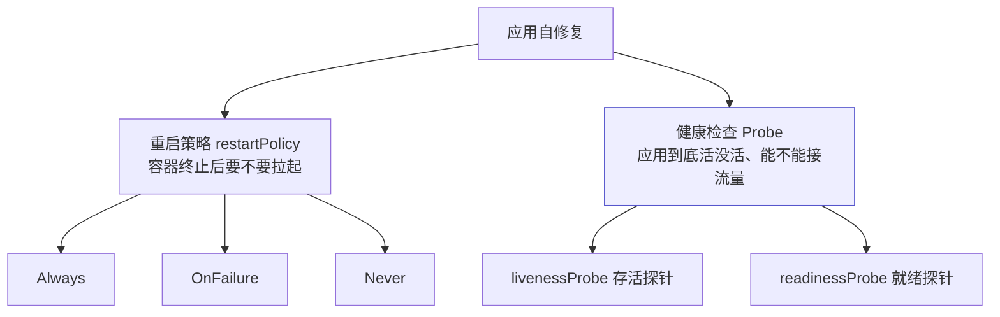
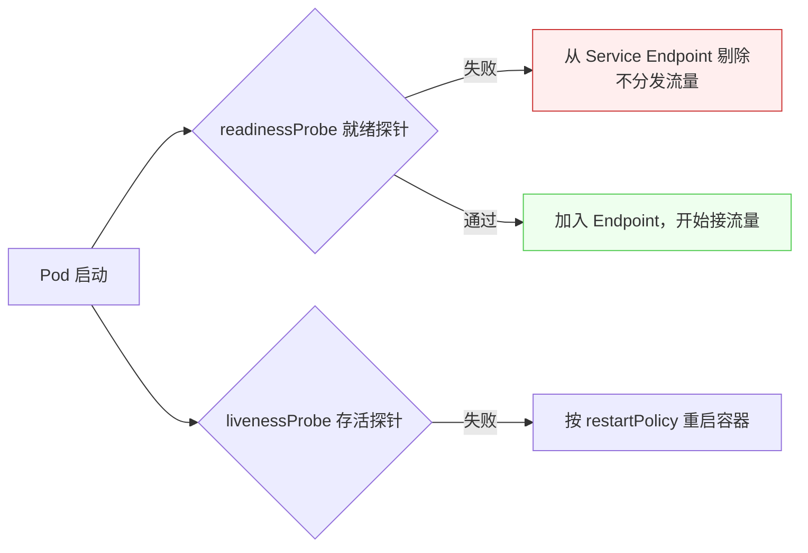
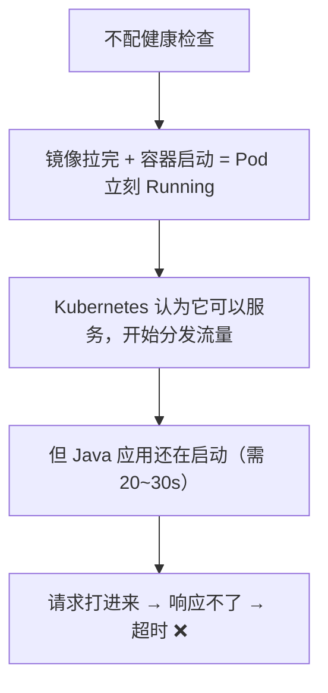
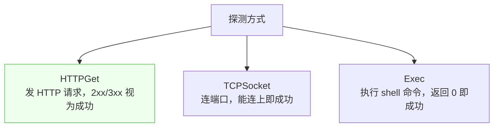

# Kubernetes 认证实战: 应用自修复 —— 重启策略与健康检查

Kubernetes 能自动把挂掉的应用拉起来，靠的是两个机制配合。结论先给：**重启策略（restartPolicy）决定「容器终止后要不要重启」，健康检查（livenessProbe / readinessProbe）决定「应用到底算不算活着、算不算能接客」；只靠 Pod 的 Running 状态是不够的 —— Java 应用启动要二三十秒，Running 了不代表能响应请求。**

## 纲要

- 自修复的两大机制
- 重启策略三种：Always / OnFailure / Never
- 为什么默认 Always 足够
- 批处理与定时任务为什么要用 OnFailure / Never
- 健康检查的两个维度
- 三种探测手段：HTTPGet / TCPSocket / Exec
- 延迟与周期参数
- 不配健康检查会出什么事

## 自修复的两大机制



## 重启策略 restartPolicy

```bash
# 看一个已有 Pod 的重启策略
kubectl get pod web -o yaml | grep -A1 restartPolicy
```

| 策略 | 行为 | 典型场景 |
| --- | --- | --- |
| `Always`（默认） | **容器只要终止退出就重启**，不看退出码 | 长期运行的服务：Web、API、MySQL |
| `OnFailure` | **仅当退出码非零**（异常退出）才重启 | 批处理 / 定时任务：备份脚本失败要重试 |
| `Never` | 无论怎么退出都不重启 | 只能执行一次的任务：离线数据处理 |

```text
退出码怎么理解
├── 命令执行成功 → echo $? 输出 0
├── 命令执行失败 → echo $? 输出非 0
└── Always 不看这个码；OnFailure 只看非 0
```

- **绝大多数业务都是长期运行的服务**（网站不可能今天开明天关），所以 `Always` 就够了，**平时基本不用改**。
- `OnFailure` / `Never` 主要服务于 **Job / CronJob 这类批处理与定时任务**：
  - 数据库备份脚本失败（退出码非 0）→ 希望重跑一次 → `OnFailure`；
  - 离线数据处理**只能执行一次**，重复跑会导致数据不一致 → `Never`。

## 健康检查的两个维度



| 探针 | 关注的问题 | 失败后果 |
| --- | --- | --- |
| `livenessProbe` | 容器还活不活 | **按 restartPolicy 重启容器**（Never 就不重启） |
| `readinessProbe` | 应用准备好没 | **从 Service 的 Endpoint 里剔除**，不再分发新流量 |

> `kubectl get endpoints`（缩写 `ep`）能看到 Service 当前关联了哪几个 Pod IP —— **这个列表就是「准备接客」的 Pod 列表**。就绪探针没过，就不会出现在这个列表里。

## 为什么必须配健康检查



- **Pod 的 Running 状态不关心容器内应用的真实状态**。容器进程起来了就是 Running，但里面 Tomcat 还没初始化完，请求照样打不进来。
- 更隐蔽的是**假死**：进程还在、端口还在，但堆内存溢出导致服务不可用 —— 只看端口和进程是发现不了的。

> 所以**大多数应用都应该配置健康检查**，让 Pod 的状态由应用自身的状态来决定。

## 三种探测手段



| 方式 | 判据 | 适用 | 精确度 |
| --- | --- | --- | --- |
| `httpGet` | 状态码 **200~399** 视为正常（4xx/5xx 异常） | Web / API / 接口类 | ⭐⭐⭐ 最准 |
| `tcpSocket` | 端口能连上即成功 | 四层服务、自写 socket server、无标准协议 | ⭐⭐ |
| `exec` | 命令退出码为 0 即成功 | 上面两种都满足不了时，自己写脚本判断特征 | ⭐⭐ 最灵活 |

- `exec` 的典型写法：判断应用的 **PID 文件在不在** —— 在就 `exit 0`，不在就 `exit 1`。
- Web 服务**最好让开发提供一个专门的探测接口**（如 `/healthz`），探测它比探测首页精确得多。

## 配置示例

```yaml
apiVersion: apps/v1
kind: Deployment
metadata:
  name: javademo
spec:
  replicas: 3
  selector:
    matchLabels:
      app: javademo
  template:
    metadata:
      labels:
        app: javademo
    spec:
      restartPolicy: Always
      containers:
      - name: javademo
        image: harbor.example.com/demo/javademo:v1
        ports:
        - containerPort: 8080
        livenessProbe:
          tcpSocket:
            port: 8080
          initialDelaySeconds: 30
          periodSeconds: 10
        readinessProbe:
          httpGet:
            path: /healthz
            port: 8080
          initialDelaySeconds: 30
          periodSeconds: 10
```

| 参数 | 含义 |
| --- | --- |
| `initialDelaySeconds` | 容器启动后**延迟多久**做第一次探测（Java 类要给到 20~30s） |
| `periodSeconds` | 之后**每隔多久**探测一次 |

> **探针定义在容器级别，不是 Pod 级别** —— 因为一个 Pod 里可以有多个容器，每个容器各配各的。它的层级与 `resources` 同级，都在 `containers[]` 元素下面。

## API 速览

| 目标 | 命令 |
| --- | --- |
| 看重启策略 | `kubectl get pod <pod> -o yaml \| grep restartPolicy` |
| 看 Service 关联的 Pod | `kubectl get endpoints` |
| 看 Pod 事件（探针失败会报） | `kubectl describe pod <pod>` |
| 看容器日志（探针探测痕迹） | `kubectl logs <pod> -c <容器>` |
| 查探针字段写法 | `kubectl explain pod.spec.containers.livenessProbe` |
| 查 httpGet 参数 | `kubectl explain pod.spec.containers.livenessProbe.httpGet` |

## Demo 示例

给 nginx 配上两种探针，观察「不再是立刻就绪」：

```bash
cat <<'EOF' > probe.yaml
apiVersion: v1
kind: Pod
metadata:
  name: probe-demo
spec:
  restartPolicy: Always
  containers:
  - name: nginx
    image: nginx:1.26
    livenessProbe:
      httpGet:
        path: /
        port: 80
      initialDelaySeconds: 15
      periodSeconds: 10
    readinessProbe:
      httpGet:
        path: /
        port: 80
      initialDelaySeconds: 15
      periodSeconds: 10
EOF

kubectl apply -f probe.yaml
kubectl get pod probe-demo -w
kubectl describe pod probe-demo | grep -A5 -i "liveness\|readiness"
```

故意把端口写错，看存活探针失败后的重启：

```bash
cat <<'EOF' > bad-probe.yaml
apiVersion: v1
kind: Pod
metadata:
  name: bad-probe
spec:
  restartPolicy: Always
  containers:
  - name: nginx
    image: nginx:1.26
    livenessProbe:
      tcpSocket:
        port: 8080
      initialDelaySeconds: 10
      periodSeconds: 5
EOF

kubectl apply -f bad-probe.yaml
sleep 30
kubectl get pod bad-probe          # RESTARTS 会涨
kubectl describe pod bad-probe | tail -20
```

批处理场景用 `Never`：

```bash
cat <<'EOF' > job-never.yaml
apiVersion: batch/v1
kind: Job
metadata:
  name: offline-etl
spec:
  template:
    spec:
      restartPolicy: Never
      containers:
      - name: etl
        image: busybox:1.36
        command: ["sh", "-c", "echo run-once-and-never-retry; exit 0"]
EOF

kubectl apply -f job-never.yaml
kubectl get pod -l job-name=offline-etl
```

### 总结

- **自修复 = 重启策略 + 健康检查**，两者分别解决「要不要重启」和「到底活没活」。
- **restartPolicy 三选一**：`Always`（默认，长期服务）、`OnFailure`（退出码非 0 才重启，适合备份这类要重试的任务）、`Never`（绝不重启，适合只能跑一次的离线处理）。
- **Pod 的 Running ≠ 应用可用**：Java 启动要二三十秒，不配探针就会有流量打到还没准备好的容器上。
- **livenessProbe 失败按 restartPolicy 重启容器；readinessProbe 失败从 Service Endpoint 剔除**，一个管生死、一个管接客。
- **三种探测手段**：`httpGet`（2xx/3xx 为成功，最准）、`tcpSocket`（连端口，适合四层）、`exec`（自己写脚本，最灵活）。
- **探针写在容器级**（与 `resources` 同级），关键参数是 `initialDelaySeconds`（首次延迟）与 `periodSeconds`（探测周期）。

