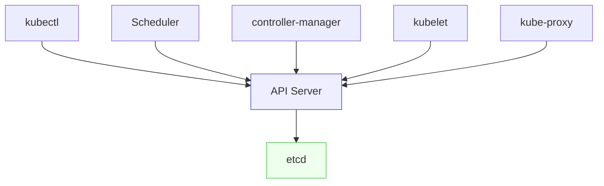
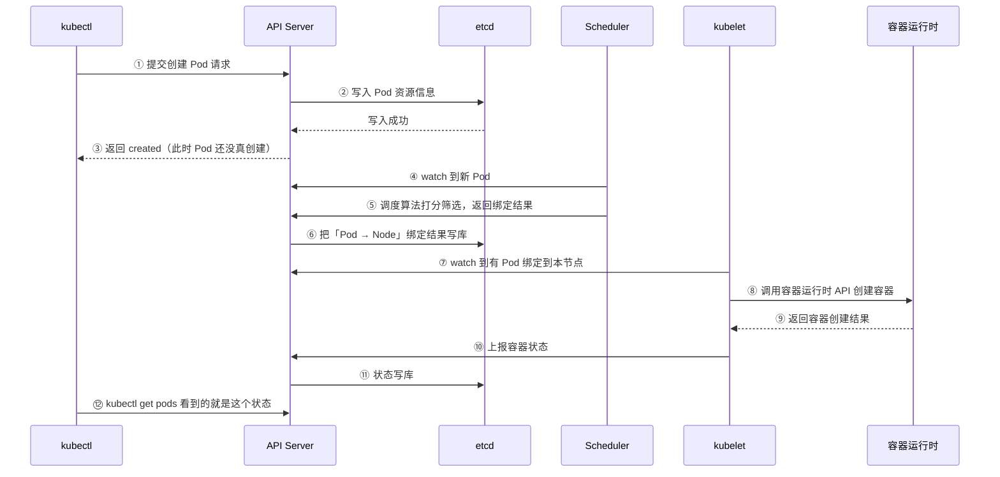
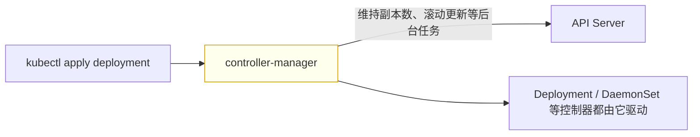

# Kubernetes 认证实战: 创建一个 Pod 的工作流程（list-watch 与组件协作）

集群规模上百台之后，没人再关心 Pod 落在哪个节点 —— 但 Kubernetes 里确实有办法指定。在讲调度控制之前，先得搞清楚一件事：**从你敲下 `kubectl apply` 到 `kubectl get pods` 看到 Running，这中间到底有哪些组件参与了、各自干了什么。结论先给：Kubernetes 各组件之间靠 list-watch 机制解耦，所有组件只与 API Server 通信，API Server 是集群的唯一入口与协调者，状态统一落 etcd。**

## 纲要

- 本章地图：为什么要学调度
- 组件通信的总原则：只与 API Server 通信
- 完整时序：kubectl → API Server → etcd → Scheduler → kubelet → docker
- 状态是谁上报的
- controller-manager 在哪一步介入
- kube-proxy 在哪一步介入

## 组件通信总原则



| 角色 | 组件 | 与谁通信 |
| --- | --- | --- |
| Master | API Server | **唯一与 etcd 通信的组件** |
| Master | Scheduler | 只与 API Server |
| Master | controller-manager | 只与 API Server |
| Node | kubelet | 只与 API Server |
| Node | kube-proxy | 只与 API Server |

> Kubernetes 自身架构就是一种**微服务化的形态**，组件之间全部通过 API 交互、靠 **list-watch** 实现解耦 —— 各组件周期性 watch API Server 上有没有需要自己处理的事件。

## 创建一个 Pod 的完整时序



| 步骤 | 谁 | 干了什么 |
| --- | --- | --- |
| ① | kubectl | 按 `~/.kube/config` 里声明的 API Server 地址与端口发请求 |
| ②③ | API Server | 把 Pod 的属性信息写进 etcd，成功即返回 `created`（**注意：这只是写库成功，Pod 还没被创建**） |
| ④⑤ | Scheduler | watch 到新 Pod，用自身调度算法筛选出合适节点，**把结果响应给 API Server**（不会直接通知节点） |
| ⑥ | API Server | 把绑定结果写入 etcd |
| ⑦ | kubelet | 周期性 watch，发现有 Pod 绑到自己这个节点上了 |
| ⑧⑨ | kubelet + 容器运行时 | kubelet 本身不是容器引擎，它**调用 docker/containerd 的 API 创建容器** |
| ⑩⑪ | kubelet → API Server → etcd | **容器状态由 kubelet 上报**，上报什么状态，`get pods` 就显示什么状态 |

```text
Pod 的两阶段
├── 阶段一：写库 + 调度（只有元数据，容器还没影子）
│   ├── kubectl → API Server → etcd
│   └── Scheduler → 绑定结果 → API Server → etcd
└── 阶段二：真正创建
    ├── kubelet watch 到绑定 → 调用运行时创建容器
    └── kubelet 回报状态 → API Server → etcd
```

> `kubectl` 连哪个集群、API Server 的 IP 和端口是什么，都写在 **`~/.kube/config`** 里，这是 kubectl 默认读取的连接配置。

## controller-manager 在哪一步介入

上面的例子是**直接创建 Pod**，和控制器没关系，所以 controller-manager 没出现。



> 如果创建的是 Deployment，controller-manager 就负责「该起几个副本」以及滚动更新这类**后台任务**；它是 Deployment、DaemonSet 这些控制器背后的真正执行者。

## kube-proxy 在哪一步介入

- kube-proxy 负责 **Pod 的服务发现和负载均衡**，与 kubelet 的工作很多是并行的。
- Pod 落到节点后，kube-proxy 会从 API Server 获取 **Service 和 Endpoint 的变化，刷新网络规则**，为 Pod 提供对外访问的形式。

## API 速览

| 目标 | 命令 |
| --- | --- |
| 看 Pod 落在哪个节点 | `kubectl get pods -o wide` |
| 看 Pod 的完整事件 | `kubectl describe pod <pod>` |
| 看调度器给的绑定 | `kubectl get pod <pod> -o jsonpath='{.spec.nodeName}'` |
| 看 kubelet 日志 | `journalctl -u kubelet -f` |
| 看组件健康 | `kubectl get cs` |
| 看连接配置 | `kubectl config view` |
| 看某资源事件 | `kubectl get events --sort-by=.lastTimestamp` |

## Demo 示例

跟着时序一步步验证：

```bash
# ① 写一份最简 Pod 清单
cat <<'EOF' > my-pod.yaml
apiVersion: v1
kind: Pod
metadata:
  name: my-pod
  namespace: default
  labels:
    app: web
spec:
  containers:
  - name: nginx
    image: nginx:1.26
EOF

# ② 提交，观察「已创建」但还没 Running
kubectl apply -f my-pod.yaml
kubectl get pod my-pod          # 先 ContainerCreating

# ③ 看调度结果（Scheduler 写入的 nodeName）
kubectl get pod my-pod -o jsonpath='{.spec.nodeName}'; echo

# ④ 看事件：Scheduled → Pulling → Created → Started
kubectl describe pod my-pod | sed -n '/Events/,/^$/p'

# ⑤ 看最终状态（由 kubelet 上报）
kubectl get pod my-pod -o wide
```

对照 Deployment 场景，看 controller-manager 的痕迹：

```bash
kubectl create deployment web --image=nginx:1.26 --replicas=3
kubectl get pods -o wide
kubectl describe deploy web | sed -n '/Events/,/^$/p'
kubectl get events --sort-by=.lastTimestamp | tail -20
```

### 总结

- **所有组件只与 API Server 通信，API Server 是集群统一入口与协调者，etcd 是唯一状态存储。**
- **list-watch 是组件间的协作机制**：各组件周期性 watch API Server 上有没有需要自己处理的事件，彼此解耦。
- **创建 Pod 分两阶段**：先写库 + 调度（Scheduler 只把绑定结果回给 API Server，不直接通知节点），再由 kubelet watch 到绑定后调用容器运行时真正创建容器。
- **`kubectl apply` 返回的 `created` 只代表写库成功**，此时容器还不存在。
- **容器状态由 kubelet 上报**，上报什么 `get pods` 就显示什么。
- **controller-manager 驱动 Deployment/DaemonSet 等控制器**（副本维持、滚动更新）；**kube-proxy 负责服务发现与负载均衡**，刷新 Service/Endpoint 对应的网络规则。

