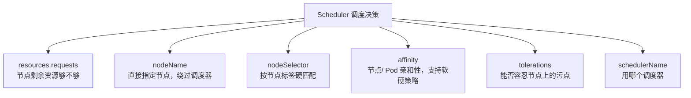
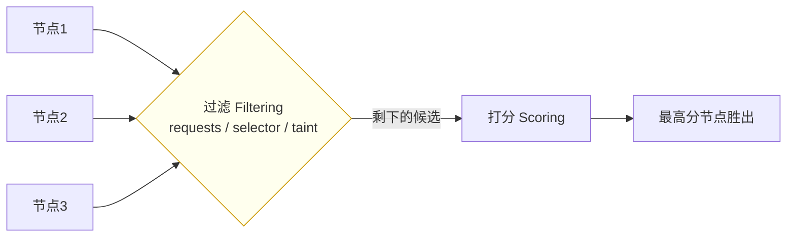

# Kubernetes 认证实战: Pod 中影响调度的属性有哪些

调度器并不是完全「自己说了算」。结论先给：**除了调度器自身的默认策略，Pod 清单里有六个字段会直接影响它被分配到哪个节点 —— `nodeName`、`nodeSelector`、`affinity`、`tolerations`、`resources`（requests/limits）以及 `schedulerName`。这些是人为可改的，调度时优先以人为指定为准。**

## 纲要

- 导出的 YAML 为什么比自己写的长好几倍
- 影响调度的六个字段
- 验收清单：对照字段表
- 调度器如何参考这些值

## 先看清一件事：默认属性

```bash
kubectl get pod my-pod -o yaml
```

自己写的 Pod 清单可能只有一二十行，导出来却翻了三四倍 —— **API Server 在你不指定时会按默认行为把大量属性补齐**。所以导出的 YAML 才是这个 Pod 实际携带的全部属性。

```text
kubectl get pod -o yaml 输出的结构
├── metadata.*                 名称、命名空间、labels、uid…
├── spec
│   ├── nodeName               ★ 影响调度（调度完成后由 Scheduler 回填）
│   ├── schedulerName          默认调度器 default-scheduler
│   ├── tolerations            ★ 影响调度（污点容忍）
│   ├── nodeSelector           ★ 影响调度（节点标签选择器）
│   ├── affinity               ★ 影响调度（亲和性）
│   ├── containers[]
│   │   └── resources          ★ 影响调度（requests 是调度依据）
│   │       ├── requests
│   │       └── limits
│   └── volumes / volumeMounts
└── status                     调度、创建时回填的状态
```

## 影响调度的六个字段



| 字段 | 位置 | 作用 | 后续小节 |
| --- | --- | --- | --- |
| `resources.requests` | `spec.containers[].resources` | **调度的资源依据**：节点有没有足够资源满足这个请求量 | 5-3 |
| `nodeName` | `spec.nodeName` | 直接指定节点名，**绕过调度器**；调度完成后由 Scheduler 回填 | 5-7 |
| `nodeSelector` | `spec.nodeSelector` | 按节点标签做**硬匹配** | 5-4 |
| `affinity` | `spec.affinity` | 亲和性，支持硬性 + 软性（权重）策略 | 5-5 |
| `tolerations` | `spec.tolerations` | 容忍节点上的**污点（taint）** | 5-6 |
| `schedulerName` | `spec.schedulerName` | 默认 `default-scheduler`，可换成自定义调度器 | —— |

> 调度器在默认策略之外，会**参考以上这些人为指定的值**，且**以人为修改的为主**。

## 调度器的两步筛选



- **第一步过滤**：把不满足硬性条件的节点直接 pass 掉（资源不够、标签不匹配、有不可容忍的污点）。
- **第二步打分**：对剩下的候选节点按策略打分，选最高分的。

> 注意 `resources` 是**写在 container 级别**的（`spec.containers[].resources`），不是 Pod 级别 —— 因为一个 Pod 可以有多个容器，每个容器的资源限制各自独立。

## API 速览

| 目标 | 命令 |
| --- | --- |
| 看 Pod 全部属性（含默认值） | `kubectl get pod <pod> -o yaml` |
| 看调度后落在哪个节点 | `kubectl get pod <pod> -o jsonpath='{.spec.nodeName}'` |
| 看用了哪个调度器 | `kubectl get pod <pod> -o jsonpath='{.spec.schedulerName}'` |
| 查字段含义 | `kubectl explain pod.spec` |
| 查亲和性字段 | `kubectl explain pod.spec.affinity` |
| 查容忍字段 | `kubectl explain pod.spec.tolerations` |

## Demo 示例

导出一份 Pod 清单，把影响调度的字段挑出来看：

```bash
kubectl run my-pod --image=nginx:1.26
kubectl wait --for=condition=Ready pod/my-pod --timeout=120s

kubectl get pod my-pod -o yaml > my-pod.yaml

# 逐个确认影响调度的字段
kubectl get pod my-pod -o jsonpath='{.spec.nodeName}'; echo
kubectl get pod my-pod -o jsonpath='{.spec.schedulerName}'; echo
kubectl get pod my-pod -o jsonpath='{.spec.tolerations}'; echo
kubectl get pod my-pod -o jsonpath='{.spec.containers[0].resources}'; echo

# nodeSelector / affinity 默认不指定，导出时是空
kubectl get pod my-pod -o jsonpath='{.spec.nodeSelector}'; echo
kubectl get pod my-pod -o jsonpath='{.spec.affinity}'; echo
```

### 总结

- **导出的 YAML 才是 Pod 实际携带的全部属性** —— API Server 会按默认行为补齐大量字段，所以比自己写的长好几倍。
- **影响调度的六个字段**：`resources.requests`、`nodeName`、`nodeSelector`、`affinity`、`tolerations`、`schedulerName`。
- **`resources` 写在容器级别**（`spec.containers[].resources`），多容器 Pod 各配各的。
- **调度器先过滤后打分**：不满足硬性条件的节点直接 pass，剩下的再打分选最高分。
- **人为指定的值优先于调度器的默认策略**。

