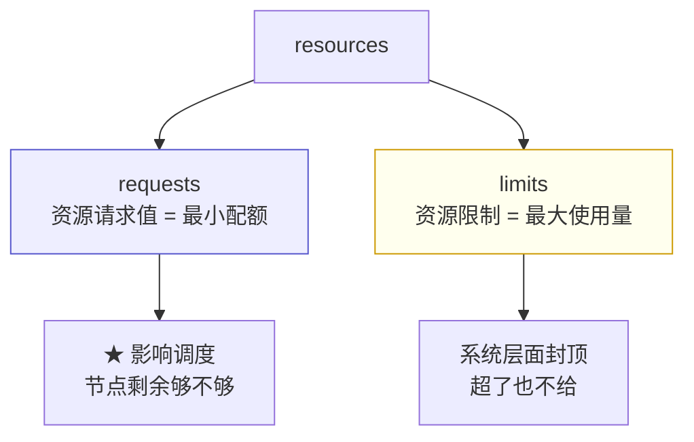
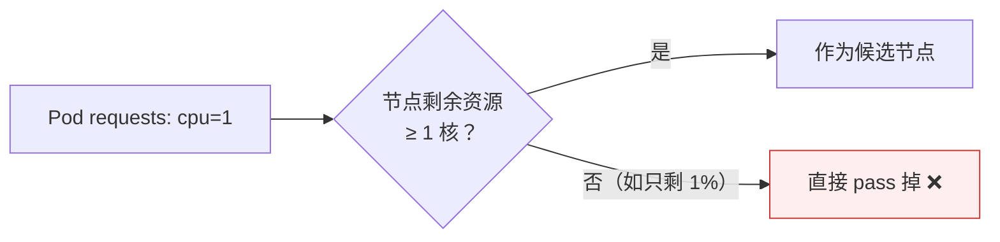
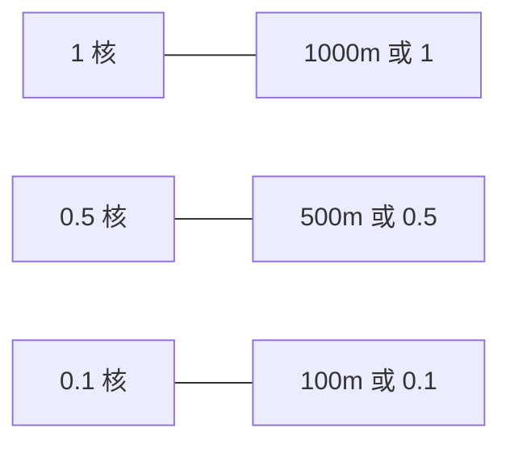

# Kubernetes 认证实战: 资源限制对 Pod 调度的影响（requests 与 limits）

`resources` 这个字段常被简单理解成「资源限制」，其实它是两件事。结论先给：**`requests` 是调度依据 —— 调度器用它判断节点上还有没有足够的资源能塞下这个 Pod；`limits` 是硬上限 —— 在系统层面把容器的 CPU/内存使用封死。不配 `resources` 就等于 Pod 能吃光宿主机所有资源，生产环境必须配。**

## 纲要

- resources 的两块功能
- requests：调度依据，最小配额
- 不配 resources 会发生什么
- limits：资源最大使用量
- CPU 单位的两种写法（浮点数与 m）
- 怎么看节点的资源分配情况

## requests 与 limits 的分工



| 字段 | 含义 | 谁在用 |
| --- | --- | --- |
| `requests` | 跑起来**最低需要多少**资源 | **Scheduler 调度时参考** |
| `limits` | **最多能用多少**资源 | 容器运行时（cgroup）强制限制 |

## requests：调度依据



> 调度器在调度阶段会参考 `requests` 的值，**判定当前节点还有没有足够资源供这个 Pod 分配**；不够就直接把这个节点淘汰，不会再考虑往它上面分。

```yaml
apiVersion: v1
kind: Pod
metadata:
  name: my-pod
spec:
  containers:
  - name: nginx
    image: nginx:1.26
    resources:
      requests:
        cpu: 0.1
        memory: 100Mi
```

> 这里的含义是：**跑这个 nginx 最少给 0.1 核 CPU、100Mi 内存**。这个值得自己心里有谱 —— nginx 本身不干重活，给一丁点就能跑起来。

## 不配 resources 会怎样

```text
不写 resources 的后果
├── requests 默认 = 0
│   └── 调度时不参考配额 → 随便往哪塞
├── limits 默认 = 无
│   └── Pod 可以用光宿主机所有资源
└── 风险
    └── 某 Pod 突发异常/被打 → 吃满节点资源
        → 同节点其他 Pod 全部受牵扯 → 节点挂掉 ❌
```

> **生产环境资源限制肯定要做**，绝不能让 Pod 毫无限制地跑。

## limits：硬上限

```yaml
apiVersion: v1
kind: Pod
metadata:
  name: my-pod
spec:
  containers:
  - name: nginx
    image: nginx:1.26
    resources:
      requests:
        cpu: 0.1
        memory: 100Mi
      limits:
        cpu: 0.5
        memory: 500Mi
```

- 上面这份配置意味着：**这个 nginx 最大只能用半核 CPU、500Mi 内存**，即使有突发流量也超不出去 —— 系统层面已经限制死了。
- **值该给多少要看应用**：nginx 这种 0.2~0.5 核就够；**Java 启动耗 CPU 比较多**，给低了启动就慢，得按应用特性定。

## CPU 单位的两种写法

| 写法 | 例子 | 含义 |
| --- | --- | --- |
| 浮点数 | `1` / `2` / `0.5` / `0.1` | 1 = 1 核，0.5 = 半核 |
| m（毫核） | `1000m` / `500m` / `100m` | **1000m = 1 核**，500m = 0.5 核，100m = 0.1 核 |



- 内存单位用 `Mi` / `Gi`（也可以写 `M` / `G`）。
- CPU 的限制是按**时间片分配**算出来的比例，不是死死钉住的，本身就有一定的浮动性。

## 看节点的资源分配情况

```bash
kubectl describe node k8s-node1
```

```text
kubectl describe node 输出的资源相关段落
├── Allocated resources（已分配）
│   ├── cpu                 Requests 总量 / Limits 总量
│   ├── memory              Requests 总量 / Limits 总量
│   └── ephemeral-storage   短暂存储（docker 工作目录所在磁盘，一般关注较少）
└── 这里能看到该节点上跑了哪些 Pod、每个 Pod 在 YAML 里定义了多少
```

| 指标 | 说明 |
| --- | --- |
| CPU Requests | 该节点上所有 Pod 的 `requests.cpu` 之和 |
| CPU Limits | 该节点上所有 Pod 的 `limits.cpu` 之和 |
| Memory Requests / Limits | 同理 |

> **没在 YAML 里写 `resources` 的 Pod，这两列统计出来就是 0** —— 这正是「调度不参考配额」的直接体现。

## API 速览

| 目标 | 命令 |
| --- | --- |
| 看节点资源分配 | `kubectl describe node <节点>` |
| 看各节点资源用量 | `kubectl top nodes` |
| 看 Pod 实际用量 | `kubectl top pods` |
| 看 Pod 配的 resources | `kubectl get pod <pod> -o jsonpath='{.spec.containers[0].resources}'` |
| 查字段写法 | `kubectl explain pod.spec.containers.resources` |

## Demo 示例

```bash
cat <<'EOF' > resource-demo.yaml
apiVersion: v1
kind: Pod
metadata:
  name: resource-demo
spec:
  containers:
  - name: nginx
    image: nginx:1.26
    resources:
      requests:
        cpu: 0.1
        memory: 100Mi
      limits:
        cpu: 0.5
        memory: 500Mi
EOF

kubectl apply -f resource-demo.yaml
kubectl wait --for=condition=Ready pod/resource-demo --timeout=120s

# 确认配置生效
kubectl get pod resource-demo -o jsonpath='{.spec.containers[0].resources}'; echo

# 看节点上 requests/limits 的统计
kubectl describe node | sed -n '/Allocated resources/,/ephemeral-storage/p'

# 造一个 requests 远超节点容量的 Pod，观察调度失败
cat <<'EOF' > too-big.yaml
apiVersion: v1
kind: Pod
metadata:
  name: too-big
spec:
  containers:
  - name: nginx
    image: nginx:1.26
    resources:
      requests:
        cpu: 999
        memory: 9999Gi
EOF

kubectl apply -f too-big.yaml
kubectl get pod too-big
kubectl describe pod too-big | sed -n '/Events/,/^$/p'
```

### 总结

- **`resources` 有两块**：`requests` 管调度（最小配额），`limits` 管上限（最大使用量）。
- **调度器在调度阶段参考 `requests`**，节点剩余资源不满足就直接淘汰该节点。
- **不配 `resources` 后果严重**：requests=0 导致调度不参考配额，limits 为空导致 Pod 能吃光宿主机资源，一个异常 Pod 能拖垮整节点。
- **`limits` 是在系统层面封死的**，即便突发也超不过去；取值要按应用特性定（nginx 小、Java 启动期费 CPU）。
- **CPU 两种写法**：`1` = 1000m = 1 核，`0.5` = 500m = 半核，`0.1` = 100m = 0.1 核。
- **`kubectl describe node` 的 Allocated resources 段**能看到该节点所有 Pod 的 requests/limits 汇总，没配的统计为 0。

