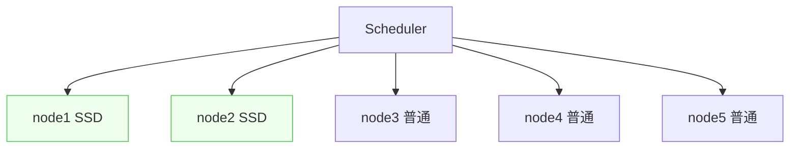
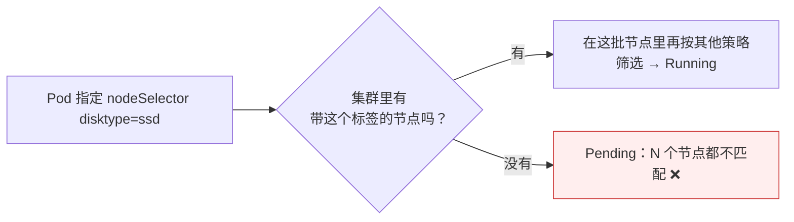

# Kubernetes 认证实战: nodeSelector 节点标签选择器（把 Pod 固定到一类节点）

集群里几十上百个节点，硬件和用途往往并不一样 —— 有些配了 SSD、有些有 GPU。结论先给：**先用 `kubectl label node` 给节点做逻辑分组（打标签），再在 Pod 清单里用 `nodeSelector` 匹配这个标签，Pod 就只会调度到含有该标签的那一批节点上；这是绝对相等的硬匹配，匹配不到就一直 Pending。**

## 纲要

- 为什么要给节点分组
- 第一步：给节点打标签
- 节点自带的默认标签也能用
- 第二步：Pod 里用 nodeSelector 匹配
- 硬匹配的特性：匹配不到就 Pending
- 典型场景：SSD / GPU 节点

## 为什么要分组



> 默认情况下调度器对所有节点**一视同仁**，按默认算法随便分。想让某个对磁盘 IO 要求高的应用只跑在 SSD 节点上，就得先分组、再匹配。

```text
实现这个需求的两步
├── ① 给节点打标签（逻辑分组）
│   kubectl label node k8s-node1 disktype=ssd
└── ② Pod 清单里匹配这个标签
    spec.nodeSelector: { disktype: ssd }
```

## 第一步：给节点打标签

```bash
# 打标签：一个 key 一个 value
kubectl label node k8s-node1 disktype=ssd

# 查看节点标签
kubectl get node k8s-node1 --show-labels

# 覆盖已有标签要加 --overwrite
kubectl label node k8s-node1 disktype=hdd --overwrite

# 删标签：key 后加减号
kubectl label node k8s-node1 disktype-
```

### 节点自带的默认标签

```text
kubectl get node --show-labels 里，除你打的标签外还有默认标签
├── kubernetes.io/arch=amd64        CPU 架构（x86 / arm 可据此区分调度）
├── kubernetes.io/hostname=xxx      主机名
└── kubernetes.io/os=linux          操作系统发行版
```

> 这些默认标签**也可以直接拿来匹配** —— 比如集群里同时有 x86 和 arm 两种架构的服务器，应用镜像要按架构区分部署，直接用 `kubernetes.io/arch` 就够。

## 第二步：Pod 里匹配

```yaml
apiVersion: v1
kind: Pod
metadata:
  name: my-pod2
spec:
  nodeSelector:
    disktype: ssd
  containers:
  - name: nginx
    image: nginx:1.26
```

| 层级 | 说明 |
| --- | --- |
| `spec.nodeSelector` | 与 `spec.containers` **同级**，是 Pod 级属性 |
| `disktype: ssd` | key = value 的绝对匹配 |

```bash
kubectl apply -f my-pod2.yaml
kubectl get pod my-pod2 -o wide
```

## 硬匹配的特性



> `nodeSelector` 是**绝对性的相等匹配**，调度器先筛出符合标签的这一批服务器，再在这批里按其他参数筛选。**没有任何节点匹配时，Pod 就一直 Pending。**

```text
kubectl describe pod 看到的事件
└── FailedScheduling: 0/N nodes are available: N node(s) didn't match node selector
```

## API 速览

| 目标 | 命令 |
| --- | --- |
| 给节点打标签 | `kubectl label node <节点> <key>=<value>` |
| 覆盖标签 | `kubectl label node <节点> <key>=<value> --overwrite` |
| 删标签 | `kubectl label node <节点> <key>-` |
| 看节点标签 | `kubectl get node --show-labels` |
| 按标签筛节点 | `kubectl get node -l disktype=ssd` |
| 看 Pod 落在哪 | `kubectl get pods -o wide` |
| 查字段 | `kubectl explain pod.spec.nodeSelector` |

## Demo 示例

完整走一遍「分组 → 匹配 → 观察 Pending → 补标签后自动调度」：

```bash
# ① 给 node1 打 SSD 标签
kubectl label node k8s-node1 disktype=ssd
kubectl get node -l disktype=ssd

# ② 写一个只去 SSD 节点的 Pod
cat <<'EOF' > ssd-pod.yaml
apiVersion: v1
kind: Pod
metadata:
  name: ssd-pod
spec:
  nodeSelector:
    disktype: ssd
  containers:
  - name: nginx
    image: nginx:1.26
EOF

kubectl apply -f ssd-pod.yaml
kubectl get pod ssd-pod -o wide

# ③ 故意匹配一个不存在的标签，观察 Pending
cat <<'EOF' > pending-pod.yaml
apiVersion: v1
kind: Pod
metadata:
  name: pending-pod
spec:
  nodeSelector:
    disktype: nvme
  containers:
  - name: nginx
    image: nginx:1.26
EOF

kubectl apply -f pending-pod.yaml
kubectl get pod pending-pod
kubectl describe pod pending-pod | sed -n '/Events/,/^$/p'

# ④ 补上标签后，调度器会周期性重新判定并分配过去
kubectl label node k8s-node1 disktype=nvme --overwrite
kubectl get pod pending-pod -o wide
```

用默认标签按架构调度：

```bash
kubectl get node --show-labels | awk '{print $1, $NF}'

cat <<'EOF' > arch-pod.yaml
apiVersion: v1
kind: Pod
metadata:
  name: arch-pod
spec:
  nodeSelector:
    kubernetes.io/arch: amd64
  containers:
  - name: nginx
    image: nginx:1.26
EOF

kubectl apply -f arch-pod.yaml
kubectl get pod arch-pod -o wide
```

### 总结

- **思路是「先分组、再匹配」**：给节点打标签做逻辑分组，Pod 用 `nodeSelector` 指定要匹配哪一组。
- **打标签 `kubectl label node <节点> k=v`**，查看用 `kubectl get node --show-labels`，删除用 `k-`。
- **节点自带默认标签**（`kubernetes.io/arch`、`hostname`、`os`）同样可以直接用于匹配调度。
- **`spec.nodeSelector` 与 `spec.containers` 同级**，是 Pod 级属性，写法就是 key: value。
- **绝对相等的硬匹配**：匹配不到任何节点时 Pod 一直 Pending，`describe` 会给出 `didn't match node selector`。
- 典型场景：**SSD 硬盘节点、GPU 节点、专用业务节点**。

