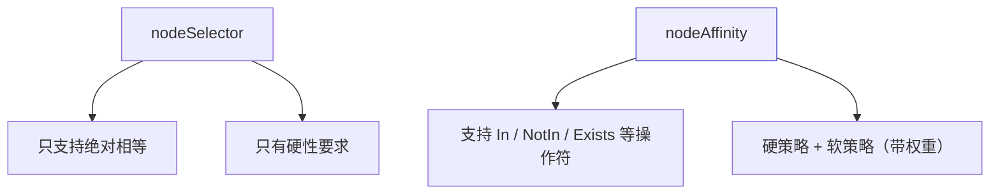
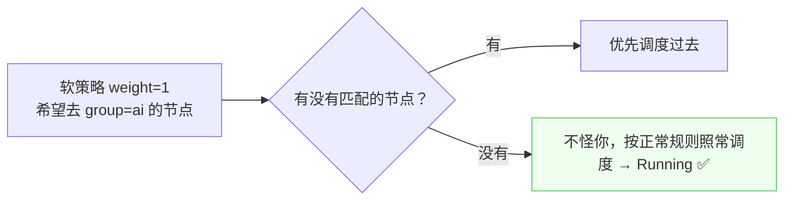
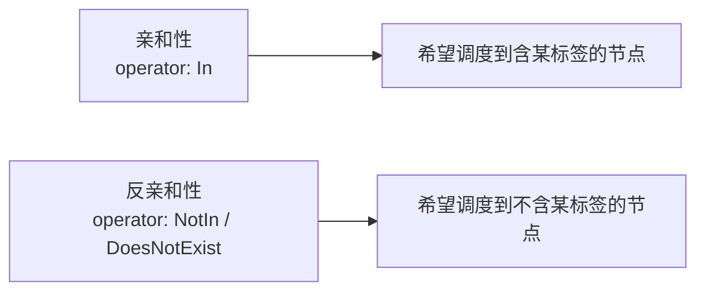

# Kubernetes 认证实战: nodeAffinity 节点亲和性（硬策略与软策略）

`nodeSelector` 只能做「字符串绝对相等」，表达力不够。结论先给：**`nodeAffinity` 同样基于节点标签约束 Pod 能调度到哪些节点，但强在两点 —— ① 支持 `In` / `NotIn` / `Exists` 等丰富的逻辑操作符；② 分硬策略（required，必须满足）和软策略（preferred，尽量满足 + 权重 1~100）。匹配不到硬策略就 Pending，软策略匹配不到也照常调度。**

## 纲要

- nodeAffinity 比 nodeSelector 强在哪
- 硬策略 requiredDuringSchedulingIgnoredDuringExecution
- 软策略 preferredDuringSchedulingIgnoredDuringExecution
- 权重 1~100 的含义
- 常用操作符与反亲和性
- 现场验证：Pending 与 Running 的差别

## 强在哪两点



| 维度 | nodeSelector | nodeAffinity |
| --- | --- | --- |
| 匹配方式 | 字符串**绝对相等** | `In`、`NotIn`、`Exists`、`DoesNotExist`、`Gt`、`Lt` |
| 策略强度 | 只有硬性 | **硬策略 + 软策略** |
| 不满足时 | Pending | 硬策略 Pending；软策略照常调度 |

## 硬策略

```yaml
apiVersion: v1
kind: Pod
metadata:
  name: gpu-pod
spec:
  affinity:
    nodeAffinity:
      requiredDuringSchedulingIgnoredDuringExecution:
        nodeSelectorTerms:
        - matchExpressions:
          - key: gpu
            operator: In
            values:
            - nvidia-tesla-v100
  containers:
  - name: nginx
    image: nginx:1.26
```

```text
字段层级
└── spec.affinity.nodeAffinity
    ├── requiredDuringSchedulingIgnoredDuringExecution   ← 硬策略：必须满足
    │   └── nodeSelectorTerms[].matchExpressions[]
    │       ├── key        节点上的标签 key
    │       ├── operator   操作符
    │       └── values[]   候选值列表
    └── preferredDuringSchedulingIgnoredDuringExecution  ← 软策略：尽量满足
        └── [].weight 1~100 + preference.matchExpressions[]
```

> 硬策略的含义是**节点必须含有这个标签且值匹配**，背后逻辑和 `nodeSelector` 基本一致。集群里没有匹配的标签时，Pod 就是 **Pending**，`describe` 报 `didn't match node selector`。

> 调度器会周期性重新判定 —— **给某个节点补上标签后，Pending 的 Pod 会被重新分配过去**。

## 软策略

```yaml
apiVersion: v1
kind: Pod
metadata:
  name: ai-pod
spec:
  affinity:
    nodeAffinity:
      preferredDuringSchedulingIgnoredDuringExecution:
      - weight: 1
        preference:
          matchExpressions:
          - key: group
            operator: In
            values:
            - ai
  containers:
  - name: nginx
    image: nginx:1.26
```

| 参数 | 含义 |
| --- | --- |
| `weight` | **1~100 的权重值**，越大调度到对应标签节点的概率越高 |
| `preference.matchExpressions` | 和硬策略写法一致，只是「尽量满足」 |



> **软策略不是强制匹配**：条件满足不了也照样完成调度，Pod 依然是 Running。

## 操作符与反亲和性

| 操作符 | 含义 |
| --- | --- |
| `In` | 标签值在给定列表中（最常用，基本够用） |
| `NotIn` | 标签值**不在**给定列表中 |
| `Exists` | 只要存在这个 key 即可，不看值 |
| `DoesNotExist` | 不存在这个 key |
| `Gt` / `Lt` | 数值大小比较 |



> 实现**节点反亲和性**很简单：把 `In` 换成 `NotIn`（或 `DoesNotExist`），语义就反过来了 —— 必须分配到**不含**该标签的节点上。

## API 速览

| 目标 | 命令 |
| --- | --- |
| 给节点打标签 | `kubectl label node <节点> gpu=nvidia-tesla-v100` |
| 看节点标签 | `kubectl get node --show-labels` |
| 查亲和性字段 | `kubectl explain pod.spec.affinity.nodeAffinity` |
| 查硬策略字段 | `kubectl explain pod.spec.affinity.nodeAffinity.requiredDuringSchedulingIgnoredDuringExecution` |
| 看调度失败原因 | `kubectl describe pod <pod>` |
| 看 Pod 落点 | `kubectl get pods -o wide` |

## Demo 示例

```bash
# ① 硬策略：集群里还没有 gpu 标签 → Pending
cat <<'EOF' > hard.yaml
apiVersion: v1
kind: Pod
metadata:
  name: hard-pod
spec:
  affinity:
    nodeAffinity:
      requiredDuringSchedulingIgnoredDuringExecution:
        nodeSelectorTerms:
        - matchExpressions:
          - key: gpu
            operator: In
            values:
            - nvidia-tesla-v100
  containers:
  - name: nginx
    image: nginx:1.26
EOF

kubectl apply -f hard.yaml
kubectl get pod hard-pod                 # Pending
kubectl describe pod hard-pod | sed -n '/Events/,/^$/p'

# ② 给节点补标签，调度器重新判定后分配过去
kubectl label node k8s-node1 gpu=nvidia-tesla-v100
kubectl get pod hard-pod -o wide         # 变成 Running

# ③ 软策略：没有匹配标签也照常 Running
cat <<'EOF' > soft.yaml
apiVersion: v1
kind: Pod
metadata:
  name: soft-pod
spec:
  affinity:
    nodeAffinity:
      preferredDuringSchedulingIgnoredDuringExecution:
      - weight: 80
        preference:
          matchExpressions:
          - key: group
            operator: In
            values:
            - ai
  containers:
  - name: nginx
    image: nginx:1.26
EOF

kubectl apply -f soft.yaml
kubectl get pod soft-pod -o wide         # Running（即使没有 group=ai 的节点）

# ④ 反亲和性：不去带 gpu 标签的节点
cat <<'EOF' > anti.yaml
apiVersion: v1
kind: Pod
metadata:
  name: anti-pod
spec:
  affinity:
    nodeAffinity:
      requiredDuringSchedulingIgnoredDuringExecution:
        nodeSelectorTerms:
        - matchExpressions:
          - key: gpu
            operator: NotIn
            values:
            - nvidia-tesla-v100
  containers:
  - name: nginx
    image: nginx:1.26
EOF

kubectl apply -f anti.yaml
kubectl get pod anti-pod -o wide
```

### 总结

- **`nodeAffinity` 是 `nodeSelector` 的增强版**，同样基于节点标签约束调度。
- **强在两点**：支持 `In` / `NotIn` / `Exists` 等逻辑操作符；支持硬策略与软策略。
- **硬策略 `requiredDuringSchedulingIgnoredDuringExecution`**：必须满足，不满足就 Pending；调度器会周期性重判，补上标签后会自动分配过去。
- **软策略 `preferredDuringSchedulingIgnoredDuringExecution`**：尽量满足，`weight` 取 1~100，值越大命中概率越高；不满足也照常 Running。
- **反亲和性用 `NotIn` / `DoesNotExist`** 即可实现「不去某类节点」。
- 字段都在 `spec.affinity.nodeAffinity` 下，与 `spec.containers` 同级。

