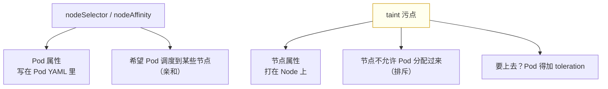
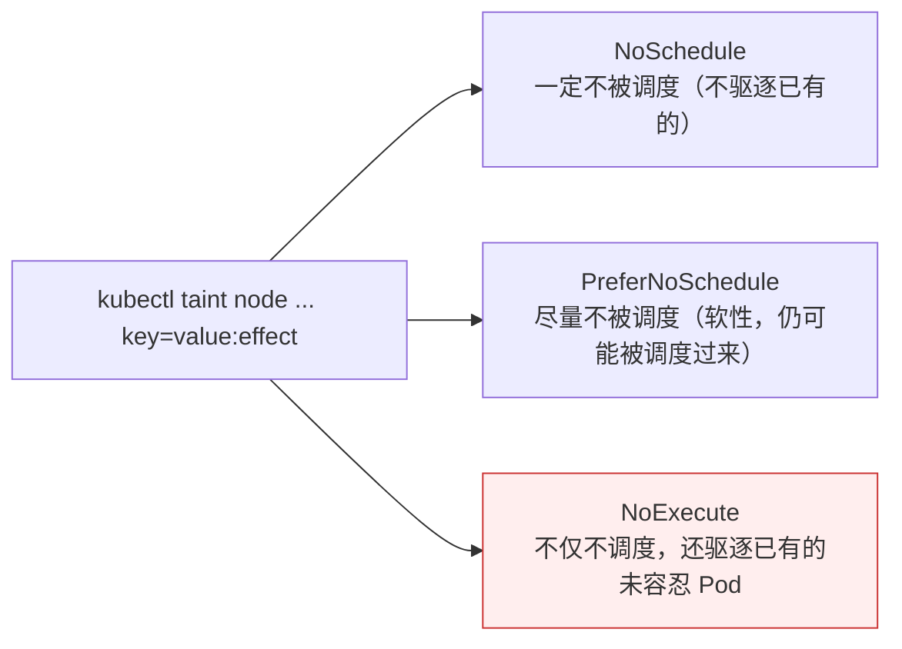

# Kubernetes 认证实战: 污点与污点容忍（taint 与 toleration）

`nodeSelector` 和 `nodeAffinity` 都是「我希望 Pod 去哪」，污点则是「节点不让 Pod 来」。结论先给：**taint（污点）是节点自身的属性，打了污点后默认不会再有 Pod 往这个节点分配；想让特定 Pod 上去，就得给 Pod 加 toleration（容忍）。三个 effect 决定了强度：`NoSchedule` 一定不调度、`PreferNoSchedule` 尽量不调度、`NoExecute` 不仅不调度还会驱逐已有 Pod。**

## 纲要

- 污点与亲和性是相反的两个维度
- 关键区别：污点是节点属性，亲和性是 Pod 属性
- 三种应用场景
- effect 三个取值
- 打污点与看污点
- toleration 的写法与「不是强制分配」
- master 节点自带的污点
- 节点状态自动打的污点

## 两个相反的维度



| 维度 | 归属 | 方向 |
| --- | --- | --- |
| `nodeSelector` / `nodeAffinity` | **Pod 属性**（在 Pod YAML 的调度阶段生效） | 吸引：我要去那类节点 |
| `taint` 污点 | **节点属性**（和标签一样挂在 Node 上） | 排斥：这类节点别来 |
| `toleration` 容忍 | **Pod 属性** | 抵消：我能忍这个污点，让我上去 |

## 三种应用场景

```text
taint 的典型用途
├── ① 专用节点    某批用户/业务独占这几个节点，其他人默认进不来
├── ② 特殊硬件节点 GPU / SSD 节点打污点，不用这类硬件的 Pod 别来占坑
└── ③ 基于 taint 的驱逐  NoExecute 会把没容忍的已有 Pod 赶走（节点维护时用）
```

## effect 的三个取值



| effect | 新 Pod 能不能调度上来 | 已有 Pod 会不会被赶走 |
| --- | --- | --- |
| `NoSchedule` | ❌ 一定不能 | ❌ 不驱逐 |
| `PreferNoSchedule` | ⚠️ 尽量不（软性，仍有几率） | ❌ 不驱逐 |
| `NoExecute` | ❌ 不能 | ✅ **驱逐未容忍的已有 Pod**（控制器会在别的节点重新拉起） |

> 日常最常用的是 `NoSchedule`；`NoExecute` 一般在**维护节点**时才用。

## 打污点与看污点

```bash
# 打污点：key=value:effect
kubectl taint node k8s-node1 gpu=yes:NoSchedule

# 看污点
kubectl describe node k8s-node1 | grep -i taint

# 删污点：key 后加减号
kubectl taint node k8s-node1 gpu:NoSchedule-
```

```text
污点的三元组（toleration 必须与它完全对应）
├── key     例如 gpu
├── value   例如 yes
└── effect  例如 NoSchedule
```

## master 节点自带的污点

```bash
kubectl describe node k8s-master | grep -i taint
```

> kubeadm 部署后**已经给 master 打好了污点**（`node-role.kubernetes.io/master:NoSchedule`），所以普通 Pod 不会往 master 上分配 —— 除非你给它加容忍。

## 节点状态自动打的污点

```text
Kubernetes 会根据节点状态自动打污点（不需要你动手）
├── node.kubernetes.io/not-ready          节点没准备好（kubectl get node 显示 NotReady）
├── node.kubernetes.io/unreachable        节点不可达
└── node.kubernetes.io/unschedulable      节点被 cordon（kubectl cordon 之后）
```

> 默认 Pod 不会容忍这些，所以**节点 NotReady 或 cordon 之后就不会有新 Pod 分配过去**。

## toleration 的写法

```yaml
apiVersion: v1
kind: Pod
metadata:
  name: gpu-pod
spec:
  tolerations:
  - key: gpu
    operator: Equal
    value: "yes"
    effect: NoSchedule
  containers:
  - name: nginx
    image: nginx:1.26
```

| 字段 | 说明 |
| --- | --- |
| `key` | 与你打污点时的 key 完全一致 |
| `operator` | `Equal`（值也要相等）或 `Exists`（只要 key 存在） |
| `value` | 与污点的 value 一致（`Equal` 时必填） |
| `effect` | 与污点的 effect 一致（可省略表示容忍所有 effect） |

> **注意：容忍了污点 ≠ 强制分配到有污点的节点。** 容忍只是让调度器在调度时**忽略这个污点**，节点仍在候选池里参与正常打分，可能分配过去也可能不。

```text
spec.tolerations 的层级
└── 与 spec.containers 同级（都是 Pod 级属性）
    └── 与 spec.nodeSelector / spec.affinity 也是同级的
```

## API 速览

| 目标 | 命令 |
| --- | --- |
| 打污点 | `kubectl taint node <节点> <key>=<value>:<effect>` |
| 删污点 | `kubectl taint node <节点> <key>:<effect>-` |
| 看污点 | `kubectl describe node <节点> \| grep -i Taint` |
| 标记不可调度 | `kubectl cordon <节点>` |
| 恢复可调度 | `kubectl uncordon <节点>` |
| 驱逐节点 Pod | `kubectl drain <节点> --ignore-daemonsets` |
| 查容忍字段 | `kubectl explain pod.spec.tolerations` |

## Demo 示例

```bash
# ① 给 node1 打污点
kubectl taint node k8s-node1 gpu=yes:NoSchedule
kubectl describe node k8s-node1 | grep -i taint

# ② 起 6 个副本，观察全部避开 node1
kubectl create deployment web --image=nginx:1.26
kubectl scale deployment web --replicas=6
kubectl get pods -o wide                # 全都落在 node2 / node3

# ③ 加容忍后，Pod 就能分配到 node1 了
cat <<'EOF' > tolerate.yaml
apiVersion: v1
kind: Pod
metadata:
  name: tolerate-pod
spec:
  tolerations:
  - key: gpu
    operator: Equal
    value: "yes"
    effect: NoSchedule
  containers:
  - name: nginx
    image: nginx:1.26
EOF

kubectl apply -f tolerate.yaml
kubectl get pod tolerate-pod -o wide    # 可以落到 node1

# ④ 换成 NoExecute，观察已有 Pod 被驱逐
kubectl taint node k8s-node1 gpu=yes:NoExecute
kubectl get pods -o wide -w

# ⑤ 清理
kubectl taint node k8s-node1 gpu:NoSchedule-
kubectl taint node k8s-node1 gpu:NoExecute-
```

### 总结

- **taint 是节点属性，nodeSelector/affinity 是 Pod 属性**，两者是相反的两个维度（排斥 vs 吸引）。
- **打污点后默认不再往该节点分配 Pod**，想上去就得给 Pod 加 `toleration`。
- **effect 三选一**：`NoSchedule`（一定不调度）、`PreferNoSchedule`（尽量不，软性）、`NoExecute`（不调度 + 驱逐已有未容忍 Pod，节点维护时用）。
- **kubeadm 已给 master 打好 `node-role.kubernetes.io/master:NoSchedule`**；节点 NotReady / cordon 时 Kubernetes 会自动打污点。
- **toleration 的 key/value/effect 必须与污点完全对应**，`operator` 用 `Equal` 或 `Exists`。
- **容忍 ≠ 强制分配** —— 容忍只是让调度器忽略该污点，节点仍参与正常打分。

